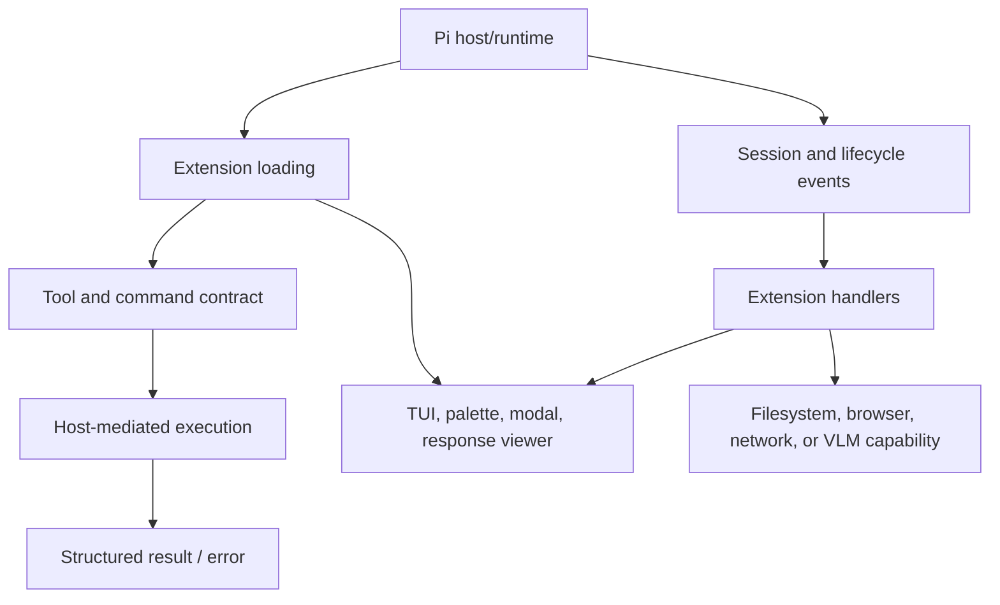

# Pi Extensions — Agent Tools, TUI Surfaces, and Runtime Boundaries

Pi extensions are the agent-facing tools, commands, UI surfaces, and runtime hooks that extend a coding-agent host without modifying its core. The work includes a shared extension framework, VLM/search tools, response viewers, compaction and context transforms, command palettes, modal/TUI surfaces, environment capture, and auditable agent-run packaging. The recurring boundary is between a loaded extension, a declared tool contract, host-owned runtime state, and the user-facing UI.

> [!summary]
> - **Tool surface:** extensions expose narrow, documented commands with explicit inputs, outputs, and failure behavior.
> - **UI surface:** TUI, modals, palettes, response viewers, and browser-backed tools share lifecycle/event constraints.
> - **Runtime boundary:** extensions observe or transform agent state without silently owning the host's session, filesystem, or process lifecycle.

## Architecture

A successful load only proves that the extension registered. It does not prove that its tool works, that its description is accurate, or that its UI lifecycle is safe. The reports therefore emphasize live proof, explicit tool schemas, host-owned execution, and tests that exercise the real Pi surface.

## Capability areas

### Shared framework and tools

- [[PROJECT REPORT - Pi Extensions Shared Framework and Tool Surface Deep Dive]] — shared framework, VLM/search tools, response viewer, and testing.
- [[ARTICLE - Playbook - Building and Testing Pi Extensions]] — extension development workflow.
- [[PROJ - Pi Extension - Hello World Before Thinking Blocks]] — first lifecycle boundary.
- [[PROJ - Pi Extensions - Agent Env and Response Capture]] — environment and response capture.
- [[Research/KB/On-Ramp/pi-extension-authoring-mental-model]] — extension lifecycle orientation.
- [[Research/KB/Tribal/pi-extension-event-seams]] — event and host seams.

### TUI, palettes, and response surfaces

- [[ARTICLE - Textbook - Building Beautiful TUIs for Pi Extensions]] — TUI construction.
- [[PROJ - Pi Extensions - Compaction Title Extension]] — extension-generated title/context behavior.
- [[PROJ - Pi Extensions - Direnv Bash Extension]] — host command/environment integration.
- [[ARTICLE - Response Viewer - A Pi Extension for Browsing and Opening Assistant Responses in a Markdown Viewer]] — response viewer.
- [[PROJ - Pi Extensions - Response Viewer Metadata Report]] — response metadata.
- [[ARTICLE - Pi Command Palette - Keyboard-Driven Hierarchical Action Menu]] — command palette.
- [[ARTICLE - Pi Agent Command Palette Extension Architecture - Shared Registry and Keyboard-Driven Actions]] — shared action registry.
- [[ARTICLE - Pi Agent Modals and Terminal Shortcuts - Debugging Overlay Shortcut Behavior]] — modal and terminal lifecycle.

### Context, compaction, and agent packaging

- [[ARTICLE - Selective Compaction Extension - Rewriting Middle Session Context]] — context rewriting.
- [[ARTICLE - Pi Claw Runtime Packaging - Scenario Driven LLM Extraction and Auditable Agent Runs]] — auditable run substrate.
- [[PROJ - Extensions and Dashboard - Overhaul Deep Dive]] — extension/dashboard consolidation.
- [[PROJ - pi-launcher - Declarative YAML Profiles for Pi]] — declarative host profiles.
- [[PROJ - Prompto Pi Extension - Prompt Form Expansion for Pi]] — prompt authoring surface.
- [[PROJ - Prompto Pi Extension - From Extension to Authoring Skill]] — extension-to-skill transition.

### Adjacent runtime maps

- [[go-go-goja]] — Go-hosted JavaScript and generated runtimes.
- [[geppetto]] — model, session, event, and tool runtime.
- [[pinocchio]] — CLI/TUI/chat host.
- [[go-minitrace]] — transcript evidence and session analysis.
- [[sessionstream]] — event and timeline protocol.

## Working rules

- Treat tool descriptions and schemas as runtime contracts.
- Separate registration success from behavioral success.
- Keep extension capabilities narrow and host-mediated.
- Use real Pi/TUI smoke tests for lifecycle-sensitive behavior.
- Preserve session identity and event ordering when transforming context.
- Keep filesystem recency, session recency, and UI state as separate concepts.
- Test keyboard focus, terminal ownership, and modal cleanup explicitly.
- Package agent runs with scenarios, manifests, raw outputs, and audit evidence.

## Recommended reading path

1. Read the shared framework report and extension authoring playbook.
2. Read the event-seam and extension mental-model KB entries.
3. Choose the TUI/palette branch or context/compaction branch.
4. Read Pi Claw packaging for auditable multi-provider runs.
5. Follow Geppetto, Pinocchio, and sessionstream for host/runtime boundaries.

## Repository and workspace map

The extension work spans Pi extension repositories and workspaces, including `/home/manuel/code/wesen/corporate-headquarters` extension projects, `/home/manuel/code/wesen/go-go-golems/pi-launcher`, `/home/manuel/code/wesen/go-go-golems/prompto`, and `/home/manuel/code/wesen/go-go-golems/promptos`.

| Concern | Location |
|---|---|
| Shared extension framework | Pi extension workspace |
| Tools and native capabilities | extension packages and host adapters |
| TUI/palette/modal surfaces | extension UI modules |
| Prompt authoring | `prompto`, `promptos` |
| Run packaging | Pi Claw and agent-run workspaces |
