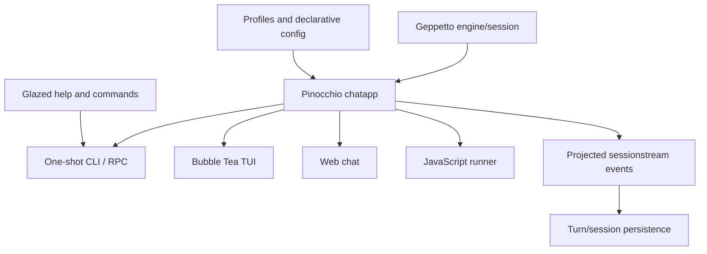

# Pinocchio — CLI Chat Applications, TUI, RPC, and Session Hosts

Pinocchio is the application and host layer around Geppetto. It turns model engines into usable CLI chat tools, Bubble Tea interfaces, command/RPC services, web-chat surfaces, JavaScript runners, and persistent session applications. Its central engineering problem is translating a streaming inference runtime into several client-facing modes without losing event identity, stdout discipline, turn persistence, or provider semantics.

> [!summary]
> - **CLI host:** human-readable stdout, script-friendly RPC/JSONL, profiles, configuration, and commands.
> - **Interactive host:** Bubble Tea TUI, sessionstream projections, reasoning blocks, continuation prompts, and hydration.
> - **Application host:** web chat, chatapp persistence, JavaScript execution, and shared help/UI assets.

## Architecture

Pinocchio has several output modes, but they should share a runtime contract rather than independently reimplementing inference. The TUI needs live event fanout and snapshot hydration; RPC needs machine-readable stdout; one-shot CLI needs readable output; web-chat needs persistent timeline state. These are different projections over the same application/session lifecycle.

## Capability areas

### CLI, profiles, and declarative configuration

- [[loading-pinocchio-geppetto-profiles-for-llm-and-embeddings-inference]] — playbook for loading engine and embedding profiles for LLM and embeddings inference, reusing `pinocchio/pkg/cmds/profilebootstrap` and geppetto's `AppBootstrapConfig`.
- [[PROJ - PinocchioRC - Declarative Config Plans and Cleanup]] — the shared config-plan architecture across Glazed, Geppetto, and Pinocchio.
- [[ARTICLE - Pinocchio Structured Streams - Protobuf JSONL RPC and Chatapp TUI Migration]] — current CLI/RPC/TUI stream contract.
- [[PROJ - Scopedjs Runtime - Geppetto Final State]] — runtime profile and host history.
- [[ARTICLE - Building a Sessionstream CLI Chat Runner - CoinVault Pinocchio Chatapp Deep Dive]] — chat runner integration.
- [[PROJECT REPORT - Packaging and Embedding a Shared Help SPA - Glazed and Pinocchio]] — help and shared asset packaging.

### Streaming, TUI, and sessionstream

- [[ARTICLE - Observer Instrumentation - Geppetto Pinocchio Sessionstream Deep Dive]] — event instrumentation.
- [[ARTICLE - Removing a Dead Event Pipeline - SEM Frame Cleanup in Pinocchio]] — removing an obsolete event path.
- [[ARTICLE - Protobuf Payload Contracts and Sessionstream Schema Vet]] — payload contract validation.
- [[ARTICLE - Sessionstream Chatapp CoinVault Cleanup - Protobuf Ordinals and Transcript Segments]] — ordering and persistence.
- [[Research/KB/Tribal/bubbletea-streaming-llm-uis]] — TUI streaming design patterns.
- [[Research/KB/Tribal/session-turn-blocks-chat-applications]] — sessions, turns, and blocks.

### Web, JavaScript, and application surfaces

- [[ARTICLE - Pinocchio Web Chat Cleanup - Engineering Playbook and Technical Report]] — web-chat cleanup and lifecycle.
- [[ARTICLE - Generic ChatProvider - From Overlay Runtime to Provider Backed Web Chat]] — provider-backed web chat.
- [[ARTICLE - Geppetto JS Session API - From Turns to Sessions]] — JavaScript session contract.
- [[ARTICLE - Geppetto JS Overhaul - Wrapper First Agents Events and Storage Boundaries]] — wrapper and storage boundaries.
- [[ARTICLE - LLM Proxy - Chat Completions Tools and Pinocchio Smoke Technical Report]] — service/CLI integration.
- [[ARTICLE - Devctl Trace Profiles - Pinocchio and CoinVault]] — host observability.

### Migration and failure reports

- [[ARTICLE - Pinocchio Structured Streams - Protobuf JSONL RPC and Chatapp TUI Migration]] — current stream migration.
- [[ARTICLE - From eval_js to Persistent Agent Runtime - Replsession Logging and Streaming Events]] — persistent execution transition.
- [[ARTICLE - Conversation Export Pipelines - Pinocchio CoinVault Timeline Turns and Minitrace]] — export and transcript boundaries.
- [[ARTICLE - Canonical Chat Event Protocol - Provider Streams to Browser State]] — event projection model.

## Recommended reading path

1. Read PinocchioRC and the structured-stream migration report.
2. Read the Bubble Tea tribal entry and session/turn/block model.
3. Read the observer and persistence reports for event identity and completion.
4. Read the web-chat and JavaScript reports for application projections.
5. Use the migration and failure reports when modifying output, RPC, or TUI behavior.

## Working rules

- One inference/session contract, many client projections.
- Keep human stdout, machine RPC stdout, stderr, and terminal UI ownership separate.
- Treat event identity and ordering as part of the public protocol.
- Do not infer run completion from segment completion or merely from `WaitIdle`.
- Persist final turns from the authoritative host/backend, not from reconstructed UI timelines.
- Keep reasoning and append-mode patches cumulative and explicitly registered.
- Test CLI, RPC, TUI, and web modes separately because their lifecycle boundaries differ.

## Repository map

Repository: `/home/manuel/code/wesen/go-go-golems/pinocchio`

| Concern | Location |
|---|---|
| CLI commands | `cmd/pinocchio`, `pkg/cmds` |
| Chat application | `pkg/chatapp` |
| TUI and UI | `pkg/tui`, `pkg/ui` |
| Persistence and streams | `pkg/persistence`, `pkg/redisstream` |
| JavaScript integration | `pkg/js` |
| Web chat and SPA | `pkg/spa`, `cmd/web-chat` |
| Compatibility and Geppetto bridge | `pkg/geppettocompat` |
| Protocols | `proto/pinocchio` |
