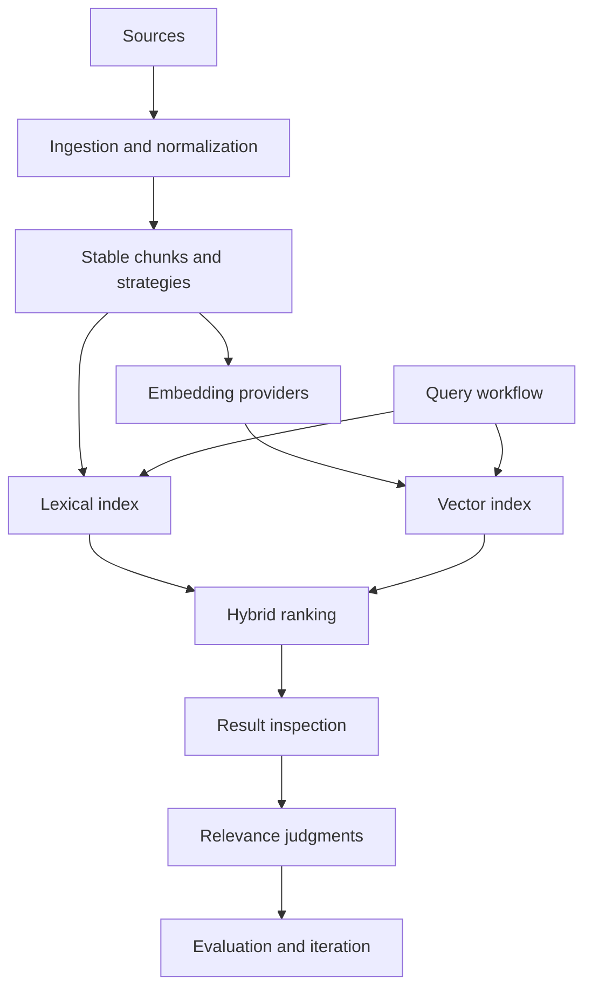

# RAG Evaluation System — Corpus, Retrieval, and Workflow Evaluation

The RAG Evaluation System is a workflow-driven environment for ingesting source documents, generating stable chunks and embeddings, querying lexical/vector/hybrid indexes, inspecting retrieved evidence, and recording relevance judgments. It treats retrieval as an inspectable experiment rather than a single search function: corpus identity, chunking strategy, embedding provider, query results, and human evaluation are all part of the evidence.

> [!summary]
> - **Corpus:** sources become versioned documents, chunks, embeddings, and retrieval indexes.
> - **Retrieval:** BM25, vector search, and hybrid ranking are compared through explicit query workflows.
> - **Evaluation:** smoke checks, fixed-truth datasets, manual inspection, and relevance judgments prevent weak search from being mistaken for a good RAG system.

## Architecture

The system's correctness depends on identity. A chunk must retain its source and strategy lineage; an embedding must be associated with the model and generation; a query result must be inspectable; and an evaluation must state which corpus and retrieval configuration produced it. Without those identities, “better retrieval” is not reproducible.

## Capability areas

### Ingestion, chunking, and embeddings

- [[ARTICLE - RAG Evaluation System - Workflow-Driven Retrieval Evaluation]] — workflow state, ingestion, chunking, embeddings, and failure modes.
- [[ARTICLE - RAG Evaluation System - Building a Database-Backed TTC Corpus Pipeline]] — corpus persistence and TTC data.
- [[ARTICLE - Exporting WordPress WooCommerce Data into a RAG SQLite Corpus]] — source ingestion example.
- [[PROJ - goja-text - Source-Preserving Chunking for JavaScript RAG Pipelines]] — chunk provenance companion.

### Search and ranking

- [[ARTICLE - RAG Evaluation System - Search Retrieval Foundation Deep Dive]] — BM25, vector search, hybrid retrieval, and current limits.
- [[ARTICLE - Building FAISS for Bleve Vector Search]] — vector indexing and ANN context.
- [[ARTICLE - Goja Bleve - Native Search Bindings for JavaScript RAG Pipelines]] — native search bindings.
- [[PROJECT REPORT - Transcript RAG Bleve - Hybrid Search, Empirical Findings, and the Corrected Architecture]] — empirical hybrid-search correction.
- [[PROJECT REPORT - Transcript RAG - Final Hybrid Architecture and IVF Probe Auto-Tune]] — probe tuning and hybrid architecture.

### Evaluation workflow and UI

- [[ARTICLE - RAG Evaluation - Workflow Intake UI Architecture and Data Exploration]] — intake and exploration UI.
- [[PROJ - RAG Evaluation - Workflow Intake UI Implementation Report]] — implemented workflow surface.
- [[ARTICLE - RAG Evaluation - Building and Validating an Initial Fixed-Truth Dataset]] — fixed-truth evaluation.
- [[ARTICLE - RAG Evaluation System - Corpus Explorer and Pipeline Visualization Website]] — corpus and pipeline inspection.
- [[ARTICLE - RAG Evaluation System - Frontend Architecture and Context Viewer Integration]] — frontend result/context viewer.
- [[PROJECT REPORT - External Agent Validation Loop - Isolated Skill Experiments and Transcript Evaluation]] — isolated evaluation methodology.

### Generated hosts and widgets

- [[ARTICLE - Deep Dive - xgoja Scripting for RAG Evaluation Systems]] — JavaScript-hosted workflow tooling.
- [[ARTICLE - Widget IR - Building a Data-First React Rendering Pipeline for RAG Evaluation]] — structured UI output.
- [[ARTICLE - Widget DSL Grammar - Designing an Intent-Level UI Authoring Layer for a Widget IR System]] — declarative UI layer.
- [[ARTICLE - Doodle on xgoja and Widget DSL v3 - A SQLite Scheduling Site Deep Dive]] — adjacent generated application.

## Recommended reading path

1. Read the workflow-driven retrieval evaluation report.
2. Read the search foundation report for BM25/vector/hybrid semantics.
3. Read the fixed-truth dataset report before trusting metrics.
4. Read the UI/corpus explorer reports for inspection workflows.
5. Follow goja-text, goja-bleve, and widget DSL links for reusable implementation boundaries.

## Working rules

- Version corpus, chunking strategy, embedding configuration, and index configuration together.
- Make workflow operations idempotent and preserve stable identities.
- Inspect weak queries manually before tuning ranking parameters.
- Keep smoke tests separate from benchmarks and relevance claims.
- Use fixed-truth judgments for regression, not only synthetic success checks.
- Keep live provider calls out of unit tests.
- Preserve source context and chunk provenance through every retrieval layer.

## Related project maps

- [[goja-text]] — text parsing and source-preserving chunking.
- [[goja-bleve]] — native vector and hybrid search runtime.
- [[sessionstream]] — streamed inspection and chat evidence.
- [[go-go-goja]] — generated JavaScript hosts.
- [[widget-dsl]] — structured UI for corpus and result inspection.

## Repository map

Repository: `/home/manuel/code/wesen/go-go-golems/rag-evaluation-system`

| Concern | Location |
|---|---|
| Workflow and domain model | Go packages under `pkg/` |
| Corpus and retrieval | ingestion/index/search packages |
| HTTP and CLI adapters | command and server packages |
| Frontend and viewer | `web/`, `packages/`, or app frontend |
| Evaluation fixtures | test data and workflow artifacts |
