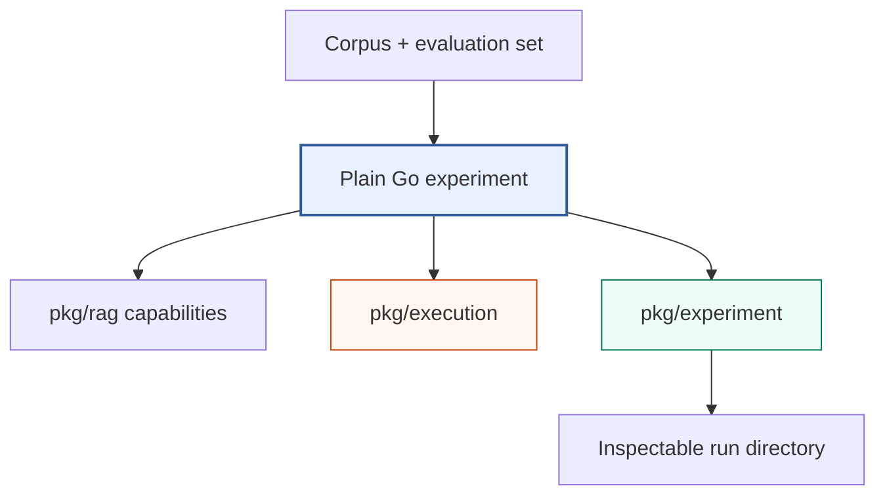

# rag-ttc — Clean-Slate TTC RAG Experiments

`rag-ttc` is the clean-slate TTC retrieval experiment repository. Experiments
are ordinary Go programs that compose a typed RAG toolbox, explicit execution
controls, and a filesystem run ledger. The repository does not depend on the
historical RAG DSL, Researchctl, or Scraper Workflow V3.

> [!summary]
> - **Direct experiments:** Go programs keep the hypothesis, stage order, and
>   measurements visible; a 38+-arm representation registry screens on BM25
>   and promotes winners into full retrieval confirmation with zero re-spend.
> - **Two tracks, one module:** the research lab and a Bubble Tea chat app
>   (`pkg/app/`), with a test-enforced one-way dependency boundary.
> - **Headline findings:** the hybrid retrieval reversal (summaries win under
>   BM25-only; raw wins under vector; RRF-over-raw dominates); judged answer
>   quality shows faithfulness ≈0.98–0.99 on every arm with **answerability**
>   as the real differentiator (BM25 fails to answer 30% vs vector's 14%);
>   findings replicate across generation models (GLM era → luna era).
> - **LLM judge:** a two-step decomposed pipeline (statement extraction →
>   per-statement verdicts; faithfulness computed, never asked), cached so a
>   re-judge is a 100% replay; 20-card human audit gates any cited number.
> - **Subscription economics:** answers and up-front generation run on
>   gpt-5.6-luna over ChatGPT-plan OAuth (codex profile extension) at ~234
>   calls/min at 24 workers; the full 3,149-doc corpus is extracted with the
>   148-query evaluation set preserved verbatim.

## Primary report

- [[PROJECT REPORT - rag-ttc - Clean-Slate RAG Experiments in Plain Go]] —
  textbook-style architecture and implementation deep dive, including the
  experiment directory, execution controls, cache recovery algorithm, examples,
  validation boundary, and real-TTC integration sequence.
- [[PROJECT REPORT - rag-ttc - From Clean-Slate Toolbox to Live TTC Answer Quality Evaluation]] —
  chronological implementation deep dive through
  persistent backends, Geppetto profiles, real TTC measurements, recoverable
  provider execution, live OpenAI experiments, and the replay blocker.
- [[ARTICLE - rag-ttc - Architecture of a Reproducible Go RAG Evaluation System]] —
  repository-oriented reference covering data records, interfaces,
  backends, execution controls, run artifacts, answer contracts, blinded
  review, and measurement semantics without implementation history.
- [[PROJECT REPORT - rag-ttc - Simplifying a Recoverable and Measurable RAG Experiment System]] —
  post-refactor technical analysis of the final package boundaries, generic
  execution primitives, per-item cache recovery, artifact reduction,
  arm-aware dependency planning, real TTC validation, and bounded OpenAI
  generation and embedding evidence.
- [[ARTICLE - rag-ttc - Reproducible TTC RAG Evaluation with Blinded LLM Judges]] —
  complete 30-query BM25-versus-RRF protocol, grounded generation contract,
  semantic-identity replay, blinded LLM judging, paired results, disagreement
  audit, and zero-provider-work annotation import.
- [[ARTICLE - rag-ttc - Refactoring Explicit Experiments and Reusable Mechanisms]] —
  textbook-style account of the final dependency structure, generic execution
  and experiment custody, semantic RAG decorators, command-owned policy,
  deletion decisions, and validation rules.
- [[PROJECT REPORT - Zapx - Defensive Varint Decoding for Corrupt Bleve Postings]] —
  corpus-level diagnosis of a malformed Bleve posting, the retained `goja`
  reproducer, the Zapx truncated-varint bounds fix, recovery by deterministic
  index rebuilding, and the remaining writer-side uncertainty.

## Campaign reports (2026-07-30 → 07-31)

The chunk-lab / judge / luna-era campaign, in reading order:

- [[PROJ - RAG-TTC Chunk Lab Results - From BM25 Screening to the Hybrid Retrieval Reversal]] —
  the 38-arm screening bench, Track A size/overlap results (knee at
  1600–2400 runes, overlap dead), Track B representations (summaries best for
  BM25 breadth, llm-chunk efficient, questions churny), and the E10
  confirmation that reversed the story: the summary advantage is
  BM25-length-normalization-local, vector prefers raw, hybrid RRF over raw
  dominates.
- [[PROJ - Codex OAuth for gpt-5.6-luna - Subscription-Plan Inference Through Geppetto's OpenAI-Codex Transport]] —
  the standalone smoke tool that proved subscription generation end to end:
  PKCE constants recovered from the codex binary, the `invalid_scope` and
  `store=false` discoveries, JWT-derived account identity.
- [[PROJ - RAG-TTC Codebase Consolidation - Review-Then-Execute from 49k Lines to a Two-Track Repository]] —
  the evidence-first review (three parallel sweeps), the deletions
  (−3,152 lines), the `pkg/app/` split with a boundary test, `pkg/harness`
  extraction, and the byte-identical replay gate.
- [[PROJ - RAG-TTC LLM Judge - A Two-Step Decomposed Faithfulness Pipeline from Design to Live Run]] —
  the judge's contracts, outcome taxonomy, cache identity, multi-profile
  resolution (`ResolveNamed`), and the discovery that the judge, not the
  answerer, is the throughput bottleneck of judged experiments.
- [[PROJ - RAG-TTC Luna Era - Executing the Six-Item Sequence on Subscription Economics]] —
  codex wiring behind a profile extension, the audit tooling, E10b
  per-channel fusion, E16/E17, E11, the four-attempt judge reliability
  campaign, and the pinocchio registry-resolution regression (upstream PR
  #191).
- [[ARTICLE - Study - RAG for AIGC Survey Zhao et al 2026 - Digest and Experiment Candidates]] —
  the survey study that seeded SYSLAB E14–E21 (E16/E17 implemented; E21
  became the judge).

## Textbook article series

Durable fundamentals distilled from the campaign, each anchored to repo code:

- [[ARTICLE - Chunking Theory - Cut Strategies and the Exact-Slice Invariant]]
- [[ARTICLE - Representation Theory for Retrieval - Indexing Descriptions Instead of Content]]
- [[ARTICLE - Retrieval Models - Lexical, Vector, and Hybrid Retrieval in RAG Systems]]
- [[ARTICLE - Rank Fusion - Weighted Reciprocal Rank Fusion over Heterogeneous Channels]]
- [[ARTICLE - Query and Index Transformations - Closing the Vocabulary Gap from Both Sides]]
- [[ARTICLE - Reranking - Cross-Encoder Second Stages and Their Diagnostics]]
- [[ARTICLE - Retrieval Evaluation - Judged Sets, Ranking Metrics, and Per-Query Analysis]]
- [[ARTICLE - RAG Evaluation and LLM Judges - Behavioral Benchmarks, Judged Metrics, and Judge Reliability]]
- [[ARTICLE - Reproducibility Engineering - Digests, Caches, Budgets, and Provenance]]
- [[ARTICLE - Measurement Discipline and LLM IO - Throughput, Batching, and Structured Output]]

## Papers and techniques implemented

Techniques in the codebase, mapped to their sources (RES notes live in
`Projects/2026/07/30/resources/`):

| Technique | Where in rag-ttc | Source |
| --- | --- | --- |
| Decomposed faithfulness judging | `answerquality/judge.go` (statements → verdicts; F computed) | [[RES - Es et al 2023 - RAGAS Automated Evaluation of RAG (arXiv full)]] |
| Judge reliability + biases | judge validation plan; audit gate | [[RES - Zheng et al 2023 - Judging LLM-as-a-Judge MT-Bench (arXiv)]], [[RES - Panickssery et al 2024 - LLM Evaluators Favor Their Own Generations (arXiv)]], [[RES - Gu et al 2024 - A Survey on LLM-as-a-Judge (arXiv)]], [[RES - Liu et al 2023 - G-Eval NLG Evaluation with GPT-4 (arXiv)]], [[RES - Saad-Falcon et al 2023 - ARES Automated RAG Evaluation (arXiv full)]] |
| Reciprocal rank fusion | `pkg/rag/retrieval` (weighted RRF) | Cormack, Clarke & Büttcher 2009 (SIGIR; no RES note — ACM paywall) |
| HyDE hypothetical documents | `answering.StrategyHyDE`; E11 arm | [[RES - Gao et al 2022 - HyDE Precise Zero-Shot Dense Retrieval (arXiv)]] |
| Query expansion by prediction | questions arms (`questions-only*`) — index-side doc2query mirror | [[RES - Nogueira Cho 2019 - Document Expansion by Query Prediction doc2query (arXiv)]] |
| Contextual representations | contextual arms (`contextual-*`) | [[RES - Anthropic 2024 - Introducing Contextual Retrieval]] |
| Hierarchical summaries (E16) | `representations.DocumentSummaries`; `raptor-lite` arm — screened FLAT | Sarthi et al 2024, RAPTOR ([arXiv:2401.18059](https://arxiv.org/abs/2401.18059)) |
| Atomic statement indexing (E17) | `GeneratedStatementsBatched`; `statements-only` arms — informative negative (questions beat statements on both axes) | Chen et al 2023, Dense X Retrieval / propositions ([arXiv:2312.06648](https://arxiv.org/abs/2312.06648)) |
| Dense passage retrieval | `vector/sqliteexact` + OpenAI embeddings | [[RES - Karpukhin et al 2020 - Dense Passage Retrieval (arXiv)]] |
| Cross-encoder reranking | `pkg/rag/reranking` (deterministic stand-in; real reranker pending) | [[RES - Nogueira Cho 2019 - Passage Re-ranking with BERT (arXiv)]] |
| Chunking strategy evaluation | Track A size/overlap sweep | [[RES - Chroma Research - Evaluating Chunking Strategies for Retrieval]], [[RES - Gunther et al 2024 - Late Chunking Contextual Chunk Embeddings (arXiv)]] |
| Behavioral RAG benchmarks | abstention/contract discipline | [[RES - Chen et al 2023 - RGB Benchmarking LLMs in RAG (arXiv)]], [[RES - Yang et al 2024 - CRAG Comprehensive RAG Benchmark (arXiv)]], [[RES - Thakur et al 2021 - BEIR Zero-Shot IR Benchmark (arXiv)]] |
| Retry with backoff + jitter | `generation.WithRetry` (incident-grown marker set) | [[RES - AWS Architecture Blog - Exponential Backoff and Jitter.md|RES - AWS Architecture Blog - Exponential Backoff and Jitter]] |
| ANN indexing (pending bakeoff) | SCALE-001 plan | [[RES - Malkov Yashunin 2016 - HNSW Approximate Nearest Neighbor (arXiv)]] |
| Coordinated-omission-aware measurement | throughput benches | [[RES - ScyllaDB - On Coordinated Omission]] |

## Software Architecture Garden

- [[Research/Software Architecture Garden/rag-ttc/README|Architecture Garden — rag-ttc]] — commit-pinned project study of how plain-Go experiment policy, typed RAG contracts, provider adapters, bounded recoverable execution, semantic identity, and experiment result custody are woven together.
- [[Research/Software Architecture Garden/rag-ttc/05 - Provider Integration Validation and Ecosystem Lessons|rag-ttc provider integration and ecosystem lessons]] — validated provider boundaries and reusable rules for package ownership, expensive-work recovery, zero-authority replay, adapter validation, and durable completed-result streams.

## Architecture



The experiment program owns composition. `pkg/rag` owns semantic operations.
`pkg/rag/execution` owns bounded and recoverable work mechanics.
`pkg/experiment` owns artifact custody and terminal state. None of these
packages owns a generic end-to-end workflow.

## Implementation areas

| Concern | Repository location |
| --- | --- |
| Canonical records and interfaces | `pkg/rag/types.go`, `pkg/rag/components.go`, `pkg/rag/target.go` |
| Source-preserving chunking | `pkg/rag/chunking` |
| Representations, prompts, batching | `pkg/rag/representations` (incl. `DocumentSummaries`, statements) |
| Local and Geppetto embeddings | `pkg/rag/embedding`, `pkg/rag/providers/geppetto` |
| Subscription (codex) generation | `pkg/rag/providers/geppetto/codex` + `profile` (extension-selected) |
| BM25 and exact vector search | `pkg/rag/lexical/bleve`, `pkg/rag/vector/sqliteexact` |
| Collapse, fusion, and hydration | `pkg/rag/retrieval` |
| Reranking and answer generation | `pkg/rag/reranking`, `pkg/rag/generation` (incl. `WithRetry`) |
| Retrieval metrics | `pkg/rag/evaluation` |
| Workers, rates, budgets, caches | `pkg/execution`; harness glue in `pkg/harness` |
| Run directory lifecycle | `pkg/experiment` |
| Screening bench (38+ arms) | `cmd/rag-ttc/cmds/experiments/chunkcompare` |
| Answer quality + LLM judge + E10b/E11 | `cmd/rag-ttc/cmds/experiments/answerquality` (`judge.go`, `representationarm.go`) |
| Index bundles + corpus inspection | `pkg/rag/indexbundle`, `cmds/indexes`, `cmds/corpus` |
| Interactive app track (frozen boundary) | `pkg/app/{chatui,chat,session,annotation}`, boundary test in `cmd/rag-ttc/boundary_test.go` |
| Progressive onboarding | `examples/01_chunking`, `examples/06_end_to_end_experiment` |

## Source project evidence

- Repository:
  `/home/manuel/workspaces/2026-06-30/benchmark-cpu-inference/rag-ttc`
- Ticket:
  `ttmp/2026/07/25/RAG-TTC-CLEAN-SLATE-001--clean-slate-ttc-rag-experiment-toolbox-and-measurement-architecture`
- Implementation commit: `800ad75fec583acf77cb9376382a1f49322a5579`
- Documentation commit: `77747a8f8e53b878d2b6769cd4b9b2b4d6171ef5`

## Historical context

- [[bleve]] indexes the lexical backend, FAISS vector experiments, hybrid
  retrieval evidence, and the Zapx persisted-posting integrity investigation.
- [[rag-evaluation-system]] indexes the earlier corpus, DSL, workflow, and
  evaluation implementation.
- [[researchctl]] indexes the experiment control-plane and analysis system that
  no longer participates in the clean-slate RAG runtime.
- [[scraper]] indexes Workflow V3, whose general durable scheduler is no longer
  required for these self-contained experiments.
- [[goja-text]] documents earlier source-preserving chunking work that informed
  the chunk lineage invariants.
- [[goja-bleve]] documents native lexical and vector retrieval work relevant to
  future production index adapters.

Important historical reports:

- [[PROJECT REPORT - Experiment Platform Convergence - Researchctl Workflow V3 and RAG]]
- [[ARTICLE - Full TTC RAG Laboratory and go-go-parc Corpus Research Report]]
- [[ARTICLE - RAG Evaluation - Building and Validating an Initial Fixed-Truth Dataset]]
- [[ARTICLE - RAG DSL v2 - Developer Guide]]
- [[ARTICLE - Immutable TTC RAG Laboratory - From Fixed Truth to Executable JavaScript Experiments]]

## Current validation boundary (2026-07-31)

Established, with digit-exact replay evidence throughout:

- **Retrieval:** the full 148-query E10 confirmation series across bm25 /
  vector / rrf; the hybrid reversal; luna-era screening replicating the
  GLM-era representation findings across generation models; E16 flat and
  E17 an informative negative (questions beat statements on both axes).
- **Judged answers:** decomposed faithfulness ≈0.98–0.99 on every arm,
  relevance ≈0.96–0.97, with answerability the differentiator (bm25 30%
  non-answers vs vector 14%); zero unjudged/partial cells; re-judging is a
  proven 100% cache replay. Labeled `same_family_verdicts: true` (GLM
  judging GLM-era answers).
- **Scale groundwork:** the full 3,149-document corpus extracted with all 200
  evaluation documents verbatim (judgments carry over); a deterministic
  2,000-doc build subset; measured luna throughput (~58/min at 4 workers to
  ~234/min at 24, thinking level immaterial for summaries).

The current boundary is:

```text
judged numbers + replicated screening findings
  != human-audited judge (20-card audit sheet awaiting grading)
  != cross-family judged evidence (luna answers + GLM judge pending)
  != full-corpus confirmation (2,000-doc bundle building; ANN bakeoff pending)
```

## Next steps

1. Human 20-card audit grading (`judge-audit.py score`; ≥90% unlocks judged
   numbers for write-ups).
2. E10b per-channel fusion verdict (configs a/b/c) and the 2,000-doc bundle
   (both running in tmux at time of writing).
3. Cross-family judged run: luna answers over the codex subscription, GLM
   judge — `same_family_verdicts: false` by construction.
4. SYSLAB E14/E15/E18/E20 on the judged harness; ANN bakeoff (HNSW candidate)
   on the 2,000-doc bundle per SCALE-001.
5. Real cross-encoder reranker (mac-bge tunnel) to replace the deterministic
   stand-in.

## Working rules

- Keep experiments as readable Go programs.
- Share stable capabilities, not anticipated workflows.
- Preserve exact source lineage through chunking and retrieval.
- Resolve cache hits before rate and budget admission.
- Commit successful expensive items independently.
- Keep per-query evidence beside aggregate metrics.
- Label synthetic results as synthetic.
- Do not claim TTC quality until the approved corpus and split have been run.
