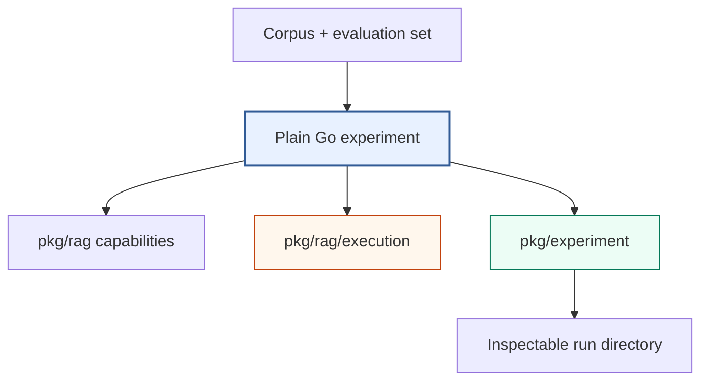

# rag-ttc — Clean-Slate TTC RAG Experiments

`rag-ttc` is the clean-slate TTC retrieval experiment repository. Experiments
are ordinary Go programs that compose a typed RAG toolbox, explicit execution
controls, and a filesystem run ledger. The repository does not depend on the
historical RAG DSL, Researchctl, or Scraper Workflow V3.

> [!summary]
> - **Direct experiments:** Go programs keep the hypothesis, stage order, and
>   measurements visible.
> - **Shared toolbox:** packages provide chunking, embedding, lexical/vector
>   retrieval, fusion, reranking, generation, evaluation, and reporting.
> - **Safe execution:** worker bounds, resource rates, finite budgets, and
>   atomic per-item caching control expensive provider work and allow recovery.
> - **Current evidence:** all examples pass on a deterministic synthetic corpus;
>   the authoritative TTC evaluation run is still pending input selection.

## Primary report

- [[PROJECT REPORT - rag-ttc - Clean-Slate RAG Experiments in Plain Go]] —
  textbook-style architecture and implementation deep dive, including the
  experiment directory, execution controls, cache recovery algorithm, examples,
  validation boundary, and real-TTC integration sequence.

## Architecture



The experiment program owns composition. `pkg/rag` owns semantic operations.
`pkg/rag/execution` owns bounded and recoverable work mechanics.
`pkg/experiment` owns artifact custody and terminal state. None of these
packages owns a generic end-to-end workflow.

## Implementation areas

| Concern | Repository location |
| --- | --- |
| Canonical records and interfaces | `pkg/rag/types.go`, `pkg/rag/components.go` |
| Source-preserving chunking | `pkg/rag/chunking` |
| Deterministic local embeddings | `pkg/rag/embedding` |
| BM25 and exact vector search | `pkg/rag/lexical`, `pkg/rag/vector` |
| Collapse, fusion, and hydration | `pkg/rag/retrieval` |
| Reranking and answer generation | `pkg/rag/reranking`, `pkg/rag/generation` |
| Retrieval metrics and reports | `pkg/rag/evaluation`, `pkg/rag/report` |
| Workers, rates, budgets, caches | `pkg/rag/execution` |
| Run directory lifecycle | `pkg/experiment` |
| Progressive onboarding | `examples/01_chunking` through `examples/06_end_to_end_experiment` |

## Source project evidence

- Repository:
  `/home/manuel/workspaces/2026-06-30/benchmark-cpu-inference/rag-ttc`
- Ticket:
  `ttmp/2026/07/25/RAG-TTC-CLEAN-SLATE-001--clean-slate-ttc-rag-experiment-toolbox-and-measurement-architecture`
- Implementation commit: `800ad75fec583acf77cb9376382a1f49322a5579`
- Documentation commit: `77747a8f8e53b878d2b6769cd4b9b2b4d6171ef5`

## Historical context

- [[rag-evaluation-system]] indexes the earlier corpus, DSL, workflow, and
  evaluation implementation.
- [[researchctl]] indexes the experiment control-plane and analysis system that
  no longer participates in the clean-slate RAG runtime.
- [[scraper]] indexes Workflow V3, whose general durable scheduler is no longer
  required for these self-contained experiments.
- [[goja-text]] documents earlier source-preserving chunking work that informed
  the chunk lineage invariants.
- [[goja-bleve]] documents native lexical and vector retrieval work relevant to
  future production index adapters.

Important historical reports:

- [[PROJECT REPORT - Experiment Platform Convergence - Researchctl Workflow V3 and RAG]]
- [[ARTICLE - Full TTC RAG Laboratory and go-go-parc Corpus Research Report]]
- [[ARTICLE - RAG Evaluation - Building and Validating an Initial Fixed-Truth Dataset]]
- [[ARTICLE - RAG DSL v2 - Developer Guide]]
- [[ARTICLE - Immutable TTC RAG Laboratory - From Fixed Truth to Executable JavaScript Experiments]]

## Current validation boundary

The package tests, race tests, build, lint, and all six examples pass. The
examples use `pkg/sampledata`, a deterministic synthetic tree-care corpus. No
authoritative TTC export or protected evaluation split has been run in this
repository.

This boundary must remain visible in future reports:

```text
synthetic example success != TTC retrieval quality
```

## Next production step

1. Confirm the authoritative TTC corpus export.
2. Confirm the approved development and protected evaluation splits.
3. Implement a focused loader into `rag.Document` and `rag.EvaluationSet`.
4. Record corpus and evaluation digests in the run directory.
5. Execute and inspect the BM25 baseline.
6. Add provider embeddings only after the input mapping is trusted.
7. Apply worker, rate, budget, and cache controls to provider work.

## Working rules

- Keep experiments as readable Go programs.
- Share stable capabilities, not anticipated workflows.
- Preserve exact source lineage through chunking and retrieval.
- Resolve cache hits before rate and budget admission.
- Commit successful expensive items independently.
- Keep per-query evidence beside aggregate metrics.
- Label synthetic results as synthetic.
- Do not claim TTC quality until the approved corpus and split have been run.
