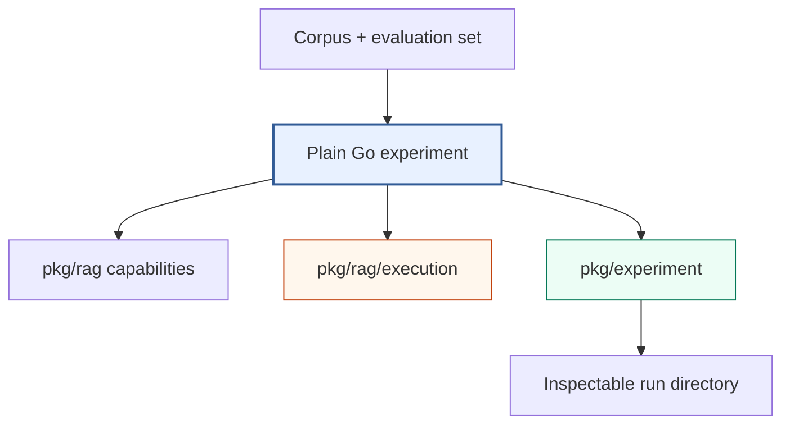

# rag-ttc — Clean-Slate TTC RAG Experiments

`rag-ttc` is the clean-slate TTC retrieval experiment repository. Experiments
are ordinary Go programs that compose a typed RAG toolbox, explicit execution
controls, and a filesystem run ledger. The repository does not depend on the
historical RAG DSL, Researchctl, or Scraper Workflow V3.

> [!summary]
> - **Direct experiments:** Go programs keep the hypothesis, stage order, and
>   measurements visible.
> - **Shared toolbox:** packages provide chunking, embedding, lexical/vector
>   retrieval, fusion, reranking, generation, evaluation, and reporting.
> - **Safe execution:** worker bounds, resource rates, finite budgets, and
>   atomic per-item caching control expensive provider work and allow recovery.
> - **Current evidence:** persistent backends have been measured on the
>   canonical TTC candidate dataset; a five-query OpenAI smoke and 30-query
>   paired pilot completed within explicit provider budgets.
> - **Current boundary:** human review is paused because independent
>   zero-budget replay exposed an unresolved semantic-identity instability.

## Primary report

- [[PROJECT REPORT - rag-ttc - Clean-Slate RAG Experiments in Plain Go]] —
  textbook-style architecture and implementation deep dive, including the
  experiment directory, execution controls, cache recovery algorithm, examples,
  validation boundary, and real-TTC integration sequence.
- [[PROJECT REPORT - rag-ttc - From Clean-Slate Toolbox to Live TTC Answer Quality Evaluation]] —
  chronological implementation deep dive through
  persistent backends, Geppetto profiles, real TTC measurements, recoverable
  provider execution, live OpenAI experiments, and the replay blocker.
- [[ARTICLE - rag-ttc - Architecture of a Reproducible Go RAG Evaluation System]] —
  repository-oriented reference covering data records, interfaces,
  backends, execution controls, run artifacts, answer contracts, blinded
  review, and measurement semantics without implementation history.
- [[PROJECT REPORT - rag-ttc - Simplifying a Recoverable and Measurable RAG Experiment System]] —
  post-refactor technical analysis of the final package boundaries, generic
  execution primitives, per-item cache recovery, artifact reduction,
  arm-aware dependency planning, real TTC validation, and bounded OpenAI
  generation and embedding evidence.

## Software Architecture Garden

- [[Research/Software Architecture Garden/rag-ttc/README|Architecture Garden — rag-ttc]] — commit-pinned project study of how plain-Go experiment policy, typed RAG contracts, provider adapters, bounded recoverable execution, semantic identity, and experiment result custody are woven together.
- [[Research/Software Architecture Garden/rag-ttc/08 - Candidate Ecosystem Guidelines|rag-ttc candidate ecosystem guidelines]] — reusable rules for package ownership, expensive-work recovery, zero-authority replay, adapter validation, and durable completed-result streams.

## Architecture



The experiment program owns composition. `pkg/rag` owns semantic operations.
`pkg/rag/execution` owns bounded and recoverable work mechanics.
`pkg/experiment` owns artifact custody and terminal state. None of these
packages owns a generic end-to-end workflow.

## Implementation areas

| Concern | Repository location |
| --- | --- |
| Canonical records and interfaces | `pkg/rag/types.go`, `pkg/rag/components.go` |
| Source-preserving chunking | `pkg/rag/chunking` |
| Local and Geppetto embeddings | `pkg/rag/embedding`, `pkg/rag/providers/geppetto` |
| BM25, FTS5, and exact vector search | `pkg/rag/lexical`, `pkg/rag/vector` |
| Collapse, fusion, and hydration | `pkg/rag/retrieval` |
| Reranking and answer generation | `pkg/rag/reranking`, `pkg/rag/generation` |
| Retrieval metrics and reports | `pkg/rag/evaluation`, `pkg/rag/report` |
| Workers, rates, budgets, caches | `pkg/rag/execution` |
| Run directory lifecycle | `pkg/experiment` |
| Live answer-quality command | `cmd/rag-ttc/cmds/experiments/answerquality` |
| Progressive onboarding | `examples/01_chunking` through `examples/06_end_to_end_experiment` |

## Source project evidence

- Repository:
  `/home/manuel/workspaces/2026-06-30/benchmark-cpu-inference/rag-ttc`
- Ticket:
  `ttmp/2026/07/25/RAG-TTC-CLEAN-SLATE-001--clean-slate-ttc-rag-experiment-toolbox-and-measurement-architecture`
- Implementation commit: `800ad75fec583acf77cb9376382a1f49322a5579`
- Documentation commit: `77747a8f8e53b878d2b6769cd4b9b2b4d6171ef5`

## Historical context

- [[rag-evaluation-system]] indexes the earlier corpus, DSL, workflow, and
  evaluation implementation.
- [[researchctl]] indexes the experiment control-plane and analysis system that
  no longer participates in the clean-slate RAG runtime.
- [[scraper]] indexes Workflow V3, whose general durable scheduler is no longer
  required for these self-contained experiments.
- [[goja-text]] documents earlier source-preserving chunking work that informed
  the chunk lineage invariants.
- [[goja-bleve]] documents native lexical and vector retrieval work relevant to
  future production index adapters.

Important historical reports:

- [[PROJECT REPORT - Experiment Platform Convergence - Researchctl Workflow V3 and RAG]]
- [[ARTICLE - Full TTC RAG Laboratory and go-go-parc Corpus Research Report]]
- [[ARTICLE - RAG Evaluation - Building and Validating an Initial Fixed-Truth Dataset]]
- [[ARTICLE - RAG DSL v2 - Developer Guide]]
- [[ARTICLE - Immutable TTC RAG Laboratory - From Fixed Truth to Executable JavaScript Experiments]]

## Current validation boundary

The repository now contains and has exercised the canonical 200-document TTC
candidate corpus, 1,982 raw representations, judged queries, persistent
lexical/vector backends, OpenAI embeddings, and OpenAI Responses generation.

The five-query smoke completed ten cells and replayed with all provider budgets
at zero. The 30-query pilot completed 60 cells with 30 query-embedding and 60
generation work calls. A later independent zero-budget replay found an
identity/cache instability, so the 60-item blinded queue has not been
distributed.

The current boundary is:

```text
successful provider execution
  != reproducible review identity
  != completed human answer-quality evidence
```

## Next production step

1. Audit semantic identity across retrieval evidence, generation cache keys,
   and review IDs.
2. Define one versioned canonical selected-evidence identity.
3. Require at least two independent zero-budget replays with zero work calls
   and identical evidence, answers, queues, and private keys.
4. Commit the coherent identity fix and replay evidence.
5. Distribute the 60-cell primary queue and balanced ten-cell overlap queue.
6. Import annotations through a zero-budget run and publish paired arm and
   reviewer-disagreement results.

## Working rules

- Keep experiments as readable Go programs.
- Share stable capabilities, not anticipated workflows.
- Preserve exact source lineage through chunking and retrieval.
- Resolve cache hits before rate and budget admission.
- Commit successful expensive items independently.
- Keep per-query evidence beside aggregate metrics.
- Label synthetic results as synthetic.
- Do not claim TTC quality until the approved corpus and split have been run.
