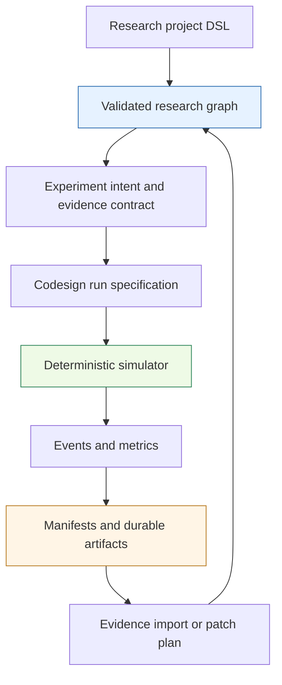

# researchctl — Experiment Management Tool and DSL

`researchctl` is a tool and set of DSLs for making technical research executable, reviewable, and reproducible. Its research-project DSL models goals, questions, hypotheses, experiments, sources, evidence, decisions, and reports as a validated graph. Its codesign DSL defines deterministic experiments as devices, workloads, policies, metrics, and sweeps, then persists event streams and manifests that can be reviewed or imported as evidence.

> [!summary]
> - **Research graph:** author and validate the structure and rationale of an investigation through YAML, JSON, or `require("researchctl")`.
> - **Codesign runtime:** execute deterministic CPU/GPU placement and performance experiments through Go or `require("codesign")`.
> - **Boundary:** experiment artifacts cross from execution back into the research graph; simulator state does not silently mutate research documents.

## The two-layer model



These layers are related but intentionally separate. `require("researchctl")` is a graph-construction and validation API; it is not an experiment executor. `require("codesign")` is an explicit execution workbench; it can simulate, sweep, compare, hash, and write artifacts. This separation keeps project loading free of experiment side effects and keeps the simulator independent from hand-authored research files.

## Research graph DSL

The project API represents an investigation as a typed graph with stable IDs and validated references:

- Goals and questions define why the work exists.
- Hypotheses state claims, alternatives, assumptions, and falsifiers.
- Work packages describe implementation or analysis work.
- Experiments define expected artifacts and success criteria.
- Sources and evidence preserve provenance and observations.
- Decisions record conclusions and follow-ups.
- Reports and views select graph content for readers.

The graph can be authored as YAML, JSON, or JavaScript. All forms converge on the same Go specification and validation path. The filesystem writer, completion rules, and report renderer operate on that shared model rather than on the authoring language.

## Codesign DSL and runtime

A codesign experiment has four core parts:

1. **Topology:** devices with stable IDs and cost-model configuration.
2. **Workload:** request arrivals and per-request stages.
3. **Policy:** device selection and scheduling behavior.
4. **Metrics:** reductions over the emitted event stream.

The built-in runtime is deterministic and CPU-side. A task is assigned to a compatible device, the device estimates and runs it, events are emitted, and metrics reduce those events into results. The JavaScript layer adds fluent builders, callback devices, callback policies, callback metrics, sweeps, comparisons, and artifact writing without requiring a Go recompile for every experiment.

```text
runSpec
  → validate
  → execute
  → event stream
  → metrics
  → manifest + artifacts
  → reviewable evidence
```

The core cost model is deliberately explicit. A compute device uses setup plus compute time; a bandwidth device separates transfer and compute terms. Custom callback devices can express pipelining, divergence, access-pattern waste, multicast reuse, and other experiment-specific formulas.

## Research workflow

A typical end-to-end workflow is:

1. State a bounded question and hypothesis in the research graph.
2. Define the experiment and its expected evidence.
3. Author a run with topology, workload, policy, and metrics.
4. Validate the run before execution.
5. Execute one run or a parameter sweep.
6. Retain the normalized specification, manifest, event stream, and relevant raw artifacts.
7. Review the result against the hypothesis and analytic expectations.
8. Import a dry-run evidence/status patch into the research graph.
9. Render a report or promote a durable claim.

The design favors explicit transitions. Running an experiment does not rewrite hand-authored project YAML, and importing a manifest is a separate operation that can produce a reviewable patch plan.

## Experiment catalog

### Foundation and placement

- [[ARTICLE - researchctl Codesign Experiment Setup Chapter Mapping and API Refinement]] — maps AI performance concepts to simulator primitives and identifies missing device families.
- [[ARTICLE - A Simulation Experiment Program for AI Systems Performance Engineering]] — catalogs the broader forty-two-experiment program across storage, kernels, orchestration, and serving.
- [[ARTICLE - Validated Codesign Experiments for AI Systems Performance Engineering]] — reports thirty-six JavaScript-authored experiments and their validation outcomes.

### Runtime and API implementation

- [[ARTICLE - Researchctl Codesign API - Implementation and Usage Deep Dive]] — explains the JavaScript workbench, registries, simulator, sweeps, callbacks, and artifacts.
- [[PROJECT REPORT - researchctl CPU GPU Codesign Experiment Runtime Deep Dive]] — explains the Go runtime, event vocabulary, manifests, and graph-import bridge.
- [[ARTICLE - Researchctl API - Implementation and Usage Deep Dive]] — explains the research graph, authoring forms, validation, materialization, and reporting.

### Project history and context

- [[PROJECT REPORT - benchmark-cpu-inference Workspace - researchctl Bootstrap Deep Dive]] — records the repository bootstrap and the original CPU-inference benchmarking direction.
- [[PROJ - Research Lab - Filesystem-First Evidence Infrastructure]] — describes the broader filesystem-first evidence and audit infrastructure that complements researchctl.
- [[ARTICLE - Tiny Model CPU Inference - Threads Runner Replacement and Experimental Limits]] — an applied research report demonstrating the evidence and audit problems the broader workflow is designed to handle.

## Reusable design patterns

- [[dsl-normalized-config-compiled-plan]] — the broader pattern of separating human DSL input, normalized configuration, compiled plans, and execution.
- [[goja-embedding-in-go]] — the host/runtime boundary behind the JavaScript APIs.
- [[goja-execution-model]] — runtime ownership and single-threaded execution constraints relevant to callbacks.

## Implementation map

Repository: `/home/manuel/code/wesen/go-go-golems/researchctl`

| Concern | Main source area |
|---|---|
| Research project specification | `pkg/research/spec` |
| Graph indexing and references | `pkg/research/graph` |
| Structural validation | `pkg/research/validate` |
| Filesystem planning | `pkg/research/filesystem` |
| Completion rules | `pkg/research/rules` |
| Report rendering | `pkg/research/render` |
| Project loading | `pkg/research/projectio` |
| Codesign specification | `pkg/codesign/spec` |
| Devices, policies, metrics, and workloads | `pkg/codesign/{devices,policies,metrics,workloads}` |
| Simulation loop and events | `pkg/codesign/{simulator,events}` |
| Sweeps, comparisons, and artifacts | `pkg/codesign/{sweeps,compare,artifacts}` |
| JavaScript modules | `pkg/gojamodules/{researchctl,codesign}` |
| Generated-host integration | `pkg/xgoja/providers/researchctl` |

## Boundaries and open questions

- The deterministic simulator validates relationships and cost formulas; it does not substitute for real hardware measurement.
- The current single-slot and serial-stage model cannot faithfully express all forms of overlap or intra-device concurrency without extensions.
- Callback flexibility is useful for experiment design, but important behavior should eventually be promoted into tested Go device families or policies.
- The project graph and execution artifacts are separate domains; stronger automated evidence promotion remains an explicit design space rather than an implicit side effect.

## Source notes

The core implementation and experiment articles date from the June–July 2026 `benchmark-cpu-inference` work. The canonical repository is `github.com/wesen/researchctl`; the local checkout is `/home/manuel/code/wesen/go-go-golems/researchctl`.
