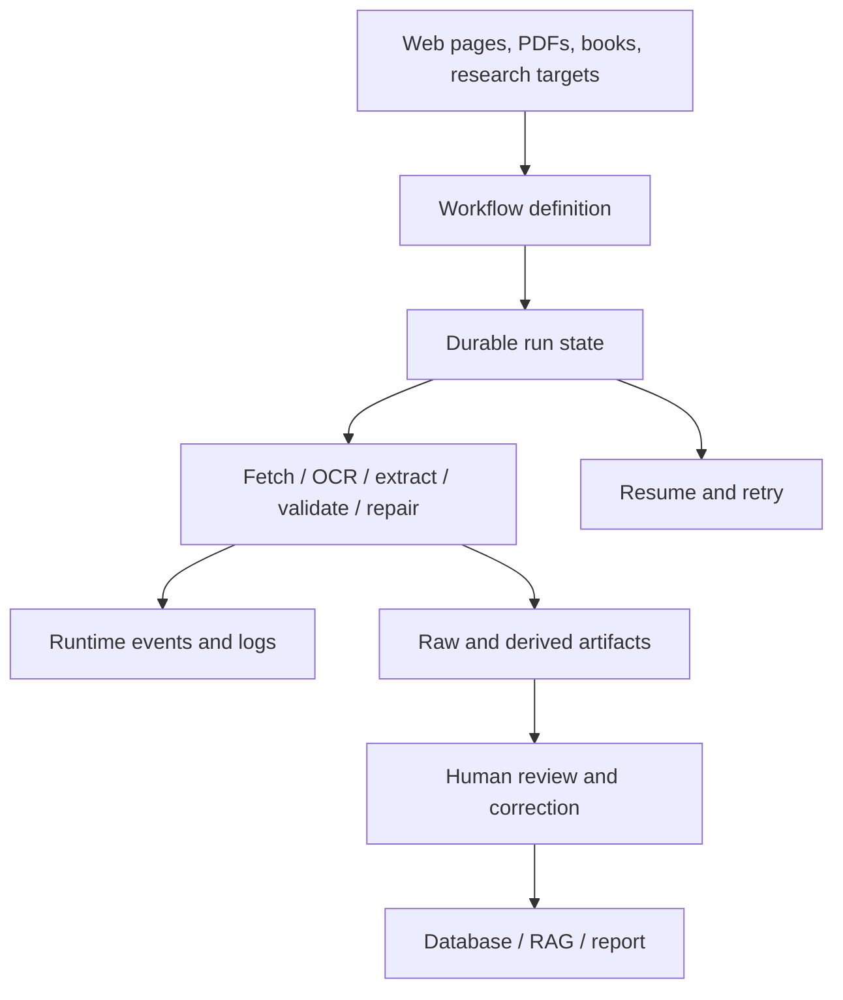

# Scraper — Durable Workflows, Research Extraction, and Evidence Pipelines

The `scraper` work evolved from browser/LLM-assisted extraction into a reusable workflow runtime for research and document-processing jobs. It provides durable run state, workflow events, structured extraction contracts, provider/model policies, OCR pipelines, persistence, and inspection surfaces. The central design goal is to make long-running research jobs restartable and auditable rather than hiding them inside one fragile prompt or command.

> [!summary]
> - **Workflow runtime:** jobs, steps, retries, events, persistence, and recovery are explicit.
> - **Extraction contracts:** LLM/OCR outputs are validated against target schemas and provenance.
> - **Research pipeline:** source acquisition, extraction, repair, indexing, and human review remain inspectable stages.

## Architecture

The runtime is more important than any individual scraper. A workflow must expose its inputs, state transitions, target contracts, provider configuration, failure state, and artifacts. This is why the same architecture can support therapist research, Book OCR, RAG ingestion, and other extraction programs.

## Capability areas

### Workflow runtime and events

- [[ARTICLE - Scraper Workflow API - Building a Public Reusable Durable Workflow Runtime]] — public workflow API and durability model.
- [[PROJ - Scraper - Runtime Events Session Report]] — runtime event design.
- [[ARTICLE - Sessionstream Runtime Events in Scraper]] — sessionstream integration.
- [[ARTICLE - Devctl Trace Profiles - Pinocchio and CoinVault]] — adjacent trace/profile tooling.
- [[Research/KB/On-Ramp/rag-evaluation-pipeline-architecture]] — downstream evaluation orientation.

### Research and extraction applications

- [[PROJ - Claude Agent SDK - Teaching an AI to Write Web Scrapers]] — original agent-assisted scraping direction.
- [[ARTICLE - Providence Therapist Search - End-to-End Research System and LLM Extraction Lab]] — research extraction application.
- [[ARTICLE - Providence Therapist Search - A Retro Monochrome Research Dashboard]] — inspection UI.
- [[ARTICLE - Book OCR Quality Lab - Baseline Runs SQLite Log Filtering and Experiment Provenance]] — OCR measurement.
- [[ARTICLE - Building Book OCR on Scraper Job System - Workflow Runtime Deep Dive]] — OCR workflow integration.
- [[ARTICLE - Extracting Book OCR from Scraper - Workflow Runtime and External OCR Pipelines]] — extraction decomposition.
- [[ARTICLE - Book OCR Project Report - Structured Workflow Runtime and Manual PDF Repair]] — production repair loop.
- [[ARTICLE - Structured Book OCR - Target Page Contracts Workflow Runtime and Production Hardening]] — target contracts and hardening.
- [[ARTICLE - Book OCR Productization - Plugin Seams, Profile Policy, and the Road to v0.1.0]] — productization boundaries.

### RAG and evidence consumers

- [[PROJECT REPORT - rag-ttc - Clean-Slate RAG Experiments in Plain Go]] —
  documents the TTC RAG reset that deliberately removes Workflow V3 from the
  experiment execution path while retaining focused durability ideas such as
  atomic artifacts and recoverable per-item work.
- [[rag-ttc]] — project map for the direct-Go TTC RAG toolbox.
- [[rag-evaluation-system]] — retrieval and relevance evaluation.
- [[goja-text]] — source-preserving text/chunking.
- [[goja-bleve]] — search and vector indexing.
- [[researchctl]] — explicit experiment/evidence workflow.
- [[go-minitrace]] — transcript and run evidence analysis.

## Recommended reading path

1. Read the workflow API and runtime-events reports.
2. Read one extraction application, preferably Book OCR or therapist research.
3. Read the target-contract and manual-repair reports for correctness boundaries.
4. Follow RAG evaluation and source-preserving text links for downstream use.
5. Use the evidence MOCs when turning workflow runs into durable conclusions.

## Working rules

- Define workflow state and target contracts before adding provider calls.
- Make operations idempotent, resumable, and observable.
- Retain raw inputs and intermediate artifacts beside derived outputs.
- Separate extraction from validation and human correction.
- Record provider/model/profile identity with every run.
- Keep live LLM calls out of unit tests; use fixtures and replayable artifacts.
- Treat manual repair as an explicit workflow stage, not an invisible edit.

## Repository map

Repository: `/home/manuel/code/wesen/go-go-golems/scraper`

| Concern | Location |
|---|---|
| Workflow runtime | workflow/job packages |
| Browser and source acquisition | scraper adapters |
| LLM/OCR extraction | extraction/provider packages |
| Runtime events | event/trace packages |
| Persistence | database and artifact packages |
| CLI and service surfaces | command/server packages |
