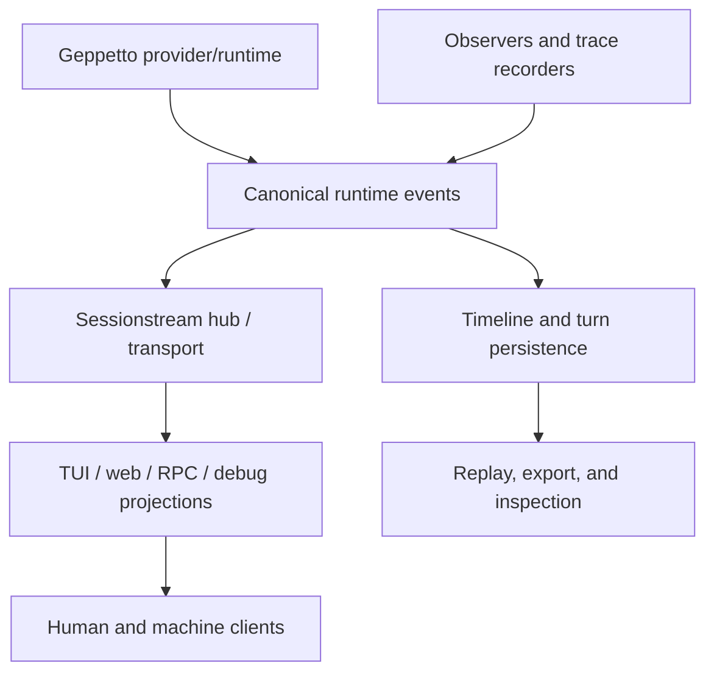

# Sessionstream — Event Protocols, Timelines, and Chat State

`sessionstream` is the event and timeline layer shared by Geppetto, Pinocchio, CoinVault, web chat, TUI clients, RPC services, and observability tools. It carries provider and application events across process and UI boundaries while preserving identity, ordering, persistence, and replay semantics. The surrounding reports repeatedly return to one distinction: a visible timeline is a projection of runtime state, not the inference state itself.

> [!summary]
> - **Protocol:** typed events and protobuf/JSONL contracts move streamed state between Go services and clients.
> - **Projection:** TUI, web, RPC, debug, and transcript views consume projections rather than raw provider deltas.
> - **Persistence:** final turns, timeline events, and replay artifacts have explicit ownership and completion rules.

## Architecture

Sessionstream is not just a message bus. Event identity, sequence/ordinal behavior, terminal status, append-mode patches, and hydration rules determine whether a client can reconstruct a trustworthy conversation. The event contract must therefore be tested at the boundaries where providers, hosts, transports, and UI projections meet.

## Capability areas

### Protocol and transport

- [[ARTICLE - Pinocchio Structured Streams - Protobuf JSONL RPC and Chatapp TUI Migration]] — protobuf/JSONL RPC and TUI migration.
- [[ARTICLE - Protobuf Payload Contracts and Sessionstream Schema Vet]] — schema contract validation.
- [[ARTICLE - Canonical Chat Event Protocol - Provider Streams to Browser State]] — provider-to-browser projection.
- [[ARTICLE - Instrumenting Sessionstream and Browser Streaming Debug Pipelines]] — transport and debug instrumentation.
- [[ARTICLE - Goja HTTP Composition - Mountable Handlers and Sessionstream WebSockets]] — HTTP/WebSocket integration.

### Runtime and persistence

- [[PROJ - Sessionstream - Replay Store Remediation and Systemlab UI Refinement]] — replay storage and UI refinement.
- [[ARTICLE - Sessionstream Chatapp CoinVault Cleanup - Protobuf Ordinals and Transcript Segments]] — ordering and transcript segments.
- [[ARTICLE - Building a Sessionstream CLI Chat Runner - CoinVault Pinocchio Chatapp Deep Dive]] — CLI host integration.
- [[ARTICLE - Observer Instrumentation - Geppetto Pinocchio Sessionstream Deep Dive]] — end-to-end observability.
- [[ARTICLE - Conversation Export Pipelines - Pinocchio CoinVault Timeline Turns and Minitrace]] — export and transcript boundaries.
- [[ARTICLE - CoinVault Web Chat - Event Projection Debug Exports and Thinking Persistence]] — persistence and projected UI state.

### Client projections

- [[Research/KB/Tribal/bubbletea-streaming-llm-uis]] — Bubble Tea lifecycle and streaming patterns.
- [[Research/KB/Tribal/session-turn-blocks-chat-applications]] — sessions, turns, blocks, and hydration.
- [[ARTICLE - Chat Overlay API - Sessionstream Widget Runtime Deep Dive]] — streamed widgets.
- [[ARTICLE - Chat Overlay API - Two Proposals for a Typed Widget Streaming Architecture]] — typed widget event design.
- [[ARTICLE - ChatProvider Web Chat Cleanup - Provider Runtime Timeline Adapters and Example Architecture]] — web timeline adapters.
- [[ARTICLE - Generic ChatProvider - From Overlay Runtime to Provider Backed Web Chat]] — provider-backed chat.

## Working rules

- Define the client-visible event contract before implementing a projection.
- Give events stable identity and explicit ordering; do not rely on arrival order alone.
- Distinguish segment completion, run completion, persistence completion, and transport closure.
- Persist from the authoritative backend rather than reconstructing final turns from UI timelines.
- Treat reasoning and append-mode patches as first-class event shapes.
- Keep human stdout, machine RPC stdout, debug traces, and UI rendering separate.
- Validate hydration and replay with fixtures, not only live streaming tests.

## Related project maps

- [[geppetto]] — provider/runtime events and sessions.
- [[pinocchio]] — CLI, TUI, RPC, and web hosts.
- [[go-minitrace]] — transcript archives and analysis of resulting sessions.
- [[go-go-goja]] — JavaScript and generated-host integrations.
- [[goja-text]] — source-preserving text and transcript chunking.
- [[CHATGPT TRANSCRIPT - Widget DSL Extension Design — Streaming Chat]] — extending widget.dsl with SSE/websocket streaming chat widgets.

## Repository map

Repository: `/home/manuel/code/wesen/go-go-golems/sessionstream`

| Concern | Location |
|---|---|
| Event and timeline contracts | repository Go packages |
| Protobuf definitions | `proto/` and Buf configuration |
| Stream transport | hub/client/server packages |
| Persistence and replay | store/replay packages |
| Validation | package and integration tests |
