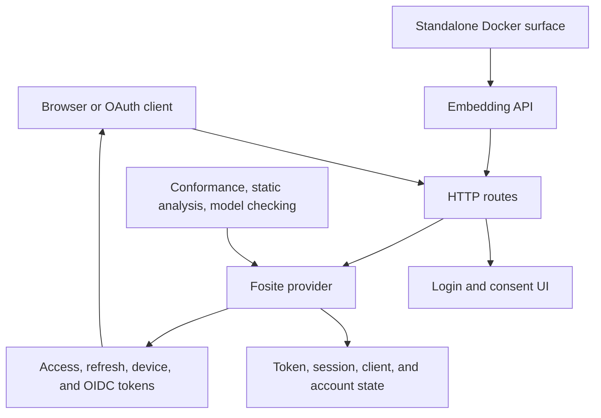

# tiny-idp — Embedded OIDC Provider and Auth Test Platform

`tiny-idp` is a small, embeddable identity provider and authentication test fixture built around OAuth/OIDC semantics. It provides a strict Fosite-backed provider, hosted login and consent pages, multi-account browser sessions, device authorization, token families, public embedding APIs, model-checking support, and deployable Docker surfaces. The project is valuable because it makes identity flows executable in tests and local applications without turning every integration test into a dependency on an external identity service.

> [!summary]
> - **Protocol core:** strict OAuth/OIDC behavior implemented with Fosite and explicit token/session state.
> - **Embedding:** reusable Go APIs and a standalone Docker/message-desk surface for applications that need a local identity boundary.
> - **Assurance:** static analysis, executable state models, conformance work, and focused security hardening accompany the implementation.

## Architecture at a glance

The project separates protocol behavior, application-owned state, presentation, and embedding. A successful browser login is not the same thing as a valid token exchange; a token being issued is not the same thing as a client being authorized for a resource. Those boundaries are where most of the security reasoning lives.

## Major capability areas

### Protocol and conformance

The strict Fosite provider establishes OAuth/OIDC semantics, request validation, consent, token exchange, redirect handling, and conformance expectations. Start with [[PROJECT REPORT - tiny-idp - Strict Fosite Provider and Hosted OIDF Conformance]].

### Embedding and release hardening

The embedding API makes tiny-idp usable as a library rather than only as a standalone server. Production hardening, public embedding foundations, and the Docker message desk show how the same core is packaged for real applications:

- [[PROJECT REPORT - tiny-idp - Public Embedding Foundations]]
- [[PROJECT REPORT - tiny-idp - Production Embedding API and Release Hardening]]
- [[PROJECT REPORT - tiny-idp - Standalone Docker OIDC Message Desk]]

### Browser sessions and UI

The login and consent pages are part of the protocol fixture, not merely demo chrome. Stylable UI, account isolation, session ownership, logout scope, and browser behavior are documented in:

- [[PROJECT REPORT - tiny-idp - Stylable Login and Consent UI]]
- [[PROJECT REPORT - tiny-idp - Multi-Account Browser Sessions and Logout Scopes]]

### Assurance and security

The project treats security review as an executable concern. Static analysis records threat surfaces and code checks; model checking makes state transitions inspectable:

- [[ARTICLE - Static Analysis for tiny-idp Security Engineering]]
- [[PROJECT REPORT - tiny-idp - Model Checking and Executable State Assurance]]
- [[ARTICLE - tinyidp - From Mock OIDC Provider to Reusable Auth Test Fixture]]

## Recommended reading path

1. Read the strict-provider report to understand the protocol boundary.
2. Read public embedding foundations to understand the library contract.
3. Read the browser-session and UI reports for human-facing state.
4. Read model-checking and static-analysis notes for assurance boundaries.
5. Read production hardening and Docker reports for deployment shape.

## Security boundaries

- Redirect URIs must be validated against the registered client and exact flow expectations.
- Browser sessions, API credentials, OAuth access tokens, refresh tokens, and device codes are different credential families with different lifetimes and revocation behavior.
- Authorization decisions belong after authentication and before protected resource access; rate limiting and session persistence must not accidentally bypass that ordering.
- Refresh-token rotation must be atomic with access-token creation and family state updates.
- Multi-account browser behavior requires explicit account/session ownership and logout scopes.
- A mock or embedded provider can be protocol-faithful without being a production identity service; deployment, key management, persistence, and threat modeling remain separate concerns.

## Related notes

- [[Research/KB/On-Ramp/oauth-2-oidc-flows]] — protocol orientation.
- [[Research/KB/Tribal/application-native-authorization]] — application-owned authorization patterns.
- [[Research/KB/Tribal/host-mediated-secret-delivery]] — related secret-boundary pattern.
- [[ARTICLE - Brokered BYOK with Keycloak and SQLite - A Technical Deep Dive]] — adjacent application-owned identity architecture.
- [[PROJECT REPORT - go-go-goja Programmatic Agent Fetch Auth - End-to-End Deep Dive]] — consumer-side programmatic authentication.
- [[PROJECT REPORT - go-go-goja Token Families and Device Authorization Flow - Deep Dive]] — token-family and device-flow integration.

## Repository map

Repository: `/home/manuel/code/wesen/tiny-idp`

| Concern | Location |
|---|---|
| Provider and protocol handlers | provider/server packages |
| Browser login and consent | web/templates and UI packages |
| Embedding API | public application packages |
| State and token persistence | storage/session packages |
| Model-checking and security analysis | verification and analysis artifacts |
| Deployment fixture | Docker and example configuration |

## Boundaries and open questions

- How much persistence and key-management policy should an embedded fixture own versus delegate to its host?
- Which conformance guarantees are required for each embedding profile?
- How should browser UI, API clients, and device-flow clients share test fixtures without coupling their lifecycle assumptions?
