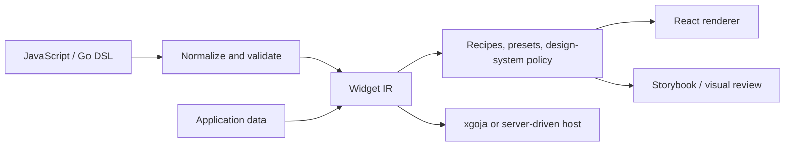

# Widget DSL — Intent-Level UI Authoring, IR, and React Targets

The Widget DSL work defines a layered way to author UI intent in JavaScript or Go, normalize it into a widget intermediate representation, and render that representation through React or another target. The system grew from RAG evaluation and generated-host experiments into a broader design pattern: application authors describe semantic widgets and interaction intent, while the renderer owns layout, styling, state wiring, and target-specific details.

> [!summary]
> - **Intent layer:** authors express semantic UI structures, not CSS coordinates or renderer internals.
> - **IR layer:** typed widget instances, slots, actions, and data contracts provide a stable boundary.
> - **Target layer:** React, Storybook, generated hosts, and application presets consume the same structured representation.

## Architecture

The important boundary is semantic versus presentational. A widget DSL should say “render a result card with evidence, actions, and an expandable detail slot,” not “place a 320px div at x=40.” The IR makes the intent inspectable, serializable, testable, and portable across applications.

## Capability areas

### Foundations and IR

- [[ARTICLE - Building a Goja UI DSL from Scratch - Widget IR to xgoja]] — initial DSL and IR boundary.
- [[ARTICLE - Widget IR - Building a Data-First React Rendering Pipeline for RAG Evaluation]] — data-first rendering.
- [[ARTICLE - Goja Fluent-Builder DSLs - Designing Typed Composable Grammars in Go for JavaScript]] — typed builder grammar.
- [[ARTICLE - Designing DSLs with go-go-goja - Go-Backed JavaScript APIs]] — Go-backed JavaScript DSLs.

### Recipes, versions, and migration

- [[ARTICLE - From Boilerplate to Recipes - Building Higher-Level Widgets on Top of Widget IR - gpt5.5 - thinking medium]] — higher-level recipes.
- [[ARTICLE - Semantic Recipes on Top of Widget IR]] — semantic recipe design.
- [[ARTICLE - Widget DSL Grammar - Designing an Intent-Level UI Authoring Layer for a Widget IR System]] — grammar design.
- [[ARTICLE - Widget DSL V2 Cutover - Typed Fluent Builders for Server-Driven Widget IR]] — typed-builder migration.
- [[ARTICLE - Widget DSL v3 - From Split Modules to a Real Host Migration]] — host migration.

### Applications and product surfaces

- [[PROJ - CRM Widget Kit - Engine, Contract, and Preset over a Widget IR]] — reusable engine/contract/preset architecture.
- [[PROJ - Doodle Scheduling Site - SQLite and the rag Widget DSL on xgoja]] — generated application.
- [[ARTICLE - Doodle on xgoja and Widget DSL v3 - A SQLite Scheduling Site Deep Dive]] — integrated runtime.
- [[ARTICLE - Doodle Project Report - From xgoja JavaScript to Rendered Widget UI]] — end-to-end rendering.
- [[ARTICLE - WidgetRenderer Standalone Site - Goja Authored React Rendered UI]] — standalone renderer.
- [[ARTICLE - RAG React Design System - From Prototype Dashboard to Structured Design System]] — design-system application.

### Design-system and IR neighbors

- [[ARTICLE - DMETA Design System Factory - From Semantic Archetypes to Validated IR]] — semantic design-system IR.
- [[ARTICLE - DMETA as a Design System Compiler - Layered IRs and MetaDesignSystems]] — compiler pipeline.
- [[ARTICLE - Presentation Based User Interfaces - AITR-794 and DMETA Implementation Guide]] — presentation-based UI model.
- [[Research/KB/Tribal/dmeta-design-system-compiler-pipeline]] — reusable compiler pattern.
- [[Research/KB/Tribal/typed-widget-instance-streaming-for-chat-overlays]] — typed streaming widget instances.

### PBUI, streaming chat, and React integration analyses

- [[CHATGPT TRANSCRIPT - React PBUI Widget DSL Guide]] — applying the widget DSL to a React PBUI framework with go-go-goja, full intern guide
- [[CHATGPT TRANSCRIPT - Widget DSL Extension Design — Streaming Chat]] — extending widget.dsl with SSE/websocket streaming chat widgets and embeddable widgets

Related output artifacts (in `Attachments/chatgpt-outputs/`):
- `pbui-widget-dsl-intern-guide.md`
- `widget-dsl-streaming-chat-architecture-report.md`
- `docgraph-pbui-delivery-readme.md`

## Working rules

- Keep author intent separate from renderer implementation.
- Normalize and validate before rendering.
- Prefer typed widget instances and explicit slots over arbitrary renderer escape hatches.
- Make actions and data contracts part of the IR, not hidden inside React callbacks.
- Keep styling and design-system policy in the target layer or preset layer.
- Treat DSL versions and host migrations as explicit compatibility events.
- Test semantics, serialized IR, and visual output separately.

## Related project maps

- [[rag-evaluation-system]] — major origin and consumer of the widget work.
- [[go-go-goja]] — JavaScript runtime and xgoja host.
- [[geppetto]] and [[pinocchio]] — streamed chat/application consumers.
- [[glazed]] — structured command/help surfaces using similar schema-first ideas.

## Repository map

Primary repositories: `/home/manuel/code/wesen/go-go-os-frontend`, `/home/manuel/code/wesen/go-go-golems/dmeta`, and related xgoja/widget workspaces.

| Concern | Location |
|---|---|
| Widget packages | frontend `packages/` and widget-kit packages |
| DSL and builders | JavaScript/Go DSL packages |
| IR contracts | widget model/type packages |
| React targets | renderer and application packages |
| Stories and review | Storybook and visual-diff fixtures |
