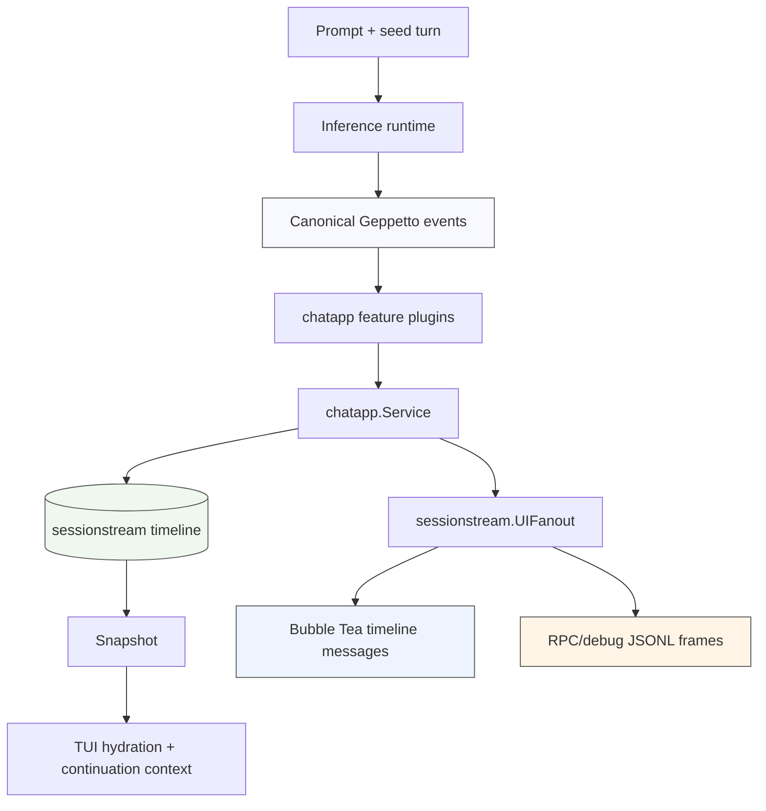

# Bubble Tea Streaming LLM UIs — How We Build Them

This note preserves the practical knowledge gained while moving Pinocchio command chat, JSONL RPC, debug traces, and terminal continuation into a shared `chatapp` + `sessionstream` architecture. The topic is not merely how to render tokens in a terminal. The durable problem is how to keep a streaming LLM run correct when the same run must feed a Bubble Tea TUI, a machine-readable JSONL stream, a debug trace, and a later continuation prompt.

> [!summary]
> Build a streaming LLM TUI around explicit event boundaries. Let the backend publish canonical run and segment events; let `sessionstream` project them into UI events and snapshots; let Bubble Tea receive only view messages. Treat snapshots, live events, terminal run status, and startup hydration as separate responsibilities. Never call `Program.Send` synchronously before `Program.Run`.

## Why this note exists

A complex terminal LLM UI contains several independently scheduled processes. The provider streams deltas. The runtime turns those deltas into canonical events. A session store records entities and ordinals. A UI projection emits client-facing events. Bubble Tea processes messages in its own event loop. A command process also has stdout, stderr, `/dev/tty`, exit status, and optional machine-readable output contracts.

Failures often appear as a rendering problem while the cause is at another boundary. Missing reasoning text may be absent from the provider stream, dropped by a plugin, present in `sessionstream` but not sent to Bubble Tea, or sent to Bubble Tea before the program starts. Premature completion may be caused by treating a text segment as a run. False success may be caused by waiting for idle goroutines instead of observing the terminal run event. A usable design names these boundaries and tests them independently.

This note uses the Pinocchio migration as the concrete source case. The main implementation paths are:

| Path | Role |
|---|---|
| `/home/manuel/workspaces/2026-05-20/pinocchio-structured-data-cli/pinocchio/pkg/cmds/cmd.go` | Command run-mode dispatch, blocking/debug/RPC/TUI orchestration, continuation prompt, startup hydration. |
| `/home/manuel/workspaces/2026-05-20/pinocchio-structured-data-cli/pinocchio/pkg/ui/chatapp_backend.go` | Bubble Tea chat backend backed by `chatapp.Service` and `sessionstream` snapshots. |
| `/home/manuel/workspaces/2026-05-20/pinocchio-structured-data-cli/pinocchio/pkg/ui/chatapp_fanout.go` | Adapter from projected `sessionstream.UIEvent` payloads to bobatea timeline messages. |
| `/home/manuel/workspaces/2026-05-20/pinocchio-structured-data-cli/pinocchio/pkg/ui/fanout_proxy.go` | Late-binding fanout that lets the runner exist before the Bubble Tea program exists. |
| `/home/manuel/workspaces/2026-05-20/pinocchio-structured-data-cli/pinocchio/pkg/ui/multi_fanout.go` | Fanout tee used to send the same projected UI events to Bubble Tea and JSONL debug files. |
| `/home/manuel/workspaces/2026-05-20/pinocchio-structured-data-cli/pinocchio/pkg/cmds/run_status_fanout.go` | Observer that derives terminal command status from projected run events. |
| `/home/manuel/workspaces/2026-05-20/pinocchio-structured-data-cli/pinocchio/pkg/chatapp/plugins/reasoning.go` | Plugin that projects canonical reasoning events into `ChatReasoning*` UI events. |
| `/home/manuel/workspaces/2026-05-20/pinocchio-structured-data-cli/pinocchio/pkg/chatapp/rpc/jsonl/fanout.go` | JSONL adapter for the same `sessionstream.UIFanout` boundary. |

## The core mental model

A streaming LLM UI should not be built as direct provider-callback-to-terminal drawing. It should be built as a sequence of contracts. Each contract has a specific job, and the next layer should not reach backward across it.



The important separation is between **canonical backend events**, **projected UI events**, and **Bubble Tea messages**.

Canonical backend events describe what the model/runtime observed: text segment started, text delta, reasoning delta, tool call started, run failed. They should be independent of a terminal UI. Projected UI events describe what clients consume: `ChatTextPatch`, `ChatReasoningPatch`, `ChatRunFinished`, `ChatRunFailed`. Bubble Tea messages describe how one local terminal widget should change: create timeline entity, update text, mark entity complete, unlock the input.

Do not collapse these layers. If the provider stream is mapped directly into Bubble Tea messages, the mapping becomes hard to reuse for JSONL RPC and web clients. If Bubble Tea messages become the durable event contract, non-terminal clients inherit terminal-specific details. If raw backend events are exposed as the public JSONL contract, scripts receive unstable provider/runtime internals instead of a product-level protocol.

The Pinocchio migration settled on this boundary:

```text
Geppetto/provider events
  -> chatapp plugins and projections
  -> sessionstream.UIEvent
  -> one or more UIFanout adapters
       -> Bubble Tea messages
       -> protobuf JSONL RpcLine frames
       -> debug-events JSONL file
```

That design made it possible to fix TUI rendering, RPC status, and debug traces without inventing three independent event mappers.

## A terminal LLM UI has four independent responsibilities

The first design mistake is to treat a terminal chat UI as one subsystem. It is at least four subsystems.

| Responsibility | Question | Correct owner |
|---|---|---|
| Runtime execution | What prompt is being run, against which engine, with what seed turn? | `chatapp.Runner`, `chatapp.Service`, runtime engine. |
| Session state | What user/assistant/reasoning/tool entities exist, and in what order? | `sessionstream` snapshot and timeline store. |
| View delivery | Which client-facing UI events should be emitted? | `sessionstream.UIFanout` projection boundary. |
| Terminal rendering | What should the local Bubble Tea model display now? | Bubble Tea model plus adapter messages. |

Each responsibility has different failure modes. Runtime execution can fail before a run starts. Session state can be empty while a seed turn exists outside the session store. View delivery can omit plugin-defined events if plugins are not registered. Terminal rendering can receive correct events but still deadlock if messages are sent before `Program.Run`.

A useful review question is:

> If this line fails, which responsibility failed?

If the answer is unclear, the code probably crosses too many boundaries.

## The run-mode problem: stdout, RPC, TUI, debug, and continuation

Pinocchio command execution has several user-facing modes:

| Mode | User expectation | Implementation implication |
|---|---|---|
| Default TTY command | Print the answer on stdout, then optionally continue in chat. | Blocking run first; prompt on `/dev/tty`; only enter Bubble Tea after `y`. |
| `--non-interactive` | Complete without prompting. | Do not open `/dev/tty`; preserve script safety. |
| `--interactive` or `--force-interactive` | Ask for continuation even when explicitly requested. | Treat as an operator request; document that scripts should avoid it or pass `--non-interactive`. |
| `--chat` | Start directly in the TUI. | Build Bubble Tea backend and auto-submit the initial prompt when needed. |
| `--rpc` or `--output jsonl` | Emit one protobuf JSON object per line. | Route through `chatapp` + JSONL fanout; no human text on stdout. |
| `--debug-events-jsonl PATH` | Keep normal stdout while recording projected events. | Tee `sessionstream.UIEvent` frames to a file without contaminating stdout. |

This split matters because a command-line tool has two audiences: humans and programs. The default path should stay readable. The RPC path should stay parseable. The debug path should not change normal stdout. The TUI path should own the terminal only when the user explicitly enters it or accepts continuation.

The controlling code in `pkg/cmds/cmd.go` reflects that split:

```go
func (g *PinocchioCommand) runBlockingMaybeContinueInChat(ctx context.Context, rc *run.RunContext) (*turns.Turn, error) {
    result, err := g.runBlockingOnce(ctx, rc)
    if err != nil {
        return nil, err
    }
    if !shouldAskForChatContinuation(rc, false) {
        return result, nil
    }
    continueInChat, err := askForChatContinuation()
    if err != nil {
        return nil, err
    }
    if !continueInChat {
        return result, nil
    }
    rc.ResultTurn = result
    rc.RunMode = run.RunModeChat
    return g.runChat(ctx, rc)
}
```

The key detail is `rc.ResultTurn = result`. Continuation must not issue the first provider call again. The result turn becomes the seed for the chat backend and the source for visible timeline hydration.

## The backend pattern: submit, wait, snapshot, rebuild turn

The Bubble Tea chat model expects a backend with methods such as `Start`, `Interrupt`, `Kill`, and `IsFinished`. The Pinocchio backend wraps `chatapp.Service` instead of talking directly to a provider.

The `Start` method performs the sequence that should be considered the standard pattern:

```go
func (b *ChatAppBackend) Start(ctx context.Context, prompt string) (tea.Cmd, error) {
    initialTurn := turnWithUserPrompt(b.currentTurn, prompt)
    b.running = true

    req := chatapp.PromptRequest{
        Prompt:      prompt,
        InitialTurn: initialTurn,
        Runtime:     b.runtime,
    }
    if err := b.service.SubmitPromptRequest(ctx, b.sid, req); err != nil {
        b.running = false
        return nil, err
    }

    return func() tea.Msg {
        err := b.service.WaitIdle(ctx, b.sid)
        if err == nil {
            snap, err := b.service.Snapshot(ctx, b.sid)
            if err == nil {
                b.currentTurn = turnFromSnapshot(b.seed, snap)
                b.running = false
            }
        }
        if err != nil {
            b.running = false
            return boba_chat.ErrorMsg(err)
        }
        return boba_chat.BackendFinishedMsg{}
    }, nil
}
```

This code has several important properties.

First, the backend submits a prompt request and returns a `tea.Cmd` rather than blocking the UI update loop. The command waits for the service to become idle and then returns a Bubble Tea message. Live streaming updates do not come from this command; they come through the fanout adapter. The command only handles lifecycle completion from the backend's point of view.

Second, the backend rebuilds `currentTurn` from a `sessionstream.Snapshot` after the run finishes. This prevents multi-turn chat from depending on local ad hoc append logic. The session store is the authoritative view of chat history after projection.

Third, `Interrupt` and `Kill` call `service.Stop`. Cancellation belongs at the service/session boundary, not in the terminal renderer.

The key points to internalize:

- The Bubble Tea backend initiates work; it should not own streaming projection logic.
- Live rendering should arrive through the same event fanout used by other clients.
- After a run completes, rebuild continuation context from a snapshot rather than trusting a local partial transcript.

## The fanout pattern: translate UI events, not provider deltas

The `ChatAppUIFanout` implements `sessionstream.UIFanout`. Its job is narrow: receive projected `sessionstream.UIEvent` payloads and send Bubble Tea timeline messages.

```go
type ChatAppUIFanout struct {
    sender BubbleTeaSender
    mu     sync.Mutex
    seen   map[string]bool
    starts map[string]time.Time
    texts  map[string]string
}

func (f *ChatAppUIFanout) PublishUI(ctx context.Context, sid sessionstream.SessionId, ord uint64, events []sessionstream.UIEvent) error {
    for _, ev := range events {
        if err := f.publishOne(ev); err != nil {
            return err
        }
    }
    return nil
}
```

This adapter should not know about OpenAI, Together, Wafer, Geppetto provider calls, or raw SSE fields. It should know about `ChatTextPatch`, `ChatReasoningPatch`, `ChatRunFinished`, and other projected product events.

The adapter keeps small local maps for view rendering:

| Field | Purpose |
|---|---|
| `seen` | Prevents duplicate `UIEntityCreated` messages for the same entity id. |
| `starts` | Preserves start time when a start event arrives before the first text patch. |
| `texts` | Accumulates append-mode patches into cumulative text for renderers that expect full content. |

The patch accumulator is not durable state. It exists because many terminal timeline renderers want the current full text at each update, while provider streams often emit deltas. The durable state remains the session snapshot.

```go
func (f *ChatAppUIFanout) applyTextPatch(id, patch string, mode chatappv1.ChatStreamPatchMode) string {
    switch mode {
    case APPEND, UNSPECIFIED:
        f.texts[id] += patch
    case SNAPSHOT, REPLACE:
        f.texts[id] = patch
    default:
        f.texts[id] += patch
    }
    return f.texts[id]
}
```

This distinction prevents a common bug: displaying only the last token. If the UI update message carries a delta but the renderer treats it as a full string, the visible answer appears to flicker or truncate. Either the renderer must understand deltas, or the adapter must accumulate deltas into snapshots. Pinocchio chose accumulation at the adapter boundary.

## Run completion is not segment completion

A streaming LLM run can produce multiple text segments. It can also interleave reasoning, tool calls, tool results, and later text. A text segment finishing means one segment is complete. It does not mean the backend is ready for new user input.

The fixed TUI fanout uses this rule:

```text
ChatTextSegmentFinished -> complete the timeline entity, do not unlock the backend.
ChatReasoningSegmentFinished -> complete the thinking entity, do not unlock the backend.
ChatRunFinished -> send BackendFinishedMsg.
ChatRunFailed -> render error and send BackendFinishedMsg.
ChatRunStopped -> send BackendFinishedMsg.
```

The relevant code shape is:

```go
case *chatappv1.ChatTextSegmentFinished:
    // Complete one entity.
    f.sender.Send(timeline.UIEntityCompleted{...})
    f.sender.Send(timeline.UIEntityUpdated{Patch: map[string]any{"streaming": false}})

case *chatappv1.ChatRunFinished:
    // Now the whole run is done.
    f.sender.Send(boba_chat.BackendFinishedMsg{})
```

This invariant should be tested directly. The test should publish `ChatTextSegmentFinished` and assert that no `BackendFinishedMsg` appears. Then it should publish `ChatRunFinished` and assert that completion is sent. This catches the exact failure class where a terminal UI becomes ready too early during `text/tool/text` flows.

## Reasoning streams require plugin registration

Reasoning output should be treated as a feature projection, not as generic text. In Pinocchio, command-side `chatapp.NewRunner` calls initially omitted feature plugins. The result was that canonical reasoning events existed upstream, but command RPC/TUI/debug paths did not project them into `ChatReasoning*` UI events.

The command runner helper now installs the plugin set explicitly:

```go
func commandRunnerOptions(fanout sessionstream.UIFanout) chatapp.RunnerOptions {
    return chatapp.RunnerOptions{
        UIFanout: fanout,
        Plugins: []chatapp.ChatPlugin{
            plugins.NewReasoningPlugin(),
            plugins.NewToolCallPlugin(),
        },
    }
}
```

The design lesson is that plugin registration is part of the event contract. A TUI can only render `ChatReasoningPatch` if some projection emits it. A JSONL debug trace is useful because it records the exact projected UI events:

```text
If debug JSONL contains ChatReasoningPatch:
    rendering is the next place to inspect.
If debug JSONL does not contain ChatReasoningPatch:
    inspect provider events, runtime normalization, and plugin registration.
```

This is why `--debug-events-jsonl` records projected UI events rather than raw provider events. The file answers whether the client-visible contract contains the missing content.

## Snapshot hydration is a separate startup concern

A TUI can start with existing state. This happens when a user accepts continuation after a blocking stdout answer, or when a session is restored from persistence. The live event stream will not necessarily replay old messages. Therefore the UI needs a hydration step.

`ChatAppUIFanout.HydrateSnapshot` converts snapshot entities into Bubble Tea timeline messages:

```go
func (f *ChatAppUIFanout) HydrateSnapshot(snap sessionstream.Snapshot) error {
    for _, entity := range snap.Entities {
        msg, ok := entity.Payload.(*chatappv1.ChatMessageEntity)
        if !ok || msg == nil {
            continue
        }
        f.sender.Send(timeline.UIEntityCreated{...})
        if !streaming {
            f.sender.Send(timeline.UIEntityCompleted{...})
        }
    }
    return nil
}
```

Continuation adds one more case. The blocking result may exist as a `turns.Turn`, while the freshly created TUI session store is empty. In that case, the command path builds a snapshot-shaped view from the result turn and hydrates the UI with it. The backend also receives the result turn as seed context, so the prior exchange is both visible and semantically available to the next run.

The sequence should be:

```text
blocking run completes
  -> rc.ResultTurn contains user and assistant history
  -> user accepts continuation
  -> runChat builds backend with rc.ResultTurn as seed
  -> runChat builds synthetic hydration snapshot from rc.ResultTurn
  -> Bubble Tea starts
  -> startup goroutine sends hydration messages
  -> user sees prior exchange and can submit the next message
```

The startup goroutine is not optional. Bubble Tea `Program.Send` can block until the program is running. If hydration calls `Program.Send` synchronously before `p.Run()`, the process can deadlock before the event loop starts. This exact bug appeared after the hydration fix and was reproduced in tmux: answering `y` left the terminal blank and the process alive. The corrected shape is:

```go
var hydrationSnapshots []sessionstream.Snapshot
// collect snapshots without sending

if len(hydrationSnapshots) > 0 || autoSubmitInitialPrompt {
    go func() {
        for _, snap := range hydrationSnapshots {
            _ = uiFanout.HydrateSnapshot(snap)
        }
        if autoSubmitInitialPrompt {
            p.Send(bobatea_chat.ReplaceInputTextMsg{Text: promptText})
            p.Send(bobatea_chat.SubmitMessageMsg{})
        }
    }()
}

_, err := p.Run()
```

The rule is precise:

> Never call `Program.Send` synchronously on the main path before `Program.Run`. Queue startup UI messages from a goroutine so `Run` can start the event loop.

## RPC status must come from run events, not `WaitIdle`

`WaitIdle` means the service's run goroutine has finished. It does not by itself tell the command whether the run succeeded. Runtime failures can be projected as `ChatRunFailed` and then the service can become idle. If the RPC path writes `done.status = "ok"` after `WaitIdle` unconditionally, clients receive false success.

The correct pattern is to observe terminal run events in a fanout wrapper:

```text
PublishUI events
  -> runStatusFanout observes ChatRunFinished / ChatRunFailed / ChatRunStopped
  -> wrapped fanout forwards events to JSONL/TUI/debug
  -> command waits idle
  -> command asks statusFanout.Result()
  -> write done.status = ok | failed | stopped
```

This keeps command exit status aligned with the client-visible event stream. The client sees `ChatRunFailed`, a terminal error frame, and `done.status = "failed"`. The Go caller also receives an error.

Startup failures are a related but separate case. Once the RPC protocol has emitted `hello`, terminal setup failures should also close the stream with `done.status = "failed"` after the error frame. Clients should not need to infer terminal state only from EOF.

## Debug JSONL is part of the architecture, not a logging afterthought

For a streaming TUI, log files and debug JSONL serve different purposes.

| Artifact | Best use |
|---|---|
| `--log-level trace --log-file PATH --with-caller` | Inspect command initialization, branch selection, errors, and internal Go logs. |
| `--debug-events-jsonl PATH` | Inspect the projected `sessionstream.UIEvent` contract consumed by TUI/RPC clients. |
| tmux pane capture | Verify actual terminal lifecycle, rendering, key handling, and alt-screen behavior. |
| RPC JSONL stdout | Verify machine-readable protocol behavior and status frames. |

A trace log can tell us that `runChat` started. It cannot prove that a `ChatReasoningPatch` was delivered to the UI boundary. A debug JSONL file can prove that. A debug JSONL file cannot prove that Bubble Tea accepted TAB or that `Program.Send` deadlocked before `Run`; tmux can prove that.

The useful debugging ladder for missing streaming output is:

```text
1. Run with --debug-events-jsonl /tmp/events.jsonl.
2. Count event names in the file.
3. If the event is absent, inspect plugin registration and runtime/provider events.
4. If the event is present, inspect the Bubble Tea fanout and renderer.
5. If fanout code looks right, reproduce in tmux and capture the pane.
6. If the pane hangs before the UI opens, inspect Program.Send and Program.Run ordering.
```

For quick inspection:

```bash
rg 'ChatReasoning|ChatTextPatch|ChatRun' /tmp/events.jsonl
```

For protocol-level validation, parse the JSONL into protobuf `RpcLine` values rather than using string contains. The JSON format includes protobuf `Any` payloads and uint64 fields encoded as strings, so tests should use `protojson.Unmarshal` where possible.

## The fanout tee pattern

A complex run often needs to send the same projected events to multiple consumers. In Pinocchio, a TUI run can send live events to Bubble Tea and also write debug JSONL to disk. An RPC run can send JSONL to stdout and tee the same events to a debug file.

The pattern is:

```text
chatapp.Service
  -> UIFanoutProxy or status fanout
  -> MultiUIFanout
       -> ChatAppUIFanout
       -> JSONL UIFanout
```

The wrapper order matters. A status observer should see the same events the client sees. A debug fanout should record projected UI events after plugins have run. Error handling should be explicit: if a debug fanout fails to open, fail early; if a live fanout fails during publication, return the error instead of silently dropping events.

A multi-fanout should be small and mechanically simple. It should not transform payloads. Its job is to preserve event identity across outputs.

## Event identity and id discipline

Streaming UIs depend on stable ids. A text segment start, text patch, segment finish, snapshot entity, and later update must refer to the same logical entity. If ids drift, the UI creates duplicates, completes the wrong block, or leaves stale streaming blocks visible.

The practical id rules are:

- Use provider/runtime segment ids when they exist and are stable.
- Fall back deterministically when an event lacks an id, for example `parentMessageId + ":thinking"` for reasoning.
- Keep user message ids distinct from assistant message ids.
- In hydration, use persisted `message_id` first and entity id second.
- Synthetic hydration ids should be deterministic within the hydrated turn, such as `seed-user-1` and `seed-assistant-2`.

The TUI adapter should be forgiving about sparse streams. Reasoning patches may arrive without an explicit reasoning-start event. The adapter should create the thinking entity on first patch. Segment-finished events may include final content even if no patch was seen. The adapter should create and complete an entity rather than dropping the final answer.

This is not a license to accept broken upstream contracts silently. It is a UI resilience rule: render useful output when possible, and use debug traces/tests to improve upstream consistency.

## User messages: live submission and snapshot hydration are different

A terminal chat model often renders the user's submitted message immediately when the user presses TAB. The live event stream may also contain `ChatUserMessageAccepted`. If the adapter renders that live event, the user sees their own message twice.

Pinocchio uses this distinction:

```text
Live ChatUserMessageAccepted event:
    ignored by Bubble Tea fanout because bobatea already rendered submission.

Snapshot ChatMessageEntity with role=user:
    rendered during hydration because existing sessions need visible user history.
```

This is why `ChatAppUIFanout.publishOne` intentionally ignores live `ChatUserMessageAccepted`, while `HydrateSnapshot` renders user messages from snapshots. The same event type can require different treatment depending on whether it is live or historical.

## Terminal ownership: stdout, stderr, alt screen, and `/dev/tty`

A command-line TUI must respect terminal ownership.

When stdout is a terminal, Bubble Tea can use the alt screen:

```go
options := []tea.ProgramOption{tea.WithMouseCellMotion()}
if !isatty.IsTerminal(os.Stdout.Fd()) {
    options = append(options, tea.WithOutput(os.Stderr))
} else {
    options = append(options, tea.WithAltScreen())
}
```

When stdout is not a terminal, TUI output should not contaminate redirected stdout. Use stderr for terminal UI rendering. When asking the continuation question, open `/dev/tty` instead of reading from stdin. This allows stdin to remain available for command data and keeps the prompt attached to the user's terminal.

The semantics should be documented in code. In Pinocchio, explicit interactive modes are treated as operator requests. They may open `/dev/tty` even when stdout is redirected. Scripts that need guaranteed no-prompt behavior should pass `--non-interactive` or avoid explicit interactive flags.

## Testing strategy

Unit tests are necessary, but they are not sufficient for terminal streaming UIs. Use three layers of tests.

### 1. Adapter unit tests

Adapter tests should create a fake `BubbleTeaSender`, publish projected UI events, and inspect the messages sent.

Important cases:

- `ChatTextPatch` creates/updates an assistant entity.
- Append patches accumulate into full text.
- Snapshot/replacement patches replace full text.
- `ChatTextSegmentFinished` completes the entity but does not send `BackendFinishedMsg`.
- `ChatRunFinished` sends `BackendFinishedMsg`.
- `ChatRunFailed` renders an error and sends `BackendFinishedMsg`.
- Reasoning patches create a thinking entity even without a start event.
- Live user accepted events are ignored, but snapshot user entities hydrate.

These tests prove the adapter contract without running Bubble Tea.

### 2. Command/RPC tests

Command tests should exercise run-mode behavior and JSONL protocol behavior.

Important cases:

- Default mode remains blocking stdout-first.
- `--rpc` emits hello, snapshots, UI events, error/done frames.
- Runtime failure emits `ChatRunFailed`, terminal error, `done.status = "failed"`, and returns an error.
- Startup failure after `hello` emits terminal error and failed done.
- `--debug-events-jsonl` preserves stdout text while writing event frames to disk.
- Command runners install the reasoning and tool-call plugins.

These tests prove that the command layer selected the right architecture path.

### 3. tmux smoke tests

tmux tests are required for lifecycle bugs involving `/dev/tty`, alt screen, terminal dimensions, key handling, and `Program.Send` ordering.

A reliable pattern is:

```bash
tmux new-session -d -s pin-cont \
  'PINOCCHIO_PROFILE=gpt-5-nano-low go run ./cmd/pinocchio code professional "hello i am manuel" --log-level trace --log-file /tmp/pin-cont.log --with-caller'

sleep 8
tmux capture-pane -t pin-cont -p -S -200 > /tmp/before.txt
tmux send-keys -t pin-cont y Enter
sleep 3
tmux capture-pane -t pin-cont -p -S -200 > /tmp/after.txt

tmux send-keys -t pin-cont -l 'Reply with exactly continue_ok'
tmux send-keys -t pin-cont Tab
sleep 8
tmux capture-pane -t pin-cont -p -S -200 > /tmp/second.txt
```

Use `tmux send-keys -l` for literal prompt text. Without `-l`, punctuation and spacing can be interpreted in ways that change the submitted message. Submit TUI chat messages with TAB when the UI uses TAB as the submit key.

A good smoke does not only check that the process is alive. It checks visible state:

```text
Before y:
  stdout answer is visible.
  continuation prompt is visible.

After y:
  Bubble Tea UI appears.
  prior user message is visible.
  prior assistant message is visible.
  status bar shows the selected profile.

After TAB message:
  submitted user message is visible.
  assistant response appears.
  terminal remains usable.
```

## Recommended implementation sequence

When building a new complex Bubble Tea LLM UI, implement in this order.

### 1. Define the client-visible event contract

Start with the events clients need, not with terminal rendering. For a chat UI, the minimal contract usually includes:

```text
ChatUserMessageAccepted
ChatTextSegmentStarted
ChatTextPatch
ChatTextSegmentFinished
ChatReasoningSegmentStarted
ChatReasoningPatch
ChatReasoningSegmentFinished
ChatToolCallStarted
ChatToolCallUpdated
ChatToolCallFinished
ChatRunFinished
ChatRunFailed
ChatRunStopped
Snapshot
Done/Error frames for process protocols
```

If scripts or external clients consume the stream, define the wire format explicitly. Pinocchio uses protobuf `RpcLine` serialized as one JSON object per line.

### 2. Build the service and projection before the terminal UI

Make the runtime produce canonical events. Install plugins that project optional features such as reasoning and tool calls. Verify projected events with tests or JSONL before building terminal rendering. This prevents terminal code from becoming a substitute for missing projection logic.

### 3. Implement the `UIFanout` adapter with a fake sender

Write the Bubble Tea fanout against a tiny interface:

```go
type BubbleTeaSender interface {
    Send(tea.Msg)
}
```

This makes the adapter testable without a real terminal. The adapter should translate one projected event into one or more Bubble Tea messages. It should keep only view-local state such as accumulated text and seen ids.

### 4. Implement snapshot hydration

Hydration should render existing session entities before live events arrive. Treat live events and snapshot hydration as separate entry points because user messages and completion states often differ between them.

### 5. Implement the Bubble Tea backend

The backend should submit prompt requests and return commands that wait for completion. It should not duplicate live event projection. It should rebuild multi-turn context from snapshots after runs complete.

### 6. Add debug fanout early

Add `--debug-events-jsonl` or an equivalent projected-event trace before the UI is considered finished. Debug traces reduce speculation when rendering and projection disagree.

### 7. Add terminal lifecycle smokes

Use tmux for start-in-chat, blocking-then-continue, cancellation, reasoning streams, and non-terminal stdout cases. These tests find bugs that unit tests cannot exercise.

## Common failure modes

### Calling `Program.Send` before `Program.Run`

Symptom: the command appears to hang before the TUI opens. The process remains alive. Logs may stop near startup hydration. The fix is to send startup messages from a goroutine that runs concurrently with `p.Run()`.

### Treating segment completion as run completion

Symptom: spinner stops, input unlocks, or backend reports finished while later text/tool segments continue streaming. The fix is to send backend completion only on run terminal events.

### Forgetting plugin registration

Symptom: provider reasoning exists, but no `ChatReasoningPatch` appears in JSONL/debug/TUI. The fix is to install feature plugins in the runner path used by commands, not only in web-chat.

### Printing machine events on human stdout

Symptom: default command output shows verbose event metadata or raw reasoning aggregates instead of readable text. The fix is to keep human text printers separate from structured/RPC/debug output modes.

### Duplicating user messages

Symptom: a submitted user prompt appears twice in the TUI. The fix is to ignore live user-accepted events when the chat widget already renders local submission, while still hydrating user messages from snapshots.

### Losing append-mode patches

Symptom: the assistant answer displays only the last token or last chunk. The fix is to accumulate append-mode patches before sending full-text update messages, or change the renderer to understand deltas.

### Returning false success after runtime failure

Symptom: RPC clients see `ChatRunFailed` but the final `done` says `ok`, or the process exits successfully. The fix is to derive done status from run terminal events, not from `WaitIdle` alone.

### Empty continuation UI after a blocking answer

Symptom: user answers `y`, TUI opens, but the previous user/assistant exchange is not visible. The fix is to hydrate the TUI from `rc.ResultTurn` or a session snapshot before accepting the next input.

### Debug traces that record the wrong boundary

Symptom: debug logs are verbose but cannot answer whether the UI event existed. The fix is to record the same projected `sessionstream.UIEvent` contract consumed by clients, not unrelated internal logs.

## Review checklist

Use this checklist before merging a complex streaming Bubble Tea LLM UI.

### Architecture

- The provider/runtime layer does not import Bubble Tea.
- The Bubble Tea adapter consumes projected UI events, not raw provider deltas.
- The same projected UI events can feed TUI, JSONL RPC, and debug traces.
- Feature plugins required for reasoning/tool calls are installed in every runner path that should expose those features.
- Terminal run status is derived from terminal run events.

### Terminal lifecycle

- No synchronous `Program.Send` call occurs on the main path before `Program.Run`.
- Startup hydration and initial auto-submit messages are sent from a goroutine.
- TUI output uses stderr when stdout is redirected.
- Continuation prompts use `/dev/tty`, not stdin.
- `--non-interactive` suppresses prompts.

### Streaming correctness

- Append patches are accumulated or represented as deltas consistently.
- Segment completion does not unlock the backend.
- Run completion, failure, and stop events unlock the backend.
- Reasoning patches render even when no explicit reasoning-start event is present.
- Live user messages are not duplicated.

### State and hydration

- Multi-turn context is rebuilt from snapshots after each run.
- Existing sessions hydrate before live events are expected.
- Blocking-to-chat continuation hydrates visible history from the blocking result.
- Synthetic hydration ids are deterministic and do not collide with live ids in the same visible timeline.

### Protocol and observability

- RPC startup failures after `hello` emit terminal error and failed done.
- Runtime failures return an error and emit failed status.
- Debug JSONL does not contaminate stdout.
- JSONL tests parse protobuf JSON rather than only matching strings.
- tmux smokes cover real key submission and TUI startup.

## A compact reference design

The following pseudocode captures the preferred design shape.

```text
runChat(ctx, rc):
    seed = rc.ResultTurn or buildInitialTurn()
    sid = commandSessionID(seed)
    engine = createEngine()

    debugFanout = openDebugEventsFanout(optional)
    fanoutProxy = NewUIFanoutProxy()
    runner = chatapp.NewRunner(commandRunnerOptions(fanoutProxy))

    backend = NewChatAppBackend(runner.Service, sid, runtime(engine), seed)
    model = bobatea_chat.InitialModel(backend, statusBar)
    program = tea.NewProgram(model, terminalOptions())

    uiFanout = NewChatAppUIFanout(program)
    liveTarget = uiFanout or MultiUIFanout(uiFanout, debugFanout)
    statusFanout = newRunStatusFanout(liveTarget)
    fanoutProxy.SetTarget(statusFanout)

    hydrationSnapshots = []
    if service snapshot has entities:
        hydrationSnapshots.append(snapshot)
    if rc.ResultTurn exists:
        hydrationSnapshots.append(snapshotFromTurnForHydration(rc.ResultTurn))

    if hydration or auto-submit needed:
        go sendStartupMessages(program, uiFanout, hydrationSnapshots, optionalPrompt)

    program.Run()

    finalSnapshot = runner.Service.Snapshot(sid)
    write debug final snapshot
    status, err = statusFanout.Result()
    write done/status
```

The important ordering is:

1. Create the program before creating the UI fanout because the fanout needs a sender.
2. Connect the runner fanout through a proxy because the runner can be created before the concrete TUI target is available.
3. Collect hydration state before `Run`, but send it asynchronously while `Run` starts.
4. Observe terminal run status through the same event stream clients consume.
5. Write snapshots and done frames after the run exits.

## Operational commands worth keeping nearby

These commands were useful during the Pinocchio migration.

Run focused unit tests:

```bash
go test ./pkg/cmds ./pkg/ui -count=1
```

Run the broader relevant suite:

```bash
go test ./pkg/chatapp/... ./pkg/ui ./pkg/cmds ./cmd/pinocchio/... -count=1
```

Run a continuation smoke with trace logging:

```bash
PINOCCHIO_PROFILE=gpt-5-nano-low \
  go run ./cmd/pinocchio code professional "hello i am manuel" \
  --log-level trace \
  --log-file /tmp/pin-cont.log \
  --with-caller
```

Run a TUI with projected event tracing:

```bash
PINOCCHIO_PROFILE=wafer-glm-5.1 \
  go run ./cmd/pinocchio code professional "explain briefly" \
  --chat \
  --debug-events-jsonl /tmp/pin-chat-debug.jsonl
```

Inspect projected event names:

```bash
rg 'ChatText|ChatReasoning|ChatRun|ChatTool' /tmp/pin-chat-debug.jsonl
```

## Related project notes and tickets

- [[ARTICLE - Pinocchio Structured Streams - Protobuf JSONL RPC and Chatapp TUI Migration]] records the broader Pinocchio project narrative and implementation sequence.
- `PIN-20260520-CLI-RPC-JSONL` contains the original JSONL/RPC design docs and diary in the Pinocchio repo.
- `PIN-20260520-SESSIONSTREAM-FINALIZE` contains the sessionstream-finalize design doc, implementation diary, and follow-up bug fixes.
- `cmd/pinocchio/doc/general/06-rpc-jsonl-output.md` documents user-facing RPC JSONL and debug-event behavior.

## Working rules

1. Treat `sessionstream.UIFanout` as the adapter seam for terminal UI, JSONL RPC, and debug traces.
2. Keep Bubble Tea code downstream of projected UI events.
3. Install all feature plugins in every runner path that should expose those feature events.
4. Accumulate append-mode patches unless the renderer explicitly accepts deltas.
5. Emit backend-finished only on run terminal events.
6. Hydrate visible history from snapshots or seed turns before expecting the user to continue.
7. Send startup `Program.Send` messages from a goroutine; do not block before `Program.Run`.
8. Derive process/RPC status from run terminal events, not from idle state alone.
9. Use debug JSONL to inspect the client-visible event boundary.
10. Use tmux for real terminal lifecycle validation.

A complex LLM TUI becomes maintainable when each boundary has one responsibility and one diagnostic artifact. The runtime emits canonical events. `chatapp` and plugins project them. `sessionstream` stores and orders them. Fanouts deliver them. Bubble Tea renders them. RPC and debug traces record them. When a bug appears, the first task is to identify which boundary failed, not to rewrite the whole path.

For the web/browser version of this architecture — typed widget instances, headless overlay runtime, React rendering — see [[Tribal/typed-widget-instance-streaming-for-chat-overlays]].
