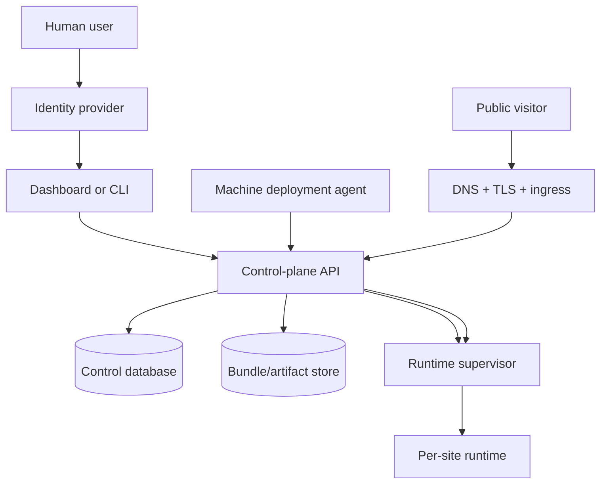

# Hosting Runtime Beta Bringup — A Reusable Playbook

A hosted runtime looks deceptively small in development. You write an HTTP server, load user code, route a request, and see a page. That is the prototype. A public beta is a different object. It is not merely the same binary on a public IP address; it is a chain of invariants that must hold across identity, deployment, storage, routing, TLS, restart, observability, and operator recovery.

> [!summary]
> To bring a hosted runtime to beta, prove the whole chain: humans can log in, machines can deploy with scoped credentials, bundles are validated before activation, active runtimes survive process restarts, wildcard DNS and TLS route generated site hosts, secrets come from the secret system, and smoke tests verify the public path after every rollout.

This article is a reusable playbook distilled from bringing `go-go-host` to its first public beta. The concrete names are examples, but the pattern applies to any platform where users upload code or configuration and expect it to become a live hosted endpoint.

## The basic shape

A hosted runtime beta has five planes:



Each plane answers a different question:

| Plane | Question it answers | Example answer |
|---|---|---|
| Identity | Who is making this request? | Keycloak OIDC, GitHub via Keycloak, CLI token |
| Control | What exists and what is active? | orgs, sites, deployments, agents, grants |
| Runtime | What code handles this public request? | host -> active deployment -> sandbox runtime |
| Delivery | How does traffic reach us safely? | DNS, wildcard TLS, ingress, service |
| Operations | Can we recover and prove it still works? | migrations, restart restore, smoke tests, backups |

A frequent mistake is to build only the runtime plane and mistake it for the product. The runtime can render a page locally, but a beta must also answer: who uploaded it, whether they were allowed to upload it, where the bytes live, how it survives restart, which host routes to it, whether TLS is valid, how to revoke a robot, and how to test the whole thing tomorrow.

## Start with the invariant, not the feature list

For a hosted runtime, the key invariant is:

> If the database says a deployment is active for a site, then a public request to that site's hostname must reach the corresponding runtime, even after a process restart.

That sentence ties together almost every subsystem. It implies:

1. There is a durable deployment record.
2. The active deployment can be reconstructed from storage.
3. The runtime supervisor can rebuild its in-memory routing map.
4. DNS sends the hostname to the cluster.
5. TLS accepts the hostname.
6. Ingress forwards the request to the service.
7. The application routes by Host header.
8. A smoke test can verify the result from outside the cluster.

Without this invariant, a deployment platform becomes an illusion. It works only while one process remembers what happened.

## Identity: authenticate humans, authorize actions locally

The clean pattern is to let an identity provider authenticate humans while the application owns authorization.

```text
GitHub or password login
  -> identity provider
  -> signed OIDC token
  -> application validates token locally
  -> application maps issuer+subject to local user
  -> application checks local permissions
```

The identity provider proves who the user is. It should not become the database of every site, deployment, CI runner, upload grant, and activation rule. Those are application concepts. Store them in the application control plane.

A good rule of thumb:

```text
Identity provider roles answer coarse questions:
  "Is this person a platform admin?"

Application permissions answer product questions:
  "Can this agent deploy this bundle path to this site?"
```

This separation keeps the system testable. You can unit-test application authorization without standing up the identity provider, and you can rotate identity-provider configuration without rewriting product policy.

## Access tokens are for APIs

OIDC has several token shapes. In a browser application it is tempting to use whichever token is easiest to retrieve. That often means accidentally sending an ID token to the API.

A better rule:

```text
ID token      -> proves authentication result to the client
Access token  -> authorizes calls to a resource server API
Refresh token -> obtains future tokens, if allowed
```

The API should validate bearer access tokens. It should verify:

- signature,
- issuer,
- expiry,
- client binding by audience or authorized party,
- subject,
- relevant claims such as email or roles.

In practice, many identity providers put the client ID in `azp` rather than `aud` for certain public-client access tokens. A robust beta implementation should know what its provider actually emits and should test it with the real provider, not just synthetic JWTs.

Pseudocode:

```pseudocode
function authenticateBearer(token):
    verified = oidcProvider.verify(token)
    claims = decodeClaims(verified)

    if expectedClient not in verified.audience
       and expectedClient not in claims.aud
       and claims.azp != expectedClient:
        reject("token was not issued for this client")

    user = users.upsert(
        issuer = claims.iss,
        subject = claims.sub,
        email = claims.email,
    )

    return user
```

The important part is not the exact library call. The important part is the security model: validate the token locally through the provider's JWKS, then map it into application identity and authorization.

## Separate human credentials from machine credentials

A hosted runtime usually has both a dashboard and automation. Treat them differently.

Humans are good at browser login:

```text
human -> browser -> Authorization Code + PKCE -> access token
```

CI runners and deploy agents are good at stable machine identity:

```text
human creates agent record
  -> system issues one-time enrollment token
  -> agent generates keypair
  -> agent enrolls public key
  -> agent signs deployment requests
  -> server checks signature, nonce, timestamp, and grant
```

Do not force long-lived robots to pretend they are humans. Conversely, do not give humans raw private deployment keys when a browser login and short-lived access token will do.

A useful credential split is:

| Actor | Credential | Lifetime | Revocation point |
|---|---|---|---|
| Browser user | OIDC access token | short | identity provider / app session |
| Human CLI | Device Flow token cache | medium | identity provider / token cache |
| Deploy agent | Ed25519 key + server grant | long but scoped | application agent record |
| Upload operation | one-time upload token | very short | deployment run |

This gives you auditability. A deployment can say not merely "someone uploaded bytes," but:

```text
agent agt_123, using key kid_456, under grant gr_789,
created deployment dep_abc for site site_def,
with logical bundle path bundles/release-2026-05-12.tar.gz
```

## Name policy concepts precisely

Names are part of the security model. If a field is called `path`, people will ask: path to what?

For deployment agents, distinguish at least three paths:

| Name | Meaning |
|---|---|
| local bundle file | where the CLI reads bytes from disk |
| logical bundle path | the artifact name/path the agent is authorized to publish |
| archive entry path | a file inside the tar/zip bundle |

A grant such as:

```json
{
  "allowedBundlePaths": ["bundles/**"]
}
```

should constrain the logical artifact path:

```text
bundles/my-service/release-42.tar.gz
```

It should not accidentally constrain files inside the archive:

```text
go-go-host.json
scripts/app.js
assets/style.css
```

Archive-entry validation is a different concern. It should prevent path traversal, oversized bundles, unsupported file types, forbidden manifest references, and missing entrypoints. It should not reuse the agent's artifact publishing policy unless that is explicitly the product design.

This is a general lesson: when a policy bug feels surprising, check whether one word is being used for two domains.

## Bundle validation is the pre-activation firewall

A hosted runtime should treat uploaded bundles as untrusted input until validation passes. Validation is not just a convenience for nicer error messages. It is the firewall before activation.

A typical validator should check:

- archive format,
- maximum compressed size,
- maximum uncompressed size,
- path traversal (`../`, absolute paths, symlink surprises),
- manifest existence,
- manifest schema,
- entrypoint existence,
- asset directory boundaries,
- requested capabilities,
- runtime channel,
- smoke route behavior,
- duplicate or conflicting files.

The lifecycle should be staged:

```text
upload bytes
  -> store immutable candidate
  -> unpack into isolated candidate directory
  -> validate manifest and files
  -> dry-run runtime if applicable
  -> create deployment record
  -> activate deployment
  -> update public runtime routing
```

Do not directly stream an upload into the live runtime directory. If validation and activation are separate steps, the system can explain failures, retry safely, and audit exactly what became live.

## Runtime memory must be reconstructable

Most hosted runtimes have some in-memory routing structure:

```text
host -> site -> active deployment -> runtime instance
```

That map is fast and convenient, but it is not the source of truth. The database is.

A beta-ready daemon should do something like this on startup:

```pseudocode
main():
    config = loadConfig()
    migrateDatabase()
    markStaleRuntimeStatusesStopped()

    supervisor = newRuntimeSupervisor()
    control = newControlPlane(supervisor)

    activeDeployments = database.listActiveDeployments()
    for deployment in activeDeployments:
        spec = buildRuntimeSpec(deployment)
        supervisor.activate(spec)

    startHTTPServer(control, supervisor)
```

This turns a pod restart from a partial outage into a normal lifecycle event. It also gives you a testable invariant:

```text
Given an active deployment in the database,
when the daemon starts,
then the public host is registered in the supervisor.
```

If this invariant is missing, every rollout can silently drop all hosted sites until someone manually reactivates them.

## Wildcard hosting requires four independent successes

Serving `https://site.example.com` and `https://another.example.com` from one platform requires more than string concatenation.

You need:

1. Wildcard DNS:
   ```text
   *.hosting.example.com -> ingress address
   ```
2. Wildcard TLS:
   ```text
   hosting.example.com
   *.hosting.example.com
   ```
3. Ingress rules that forward wildcard hosts to the platform service.
4. Application-level Host routing.

HTTP-01 certificate validation cannot issue wildcard certificates. For wildcard TLS, use DNS-01. That means cert-manager needs credentials for the DNS provider, and those credentials should come from the cluster secret system, not from a committed manifest.

The public request path should look like this:

```text
browser
  -> DNS resolves hello.hosting.example.com
  -> TLS certificate covers *.hosting.example.com
  -> ingress routes wildcard host to platform service
  -> platform reads Host header
  -> supervisor finds active runtime for hello.hosting.example.com
```

A useful smoke test checks both the platform host and a generated site host:

```bash
curl -fsSI https://hosting.example.com/healthz
curl -fsSI https://hello.hosting.example.com/
```

The first proves the control plane. The second proves wildcard delivery and runtime routing.

## GitOps ordering bugs are real bugs

Kubernetes resources are declarative, but controllers still have behavior. Argo CD sync waves, health checks, storage class binding modes, and operator reconciliation can interact in surprising ways.

A common example is a PVC with delayed binding:

```text
PVC waits for pod scheduling to bind.
Argo waits for PVC health before creating pod.
Result: deadlock.
```

The fix is not always "make Argo wait harder." Sometimes the fix is to move the PVC into the same sync wave as the Deployment that consumes it.

The general rule:

> Order resources by the behavior of their controllers, not merely by the dependency graph in your head.

For hosted runtime beta deployment, pay special attention to:

- namespaces before namespaced resources,
- service accounts before Vault auth objects,
- Vault-rendered secrets before Deployments that consume them,
- database bootstrap jobs before application readiness,
- PVC binding behavior relative to pods,
- certificates relative to ingress readiness.

## Secrets should enter at runtime, not through Git

A beta deployment has several secret classes:

- database DSNs,
- image pull credentials,
- OIDC client secrets, if using confidential clients,
- signing keys,
- upload-token signing secrets,
- cookie or session secrets,
- DNS provider tokens for wildcard TLS.

Git should contain references and shapes, not secret values. A common pattern is:

```yaml
controlDbDsn: "${CONTROL_DB_DSN}"
```

and then the Deployment receives `CONTROL_DB_DSN` from a secret rendered by Vault Secrets Operator or an equivalent secret system.

This has two benefits. First, the GitOps manifest remains reviewable and non-sensitive. Second, runtime configuration stays explicit: you can see which environment variables the process expects.

## Root redirects must be host-aware

Dashboard UX wants:

```text
https://hosting.example.com/ -> /app
```

Hosted apps want:

```text
https://hello.hosting.example.com/ -> user app root
```

If you add a blanket redirect for `/`, you will break every hosted app root. The redirect must check the Host header and apply only to the platform host.

Pseudocode:

```pseudocode
if request.path == "/" and request.host == platformHost:
    redirect("/app")
else:
    routeNormally(request)
```

This is a small example of a larger hosted-platform rule: the same URL path can mean different things on different hosts. Always include host in the routing model.

## Smoke tests should follow the user-visible path

Internal checks are useful, but beta smoke tests should start outside the system and behave like users.

A good read-only smoke checks:

```text
control-plane health
control-plane readiness
public config endpoint
dashboard root redirect
known generated site root
known generated site API route
known generated site asset route
```

A good authenticated deployment smoke checks:

```text
obtain human access token
create temporary scoped deploy agent
enroll deploy agent key
deploy bundle with logical bundle path
verify deployment record
verify public site
revoke temporary agent
```

The first script tells you whether the beta is up. The second tells you whether the platform can still change itself safely.

Keep these scripts boring. Boring scripts get run.

## A reusable beta checklist

Before calling a hosted runtime "beta," verify these statements:

### Identity and authorization

- [ ] Browser login uses Authorization Code + PKCE.
- [ ] API calls use access tokens, not ID tokens.
- [ ] Backend validates issuer, signature, expiry, and client binding.
- [ ] Application maps identity provider subject to local user.
- [ ] Platform admin bootstrap is explicit and auditable.
- [ ] Machine deployment agents have first-class app-native credentials.
- [ ] Agent grants are scoped by org/site/action/artifact path.

### Deployment lifecycle

- [ ] Upload and activation are separate stages.
- [ ] Bundle validation rejects unsafe archive paths.
- [ ] Bundle validation checks manifest, entrypoint, assets, size, and capabilities.
- [ ] Deployments are immutable records.
- [ ] Active deployment is stored durably.
- [ ] Startup restores active runtimes from durable state.

### Public delivery

- [ ] Platform host has DNS and TLS.
- [ ] Generated site hosts have wildcard DNS.
- [ ] Generated site hosts have wildcard TLS through DNS-01.
- [ ] Ingress forwards wildcard hosts to the service.
- [ ] Application routes by Host header.
- [ ] Dashboard root redirect is host-aware.

### Operations

- [ ] Runtime secrets come from the secret system.
- [ ] Private images have working image pull secrets.
- [ ] Database migrations run before serving traffic.
- [ ] Argo/GitOps sync reaches healthy state from scratch.
- [ ] Public smoke script is committed.
- [ ] Authenticated deploy smoke script is committed.
- [ ] Rollout does not drop active sites.
- [ ] Backup and restore procedure exists or is scheduled before real users.

## The pattern in one sentence

A hosted runtime becomes a beta when the platform can repeatedly answer this question from the public internet:

> Can a real identity safely publish a validated artifact to a generated hostname, and will that hostname keep serving the correct runtime after rollout, restart, and certificate renewal?

Everything else is implementation detail. Important detail, but detail nonetheless.

## Related PARC notes

- [[Tribal/keycloak-oauth-in-go-services]]
- [[Tribal/application-native-authorization]]
- [[Tribal/host-mediated-sandbox-principles]]
- [[Tribal/host-mediated-secret-delivery]]
- [[Tribal/microvm-as-execution-boundary]]
