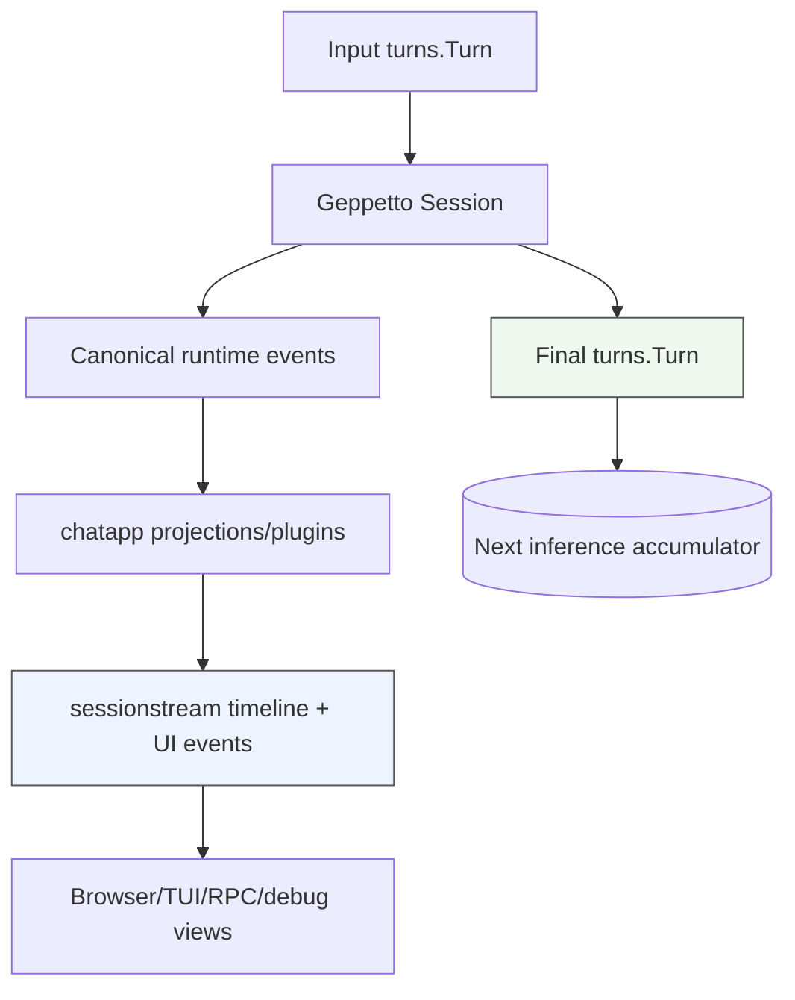

# Session, Turn, and Blocks in Chat Applications — How We Use Them

This note explains how `Session`, `Turn`, and `Block` values are used in our LLM chat applications. The concrete examples are Pinocchio command TUI and web-chat, but the pattern is broader: chat applications need one explicit conversation accumulator for inference, and they need a separate visible event/timeline model for UI clients.

> [!summary]
> A `turns.Turn` is the inference accumulator. It contains the blocks the model should see for the next call. A `Session` runs inference against the latest turn and returns the final updated turn. Blocks are the ordered typed units inside the turn: system, user, assistant, tool, image, and other payload-bearing entries. `sessionstream` is the visible event/timeline/snapshot layer; it should not be confused with the inference accumulator.

## Why this note exists

The Pinocchio sessionstream migration exposed a subtle but important state question: after a user submits the next chat message, where should the next inference context come from? There were two plausible answers. One answer was to rebuild the context from `sessionstream` timeline entities. The other answer was to carry forward the previous `turns.Turn`, append a new user block, run inference, and use the final returned turn as the new accumulator.

The second answer is the correct model for inference context. The `sessionstream` timeline is the state that clients see. The `turns.Turn` is the state the model sees. These two states are related because the same run produces both final turn data and projected UI events, but they are not interchangeable.

The relevant source paths are:

| Path | Role |
|---|---|
| `/home/manuel/workspaces/2026-05-20/pinocchio-structured-data-cli/pinocchio/pkg/chatapp/runtime_inference.go` | Builds the Geppetto `Session`, appends the initial turn or persisted turn, starts inference, waits for the final turn, and publishes chat events. |
| `/home/manuel/workspaces/2026-05-20/pinocchio-structured-data-cli/pinocchio/pkg/chatapp/service.go` | Defines `PromptRequest`, including `InitialTurn` and `OnFinalTurn`. |
| `/home/manuel/workspaces/2026-05-20/pinocchio-structured-data-cli/pinocchio/pkg/ui/chatapp_backend.go` | Command TUI backend that stores an in-memory `currentTurn` accumulator. |
| `/home/manuel/workspaces/2026-05-20/pinocchio-structured-data-cli/pinocchio/cmd/web-chat/app/server.go` | web-chat HTTP handler that submits only the prompt and runtime, leaving history reconstruction to `chatapp` and `TurnStore`. |
| `/home/manuel/workspaces/2026-05-20/pinocchio-structured-data-cli/pinocchio/cmd/web-chat/runtime_composer.go` | Builds web-chat runtimes and installs turn persistence hooks. |
| `/home/manuel/workspaces/2026-05-20/pinocchio-structured-data-cli/pinocchio/cmd/web-chat/turn_persistence.go` | Persists final turns to the turns database. |
| `/home/manuel/workspaces/2026-05-20/pinocchio-structured-data-cli/pinocchio/pkg/ui/chatapp_fanout.go` | Converts projected `sessionstream` UI events into Bubble Tea timeline messages. |

## The core model

There are four distinct concepts that must not be collapsed.

| Concept | What it represents | Typical owner |
|---|---|---|
| `Block` | One ordered unit of model context or model output. | Geppetto turns package and inference/tooling code. |
| `Turn` | The complete accumulator that should be sent to the model for one inference run. | TUI backend memory, web-chat `TurnStore`, or explicit CLI command construction. |
| `Session` | A runtime execution object that holds turns and runs inference against the latest turn. | Geppetto inference session. |
| `sessionstream` timeline | The projected client-visible state: user messages, text patches, reasoning entities, tool entities, snapshots. | chatapp/sessionstream projections and UI clients. |

A correct chat application has an explicit answer to this question:

> Where is the latest final `turns.Turn` stored between user messages?

For command TUI, it is stored in memory as `ChatAppBackend.currentTurn`. For web-chat, it is stored in the turns database as the latest persisted `final` turn. For one-shot CLI/RPC, the command builds an explicit `InitialTurn` for that single run.

Once that answer is clear, the next user message follows a simple progression:

```text
previous final turn
  -> clone
  -> append new user block
  -> run inference/tool loop
  -> receive final updated turn
  -> store final updated turn for the next message
```

The `sessionstream` timeline is updated during the same run, but it is not the source of the next inference turn.

## Blocks: the ordered units inside a turn

A `Block` is one piece of conversation or context. Blocks are ordered. Order matters because the model receives the blocks in sequence. The common roles are:

| Block role | Meaning |
|---|---|
| `system` | Instructions, policy, persona, or contextual constraints. |
| `user` | User input for a message or command invocation. |
| `assistant` | Model output that should be available to later turns. |
| tool-related roles | Tool calls, tool results, or intermediate structured interaction, depending on the engine/tool-loop representation. |
| media/content blocks | Images or richer payloads attached to user or system input. |

A block is not only a string. It has a role and payload. In Pinocchio commands, the rendered seed turn may contain system prompts, templated prompt text, images, and pre-seeded context blocks. That is why `PromptRequest.InitialTurn` exists: a command often has richer input than a single prompt string.

The main rule is:

> The turn passed to inference must contain every block that should influence the model, and no duplicate blocks from previous runs.

Duplicating a system prompt may be harmless in a small example and harmful in a larger one. Duplicating user/assistant history changes the conversation. Dropping tool result blocks can break tool-loop continuity. Dropping image blocks can make a multimodal command impossible to continue correctly.

## Turns: the inference accumulator

A `turns.Turn` is not merely the latest user message. It is the accumulated context for the next model call.

A minimal first turn might be:

```text
system: You are an assistant.
user: hello i am manuel
```

After inference, the final turn should be:

```text
system: You are an assistant.
user: hello i am manuel
assistant: Hi Manuel. How can I help?
```

After the next user message is submitted, the input turn should be:

```text
system: You are an assistant.
user: hello i am manuel
assistant: Hi Manuel. How can I help?
user: Reply with exactly continue_ok
```

After inference, the final turn should be:

```text
system: You are an assistant.
user: hello i am manuel
assistant: Hi Manuel. How can I help?
user: Reply with exactly continue_ok
assistant: continue_ok
```

This is the accumulator model. Every successful run produces the turn that should become the base for the next run.

The important implication is that a chat backend should not repeatedly reapply the original seed. The seed is only the initial value of the accumulator. After the first run, the accumulator is the final turn returned by inference.

## Sessions: where inference actually runs

The Geppetto `Session` owns the execution lifecycle for a run. In `chatapp`, the runtime path creates a session, appends one turn, starts inference, waits for completion, and receives the final updated turn.

The important code shape in `pkg/chatapp/runtime_inference.go` is:

```go
sess := gepsession.NewSessionWithID(string(sid))
sess.Builder = &enginebuilder.Builder{
    Base:       runtime.Engine,
    EventSinks: []gepevents.EventSink{eventSink},
}

if pending.InitialTurn != nil {
    sess.Append(pending.InitialTurn.Clone())
} else {
    // Load latest persisted final turn when available.
    // Then append the new user prompt.
    _, err := sess.AppendNewTurnFromUserPrompt(prompt)
}

handle, err := sess.StartInference(ctx)
output, err := handle.Wait()
```

Geppetto's session runs inference against the latest appended turn. The engine/tool loop mutates or returns the updated turn. The final `output` is the correct next accumulator after successful inference.

The session is not the long-term chat store in the command TUI. A fresh Geppetto session can be created for each submitted prompt as long as the latest accumulator turn is appended before inference. The continuity lives in the turn, not in the session object.

## `chatapp` has two turn-input paths

`chatapp` supports two ways to construct the input turn for a run.

### Path 1: explicit `InitialTurn`

Use this when the caller already knows the full turn to run. The command TUI uses this path. Pinocchio one-shot commands and RPC also use this path because command input can include rendered system prompts, blocks, images, and templated content.

```go
req := chatapp.PromptRequest{
    Prompt:      prompt,
    InitialTurn: initialTurn,
    Runtime:     runtime,
}
```

Inside `chatapp`:

```go
if pending.InitialTurn != nil {
    sess.Append(pending.InitialTurn.Clone())
}
```

In this path, `chatapp` does not load the latest turn from `TurnStore`. The caller has supplied the complete inference turn. If the caller wants multi-turn continuity, it must maintain the latest final turn and provide it as part of the next `InitialTurn`.

### Path 2: no `InitialTurn`, with optional `TurnStore`

Use this when `chatapp` should own reconstruction of the turn from persisted conversation history. web-chat uses this path.

```go
req := chatapp.PromptRequest{
    Prompt:  in.Prompt,
    Runtime: runtime,
}
```

Inside `chatapp`:

```go
if e.turnStore != nil {
    snapshot, err := e.turnStore.LoadLatestTurn(ctx, string(sid), "final")
    turn, err := serde.FromYAML([]byte(snapshot.Payload))
    sess.Append(turn)
}

_, err := sess.AppendNewTurnFromUserPrompt(prompt)
```

In this path, the latest persisted final turn is treated as the accumulator. `AppendNewTurnFromUserPrompt` clones the latest turn and appends the new user block. Then inference produces the next final turn.

## Command TUI: in-memory current turn

The command TUI is an in-process interactive application. While the Bubble Tea program is running, it can hold the current inference accumulator in memory.

The backend state is:

```go
type ChatAppBackend struct {
    service     *chatapp.Service
    sid         sessionstream.SessionId
    runtime     *infruntime.ComposedRuntime
    currentTurn *turns.Turn
    running     bool
}
```

The constructor uses the seed once:

```go
func NewChatAppBackend(..., seed *turns.Turn) (*ChatAppBackend, error) {
    var seedClone *turns.Turn
    if seed != nil {
        seedClone = seed.Clone()
    }
    return &ChatAppBackend{currentTurn: seedClone, ...}, nil
}
```

The seed is not stored separately. It is the initial value of `currentTurn`.

Each new message follows this sequence:

```go
initialTurn := turnWithUserPrompt(b.currentTurn, prompt)

req := chatapp.PromptRequest{
    Prompt:      prompt,
    InitialTurn: initialTurn,
    Runtime:     b.runtime,
    OnFinalTurn: func(t *turns.Turn) {
        finalTurn = t.Clone()
    },
}

b.service.SubmitPromptRequest(ctx, b.sid, req)
b.service.WaitIdle(ctx, b.sid)
b.currentTurn = finalTurn.Clone()
```

The helper is intentionally simple:

```go
func turnWithUserPrompt(base *turns.Turn, prompt string) *turns.Turn {
    var t *turns.Turn
    if base != nil {
        t = base.Clone()
    } else {
        t = &turns.Turn{}
    }
    turns.AppendBlock(t, turns.NewUserTextBlock(prompt))
    return t
}
```

This is the right TUI model:

```text
seed.Clone()
  -> currentTurn

currentTurn.Clone() + user(prompt)
  -> inference
  -> finalTurn
  -> currentTurn = finalTurn.Clone()
```

The TUI should not reconstruct `currentTurn` from `sessionstream` timeline entities. Timeline entities are for rendering and snapshots. The final Geppetto turn is for inference continuity.

## web-chat: persisted final turns

web-chat is an HTTP/websocket application. The HTTP handler does not keep a per-session `currentTurn` pointer in memory. It submits a prompt and runtime to `chatapp`:

```go
s.service.SubmitPromptRequest(r.Context(), sid, chatapp.PromptRequest{
    Prompt:         in.Prompt,
    IdempotencyKey: in.IdempotencyKey,
    Runtime:        runtime,
})
```

The absence of `InitialTurn` is intentional. It selects the `TurnStore` path in `chatapp`.

The runtime composer installs turn persistence when a turn store exists:

```go
if c.turnStore != nil && strings.TrimSpace(req.ConvID) != "" {
    sessionID := strings.TrimSpace(req.ConvID)
    builder.Persister = newTurnStorePersister(c.turnStore, sessionID, runtimeKey, "final")
    builder.SnapshotHook = newTurnSnapshotHook(sessionID, runtimeKey, c.turnStore)
}
```

The persister serializes and saves the final turn:

```go
func (p *turnStorePersister) PersistTurn(ctx context.Context, t *turns.Turn) error {
    payload, err := serde.ToYAML(t, serde.Options{})
    return p.store.Save(ctx, p.sessionID, p.sessionID, turnID, phase, time.Now().UnixMilli(), string(payload), chatstore.TurnSaveOptions{
        RuntimeKey:  p.runtimeKey,
        InferenceID: inferenceID,
    })
}
```

The web-chat progression is:

```text
HTTP POST prompt
  -> PromptRequest{Prompt, Runtime}
  -> chatapp loads latest final turn from TurnStore
  -> chatapp appends new user block
  -> Geppetto session/tool loop produces final turn
  -> runtime persister saves final turn
  -> websocket/sessionstream updates visible UI state
```

The turn accumulator lives in the turns database. The browser-visible timeline lives in `sessionstream`.

## One-shot CLI and RPC: explicit rendered turn

One-shot command and RPC modes usually have no long-lived conversation accumulator. They build one explicit turn from command inputs and pass it as `InitialTurn`.

This is necessary because Pinocchio verbs can include more than a single prompt string:

- command-specific system prompts,
- rendered templates,
- user prompt blocks,
- image blocks,
- pre-seeded assistant/user blocks,
- metadata such as session id.

The command path renders those inputs into a `turns.Turn` and submits it directly:

```go
seed, err := g.buildInitialTurn(rc.Variables, rc.ImagePaths)
req := chatapp.PromptRequest{
    Prompt:      displayPromptForTurn(seed),
    InitialTurn: seed,
    Runtime:     runtime,
}
```

For a one-shot run, the final answer may be printed to stdout or emitted as JSONL. There may be no next `currentTurn`. If the user chooses to continue into chat after a blocking answer, the command sets `rc.ResultTurn` and uses that as the TUI seed.

## `sessionstream`: visible state, not inference state

`sessionstream` stores and projects the state that UI clients consume. It has timeline entities, ordinals, snapshots, and UI events. It is the correct source for:

- websocket hydration,
- Bubble Tea visible timeline hydration,
- debug JSONL traces,
- RPC snapshots,
- export views,
- client-visible run status and message entities.

It is not the primary source for the next `turns.Turn` when the final inference turn is available.

The distinction is:

| Need | Source |
|---|---|
| What should the model see next? | Latest final `turns.Turn`. |
| What should the user interface display? | `sessionstream` events and snapshots. |
| What should an RPC client parse? | Protobuf JSONL frames derived from `sessionstream` UI events/snapshots. |
| What should a debug trace inspect? | Projected UI events at the `sessionstream.UIFanout` boundary. |

A useful rule is:

> Do not derive model context from UI projection when the inference loop already produced the final model context.

`sessionstream` can be used for display hydration even when the inference turn lives elsewhere. For example, when command output transitions into the TUI, the visible timeline needs hydration from the previous result turn. That hydration is a UI concern. It does not mean the next inference accumulator should be rebuilt from timeline entities.

## How final turns and projected UI state stay consistent

A single run updates both state tracks:



The final turn and timeline should describe the same run, but they have different shapes. A final turn is optimized for the next model call. Timeline entities are optimized for incremental client rendering and export. For example, one assistant response may be streamed as many `ChatTextPatch` events, stored as one or more message entities, and represented in the final turn as assistant blocks.

The correct invariant is:

```text
The next model call uses the latest final turn.
The UI displays the latest projected timeline.
Both are produced by the same run.
```

## Common failure modes

### Reusing the seed on every turn

Symptom: old initial context is reintroduced repeatedly, or seed user/assistant blocks duplicate over time.

Cause: the backend stores both `seed` and `currentTurn`, then rebuilds the next turn as `seed + timeline` after each run.

Fix: use the seed once to initialize `currentTurn`. After each successful run, replace `currentTurn` with the final inference turn.

### Reconstructing inference context from timeline entities

Symptom: model context depends on what the UI projected rather than what the inference/tool loop returned. Tool blocks, metadata, images, or non-chat blocks can be dropped. Multi-segment assistant output can be flattened incorrectly.

Cause: treating `sessionstream.Snapshot.Entities` as the source of the next `turns.Turn`.

Fix: keep timeline snapshots for UI hydration and use final `turns.Turn` for inference accumulation.

### Appending the user prompt twice

Symptom: the latest user prompt appears twice in the model context.

Cause: caller passes `InitialTurn` that already includes the user prompt, and `chatapp` also appends the prompt from `PromptRequest.Prompt`.

Fix: understand which path is active. If `InitialTurn` is present, it is authoritative; `chatapp` should not append `Prompt` again. If `InitialTurn` is absent, `chatapp` loads history and appends `Prompt`.

### Losing the assistant response after a TUI run

Symptom: second TUI message does not see the first assistant answer in context.

Cause: backend sends `InitialTurn` and waits for idle, but never records the final turn returned by inference.

Fix: capture the final turn through `PromptRequest.OnFinalTurn` or a typed run result, then assign it to `currentTurn`.

### Letting `WaitIdle` stand for final result

Symptom: code assumes idle means success and a usable final turn exists.

Cause: `WaitIdle` only means the active run goroutine is done. It is not a complete result object.

Fix: separately observe terminal run status and final turn. For RPC status, use run events such as `ChatRunFinished` and `ChatRunFailed`. For TUI context, use `OnFinalTurn` or a future typed result.

### Confusing visible hydration with inference continuation

Symptom: a TUI displays the right previous messages but sends the wrong context to the model, or the model sees the right context but the UI starts empty.

Cause: display state and inference state are handled as one concept.

Fix: hydrate the visible UI from snapshots or result turns, and maintain inference context through the `turns.Turn` accumulator. Both must be done, but they are different operations.

## Recommended design patterns

### Pattern 1: in-memory interactive client

Use this for terminal TUI, desktop UI, or any single-process interactive client.

```text
state:
    currentTurn *turns.Turn

constructor(seed):
    currentTurn = seed.Clone()

onUserPrompt(prompt):
    input = currentTurn.Clone()
    input.Append(user prompt)
    final = runInference(input)
    currentTurn = final.Clone()
```

If the run also streams to a UI, stream through events/fanout. Do not build `currentTurn` from the rendered stream.

### Pattern 2: stateless request handler with persistence

Use this for HTTP services such as web-chat.

```text
on POST prompt(sessionID, prompt):
    latest = turnStore.LoadLatestTurn(sessionID, "final")
    input = latest.Clone()
    input.Append(user prompt)
    final = runInference(input)
    turnStore.Save(sessionID, "final", final)
```

In Pinocchio, this is split between `chatapp` and the runtime persister. The handler submits only the prompt; `chatapp` loads the latest final turn; the runtime builder persists the final turn.

### Pattern 3: one-shot command

Use this for CLI commands where the input is fully rendered at invocation time.

```text
seed = renderCommandToTurn(system, prompt, blocks, images, metadata)
final = runInference(seed)
print or stream result
```

There may be no next turn. If the command transitions into interactive chat, assign the final result to the interactive client's initial `currentTurn`.

### Pattern 4: visible timeline projection

Use this for web sockets, TUIs, RPC, and debug traces.

```text
canonical runtime events
  -> chatapp plugins/projections
  -> sessionstream UI events and timeline entities
  -> client adapters
```

This path should be reused across clients. It should not own model context accumulation.

## Review checklist

Use this checklist when building or reviewing chat application state handling.

### Turn accumulator

- There is exactly one source of truth for the next inference `turns.Turn`.
- The seed is used once to initialize the accumulator, not reapplied every turn.
- Each new user message is appended to a clone of the previous final turn.
- After successful inference, the final returned turn becomes the next accumulator.
- Failed/cancelled runs have an explicit policy: keep previous turn, keep partial turn, or store an error state.

### `chatapp` request path

- If `InitialTurn` is present, it already contains the user prompt and all context for this run.
- If `InitialTurn` is absent, `chatapp` loads latest final turn from `TurnStore` and appends `Prompt`.
- Callers do not mix the two paths accidentally.
- Any caller that needs in-memory accumulation captures the final turn from the runtime path.

### Persistence

- web-chat or other stateless handlers persist final turns after successful inference.
- The stored final turn is the full accumulator, not only the latest exchange.
- Turn snapshots include enough metadata to recover session id, inference id, runtime key, and phase.
- Loading history handles missing, corrupt, or unavailable stores explicitly.

### UI/timeline

- `sessionstream` is used for visible state, snapshots, websocket updates, debug traces, and exports.
- TUI hydration is handled separately from inference context.
- RPC/debug JSONL records projected UI events, not ad hoc turn reconstruction.
- User-visible message ids and inference turn ids are not treated as the same concept unless explicitly designed that way.

### Tests

- Multi-turn TUI tests verify that the second run sees the first assistant response.
- web-chat tests verify that a persisted final turn is loaded and a follow-up prompt is appended.
- tests cover the `InitialTurn` path and the no-`InitialTurn` `TurnStore` path separately.
- tests assert that final turn capture includes assistant output.
- tests do not rely only on `sessionstream` snapshots to prove inference context correctness.

## Minimal examples

### Command TUI example

```go
// Initial setup.
backend.currentTurn = seed.Clone()

// User submits a message.
initialTurn := backend.currentTurn.Clone()
turns.AppendBlock(initialTurn, turns.NewUserTextBlock(prompt))

var finalTurn *turns.Turn
req := chatapp.PromptRequest{
    Prompt:      prompt,
    InitialTurn: initialTurn,
    Runtime:     runtime,
    OnFinalTurn: func(t *turns.Turn) {
        finalTurn = t.Clone()
    },
}

service.SubmitPromptRequest(ctx, sid, req)
service.WaitIdle(ctx, sid)
backend.currentTurn = finalTurn.Clone()
```

### web-chat example

```go
// HTTP handler submits only prompt and runtime.
service.SubmitPromptRequest(ctx, sid, chatapp.PromptRequest{
    Prompt:  prompt,
    Runtime: runtime,
})

// chatapp runtime path, because InitialTurn is nil.
latest := turnStore.LoadLatestTurn(ctx, sid, "final")
sess.Append(latest)
sess.AppendNewTurnFromUserPrompt(prompt)

handle := sess.StartInference(ctx)
finalTurn := handle.Wait()

// Runtime builder persister saves final turn.
turnStore.Save(ctx, sid, sid, finalTurn.ID, "final", now, serialize(finalTurn), opts)
```

### UI projection example

```text
runtime emits text/reasoning/tool events
  -> chatapp plugins project ChatTextPatch, ChatReasoningPatch, ChatRunFinished
  -> sessionstream stores timeline entities and emits UI events
  -> browser or TUI renders visible state
```

This projection is required for user experience. It is not the primary mechanism for deciding what the model sees next.

## Working rules

1. A `Block` is an ordered unit of model context or output.
2. A `Turn` is the full model-context accumulator for one inference run.
3. A successful inference returns the next final turn.
4. A `Session` is an execution object; long-term chat continuity lives in the latest final turn.
5. The seed initializes the accumulator once.
6. In-memory clients store the latest final turn in memory.
7. Stateless services store the latest final turn in a `TurnStore`.
8. `InitialTurn` means the caller already supplied the full input turn.
9. No `InitialTurn` means `chatapp` may load history and append `Prompt`.
10. `sessionstream` is for visible events, timeline entities, snapshots, websocket updates, RPC frames, debug traces, and exports.
11. Do not reconstruct inference context from UI timeline entities when a final turn exists.
12. Test inference context separately from UI rendering.

The durable rule is simple: the next model call starts from the latest final `turns.Turn`. The application may keep that turn in memory, store it in a database, or construct it explicitly for a one-shot command. The UI timeline is a projection of what happened, not the primary conversation accumulator.
