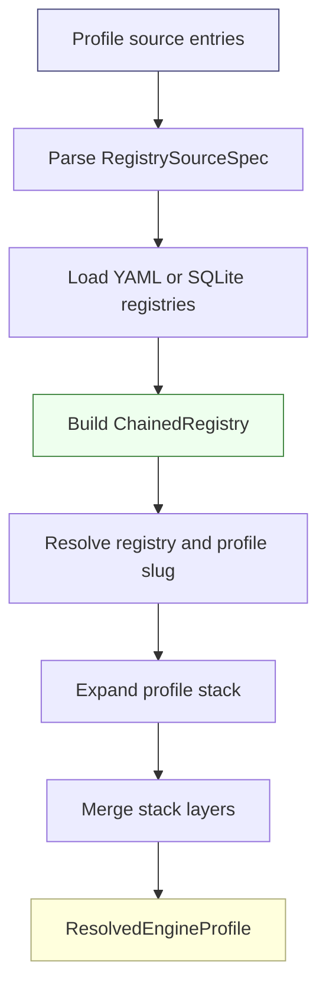
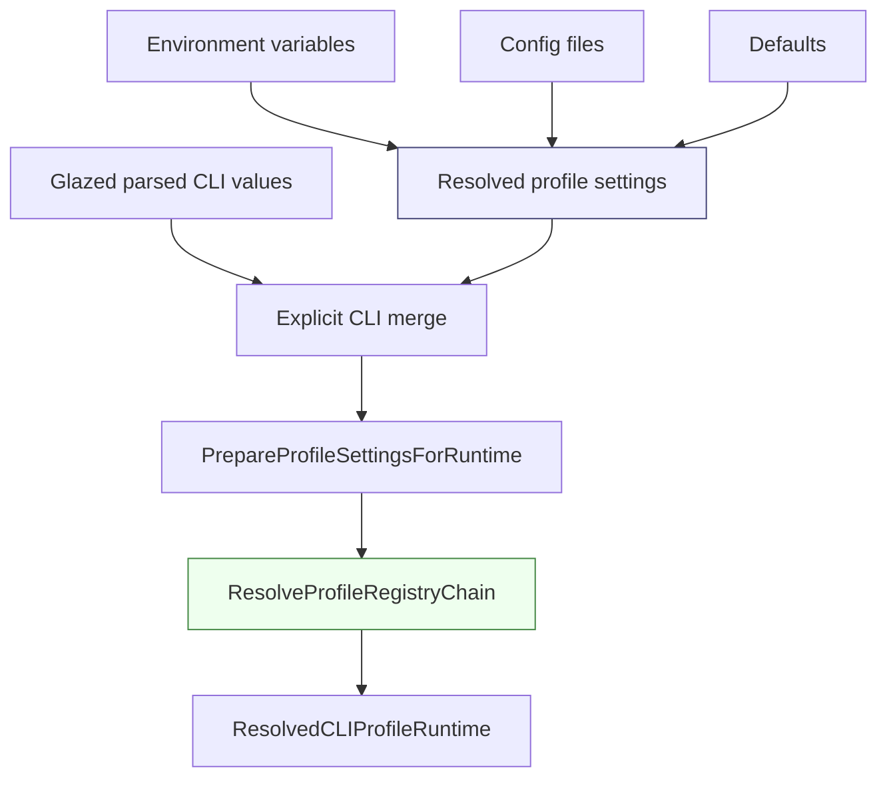

# Stack Profile Registry Pattern — Engine Profiles, Registry Chains, and Runtime Overlays

This note describes the stack/profile registry pattern used in Geppetto and adapted by Pinocchio, CoinVault, and other go-go-golems software. The pattern gives applications a disciplined way to name inference configurations, load those configurations from multiple sources, compose them through stack inheritance, and then apply application-owned runtime behavior without making the reusable engine layer responsible for every application policy.

> [!summary]
> Geppetto owns the general profile registry pattern: registries contain named engine profiles, profile stacks merge base-to-leaf settings, and chained registries load several sources with explicit precedence. Pinocchio extends the pattern with `.pinocchio.yml` documents and inline profiles. CoinVault uses the same Geppetto registry core for inference profiles, but keeps a separate application-profile layer for prompts and tools.

## Why this pattern exists

Applications that call LLM providers need more than one model preset. A local development run may use a cheap model, a production route may use a safer model, a reasoning workflow may need a different provider API, and a debugging session may need a shorter timeout or a different middleware set. These choices must be named, discoverable, overrideable, and reproducible.

A single flat configuration file does not solve this well. It can say what the current settings are, but it does not record which named policy was selected. It also makes reuse difficult: if ten profiles share the same OpenAI base settings and differ only in model or reasoning effort, duplicating the full provider configuration in every profile creates drift. The stack profile registry pattern solves this by separating three responsibilities:

- A **registry** names a collection of profiles and declares a default profile.
- A **profile** contains inference settings, optional stack references, metadata, and extension data.
- A **stack resolver** expands base profiles before leaf profiles and merges them deterministically.

This gives the system a stable unit of selection: a command, HTTP request, or script can say `profile=gpt-5-low`, and the runtime can reconstruct how that profile was built.

## The core data model

The central implementation lives in Geppetto:

| Area | Path | Responsibility |
|---|---|---|
| Profile model | `geppetto/pkg/engineprofiles/types.go` | Defines `EngineProfileRegistry`, `EngineProfile`, profile references, metadata, and extensions. |
| Registry interface | `geppetto/pkg/engineprofiles/registry.go` | Defines `RegistryReader`, `Registry`, `ResolveInput`, and `ResolvedEngineProfile`. |
| Store registry | `geppetto/pkg/engineprofiles/service.go` | Resolves defaults, expands stacks, merges profiles, and returns resolved metadata. |
| Source chain | `geppetto/pkg/engineprofiles/source_chain.go` | Parses YAML/SQLite source specs and constructs `ChainedRegistry`. |
| Stack resolver | `geppetto/pkg/engineprofiles/stack_resolver.go` | Expands a selected profile into deterministic base-to-leaf layers. |
| Stack merge | `geppetto/pkg/engineprofiles/stack_merge.go` | Merges inference settings and extensions across stack layers. |
| Settings merge | `geppetto/pkg/engineprofiles/inference_settings_merge.go` | Merges `InferenceSettings` objects with overlay-wins semantics. |

The main conceptual types are compact:

```go
type EngineProfileRegistry struct {
    Slug                     RegistrySlug
    DisplayName              string
    DefaultEngineProfileSlug EngineProfileSlug
    Profiles                 map[EngineProfileSlug]*EngineProfile
    Metadata                 EngineProfileRegistryMetadata
}

type EngineProfile struct {
    Slug              EngineProfileSlug
    DisplayName       string
    Description       string
    Stack             []EngineProfileRef
    InferenceSettings *settings.InferenceSettings
    Extensions        map[string]any
    Metadata          EngineProfileMetadata
}

type ResolveInput struct {
    RegistrySlug      RegistrySlug
    EngineProfileSlug EngineProfileSlug
}

type ResolvedEngineProfile struct {
    RegistrySlug      RegistrySlug
    EngineProfileSlug EngineProfileSlug
    InferenceSettings *settings.InferenceSettings
    StackLineage      []ResolvedProfileStackEntry
    Metadata          map[string]any
}
```

The type names are precise. An engine profile is not an application profile. It is a named engine configuration and optional extension payload. Applications may interpret extension payloads, but the registry core does not need to understand every application-specific field.

## The resolution pipeline

A complete profile resolution has five stages. The stages are useful because each one has a narrow responsibility and can be tested independently.



### Stage 1: profile source entries

The CLI or config layer starts with a list of source entries. The generic Geppetto CLI section exposes this as `--profile-registries`:

```bash
--profile-registries ./profiles.yaml,sqlite:/tmp/profiles.db
```

Geppetto accepts several forms:

```text
yaml:PATH
yaml://PATH
sqlite:PATH
sqlite-dsn:DSN
PATH.yaml
PATH.db
```

The parser lives in `geppetto/pkg/engineprofiles/source_chain.go`.

### Stage 2: source specs

Source entries become `RegistrySourceSpec` values:

```go
type RegistrySourceSpec struct {
    Raw  string
    Kind RegistrySourceKind
    Path string
    DSN  string
}
```

This is the first important normalization step. A command should not carry around ambiguous strings after this point. It should carry typed specs that say what kind of source will be opened.

### Stage 3: chained registry construction

`NewChainedRegistryFromSourceSpecs` loads every source and creates a single `Registry` implementation. The chain is not a merge of profiles with the same registry slug. Duplicate registry slugs across sources are rejected. This is deliberate: a duplicate registry slug would make provenance ambiguous.

The chain also records precedence. Later sources are treated as higher precedence for unqualified profile lookup. If a user passes:

```bash
--profile-registries base.yaml,local.yaml
```

then `local.yaml` is the higher-precedence source when searching for a profile slug without an explicit registry.

The default registry is chosen from the last loaded source that has registries. This matches the same operational expectation: a local override source should be able to become the active default without mutating the base source.

### Stage 4: registry and profile selection

The caller resolves a profile by passing a `ResolveInput`:

```go
resolved, err := registry.ResolveEngineProfile(ctx, engineprofiles.ResolveInput{
    RegistrySlug:      registrySlug,
    EngineProfileSlug: profileSlug,
})
```

Selection rules are simple:

- If the registry slug is omitted, use the registry service's default registry.
- If the profile slug is omitted, use the registry's `DefaultEngineProfileSlug`.
- If the registry has no declared default but contains a `default` profile, use that profile.
- If neither rule can select a profile, return a validation error.

A `ChainedRegistry` adds one more useful behavior: if a profile slug is supplied without a registry slug, it searches registry sources in top-of-stack precedence order and resolves the first matching profile.

### Stage 5: stack expansion and merge

Profile stacks let a leaf profile reuse base profiles. The stack resolver expands the selected profile into base-to-leaf order. The stack merger then applies each layer in order, so later layers override earlier layers.

Conceptual pseudocode:

```go
func ResolveEngineProfile(registrySlug, profileSlug):
    registrySlug = resolveDefaultRegistry(registrySlug)
    profileSlug = resolveDefaultProfile(registrySlug, profileSlug)

    layers = ExpandEngineProfileStack(registrySlug, profileSlug)
    merged = empty profile result

    for layer in layers:        // already base -> leaf
        merged.InferenceSettings = MergeInferenceSettings(
            merged.InferenceSettings,
            layer.Profile.InferenceSettings,
        )
        merged.Extensions = MergeExtensions(
            merged.Extensions,
            layer.Profile.Extensions,
        )

    return ResolvedEngineProfile{
        RegistrySlug: registrySlug,
        EngineProfileSlug: profileSlug,
        InferenceSettings: merged.InferenceSettings,
        StackLineage: lineage(layers),
        Metadata: metadata(registrySlug, profileSlug, layers),
    }
```

The merge rule is consistent: base first, overlay second, overlay wins. Nested maps merge recursively. Scalar values are replaced by the overlay.

## Registry chains and stack profiles solve different problems

Registry chains and profile stacks are both composition mechanisms, but they operate at different levels.

| Mechanism | Input | Purpose | Conflict behavior |
|---|---|---|---|
| Registry chain | Multiple registry sources | Load profile registries from several places and define source precedence. | Duplicate registry slugs across sources are rejected. Unqualified profile lookup uses precedence. |
| Profile stack | Multiple profiles referenced by one selected profile | Reuse settings across profiles and build one effective profile. | Later stack layers override earlier stack layers. |
| Base/settings merge | Command/env/config base settings plus resolved profile settings | Apply a selected named profile over host defaults. | Resolved profile settings overlay the base settings. |

This separation is the pattern's main strength. Source precedence decides where profiles come from. Stack inheritance decides how one selected profile is built. Runtime base merging decides how command-level defaults interact with the selected profile.

## Geppetto CLI bootstrap

Geppetto does not only define profile registries. It also provides reusable CLI bootstrap code for applications that want profile-aware commands.

The generic profile flag section lives in:

```text
geppetto/pkg/sections/profile_sections.go
```

It defines:

```go
type ProfileSettings struct {
    Profile           string   `glazed:"profile"`
    ProfileRegistries []string `glazed:"profile-registries"`
}
```

The reusable bootstrap layer lives in:

```text
geppetto/pkg/cli/bootstrap
```

The main path is:

```go
ResolveCLIProfileRuntime(ctx, cfg, parsed)
```

It performs a broader resolution than the low-level registry package:



The bootstrap layer can also discover a default profile registry file:

```text
~/.config/<app>/profiles.yaml
```

That default is app-name-specific. For Pinocchio the path is normally:

```text
~/.config/pinocchio/profiles.yaml
```

The bootstrap layer is the best general place to add CLI profile introspection because it knows about config files, environment variables, defaults, and explicit CLI overrides. The lower-level `engineprofiles` package knows how to resolve profiles once sources are explicit, but it does not know why those sources were selected.

## Pinocchio's adaptation

Pinocchio uses Geppetto's profile machinery and adds an application config document format. The main wrapper lives in:

```text
pinocchio/pkg/cmds/profilebootstrap/profile_selection.go
```

Pinocchio's config documents use these top-level keys:

```yaml
app:
  repositories: []
profile:
  active: gpt-5-low
  registries:
    - ./profiles.yaml
profiles:
  local-profile:
    display_name: Local Profile
    inference_settings: {}
    extensions: {}
```

The important addition is `profiles`, which defines inline profiles. Inline profiles are converted into a normal Geppetto registry by:

```text
pinocchio/pkg/configdoc/profiles.go
```

The inline registry slug is:

```text
config-inline
```

Pinocchio composes imported registries and inline profiles through the same `gepprofiles.Registry` interface. That is the correct adaptation: Pinocchio adds application config behavior, but it does not fork the profile resolution model.

A Pinocchio command that wants to print profiles should use Pinocchio's `profilebootstrap.ResolveCLIProfileRuntime`, not only Geppetto's generic bootstrap, because the Pinocchio wrapper includes inline config profiles.

## CoinVault's adaptation

CoinVault uses Geppetto engine profiles for inference settings, but it also has CoinVault application profiles. These are separate layers.

Inference profiles are selected with:

```text
--profile-registries
--registry
--profile
```

Application profiles are selected with:

```text
--application-profiles
--application-profile
```

The custom CoinVault settings resolver lives in:

```text
2026-03-16--gec-rag/cmd/coinvault/cmds/profile_settings.go
```

It preserves Geppetto's `profile-settings` section for inference profiles, but adds a CoinVault-specific section for application profiles and registry selection. It also has local defaults:

```text
./profile-registry.local.yaml
./profile-registry.yaml
./application-profiles.local.yaml
./application-profiles.yaml
```

CoinVault opens inference registries in:

```text
2026-03-16--gec-rag/internal/webchat/profiles.go
```

That code still calls the Geppetto core:

```go
entries := gepprofiles.ParseEngineProfileRegistrySourceEntries(registrySources)
specs := gepprofiles.ParseRegistrySourceSpecs(entries)
chain := gepprofiles.NewChainedRegistryFromSourceSpecs(ctx, specs)
```

CoinVault composes the final chat runtime in:

```text
2026-03-16--gec-rag/internal/webchat/sessionstream/sessionstream_runtime_resolver.go
```

The runtime resolver combines two decisions:

1. Resolve the CoinVault application profile to choose prompt and tools.
2. Resolve the Geppetto inference profile to choose provider/model/runtime settings.

Pseudocode:

```go
appSlug, appProfile := resolveApplicationProfile(request.ApplicationProfile)
profilePlan := resolveInferenceRuntimePlan(request.Registry, request.Profile)

systemPrompt := renderApplicationPrompt(appProfile)
runtimeProfile := ProfileRuntime{
    SystemPrompt: systemPrompt,
    Tools: appProfile.Tools,
}

inferenceSettings := baseSettings
if profilePlan != nil:
    inferenceSettings = profilePlan.InferenceSettings
    runtimeProfile = profilePlan.Runtime.Clone()
    runtimeProfile.SystemPrompt = systemPrompt
    runtimeProfile.Tools = appProfile.Tools

return ComposeRuntime(inferenceSettings, runtimeProfile)
```

This is a valid adaptation of the pattern. CoinVault keeps inference profile resolution in the Geppetto model, while keeping prompt and tool policy in the application layer.

## The general rule

The pattern is easiest to apply when each layer answers one question.

| Layer | Question it answers | Example fields |
|---|---|---|
| Profile registry source | Where do named profiles come from? | YAML path, SQLite path, DSN. |
| Registry | Which profile set is active? | `default`, `openai`, `local`, `config-inline`. |
| Engine profile | Which provider/model/inference settings are selected? | `gpt-5-low`, `claude-sonnet`, `o4-mini`. |
| Profile stack | Which reusable base settings should this profile inherit? | `base-openai`, `base-responses`, `low-reasoning`. |
| Runtime extension | Which app-relevant runtime behavior is attached to the profile? | Pinocchio web-chat runtime extension, middleware config. |
| Application profile | Which app prompt/tool policy should be used? | CoinVault analyst profile, operations profile, tool list. |
| Request selection | Which profile should this run use now? | CLI flag, HTTP body, query param, cookie. |

When these layers are kept separate, profile resolution remains debuggable. A user can ask where a profile came from, which registry selected it, which stack layers built it, and which application layer modified runtime behavior after inference settings were resolved.

## Common failure modes

### Treating an application profile as an engine profile

CoinVault application profiles are not engine profiles. They choose prompts and tools. Engine profiles choose provider/model/inference behavior. Mixing the names creates confusion because a user cannot tell whether selecting `analyst` changes the model, the prompt, the tool list, or all three.

The working rule is: if the setting changes provider/model/API behavior, it belongs in an engine profile. If it changes application prompt/tool policy, it belongs in an application profile or runtime extension.

### Printing raw profiles without redaction

Profile registries often contain provider keys. A `--print-profiles` command must never dump raw settings by default. It should summarize safe fields first: registry slug, profile slug, display name, description, default marker, model, API type, version, and lineage. If it prints merged settings, it must redact keys, tokens, passwords, and authorization fields.

### Hiding source precedence

If a command only prints the final profile slug, it does not explain why that profile was chosen. A useful profile report should include the source entries, resolved source kinds, default registry, selected profile, and stack lineage. Without provenance, profile bugs become guesswork.

### Reimplementing profile resolution in every application

Applications need adapters, but they should not fork the core resolution algorithm. Geppetto's `engineprofiles.Registry` interface is the shared boundary. Pinocchio can compose inline profiles into a registry. CoinVault can open local profile registries with its own defaults. Both should still use the same registry resolution and stack merge semantics.

### Letting profile stacks become arbitrary program logic

Profile stacks should remain declarative. They name base profiles and merge data. If profile resolution starts executing application logic, it becomes harder to inspect, cache, and print. Runtime behavior can be attached as explicit extensions, but the stack resolver should remain a deterministic data merge.

## How to design `--print-profiles`

The best general implementation belongs in Geppetto's CLI bootstrap layer, not in each application command. The report builder should accept a resolved registry and produce a safe, structured report.

A useful minimal report includes:

- source entries and parsed source kinds;
- loaded registry summaries;
- profile summaries per registry;
- default registry and default profile markers;
- selected profile, if one was provided;
- optional resolved lineage and merged settings summary.

The API should be split so applications can reuse the report builder even when they have custom bootstrap paths:

```go
type ProfileRegistryReportInput struct {
    SourceEntries       []string
    Registry            gepprofiles.Registry
    DefaultRegistrySlug gepprofiles.RegistrySlug
    DefaultProfileSlug  gepprofiles.EngineProfileSlug
    ResolveInput        gepprofiles.ResolveInput
}

func BuildProfileRegistryReportFromRegistry(
    ctx context.Context,
    in ProfileRegistryReportInput,
    opts ProfileRegistryReportOptions,
) (*ProfileRegistryReport, error)
```

Then the generic Geppetto bootstrap can add:

```go
func BuildProfileRegistryReport(
    ctx context.Context,
    cfg AppBootstrapConfig,
    parsed *values.Values,
    opts ProfileRegistryReportOptions,
) (*ProfileRegistryReport, func(), error) {
    runtime, err := ResolveCLIProfileRuntime(ctx, cfg, parsed)
    if err != nil {
        return nil, nil, err
    }

    report, err := BuildProfileRegistryReportFromRegistry(ctx, ProfileRegistryReportInput{
        SourceEntries:       runtime.ProfileSettings.ProfileRegistries,
        Registry:            runtime.Registry(),
        DefaultRegistrySlug: runtime.ProfileRegistryChain.DefaultRegistrySlug,
        ResolveInput:        runtime.ProfileRegistryChain.DefaultProfileResolve,
    }, opts)

    return report, runtime.Close, err
}
```

Pinocchio should call its own wrapper so inline profiles are included. CoinVault should bridge its current `resolveProfileSettings` and `OpenInferenceProfiles` into the same report input.

## Recommended output shape

A human-readable report should be compact enough to run before every debugging session.

```text
Profile sources
  1. yaml ./profile-registry.local.yaml

Default selection
  registry: default
  profile:  gpt-5-low

Registries
  * default  profiles=4  default_profile=gpt-5-low

Profiles
  registry  default  slug            model       api_type          description
  default   *        gpt-5-low       gpt-5      openai-responses  GPT-5 low reasoning
  default            gpt-5-nano-low  gpt-5-nano openai-responses  GPT-5 nano low reasoning
```

A resolved report should show the stack lineage:

```text
Resolved profile
  registry: default
  profile:  gpt-5-low

Stack lineage
  1. default/base-openai   version=1 source=profile-registry.yaml
  2. default/gpt-5-low     version=3 source=profile-registry.local.yaml

Merged settings summary
  chat.engine: gpt-5
  chat.api_type: openai-responses
  inference.reasoning_effort: low
  inference.reasoning_summary: concise
```

For CoinVault, profile introspection should run before database startup and before LLM calls. Printing profiles does not require MySQL and should not fail because the application database is offline.

## Working rules

- Use Geppetto `engineprofiles` as the source of truth for registry loading, profile stack expansion, and inference-settings merge semantics.
- Use Geppetto `pkg/cli/bootstrap` when a command wants centralized config/env/default/CLI resolution for profile settings.
- Use Pinocchio `profilebootstrap` when `.pinocchio.yml` config documents and inline profiles must be included.
- Use a CoinVault bridge when working inside CoinVault until CoinVault fully adopts Geppetto bootstrap; keep the bridge thin and call Geppetto's registry/report APIs.
- Keep engine profiles about inference configuration. Put application prompts, tool policy, and app-specific runtime behavior in explicit runtime extensions or application profiles.
- Always print profile provenance with profile summaries. A profile name without its source and registry is not enough for debugging.
- Redact secrets before printing merged settings or raw profile data.

## Related notes

- [[Geppetto Engine Config vs Runtime Behavior — How We Do It]]
- [[app-config-vs-command-config-separation]]
- [[dsl-normalized-config-compiled-plan]]
- [[Pi Scoped Models Configuration]]

## Source references

- `geppetto/pkg/engineprofiles/source_chain.go`
- `geppetto/pkg/engineprofiles/service.go`
- `geppetto/pkg/engineprofiles/stack_resolver.go`
- `geppetto/pkg/engineprofiles/stack_merge.go`
- `geppetto/pkg/cli/bootstrap/profile_runtime.go`
- `geppetto/pkg/cli/bootstrap/profile_registry.go`
- `geppetto/pkg/sections/profile_sections.go`
- `pinocchio/pkg/cmds/profilebootstrap/profile_selection.go`
- `pinocchio/pkg/configdoc/profiles.go`
- `2026-03-16--gec-rag/cmd/coinvault/cmds/profile_settings.go`
- `2026-03-16--gec-rag/internal/webchat/profiles.go`
- `2026-03-16--gec-rag/internal/webchat/sessionstream/sessionstream_runtime_resolver.go`
