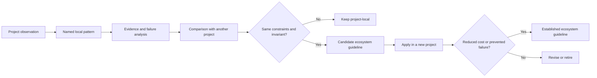

# Software Architecture Garden

The Software Architecture Garden is a project-by-project study of how our applications are actually built. It records solid patterns, emergent structures, deployment practices, architecture debt, and completed migrations from concrete repositories. Its purpose is not to make every repository look as if it followed a master plan. Its purpose is to identify the structures that repeatedly solve real problems, explain how those structures interact, and turn repeated success into ecosystem-wide guidance.

> [!summary]
> - Each project has its own directory and evidence-backed architecture analysis.
> - Patterns are described through concrete code paths, runtime flows, deployment artifacts, tests, and failure modes.
> - A pattern becomes an ecosystem guideline only after comparison across projects demonstrates that it is stable and reusable.

## Why this Garden exists

The go-go-golems ecosystem now contains enough applications that isolated project documentation is no longer sufficient. The same decisions recur: Go binaries embed SPAs, xgoja providers package JavaScript APIs, application state crosses JSON boundaries, Cobra and Glazed commands expose operational workflows, SQLite stores local state, Storybook provides visual review, and release pipelines coordinate multiple package ecosystems. When each project solves these questions independently, maintainers repeatedly rediscover the same constraints.

A normal project report explains one repository. The Architecture Garden asks a different set of questions:

1. Which structures in this repository are stable enough to name?
2. What problem does each structure solve?
3. Which other structures does it depend on?
4. What evidence shows that the pattern works?
5. What failure modes or maintenance costs accompany it?
6. Does another project implement the same pattern?
7. Is the pattern ready to become ecosystem guidance, or is it still local and experimental?

The Garden treats source code, build systems, release workflows, deployment topology, tests, documentation, and migration history as parts of architecture. Architecture is not limited to package diagrams.

## Project directory structure

Each analyzed project receives one directory:

```text
Research/Software Architecture Garden/
├── README.md
└── <project>/
    ├── README.md
    ├── 01 - Project Architecture Overview.md
    ├── 02 - <Pattern Study>.md
    ├── ...
    ├── 08 - Architecture Debt and Patterns Not to Repeat.md
    └── 09 - Candidate Ecosystem Guidelines.md
```

The directory is a study collection, not a dump of project reports. Every document should teach a coherent part of the system and link back to the project overview. Related project studies should link to each other when they reveal the same pattern.

## Pattern maturity vocabulary

Every pattern should carry one of five maturity labels.

| Label | Meaning | Required evidence |
|---|---|---|
| **Established** | The project uses the pattern successfully across important runtime paths. | Source, tests, and at least one active consumer or deployment. |
| **Emergent** | A useful structure exists but its boundary or contract is not yet explicit. | Multiple concrete occurrences and an explanation of the missing contract. |
| **Candidate ecosystem pattern** | The structure appears reusable and should be compared across repositories. | One strong implementation plus at least one likely comparison target. |
| **Architecture debt** | The structure adds cost, duplicates authority, or preserves obsolete behavior. | Concrete duplication, false contract, failure, or unused abstraction. |
| **Retired** | The pattern was replaced and should remain only as historical context. | Migration evidence and a named replacement. |

Maturity is not a quality ranking. An emergent pattern may be excellent but undocumented. A retired pattern may have been correct under earlier constraints. Architecture debt may contain a useful idea implemented at the wrong layer.

## The anatomy of a pattern study

A useful pattern document answers seven questions in a stable order.

### 1. What problem is being solved?

The opening section defines the actual engineering constraint. It avoids naming a pattern before explaining why the structure exists.

### 2. What is the concrete shape?

The document shows packages, interfaces, data structures, commands, build artifacts, or deployment resources. Diagrams and pseudocode should describe the real path, not a generic textbook variant.

### 3. How is it woven into the rest of the application?

A pattern rarely operates alone. A JSON protocol depends on schema ownership and versioning. An embedded SPA depends on the frontend build and asset serving. A DSL depends on runtime registration, declarations, transport, and a renderer. The interaction section is the core of the Garden.

### 4. Why does it work?

The document identifies the invariant or separation of responsibility that creates value. “There is an adapter” is not enough. The reader needs to understand what changing the adapter does not require changing.

### 5. What goes wrong?

Every study records failures observed in the project. A theoretical concern is labeled as a risk; it is not presented as a historical failure. Real failures include exact files, commands, payload shapes, or migration artifacts.

### 6. When should another project reuse it?

A reuse section states applicability and non-applicability. Patterns should not become default infrastructure merely because they are interesting.

### 7. What should become ecosystem guidance?

The conclusion extracts one or more candidate rules. These remain candidates until comparison with other projects confirms them.

## Evidence hierarchy

Pattern claims should be grounded in this order:

1. Runtime code and public interfaces.
2. Tests that assert behavior.
3. Active consumers and deployment configuration.
4. Build and release workflows.
5. Project design documents and implementation diaries.
6. Git history that explains migrations.
7. Comments and naming, used only when stronger evidence is absent.

A comment that says “temporary compatibility bridge” is evidence of intent, not evidence that the bridge is still temporary. Actual usage decides the classification.

## How patterns become ecosystem guidelines

A single implementation can produce a candidate. A guideline requires comparison.



The comparison step prevents accidental standardization. Two projects may use similar code for different reasons. The invariant matters more than the surface syntax.

## Analyzed projects

### rag-evaluation-system

[[Research/Software Architecture Garden/rag-evaluation-system/README|rag-evaluation-system]] is a useful starting point because it contains both strong boundaries and accumulated migration residue. Its Widget system demonstrates semantic authoring, typed lowering, JSON transport, adapter-based React rendering, generated runtime packaging, embedded frontend delivery, and dual Go/npm releases. It also demonstrates the cost of parallel generations, duplicate catalogs, raw escape hatches, and compatibility paths without retirement criteria.

### publish-vault

[[Research/Software Architecture Garden/publish-vault/README|publish-vault]] studies an application that turns an Obsidian vault directory into a self-hosted website. It is a useful second entry because it was not architected from a master plan yet produced clean, emergent structures: a two-phase load/read execution model, a single choke-point note map that makes exclusion propagate everywhere, an atomic snapshot swap with delayed cleanup for hot reload, and an embedded SPA with build-tag-controlled embedding. Its deployment topology — Go app plus Node SSR sidecar, two GHCR images, a GitOps target declaration, and a reusable release workflow — recurs across the ecosystem and is a candidate for established guidance. Its debt is concentrated in the absence of a general vault-scoped config file, the documented-subset limits of the ignore matcher, and inconsistent repo-root discovery.

### zitadel-go-test

[[Research/Software Architecture Garden/zitadel-go-test/README|zitadel-go-test]] studies a small server-rendered Go application whose important architecture lies at system boundaries. It covers OIDC identity projection, organization-bound authorization, PostgreSQL ownership, signed Stripe webhook projection, Vault/VSO secret delivery, privileged database bootstrap, Kustomize tenant overlays, immutable images, Argo reconciliation, and evidence-backed production acceptance. Its failures reveal reusable guidance about oversized stateless sessions, PostgreSQL `PUBLIC CONNECT`, top-level GitOps bootstrap, and direct cross-tenant negative testing.

### rag-ttc

[[Research/Software Architecture Garden/rag-ttc/README|rag-ttc]] studies a plain-Go RAG experiment laboratory. Its strongest patterns are the explicit separation of experiment policy from reusable mechanisms, bounded and budgeted execution with per-item durable recovery, experiment directories as result custody, typed domain interfaces with provider adapters, and zero-budget replay as a semantic-identity test. Its active simplification work also provides direct evidence for packaging code by semantic dependency rather than first use.

## Relationship to the existing knowledge base

The Architecture Garden complements existing notes rather than replacing them:

- Project maps such as [[Research/KB/Projects/rag-evaluation-system]] organize reports and capabilities.
- On-Ramps such as [[Research/KB/On-Ramp/go-cli-with-embedded-spa]] teach a reusable technology shape.
- Tribal entries describe established go-go-golems implementation rules.
- Fundamentals explain underlying theory.
- Garden studies show how several patterns combine inside one real application and provide evidence for promoting new Tribal guidance.

## Working rules

- Start from evidence and name the pattern afterward.
- Separate direct React component value from remote protocol value.
- Separate migration history from supported runtime behavior.
- Record deployment and release patterns alongside code patterns.
- Treat tests as architecture evidence because they reveal which contracts are protected.
- Keep failures and architecture debt visible; do not rewrite history into a clean-room narrative.
- Prefer hard evidence over line-count rhetoric. Size matters only when it corresponds to duplicated responsibility or maintenance cost.
- Promote patterns gradually: local observation, cross-project comparison, then ecosystem guideline.
