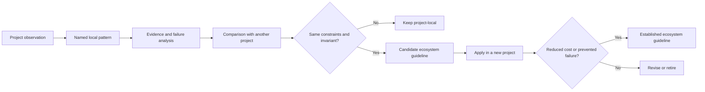

# Software Architecture Garden

The Software Architecture Garden is a project-by-project study of how our applications are actually built. It records solid patterns, emergent structures, deployment practices, architecture debt, and completed migrations from concrete repositories. Its purpose is not to make every repository look as if it followed a master plan. Its purpose is to identify the structures that repeatedly solve real problems, explain how those structures interact, and turn repeated success into ecosystem-wide guidance.

> [!summary]
> - Each project has its own directory and evidence-backed architecture analysis.
> - Patterns are described through concrete code paths, runtime flows, deployment artifacts, tests, and failure modes.
> - A pattern becomes an ecosystem guideline only after comparison across projects demonstrates that it is stable and reusable.

This index was revalidated on 2026-08-10 from committed vault base `b6b0ff1fed7c32075253e14a24acd703cbf16036` (`main`, `Add Researchctl Architecture Garden study`). The Ragkit and Ragopt entries were authored together in a working tree based on that commit and pin their target repositories separately; `repository_commit` records the analyzed base and does not claim that new working-tree entries existed in that commit.

## Why this Garden exists

The go-go-golems ecosystem now contains enough applications that isolated project documentation is no longer sufficient. The same decisions recur: Go binaries embed SPAs, xgoja providers package JavaScript APIs, application state crosses JSON boundaries, Cobra and Glazed commands expose operational workflows, SQLite stores local state, Storybook provides visual review, and release pipelines coordinate multiple package ecosystems. When each project solves these questions independently, maintainers repeatedly rediscover the same constraints.

A normal project report explains one repository. The Architecture Garden asks a different set of questions:

1. Which structures in this repository are stable enough to name?
2. What problem does each structure solve?
3. Which other structures does it depend on?
4. What evidence shows that the pattern works?
5. What failure modes or maintenance costs accompany it?
6. Does another project implement the same pattern?
7. Is the pattern ready to become ecosystem guidance, or is it still local and experimental?

The Garden treats source code, build systems, release workflows, deployment topology, tests, documentation, and migration history as parts of architecture. Architecture is not limited to package diagrams.

## Project directory structure

Each analyzed project receives one directory:

```text
Research/Software Architecture Garden/
├── README.md
└── <project>/
    ├── README.md
    ├── 01 - Project Architecture Overview.md
    ├── 02 - <Pattern Study>.md
    ├── ...
    ├── 08 - Architecture Debt and Patterns Not to Repeat.md
    └── 09 - Candidate Ecosystem Guidelines.md
```

The directory is a study collection, not a dump of project reports. Every document should teach a coherent part of the system and link back to the project overview. Related project studies should link to each other when they reveal the same pattern.

## Pattern maturity vocabulary

Every pattern should carry one of six maturity labels.

| Label | Meaning | Required evidence |
|---|---|---|
| **Established** | The project uses the pattern successfully across important runtime paths. | Source, tests, and at least one active consumer or deployment. |
| **Emergent** | A useful structure exists but its boundary or contract is not yet explicit. | Multiple concrete occurrences and an explanation of the missing contract. |
| **Candidate ecosystem pattern** | The structure appears reusable and should be compared across repositories. | One strong implementation plus at least one likely comparison target. |
| **Architecture debt** | The structure adds cost, duplicates authority, or preserves obsolete behavior. | Concrete duplication, false contract, failure, or unused abstraction. |
| **Retired** | The pattern was replaced and should remain only as historical context. | Migration evidence and a named replacement. |
| **Open correctness obligation** | The design promises a law that current implementation or tests do not fully establish. | The promised invariant, the concrete enforcement/test gap, and its operational consequence. |

Maturity is not a quality ranking. An emergent pattern may be excellent but undocumented. A retired pattern may have been correct under earlier constraints. Architecture debt may contain a useful idea implemented at the wrong layer.

## The anatomy of a pattern study

A useful pattern document answers seven questions in a stable order.

### 1. What problem is being solved?

The opening section defines the actual engineering constraint. It avoids naming a pattern before explaining why the structure exists.

### 2. What is the concrete shape?

The document shows packages, interfaces, data structures, commands, build artifacts, or deployment resources. Diagrams and pseudocode should describe the real path, not a generic textbook variant.

### 3. How is it woven into the rest of the application?

A pattern rarely operates alone. A JSON protocol depends on schema ownership and versioning. An embedded SPA depends on the frontend build and asset serving. A DSL depends on runtime registration, declarations, transport, and a renderer. The interaction section is the core of the Garden.

### 4. Why does it work?

The document identifies the invariant or separation of responsibility that creates value. “There is an adapter” is not enough. The reader needs to understand what changing the adapter does not require changing.

### 5. What goes wrong?

Every study records failures observed in the project. A theoretical concern is labeled as a risk; it is not presented as a historical failure. Real failures include exact files, commands, payload shapes, or migration artifacts.

### 6. When should another project reuse it?

A reuse section states applicability and non-applicability. Patterns should not become default infrastructure merely because they are interesting.

### 7. What should become ecosystem guidance?

The conclusion extracts one or more candidate rules. These remain candidates until comparison with other projects confirms them.

## Evidence hierarchy

Pattern claims should be grounded in this order:

1. Runtime code and public interfaces.
2. Tests that assert behavior.
3. Active consumers and deployment configuration.
4. Build and release workflows.
5. Project design documents and implementation diaries.
6. Git history that explains migrations.
7. Comments and naming, used only when stronger evidence is absent.

A comment that says “temporary compatibility bridge” is evidence of intent, not evidence that the bridge is still temporary. Actual usage decides the classification.

## How patterns become ecosystem guidelines

A single implementation can produce a candidate. A guideline requires comparison.



The comparison step prevents accidental standardization. Two projects may use similar code for different reasons. The invariant matters more than the surface syntax.

## Analyzed projects

### rag-evaluation-system

[[Research/Software Architecture Garden/rag-evaluation-system/README|rag-evaluation-system]] is a useful starting point because it contains both strong boundaries and accumulated migration residue. Its Widget system demonstrates semantic authoring, typed lowering, JSON transport, adapter-based React rendering, generated runtime packaging, embedded frontend delivery, and dual Go/npm releases. It also demonstrates the cost of parallel generations, duplicate catalogs, raw escape hatches, and compatibility paths without retirement criteria.

### Upwork Tracker

[[Research/Software Architecture Garden/upwork-tracker/README|Upwork Tracker]] studies a local-first marketplace evidence and application-workflow system. Its strongest patterns are immutable capture boundaries, reviewed ingestion plans, rebuildable remote projections separated from local workflow state, namespaced identity, a shared service behind CLI and REST adapters, an atomic human-confirmation write transaction, a generated xgoja host, and a WAL-safe backup design for operator-owned state. Its architecture debt is equally instructive: two ingestion semantics for one envelope, duplicated schema ownership, non-atomic general mutations, direct Widget mutations that bypass stable service policy, process-global Widget selection, a generic path that can record `submitted`, and incomplete eligibility checks in the dedicated confirmation path itself.

### publish-vault

[[Research/Software Architecture Garden/publish-vault/README|publish-vault]] studies an application that turns an Obsidian vault directory into a self-hosted website. It is a useful second entry because it was not architected from a master plan yet produced clean, emergent structures: a two-phase load/read execution model, a single choke-point note map that makes exclusion propagate everywhere, an atomic snapshot swap with delayed cleanup for hot reload, and an embedded SPA with build-tag-controlled embedding. Its deployment topology — Go app plus Node SSR sidecar, two GHCR images, a GitOps target declaration, and a reusable release workflow — recurs across the ecosystem and is a candidate for established guidance. Its debt is concentrated in the absence of a general vault-scoped config file, the documented-subset limits of the ignore matcher, and inconsistent repo-root discovery.

### zitadel-go-test

[[Research/Software Architecture Garden/zitadel-go-test/README|zitadel-go-test]] studies a small server-rendered Go application whose important architecture lies at system boundaries. It covers OIDC identity projection, organization-bound authorization, PostgreSQL ownership, signed Stripe webhook projection, Vault/VSO secret delivery, privileged database bootstrap, Kustomize tenant overlays, immutable images, Argo reconciliation, and evidence-backed production acceptance. Its failures reveal reusable guidance about oversized stateless sessions, PostgreSQL `PUBLIC CONNECT`, top-level GitOps bootstrap, and direct cross-tenant negative testing.

### devctl

[[Research/Software Architecture Garden/devctl/README|devctl]] studies a repository-local development-environment operator whose architecture is organized around durable evidence and reconciliation. It covers desired environment state, immutable service attempts, PID/start-token ownership, wrapper request/owner/ready/exit artifacts, a shared typed controller, raw streams plus sequenced JSONL journals, declarative NDJSON plugins, live-validated dynamic command injection, Glazed CLI and help contracts, and a three-view Bubble Tea client. Its review history exposes reusable rules about starting a complete environment before health evaluation, observing terminal artifacts directly, and preserving stronger evidence during reconciliation.

### rag-ttc

[[Research/Software Architecture Garden/rag-ttc/README|rag-ttc]] studies a plain-Go RAG experiment laboratory at the completed simplification boundary. Its consolidated study explains five larger systems: explicit experiment composition, bounded and recoverable expensive work, semantic identity with durable result custody, representation-centered retrieval, and validated provider integration. Real TTC workloads, controlled late failures, bounded OpenAI calls, and zero-work replay provide operational evidence for the candidate ecosystem rules.

### go-go-datadrop

[[Research/Software Architecture Garden/go-go-datadrop/README|go-go-datadrop]] studies a single-binary event store with a browser workbench, and is the first entry whose most transferable material is a **genre of test** rather than a runtime structure. Thirteen structural guards converged on one shape across three tickets: walk the source tree, assert an invariant, and carry an allow-list in which every exemption states its reason in a sentence. Its runtime patterns are a presentation protocol in which every visible object carries its verbs as serialisable data, a Redux store that is a factory with no module singleton so six independent instances can share a page, an enforced nine-layer import graph, and documentation that dispatches the product's own actions so it cannot rot. It is also the Garden's most useful comparison so far: it confirms four of `rag-evaluation-system`'s candidates independently, supplies a third occurrence of the embedded-SPA pattern after `publish-vault`, and splits `rag-ttc`'s "tests protect architectural invariants" into runtime and structural families that fail differently. It surfaced a live defect in shared infrastructure — `glazed`'s Cobra builder discards exit codes — filed as [glazed#611](https://github.com/go-go-golems/glazed/issues/611).

Its largest recorded debt, a hand-rolled CLI output layer in which eleven of nineteen verbs silently ignored their own `--output` flag, was **repaired in DATADROP-9** and the repair produced the entry's tenth document: a failure taxonomy for adopting a command framework, in which all four significant failures were silent — a credential printed by the framework's own debug flag, a streaming setting honoured by being ignored, three kinds of namespace collision, and an error path the framework terminates before the application sees it. That conversion also gave the structural-guard genre its first Go instances, which assert properties of an assembled command tree rather than of a source tree and so widen the pattern beyond the file walk it was first observed as.

### sessionstream

[[Research/Software Architecture Garden/sessionstream/README|sessionstream]] studies a reusable typed event kernel for session-scoped streaming applications. Commands enter host-owned handlers; canonical protobuf events feed independent UI and timeline projections; an append-only store supports replay and rebuild; and reconnecting WebSocket clients receive a declared snapshot ordinal and entity rows before buffered live observations. Transport ordering fences snapshot-before-live delivery, but the SQLite store reads its cursor and rows separately and therefore does not prove a database-consistent prefix cut under concurrent writes. The study connects these mechanisms to both Pattern Zoos and to devctl, Upwork Tracker, publish-vault, rag-ttc, rag-evaluation-system, go-go-datadrop, and zitadel-go-test. It proposes shared vocabulary for scope keys, intent values, canonical events, materialized entities, sequence coordinates, declared snapshot ordinals, projection checkpoints, and live suffixes, while recording open laws around per-session serialization, consistent SQLite cuts, stable redelivery identity, and atomic projection progress.

### Geppetto

[[Research/Software Architecture Garden/geppetto/README|Geppetto]] studies a provider-neutral LLM runtime organized around typed mutable turns, middleware-wrapped engines, an explicit host-owned tool interpreter, cancelable session executions, best-effort observations, final-turn materialization, deterministic profile resolution, and runtime-owner-safe Goja APIs. Host credentials remain Go-only, but direct `gp.agent().inference(settings).build()` bypasses the renewable source used by `gp.engine()`. The entry preserves the decisive non-equivalence between live events and durable event sourcing, and records open laws around credential-path domination, persistence outcome, retry safety, session linearization, snapshot isolation, and profile-store CAS.

### Pinocchio

[[Research/Software Architecture Garden/pinocchio/README|Pinocchio]] studies an application orchestration layer around Geppetto inference and Sessionstream persistence/projection/transport. Browser, JSONL/stdin RPC, and TUI/chat paths use the typed `chatapp` kernel; ordinary blocking and Goja paths compose directly over Geppetto plus Pinocchio bootstrap and do not traverse chat events/projections. Pinocchio delegates event append/replay and WebSocket protocol behavior to Sessionstream while retaining app policy, translation, route composition, and credential binding. The entry records behavior-incomplete commands, unenforced idempotency, absent route authorization, behavior-incomplete runtime identity, and unresolved profile-tool authority.

### Scraper

[[Research/Software Architecture Garden/scraper/README|Scraper]] studies SQLite-backed durable dependency-graph execution intended for DAGs, with strict filesystem manifest/schema/root admission, transactional queue/lease admission, heartbeat and recovery, lease-fenced store completion, JavaScript/HTTP runners, site-owned projections, and optional Sessionstream observations. Both Goja environments receive writable `scraper-db`, so admitted scripts can bypass store authority and lease fencing; manifest `modules` is not a capability allowlist. Runtime observations bracket activity rather than uniformly following transitions, are not workflow event-sourcing evidence, and released binaries do not include sites or the frontend.

### Researchctl

[[Research/Software Architecture Garden/researchctl/README|Researchctl]] studies a typed research graph and an immutable experiment laboratory whose central boundary is descriptor before authority, admitted evidence after effect. Trusted YAML/JSON/JavaScript plans remain data; an execute-mode host derives specification identity, separates replicates from retry attempts, mediates laboratory admission, verifies artifact bytes at admission, and closes terminal evidence. Trusted same-principal runners retain ambient filesystem, environment, and network authority outside the cooperative API/protocol. The entry also records the limits: read-write mode is not execution authority, events do not reconstruct run truth, terminal resume is not exactly-once admission, the workbench is unauthenticated local tooling, and neither artifacts nor analysis directories are behavior-complete release roots.

### Ragkit

[[Research/Software Architecture Garden/ragkit/README|Ragkit]] studies a reusable provider-neutral RAG kernel in which source chunks, searchable derivations, retrieval observations, and hydrated evidence remain distinct. Hydration resolves each selected hit's claimed chunk ID from caller-installed service chunks, while reranker and augmenter replacement text is discarded. Generic search-hit parent lineage and service-chunk corpus validity remain caller/adapter obligations. A second path separates semantic cache identity from worker/retry/admission policy, deduplicates only within one `MapCached`/`Run` invocation, commits successful items independently, and publishes verified content-addressed retrieval bundles. The entry explicitly does not turn those mechanisms into provider integration, run custody, cross-invocation or distributed exactly-once execution, source proof by bundle open alone, authorization, or a behavior-complete release.

### Ragopt

[[Research/Software Architecture Garden/ragopt/README|Ragopt]] studies an evidence-gated incumbent/challenger kernel. It validates a singleton mutable intervention under locked declared state, freezes exact candidate/suite/policy/snapshot inputs, commits product-native and common cell evidence at exact case/repeat/arm coordinates, preserves missing and failed pairs, and applies hard gates before cost preference. Its promotion plan always requires external human application. The entry keeps run occurrence, cell, repeat, native artifact, common outcome, gate decision, and promotion authority distinct; pins a current RAG-TTC consumer that composes Ragopt with Ragkit without merging authority; and records the absence of whole-run/multi-file atomicity, writer fencing, effect idempotency, scientific proof, authorization, and review/gate integration.

## Cross-correlation with the Pattern Zoos

The [[Transcripts/Research/09 - RAG-MATHS Pattern Zoo|RAG-MATHS Pattern Zoo]] and [[Transcripts/Research/10 - PBUI-MATHS Pattern Zoo Handbook|PBUI-MATHS Pattern Zoo]] state domain patterns as semantic objects and laws. The Garden supplies a different kind of evidence: concrete repositories, runtime paths, tests, deployments, migrations, and observed failures. A correlation below means that the implementation protects substantially the same invariant; it does not make differently scoped objects exact aliases.

| Garden finding | Evidence | Zoo relation | Strength |
|---|---|---|---|
| Identity is a deliberate scoped projection, not incidental serialization. | [[Research/Software Architecture Garden/rag-ttc/03 - Reproducible Experiment Custody and Semantic Identity#2. Deterministic digest mechanisms|rag-ttc identity]], [[Research/Software Architecture Garden/upwork-tracker/02 - Capture Ingestion Projection and Local State#Canonical identity|Upwork Tracker identity]], [[Research/Software Architecture Garden/zitadel-go-test/README|zitadel-go-test]] | [[Transcripts/Research/09 - RAG-MATHS Pattern Zoo#Pattern 1 — Semantic Identity as Explicit Projection|RAG 1]]; [[Transcripts/Research/10 - PBUI-MATHS Pattern Zoo Handbook#Pattern 1 — Semantic Reference|PBUI 1]] | Strong |
| Serializable intent crosses boundaries while trusted hosts own effects. | [[Research/Software Architecture Garden/rag-evaluation-system/04 - Serializable Actions and Host Owned Effects#Action flow|rag-evaluation-system actions]], [[Research/Software Architecture Garden/go-go-datadrop/02 - The Presentation Protocol#4. Why it works|go-go-datadrop verbs]] | [[Transcripts/Research/10 - PBUI-MATHS Pattern Zoo Handbook#Pattern 5 — Command as Data|PBUI 5]]; [[Transcripts/Research/10 - PBUI-MATHS Pattern Zoo Handbook#Pattern 8 — Serializable Semantic Contract|PBUI 8]] | Strong; not evidence for RAG's multiple-interpreter plan law |
| Immutable lifecycle evidence accumulates separately from replay records and current projections. | [[Research/Software Architecture Garden/upwork-tracker/03 - SQLite Evidence and Workflow Ledger#Append-only proposal evidence|proposal evidence]], [[Research/Software Architecture Garden/upwork-tracker/03 - SQLite Evidence and Workflow Ledger#Durable idempotency|durable idempotency]] | [[Transcripts/Research/09 - RAG-MATHS Pattern Zoo#Pattern 7: Append-Only Events, Pure Reducers, and Observable Idempotence|RAG 7]] | Strong at the submission boundary |
| One typed canonical event feeds independent live and durable projections, and stored events can rebuild timeline state. | [[Research/Software Architecture Garden/sessionstream/README#Mathematical and computer-science foundations|sessionstream foundations]] | [[Transcripts/Research/09 - RAG-MATHS Pattern Zoo#Pattern 7: Append-Only Events, Pure Reducers, and Observable Idempotence|RAG 7]]; [[Transcripts/Research/10 - PBUI-MATHS Pattern Zoo Handbook#Pattern 8 — Serializable Semantic Contract|PBUI 8]] | Strong for typed append/replay and projection; bus-redelivery idempotence remains emergent |
| Stable service identity resolves through a revisioned current pointer to immutable attempt evidence. | [[Research/Software Architecture Garden/devctl/02 - Durable State Process Identity and Wrapper Evidence#Environment state is not run history|devctl state]] | [[Transcripts/Research/10 - PBUI-MATHS Pattern Zoo Handbook#Pattern 11 — Authoritative State, Resolver, and Revision|PBUI 11]] | Strong |
| Cached discovery is advisory; a small live boundary revalidates module identity, capability, and schema. | [[Research/Software Architecture Garden/devctl/05 - Declarative Plugins and Validated Dynamic Commands#Catalog as discovery cache|devctl plugin validation]] | [[Transcripts/Research/09 - RAG-MATHS Pattern Zoo#Pattern 10 — Large Producers, Small Trusted Validators / Proof-Carrying Artifacts|RAG 10]]; [[Transcripts/Research/10 - PBUI-MATHS Pattern Zoo Handbook#Pattern 7 — Contextual Applicability and Dispatch|PBUI 7]]; [[Transcripts/Research/10 - PBUI-MATHS Pattern Zoo Handbook#Pattern 9 — Registry and Module Boundary|PBUI 9]] | Strong for admission and registry laws; not a formal proof certificate |
| One transaction combines request replay, revision claim, transition, evidence, and audit—but audited eligibility and adapter dominance are incomplete. | [[Research/Software Architecture Garden/upwork-tracker/05 - Proposal Lifecycle and Human Submission Boundary#Dedicated confirmation transaction|confirmation transaction]], [[Research/Software Architecture Garden/upwork-tracker/05 - Proposal Lifecycle and Human Submission Boundary#Critical finding UT-P0-001: generic submitted transition bypass|generic bypass]], [[Research/Software Architecture Garden/upwork-tracker/05 - Proposal Lifecycle and Human Submission Boundary#Critical finding UT-P0-002: incomplete dedicated confirmation validation|incomplete validation]] | [[Transcripts/Research/10 - PBUI-MATHS Pattern Zoo Handbook#Pattern 14 — Transactional Interaction and Evidence|PBUI 14]]; [[Transcripts/Research/09 - RAG-MATHS Pattern Zoo#Pattern 9: Constraint-First Decisions and Partial Preference|RAG 9]] | Positive transaction shape; negative constraint-dominance evidence |
| Readers observe one complete snapshot while publication atomically changes the active pointer and delays old-epoch cleanup. | [[Research/Software Architecture Garden/publish-vault/README|publish-vault]] | [[Transcripts/Research/09 - RAG-MATHS Pattern Zoo#Pattern 11 — Immutable Release as Synchronization Root|RAG 11]] | Strong for synchronization; no claim about behavior-complete RAG release identity |
| A reconnecting client receives a declared snapshot ordinal and entity rows before buffered/live observations; the transport fence is ordered, but the SQLite reads do not prove one coherent prefix cut. | [[Research/Software Architecture Garden/sessionstream/README#4. Snapshots as cuts in the prefix order|sessionstream snapshot analysis]] | [[Transcripts/Research/09 - RAG-MATHS Pattern Zoo#Pattern 11 — Immutable Release as Synchronization Root|RAG 11]]; [[Transcripts/Research/10 - PBUI-MATHS Pattern Zoo Handbook#Pattern 11 — Authoritative State, Resolver, and Revision|PBUI 11]] | Partial: snapshot-before-live ordering is established; database-consistent cut remains open |
| Runtime state is instance-scoped rather than process-global. | [[Research/Software Architecture Garden/go-go-datadrop/README|go-go-datadrop]] | [[Transcripts/Research/10 - PBUI-MATHS Pattern Zoo Handbook#Pattern 10 — Scoped Runtime and Context|PBUI 10]] | Strong |
| Tenant authority is enforced across application and infrastructure boundaries; adapter-local authorization is insufficient. | [[Research/Software Architecture Garden/zitadel-go-test/README|zitadel-go-test]], [[Research/Software Architecture Garden/upwork-tracker/05 - Proposal Lifecycle and Human Submission Boundary#Critical finding UT-P0-001: generic submitted transition bypass|Upwork bypass]] | [[Transcripts/Research/09 - RAG-MATHS Pattern Zoo#Pattern 12 — Authorization Dominates Disclosure|RAG 12]] | Generalized positive analogue plus concrete counterexample |
| Run custody retains configuration, inputs, per-unit observations, status, and results under one coordinate. | [[Research/Software Architecture Garden/rag-ttc/03 - Reproducible Experiment Custody and Semantic Identity#3. The run directory|rag-ttc run custody]] | [[Transcripts/Research/09 - RAG-MATHS Pattern Zoo#Pattern 8: Exact Experimental Coordinates and Explicit Coupling|RAG 8]] | Partial: coordinate custody only; coupling and estimand laws unverified |
| Canonical experiment descriptors project to specification identity while replicate and retry-attempt coordinates remain distinct. | [[Research/Software Architecture Garden/researchctl/README#Mathematical and computer-science foundations|Researchctl identity and coordinates]] | [[Transcripts/Research/09 - RAG-MATHS Pattern Zoo#Pattern 1 — Semantic Identity as Explicit Projection|RAG 1]]; [[Transcripts/Research/09 - RAG-MATHS Pattern Zoo#Pattern 8: Exact Experimental Coordinates and Explicit Coupling|RAG 8]] | Strong: the projection and coordinate separation are enforced; runner binary, project revision, and external state remain outside specification identity |
| Trusted JavaScript produces plan data while an execute-mode host and sink own execution admission, laboratory ordering, validation, and terminal evidence; trusted runners retain ambient OS effect authority. | [[Research/Software Architecture Garden/researchctl/README#Concrete `experiment run-plan` trace|Researchctl run-plan trace]] | [[Transcripts/Research/09 - RAG-MATHS Pattern Zoo#Pattern 4 — Typed Plans and Multiple Interpreters|RAG 4]]; [[Transcripts/Research/09 - RAG-MATHS Pattern Zoo#Pattern 10 — Large Producers, Small Trusted Validators / Proof-Carrying Artifacts|RAG 10]] | Strong: descriptor interpretation and worker admission match; validation establishes contract and custody, not scientific truth |
| Immutable per-attempt event rows have host-assigned order and terminal fencing, but they do not reconstruct run truth. | [[Research/Software Architecture Garden/researchctl/README#3. Attempt events form ordered words|Researchctl attempt event words]] | [[Transcripts/Research/09 - RAG-MATHS Pattern Zoo#Pattern 7: Append-Only Events, Pure Reducers, and Observable Idempotence|RAG 7]] | Partial: append order and terminal fencing are established; pure reduction, global causality, and command redelivery idempotence are absent |
| Provider-neutral turns and provider-specific wire values meet at fixed boundary adapters. | [[Research/Software Architecture Garden/geppetto/README#Architecture and runtime path|Geppetto provider path]] | [[Transcripts/Research/10 - PBUI-MATHS Pattern Zoo Handbook#Pattern 6 — Explicit Translation|PBUI 6]] | Adjacent: concrete adaptation exists, but not PBUI's semantic-reference graph, path provenance, selection, or coherence laws |
| One library observation stream is mapped through named, tested adapters into app-owned chat events and browser projection mutations. | [[Research/Software Architecture Garden/pinocchio/README#Architecture and runtime path|Pinocchio runtime path]] | [[Transcripts/Research/10 - PBUI-MATHS Pattern Zoo Handbook#Pattern 6 — Explicit Translation|PBUI 6]] | Adjacent: concrete adaptation exists, but not PBUI's semantic-reference graph, path provenance, selection, or coherence laws |
| Store completion APIs fence current-lease acceptance, while writable engine SQL and earlier site/network effects can bypass or escape that fence. | [[Research/Software Architecture Garden/scraper/README#Architecture debt and open laws|Scraper authority and external-effect gap]] | [[Transcripts/Research/10 - PBUI-MATHS Pattern Zoo Handbook#Pattern 14 — Transactional Interaction and Evidence|PBUI 14]]; [[Transcripts/Research/09 - RAG-MATHS Pattern Zoo#Pattern 7: Append-Only Events, Pure Reducers, and Observable Idempotence|RAG 7]] | Negative: concrete bypass and repeatable effects show that store transactions do not imply authority domination, global atomicity, or observable idempotence |
| Search derivations may determine selection, while hydration resolves selected hit chunk IDs from caller-installed chunks and reranker/augmenter text cannot replace them. | [[Research/Software Architecture Garden/ragkit/README#1. Exact-source lineage and authority rebound|Ragkit source authority]] | [[Transcripts/Research/09 - RAG-MATHS Pattern Zoo#Pattern 2 — Entity–Derivation–Observation Separation|RAG 2]] | Strong for object separation: documents/chunks, derivations, retrieval observations, and evidence remain distinct; generic hit-parent lineage, corpus validity, citation entailment, and truth remain external |
| `RunConfig` plus suite/policy/snapshot/case/repeat/arm cell keys preserve paired evidence, and identity/hard/target/regression constraints dominate cost preference. | [[Research/Software Architecture Garden/ragopt/README#3. Exact evaluation coordinates form a finite product|Ragopt coordinates]], [[Research/Software Architecture Garden/ragopt/README#6. Feasibility precedes preference|Ragopt gates]] | [[Transcripts/Research/09 - RAG-MATHS Pattern Zoo#Pattern 8: Exact Experimental Coordinates and Explicit Coupling|RAG 8]]; [[Transcripts/Research/09 - RAG-MATHS Pattern Zoo#Pattern 9: Constraint-First Decisions and Partial Preference|RAG 9]] | Strong: `RunConfig` binds `CandidateDigest` while each cell carries `CandidateID`; repeat is not retry, and a pass is not scientific or promotion authority |

The Garden also exposes patterns not yet represented cleanly by either zoo: structural guard tests, simultaneous raw and structured evidence, wrapper-owned process evidence, reconciliation before mutation, and explicit human-confirmation boundaries. These should remain extension candidates rather than being forced into a merely similar chapter. In particular, a PBUI occurrence is not a transport IR node, a RAG entity–derivation–observation graph is not a capture/projection ownership split, ordinary Go experiment control flow is not a typed plan with multiple interpreters, a dependency graph is not a binding graph, and a registry entry never grants execution authority by itself.

## Relationship to the existing knowledge base

The Architecture Garden complements existing notes rather than replacing them:

- Project maps such as [[Research/KB/Projects/rag-evaluation-system]] organize reports and capabilities.
- On-Ramps such as [[Research/KB/On-Ramp/go-cli-with-embedded-spa]] teach a reusable technology shape.
- Tribal entries describe established go-go-golems implementation rules.
- Fundamentals explain underlying theory.
- Garden studies show how several patterns combine inside one real application and provide evidence for promoting new Tribal guidance.

## Working rules

- Start from evidence and name the pattern afterward.
- Separate direct React component value from remote protocol value.
- Separate migration history from supported runtime behavior.
- Record deployment and release patterns alongside code patterns.
- Treat tests as architecture evidence because they reveal which contracts are protected.
- Keep failures and architecture debt visible; do not rewrite history into a clean-room narrative.
- Prefer hard evidence over line-count rhetoric. Size matters only when it corresponds to duplicated responsibility or maintenance cost.
- Promote patterns gradually: local observation, cross-project comparison, then ecosystem guideline.
