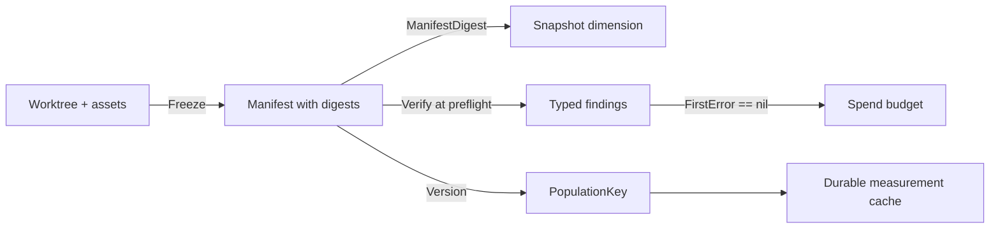

# Frozen Instruments and Self-Digesting Preflight

Three repositories independently decided that an experiment's measuring apparatus — golden sets, prompt assets, provider profiles, and the harness's own source code — must be digest-identified and verified before any provider call is spent. CoinVault pins seventeen files including its judge implementation and refuses to run when any byte drifts. rag-ttc records the SHA-256 of five of its own source files as locked snapshot dimensions. Ragopt keeps two digests of every gate policy, one over the exact bytes and one over the parsed meaning. None of these implementations shares code with the others, and none states precisely what a passing check proves.

This research project answers that question and extracts the shared mechanism into a reusable package. The answer has a sharp negative half: a digest-verified preflight proves that the *worktree* matched the frozen apparatus at one instant. It does not prove the *binary* was built from that worktree, does not bind any read that happens after the preflight instant, and constrains accident, never an adversary. Making those limits explicit is as valuable as the mechanism itself, because the failure mode of instrument freezing is not drift going undetected — it is a passing check being read as a stronger claim than it makes.

> [!summary]
> - The freeze law: a passing preflight at time $t$ excludes exactly the executions in which the apparatus present in the worktree at $t$ differs from the frozen record; everything after $t$ is the run's own obligation.
> - Two lock modes exist and must stay distinct: subset locks (these files must match; others are ignored) for harness source inside a large repository, and sealed roots (this directory must contain nothing unlocked) for input bundles.
> - Byte digests and semantic digests are the same mechanism at different congruences: a semantic digest is a byte digest of extractor-normalized content. rag-ttc's selected-profile digest and Ragopt's semantic policy digest are both instances, which lets one API serve both.
> - Version-keyed population invalidation (the `judgePromptVersion` discipline) is a disjointness theorem: cached measurement populations produced by different instrument versions can never collide because the version is a coordinate of every cache key.
> - The deepest gap is worktree/binary skew: digesting `knowledge_ragopt.go` on disk proves nothing about the compiled code executing the digest check. VCS build stamps narrow the gap; only embedding or hermetic builds close it.
> - The `instrumentlock` prototype (spec directory, 13 passing tests) implements manifests with roles, self-inclusion, extractors, sealed roots, typed findings, population keys, and advisory build binding, with mutation tests for drift, deletion, injection, and stale version keys.

## 1. Research question

```text
What exactly does a digest-verified preflight establish, against which
threat model, and what is the minimal reusable API for
  (a) freezing an apparatus, including the harness's own source,
  (b) verifying the freeze before any spend, and
  (c) deriving cache keys that make instrument-version populations disjoint?
```

The question matters because all three source repositories treat preflight passage as the license to spend provider budget and to compare results across runs. If the license claims more than the check establishes, cross-run comparisons inherit an unexamined assumption. The project states the claim precisely, builds the smallest API that preserves it, and marks every place where the claim ends and an obligation begins.

## 2. Evidence: three implementations of one idea

### 2.1 CoinVault: the seventeen-file source lock and eight-dimension preflight

`validateGECRagoptEnvironment` (`cmd/coinvault/cmds/knowledge_ragopt.go:1253-1436`) runs before any provider call and checks, in order: exact profile slugs for application, answer, and judge (`:1257-1265`); the *resolved* runtime identity — engine, reasoning effort, reasoning summary — rather than slugs alone (`:1266-1275`); eight snapshot dimensions against runtime-observed values, including source roles recomputed from the opened bundle (`:1293-1307`); the corpus digest of the opened index bundle (`:1312-1314`); byte digests of the lexical manifest and the vectors SQLite (`:1315-1326`); mechanism-specific asset digests in both arms (`:1327-1428`); the Ragopt dependency revision parsed out of `go.mod` against the `ragopt_revision` dimension (`:1429-1431`, `:1438-1477`); and finally the source lock (`:1432-1434`).

`validateGECRagoptSourceLock` (`:1565-1612`) strict-decodes a one-document YAML (`gec-ragopt-source-lock/v1`), cross-checks the recorded `ragopt_commit` against the snapshot revision (`:1587-1589`), confines every path to the repository root (`:1594-1599`), re-hashes every file (`:1600-1606`), and — notably — refuses to run when the lock carries a non-empty `implementation_note` (`:1608-1610`): a provisional freeze is not a freeze. The lock in `configs/ragopt/default-results-8-v7/shared/source-lock.yaml` pins seventeen files: the analyst prompt pack, the judge (`internal/knowledge/judge.go`), the retrieval service and tool, the runner, the harness commands themselves (`knowledge_ragopt.go` and its trace/contract/treatment siblings), the retrieval golden set, and `go.mod`/`go.sum`.

The self-reference is the striking part: `knowledge_ragopt.go` digests `knowledge_ragopt.go`. Section 3.3 examines what that does and does not achieve.

### 2.2 rag-ttc: self-digesting snapshot dimensions and a selected-subtree digest

`validateI5Environment` (`cmd/rag-ttc/cmds/tooleval/ragopt.go:147-202`) performs the same move with a different encoding: instead of a separate lock file, the digests live in the candidate snapshot's `dimensions` map. Five of them are source files — the evaluation dataset, the judge, the native adapter, the ragopt adapter (again: the file digesting is among the files digested), and the runner types (`:164-178`). Two more bind the index bundle: the manifest file digest and the corpus digest (`:186-200`).

The eighth is the most interesting: `profileDefinitionDigest` (`:208-236`) digests not `profiles.yaml` but the YAML subtree of the one selected provider profile. The code comment states the design intent exactly: "locks the selected TTC composite rather than every profile in the project registry. Unrelated comparison profiles can be added without changing an I5 candidate, while any edit to the selected composite remains part of the frozen environment identity" (`:204-207`). This is a *semantic* digest — a digest over normalized, selected content — living beside byte digests in the same dimensions map.

### 2.3 Ragopt: the byte/semantic digest split, named

Ragopt makes the distinction rag-ttc discovered operationally into an explicit type. `policy.Document` carries both `Digest` and `ByteDigest` (`pkg/policy/policy.go:52-57`); `Load` computes the byte digest over the raw file and the semantic digest over the canonical JSON encoding of the *validated, parsed* policy (`:94-100`, `:118-128`). Two runs whose policy files differ in comments or key order share a semantic digest but not a byte digest. Ragopt binds execution to exact bytes and identifies decision semantics by meaning — both, deliberately.

`candidate.DigestSnapshot` (`pkg/candidate/digest.go:17-43`) shows the canonicalization discipline that makes semantic digests trustworthy: asset lists are sorted by logical name before encoding, so declaration order cannot change identity, while paths, digests, sizes, and dimensions all participate.

### 2.4 The cache-key discipline

CoinVault's judge cache key is `execution.NewKey(step, judgePromptVersion, {model, prompt})` (`internal/knowledge/judge.go:309-314`), with the package comment stating the law informally: "a changed prompt version is a new population" (`:294-295`). This is instrument freezing applied to a *derived population* rather than a file: the cached judgments are only meaningful relative to the judge prompts that produced them, so the prompt version is a coordinate of every key, and bumping it makes the old population unreachable rather than merely deprecated.

## 3. The freeze law, precisely

### 3.1 Definitions

Let $\Sigma$ be filesystem states, $\sigma_t : \mathit{Path} \rightharpoonup \mathit{Bytes}$ the state at time $t$. Let $X : \mathit{Name} \rightharpoonup (\mathit{Bytes} \rightharpoonup \mathit{Bytes})$ be a family of deterministic extractors, with the raw extractor $x_\varepsilon = \mathrm{id}$ for unnamed entries. Let $H$ be SHA-256, assumed collision-resistant. A manifest is

$$
M = (\mathit{instrument}, v, E, S, D)
$$

with entries $E \subseteq \mathit{Role} \times \mathit{Path} \times \mathit{Digest} \times \mathbb{N} \times \mathit{Name}_\varepsilon$, sealed roots $S \subseteq \mathit{Path}$, and declared dimensions $D : \mathit{Key} \rightharpoonup \mathit{Value}$. Let $\mathit{obs}_t$ be the runtime-observed dimension valuation at $t$.

Define the pass predicate:

$$
\mathrm{Pass}(M, \sigma_t, \mathit{obs}_t) \iff
\begin{cases}
\forall (r, p, d, n, x) \in E:\ H(X_x(\sigma_t(p))) = d \ \land\ |X_x(\sigma_t(p))| = n \\
\forall s \in S:\ \mathrm{files}(\sigma_t, s) \subseteq \mathrm{paths}(E) \\
\forall k \in \mathrm{dom}(D):\ \mathit{obs}_t(k) = D(k) \\
\mathit{provisional}(M) = \varepsilon
\end{cases}
$$

### 3.2 What passing excludes

**Freeze law.** If $\mathrm{Pass}(M, \sigma_t, \mathit{obs}_t)$ holds, then — up to hash collision — the apparatus content readable at $t$ under $M$'s entries equals the content present when `Freeze` recorded $M$, no unlocked file exists inside any sealed root at $t$, and every declared environmental expectation held at $t$.

Contrapositively: the preflight excludes exactly the class of executions in which the worktree-at-$t$ apparatus differs from the frozen apparatus. That is the entire claim. Three consequences follow.

**Attribution corollary.** Two runs are apparatus-comparable if and only if both preflights passed against manifests with equal `ManifestDigest`. This is why the lock's own digest should be recorded as a snapshot dimension: the experiment identity then binds the lock, and the lock binds the apparatus, closing the regress at exactly one level. CoinVault approximates this by carrying the lock file as a candidate-bundle locked asset (so Ragopt's asset digesting covers it); rag-ttc achieves it by putting digests directly into dimensions that `DigestSnapshot` covers.

**TOCTOU boundary.** Nothing relates $\sigma_{t'}$ for $t' > t$ to $\sigma_t$. Every read the run performs after preflight is outside the law. The three repositories handle this differently for data and code: Ragopt copies data inputs into run-owned custody at bind time (moving subsequent data reads inside a *second* frozen boundary), while harness source is read only by the compiler, which leads to the next point.

**Worktree/binary skew.** The digest check evaluates $\sigma_t$; behavior is determined by the compiled image $\beta = \mathrm{compile}(\sigma_{t_{\mathrm{build}}})$. The law proves $\sigma_t = \sigma_{\mathrm{freeze}}$ and says nothing about $\beta$'s relation to either. A binary built before an edit, executed in a worktree reverted after that edit, passes every source digest while running code the lock never measured. The self-digest of `knowledge_ragopt.go` is therefore best understood as *worktree drift detection*, not code identity: it catches the common accident (someone edited the harness between freeze and run) and misses the rarer one (stale binary). Go's VCS build stamps (`vcs.revision`, `vcs.modified` from `debug.ReadBuildInfo`) narrow the gap — a stamped binary can attest which commit built it and whether the build tree was dirty — but a dirty-at-build binary is unattestable by digests, and only hermetic, stamped builds or `go:embed`-ing the assets close the gap fully. The prototype exposes this as an advisory `VerifyBuildRevision` check rather than pretending the file digests already cover it.

### 3.3 What passing never claimed

- **Adversary resistance.** Freeze and verify run as the same principal that can rewrite both files and manifest. The lock constrains drift and accident. Authorization and tamper evidence require signing or a second principal, both out of scope and both explicitly not claimed by any of the three source implementations.
- **Semantic stability.** Byte inequality does not imply behavioral difference; the lock is deliberately stricter than behavior, because "provably identical bytes" is checkable and "behaviorally equivalent" is not.
- **Post-preflight stability.** See the TOCTOU boundary. A cheap strengthening exists that none of the three repositories implements: run `Verify` again after the campaign completes. Pass-before and pass-after brackets the whole run — the apparatus can then have differed mid-run only if it was mutated and byte-identically restored, which moves the residual risk from "any drift" to "deliberate revert," a materially smaller class. Section 8 records this as the first recommended extension.

### 3.4 Population-key disjointness

Let $K(\mathit{step}, v, m, p) = H(\mathrm{json}(\mathit{step}, v, m, H(\mathrm{json}(p))))$ as implemented by `PopulationKey`. JSON encoding is injective on the tuple (fields are named and ordered), so for $v_1 \neq v_2$, the pre-images differ and — up to collision — $K(\cdot, v_1, \cdot, \cdot) \cap K(\cdot, v_2, \cdot, \cdot) = \emptyset$ over all payloads. Cached populations from different instrument versions are disjoint *by construction*: no flush, no epoch table, no operational step that can be forgotten. This is the formal content of "a changed prompt version is a new population," and it is the reason the version string must be bumped on *any* semantic change to the instrument — an unbumped semantic change silently merges two populations, which is precisely the failure the mechanism exists to make impossible.

## 4. Guarantee taxonomy

| Evidence | Establishes | Does not establish |
|---|---|---|
| Entry digest match at preflight | Worktree content under locked paths equaled the frozen content at $t$ (collision-resistance assumed) | Content at any later read; binary provenance; behavioral meaning of the bytes |
| Sealed-root walk | No unlocked file existed inside the sealed directory at $t$ | Nothing about directories outside $S$; nothing about later injection |
| Dimension comparison | Declared environmental expectations held at $t$ as observed by the harness's own resolvers | That the declared set is complete; that resolvers themselves are honest (they are harness source — lock them) |
| Extractor-normalized digest | The *selected/normalized* content was stable; unrelated sibling content may drift freely | That the extractor's notion of "selected" matches the runtime's notion of "used" — an extractor/consumer mismatch is undetectable by the lock alone |
| Provisional check | The freeze was declared final by its author | Review quality; that finality was warranted |
| Dependency-pin cross-check (`go.mod` revision vs dimension) | The declared dependency revision matches the build manifest at $t$ | That the module cache content matches the revision (Go's own sumdb covers that); vendored or replaced modules |
| `ManifestDigest` recorded in snapshot | The lock itself is bound by the experiment identity chain | Anything about content the lock does not list |
| Population key | Version-disjoint cache populations; identical coordinates reproduce identical keys | That version strings track semantic change — a human obligation |
| Build binding (advisory) | Stamped revision and build-tree dirtiness of the running binary | Anything, when unstamped; source identity, when built dirty |

Every "does not establish" cell is an obligation that must live somewhere else: in run-owned input custody, in build tooling, in review practice, or in an explicitly accepted residual risk. A verification report should say which.

## 5. API design: the `instrumentlock` package

The prototype lives at [[Research/Software Architecture Garden/Research/evaluation-loops/specs/instrumentlock/instrumentlock.go|specs/instrumentlock]], a standalone Go module with no dependencies outside the standard library.

```go
type Manifest struct {
    APIVersion  string            // "instrument-lock/v1"
    Instrument  string
    Version     string            // participates in PopulationKey
    Provisional string            // non-empty blocks verification
    Entries     []Entry           // role, path, digest, size, extractor
    SealedRoots []string
    Dimensions  map[string]string // declared environmental expectations
}

func Freeze(root string, m Manifest, x map[string]Extractor) (Manifest, error)
func Verify(root string, m Manifest, opts VerifyOptions) []Finding
func FirstError(findings []Finding) error
func ManifestDigest(m Manifest) (string, error)

func NewPopulationKey(step, instrumentVersion, model string, payload any) (PopulationKey, error)
func (k PopulationKey) Key() string
```



### 5.1 Findings, not booleans

All three source implementations fail fast on the first drift. That is correct as a gate but wrong as a diagnostic: an operator whose freeze drifted in four files learns about them one run at a time. `Verify` returns every finding, typed (`drift`, `missing`, `untracked`, `path-escape`, `dimension-drift`, `provisional`, `extractor-missing`, `undeclared-dimension`), each carrying path, role, expected, and observed values; `FirstError` restores fail-fast for gating callers. Findings also carry an `Advisory` flag: an observed dimension the freeze never declared is a coverage gap worth surfacing, not a failure — reporting it as advisory keeps the strict gate strict while making the freeze's blind spots visible. The same channel carries the unstamped-binary case: absence of build evidence is reported as absence, never as a pass.

### 5.2 Subset locks and sealed roots are different promises

CoinVault's source lock is a *subset* promise: these seventeen files must match; the repository's other thousands of files are irrelevant. Ragopt's input manifest is a *completeness* promise: the run's input directory contains exactly the declared inputs and nothing else. Collapsing the two into one mode produces either uselessly noisy locks (sealing a whole repository) or silently weak ones (a "sealed" bundle that ignores injected files). The manifest therefore carries both: `Entries` is always a subset promise; `SealedRoots` adds completeness for named directories. The mutation test injects an unlocked file into a sealed root and requires an `untracked` finding — the case CoinVault's lock cannot express and Ragopt's bind step handles with separate bespoke code.

### 5.3 Extractors unify byte and semantic digests

rag-ttc's selected-profile digest and Ragopt's semantic policy digest are the same operation: hash a deterministic normalization of the bytes instead of the bytes. The API models this as a named `Extractor` per entry; the raw case is the identity extractor. Two consequences are deliberate. First, the manifest stores only the extractor's *name* — the extractor's *code* is harness source and must itself appear as a `RoleHarnessSource` entry, or the normalization can drift invisibly; the package documents this as a freeze obligation rather than pretending to enforce it. Second, verification without the registered extractor fails with a distinct `extractor-missing` finding instead of falling back to raw bytes, because a silent fallback would convert a semantic lock into a byte lock and report spurious drift — or worse, spurious stability. The prototype's test freezes a selected JSON subtree, mutates an unrelated sibling (must pass), mutates the selected subtree (must drift), and verifies without the extractor (must fail explicitly).

### 5.4 Roles are for the trust ledger, not the mechanics

Verification treats every entry identically; `Role` (`harness-source`, `prompt-asset`, `dataset`, `dependency-pin`, `configuration`) exists so findings and reports can say *what kind* of apparatus drifted and so a reviewer can audit coverage ("does this instrument lock its own source? its datasets?") without reading paths. This mirrors the Garden's evidence-hierarchy practice: the mechanism is uniform, the meaning is labeled.

### 5.5 The provisional blocker is kept

CoinVault's `implementation_note` rejection looks like a minor detail and is not: it encodes that *a freeze under construction must not gate spend*, and it makes "we froze it" an explicit authored transition rather than a side effect of a file existing. The manifest keeps a `Provisional` field with identical semantics.

### 5.6 What the package refuses to include

No YAML front end (products own their surface formats; the kernel is canonical JSON with unknown-field rejection). No signing (a different threat model; would falsely suggest adversary resistance). No file watching or continuous verification (the law is instant-bounded; pretending otherwise widens the claim). No automatic version bumping (deciding what counts as a semantic instrument change is judgment; the package makes the consequence of the judgment safe, not the judgment itself).

## 6. Prototype results

> [!success] instrumentlock prototype — 2026-08-14
> `GOWORK=off go vet ./...` and `GOWORK=off go test ./... -count=1` pass on the standalone module with 13 tests:
>
> ```text
> --- PASS: TestFreezeVerifyRoundTrip
> --- PASS: TestDriftedFileIsRejected
> --- PASS: TestMissingFileIsRejected
> --- PASS: TestExtraFileInSealedRootIsRejected
> --- PASS: TestStaleVersionKeyCannotSeeOldPopulation
> --- PASS: TestPopulationKeyCanonicalizesMapPayloads
> --- PASS: TestProvisionalManifestIsRejected
> --- PASS: TestPathEscapeIsRejected
> --- PASS: TestDimensionDriftAndUndeclared
> --- PASS: TestExtractorSelectsSubtree
> --- PASS: TestSelfInclusionFreezesOwnSource
> --- PASS: TestSaveLoadRoundTripAndUnknownFieldRejection
> --- PASS: TestVerifyBuildRevisionIsAdvisoryWhenUnstamped
> PASS  ok  instrumentlock  0.006s
> ```
>
> Mutation sensitivity is covered by construction: a drifted locked file, a deleted locked file, an injected file inside a sealed root, and a stale instrument version key are each rejected with the specific typed finding (`drift` with both digests, `missing`, `untracked` with the injected path, and disjoint cache keys respectively). The self-inclusion test freezes the package's own `instrumentlock.go`, `populationkey.go`, and `go.mod` and verifies them, demonstrating the self-digesting pattern the research documents.
>
> These are unit tests of a prototype. They establish the API's behavior on the tested cases, not adoption fitness, performance under thousand-entry manifests, or the correctness of any product's migration.

Formal verification beyond this was considered and declined for this project: the invariants at stake (hash equality, set inclusion, key disjointness) are one-step properties with no concurrency or state evolution, exactly the class where Go tests are the cheapest sufficient oracle. TLA+ and Lean effort belongs to projects 04 and 05, whose laws are temporal and algebraic respectively.

## 7. Adoption plan

### Phase A — CoinVault source-lock adapter

Write a `gec-ragopt-source-lock/v1 → Manifest` converter (roles inferable: prompt-pack templates are `prompt-asset`, `*.go` are `harness-source`, `data/knowledge-eval.yaml` is `dataset`, `go.mod`/`go.sum` are `dependency-pin`). Replace the body of `validateGECRagoptSourceLock` with `Verify` + `FirstError`, preserving exact error behavior for the existing callers, and surface full findings under `--preflight-only`. The `implementation_note` blocker maps to `Provisional`. Nothing in the bundle format changes; this is an internal refactor with a golden test against the current seventeen-file lock.

### Phase B — rag-ttc dimension-digest adapter

`validateI5Environment`'s five source digests and the profile digest become one manifest with a registered `selected-profile` extractor (the existing `profileDefinitionDigest` body, unchanged, now named and itself lockable). The digests remain published as snapshot dimensions for compatibility — `ManifestDigest` becomes a sixth dimension, giving rag-ttc the regress closure it currently lacks (its adapter file digest covers the digesting code, but nothing binds the *set* of digested files).

### Phase C — Ragopt kernel integration

Offer the manifest as an optional first-class run input: `RunConfig` gains an `InstrumentLockDigest`, and `prepareRequest` verifies the lock alongside its existing suite/candidate digest re-checks. This is the natural home because Ragopt already owns the frozen-input transition; products then declare apparatus in one vocabulary instead of three. Sealed roots cover candidate bundle `shared/` directories, closing the injected-file case no current implementation checks.

### Phase D — population keys at the flowkit boundary

`NewPopulationKey` replaces the ad-hoc `execution.NewKey(step, judgePromptVersion, …)` call sites, with `Manifest.Version` as the instrument version so the freeze and the cache population share one version authority. This is deliberately breaking for the cache (all keys change once): the migration *is* a population bump, which is the honest reading of adopting a new keying discipline.

### Phase E — build binding for release campaigns

Stamped release binaries verify `vcs.revision` against the lock's recorded base commit and refuse dirty-at-build stamps for promotion-grade campaigns; developer and test runs keep the advisory behavior. This phase is last because it changes build/release practice, not code.

## 8. Decision records

### DR-1: Return all findings; make fail-fast a projection

- **Context:** All three sources fail on first drift; operators fix drift one run at a time.
- **Decision:** `Verify` returns the complete typed finding set; `FirstError` restores gating semantics.
- **Consequence:** Diagnostic completeness without weakening the gate; callers cannot accidentally ignore findings because the gate helper is one call.
- **Status:** implemented in prototype.

### DR-2: Keep subset locks and sealed roots as distinct modes

- **Context:** Harness source needs a subset promise; input bundles need a completeness promise.
- **Decision:** `Entries` is always subset; `SealedRoots` opts named directories into completeness.
- **Consequence:** The injected-file failure class becomes checkable without sealing whole repositories.
- **Status:** implemented in prototype.

### DR-3: Semantic digests are extractor-normalized byte digests

- **Context:** rag-ttc and Ragopt independently invented normalization-before-hashing.
- **Decision:** One `Extractor` mechanism serves both; manifests record extractor names; extractor code must be self-locked as harness source; missing extractors fail explicitly rather than falling back to raw bytes.
- **Consequence:** One API, one law, and a documented obligation instead of an invisible one.
- **Status:** implemented in prototype; the self-locking obligation is documentation, not enforcement.

### DR-4: Advisory findings exist and never gate

- **Context:** Undeclared observed dimensions and unstamped binaries are evidence gaps, not violations.
- **Decision:** `Advisory` findings surface gaps; `FirstError` skips them.
- **Consequence:** The gate stays strict while blind spots stay visible; the temptation to widen a pass into a stronger claim is countered in the report itself.
- **Status:** implemented in prototype.

### DR-5: Post-flight verification is the recommended TOCTOU narrowing

- **Context:** The freeze law is instant-bounded; none of the three repositories re-verifies after the campaign.
- **Decision:** Recommend bracketing (verify at preflight and after finalization, recording both outcomes in the run) rather than any continuous-watch mechanism.
- **Consequence:** Residual apparatus risk shrinks from "any post-preflight drift" to "mutated and byte-identically restored mid-run" at the cost of one cheap re-verify; the bracket's second half must be recorded even when it fails, because a failed post-flight invalidates attribution, not the run's raw evidence.
- **Status:** proposed; not yet implemented in any consumer.

## 9. Risks

- **Version strings that lag semantics.** Population disjointness is only as good as the human discipline of bumping `Version` on semantic instrument change. Mitigation: derive the version's *sufficiency* check from the lock — if any `RoleHarnessSource` or `RolePromptAsset` digest changes without a version change between two freezes of the same instrument, tooling can flag the pair. This cross-freeze check is future work; the prototype only makes bumping safe, not mandatory.
- **Lock sprawl.** Locking too much turns every commit into drift and pushes teams toward provisional-forever locks, which the blocker then converts into a standing failure. The role vocabulary helps reviewers keep locks minimal-but-covering; no mechanical answer exists.
- **False confidence.** The named risk of the whole pattern: a passing preflight being cited as if it bound the run, the binary, or an adversary. The guarantee-taxonomy table exists to be pasted into verification reports; the package's doc comment carries the same ledger so the claim travels with the code.
- **Extractor/consumer divergence.** A lock can freeze the selected profile while the runtime reads a different one. The lock cannot see this; only dimension checks against *runtime-resolved* identity (CoinVault's resolved-engine check is the model) cover it. The API keeps `Dimensions` alongside entries precisely so both kinds of evidence live in one verified document.

## 10. Open questions

1. Should `ManifestDigest` exclude `Provisional` so that finalizing a freeze does not change its identity, or include it so that provisional and final freezes are never confusable? The prototype includes it; the adoption phases should revisit with real bundles.
2. Can the cross-freeze version-sufficiency check (DR-5's sibling: harness digest changed ⟹ version must change) be made a `Freeze`-time error given access to the previous manifest, and does that belong in the kernel or in product tooling?
3. Is a two-principal deployment (freeze signed in CI, verified at run) worth specifying now, or does it wait for the first campaign whose threat model includes tampering?
4. Should sealed roots support declared exclusions (e.g., `*.tmp`), or does any exclusion pattern reintroduce exactly the injected-file blindness sealing exists to remove?
5. How should the bracket (preflight + post-flight) outcomes be recorded in Ragopt's run store so that a failed post-flight marks attribution-invalid without destroying evidence — a new terminal status, or a summary field?

## 11. Working rules

- State the freeze law's time bound in every report: a pass binds the worktree at the preflight instant, nothing later.
- Lock the harness's own source, the extractors, and the lock-consuming code; record `ManifestDigest` in the experiment's snapshot identity.
- Keep subset and sealed promises distinct; seal input bundles, subset-lock source.
- Fail on provisional freezes; finalize explicitly.
- Bump the instrument version on any semantic instrument change; treat cache-key migration as a deliberate population bump.
- Report advisory findings; never let them gate, never let them vanish.
- Treat worktree/binary skew as unresolved unless builds are stamped and clean; say so in the report when they are not.
- Do not present any of this as adversary resistance.

## Related notes

- [[Research/Software Architecture Garden/Research/evaluation-loops/README|Evaluation-Loop Formalization Research]] — the research family index and overlap analysis
- [[Research/Software Architecture Garden/coinvault/README|CoinVault]] — the seventeen-file source lock and eight-dimension preflight in production shape
- [[Research/Software Architecture Garden/rag-ttc/optimization/01 - Optimization Judging and Improvement Loops - Overview|rag-ttc optimization loops]] — the self-digesting five-file environment freeze
- [[Research/Software Architecture Garden/ragopt/README|Ragopt]] — the byte/semantic digest split and frozen-input custody this package would slot into
- [[Research/Software Architecture Garden/sessionstream/designs/research/02 - Constraining the Go Binary - Layered Refinement from Proved Kernels to Executables|Sessionstream — Constraining the Go Binary]] — the guarantee-taxonomy and trust-ledger conventions this document follows
