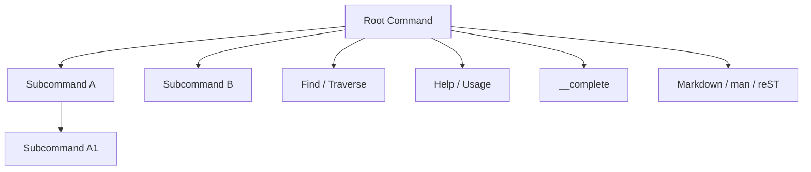

# Command Graph as Semantic Authority

## Why this note exists

Large command-line applications often accumulate several almost-equivalent descriptions of themselves: one parser tree, one help catalog, one completion schema, one documentation hierarchy, and sometimes a separate validation model. Cobra avoids most of that duplication by making `*Command` nodes and their parent/child links the model that all those interpreters inspect.

> [!summary]
> **Pattern:** represent the external interface as one semantic graph, then make dispatch, assistance, validation, completion, and documentation interpret that graph rather than maintain sibling schemas.
>
> **Law:** if two framework features need to agree about command identity or scope, they should derive that answer from the same command graph.

## Concrete shape

`Command` owns both semantic data and topology. It carries `Use`, aliases, descriptions, argument validators, lifecycle functions, flags, completion functions, annotations, parent/children links, context, and I/O overrides. `AddCommand` assigns parent links and appends children. `Find` and `Traverse` route argv through those links. Help walks `Commands()`. Completion finds the target command through the root graph. Markdown generation recursively walks `cmd.Commands()` and emits links to parent and child commands.



The graph is therefore more than routing state. It is the executable schema for the CLI.

## Behavioral contract

### Guarantees supported by the implementation

- A child added through `AddCommand` receives a parent pointer; `Root`, `Parent`, `CommandPath`, `VisitParents`, and inherited policy all use that topology.
- Dispatch (`Find`/`Traverse`) and completion use the same command identities and aliases.
- Availability rules (`Hidden`, `Deprecated`, runnable/subcommands) influence both user-facing help and completion.
- Documentation generation walks the same `Command` nodes and uses runtime methods such as `UseLine`, `NonInheritedFlags`, and `InheritedFlags`.

### Non-guarantees

- The graph is not immutable. Commands may be added and removed and defaults are synthesized during execution/help/completion.
- The graph is not an authorization model. Discovering or routing a command says nothing about whether a caller is permitted to perform its effect.
- The graph is not a concurrency-safe dynamic registry by contract. Mutation should have a clear owner and normally finish before concurrent execution.

## Why it works

The important separation is **model versus interpreters**. Cobra centralizes facts that must agree — command identity, hierarchy, flags, descriptions, availability — and lets multiple features interpret those facts differently.

That creates a strong anti-drift invariant:

```text
command declared once
    -> routable by dispatch
    -> visible according to availability rules
    -> completable according to the same hierarchy
    -> documentable from the same hierarchy
```

A command cannot accidentally exist in the parser but be absent from the generated docs because somebody forgot to add it to a second catalog; the generator discovers it from the graph.

## Failure modes and tricky details

### Mutation can have semantic side effects

Because the graph is mutable, an interpreter may temporarily alter it. Completion installs `__complete` and removes it when it is not actually being invoked. Default help and completion commands are also created lazily. The pattern therefore requires ownership discipline: one authority does not imply immutability.

### Caches follow topology

Cobra caches derived values such as local/inherited flag sets and command padding. Mutation code must invalidate or recompute those derived views. Reusing this pattern elsewhere means derived caches need explicit invalidation rules.

### One model does not mean one concern

The `Command` struct is intentionally broad. A smaller system may prefer a pure declarative model plus executor state rather than storing runtime context and streams on the same object. The transferable law is shared semantic authority, not necessarily Cobra's exact aggregate type.

## Testing and evidence

`command_test.go` executes real command trees in process and checks child routing, aliases, context propagation, unknown-command behavior, and display behavior. `completions_test.go` checks that hidden and deprecated commands are omitted and that traversal semantics affect completion. `doc/md_docs.go` walks the same command tree to produce Markdown.

The evidence is therefore spread across independent interpreters rather than a single comment claiming they agree.

## Applicability

Reuse this pattern when several tools must agree on one hierarchical interface: CLI routers, RPC method catalogs, workflow command graphs, UI action trees, plugin command systems, or operational consoles.

Do not reuse the exact mutable aggregate when the interface is security-sensitive and requires immutable signed schemas, when independently deployed components cannot share one model, or when dynamic concurrent registration is itself a first-class requirement.

## Candidate ecosystem guidance

> **Keep one semantic authority for any externally visible interface whose dispatch, validation, assistance, completion, and documentation must agree. Add new interpreters before adding new copies of the schema.**

## Evidence and references

- `command.go`: `Command`, `AddCommand`, `Find`, `Traverse`, availability rules, help/usage and inherited behavior.
- `completions.go`: completion resolves commands through the root graph and derives candidates from command metadata.
- `doc/md_docs.go`: Markdown documentation recursively traverses `Command` nodes and runtime flag views.
- `command_test.go` and `completions_test.go`: executable evidence for routing and completion semantics.
