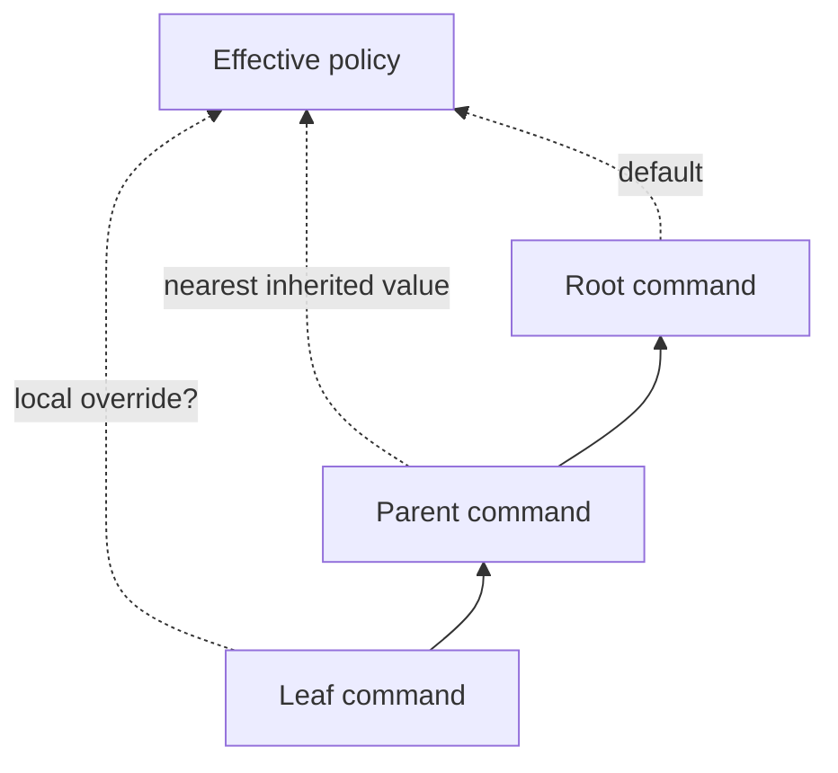

# Hierarchical Policy Inheritance with Local Shadowing

## Why this note exists

Hierarchical interfaces need defaults that travel downward without making every leaf repeat configuration. They also need a way for a leaf to take control locally. Cobra implements that relation repeatedly: persistent flags flow to descendants, streams fall back through parents, help/usage functions and templates are resolved upward, error prefixes inherit, and normalization can be propagated to children.

> [!summary]
> **Pattern:** resolve policy at the nearest scope that defines it; otherwise walk toward the root. Preserve local ownership by excluding a shadowed ancestor value from the inherited view.
>
> **Law:** `effective(child, key) = local(child, key)` when locally defined; otherwise use the nearest applicable ancestor value.

## Concrete shape

The clearest instance is flags. A command owns local and persistent flag sets. `updateParentsPflags` visits parents and accumulates their persistent flags. `mergePersistentFlags` combines current persistent flags and parent persistent flags into the effective set. `InheritedFlags` excludes any parent flag whose name is locally present, so a child can shadow an inherited name.

The same resolution shape appears outside flags:

- `getOut`, `getErr`, and `getIn` use a local stream if present, otherwise recurse to the parent, then fall back to process defaults.
- `UsageFunc`, `HelpFunc`, and their templates recurse to parents when a command has no local override.
- `ErrPrefix` inherits upward.
- a global normalization function can be installed on a command and propagated to children.

## Why it works

The pattern separates **where policy is declared** from **where it is consumed**. A root can establish application-wide conventions while subtrees and leaves retain explicit control.

For flags, the distinction among `LocalFlags`, `PersistentFlags`, and `InheritedFlags` is especially important. Tooling can explain not only the effective option set but also its provenance. Cobra's default usage output exploits this distinction by showing local `Flags` separately from inherited `Global Flags`.

## Behavioral contract

### Guarantees

- Persistent flags on ancestors become available to descendants.
- A local flag with the same name prevents the ancestor flag from appearing in the descendant's inherited set.
- I/O overrides can be placed at an ancestor and used by descendants that do not override them.
- Help/usage customization can be scoped to a subtree by placing it on an ancestor.

### Non-guarantees

- Inheritance is not isolation. A broad persistent flag can unintentionally affect a large subtree.
- A parent-owned writer or other mutable object is still shared state; inheritance does not clone values.
- Package-global Cobra settings are outside this hierarchy and therefore cannot be locally shadowed per command tree.

## Failure modes and tricky details

### Accidental scope widening

A convenient root persistent flag becomes part of every descendant's effective namespace. This can produce collisions or make a lower-level command appear to support a concept it does not meaningfully use.

### Shadowing changes provenance

A child flag with the same name as a persistent ancestor is local, not inherited. Tools that flatten flags without preserving provenance can misdescribe where the behavior comes from.

### Global state bypasses the pattern

Settings such as `EnablePrefixMatching` and `EnableTraverseRunHooks` are package globals. They demonstrate the boundary of the pattern: hierarchical policy is strongest when configuration belongs to the graph or executor rather than the process.

## Testing and evidence

Cobra's tests explicitly verify that a child sees an ancestor persistent flag as inherited while a locally defined flag of the same name is not included in `InheritedFlags`. Tests also verify normalization propagation to inherited sets. Execution helpers place output and error buffers on the root and observe descendant behavior through those inherited streams.

## Applicability

Reuse this pattern for hierarchical routers, configuration trees, policy scopes, nested workflows, UI component trees, and plugin namespaces where defaults should travel downward but local ownership matters.

Avoid implicit inheritance for security authority, billing/tenant identity, or other high-risk values where an explicit handoff is easier to audit. In those cases, requiring a child to name its authority source can be safer than nearest-ancestor lookup.

## Candidate ecosystem guidance

> **When configuration follows a hierarchy, expose local, inherited, and effective views separately. Let descendants shadow defaults deliberately, and keep process-global state out of the hierarchy unless global scope is truly the contract.**

## Evidence and references

- `command.go`: local/persistent/inherited flag sets, parent flag merging, stream inheritance, help/usage/template inheritance, error-prefix inheritance, normalization propagation.
- `command_test.go`: inherited flag shadowing and normalization tests; root-owned test streams used through command execution.
