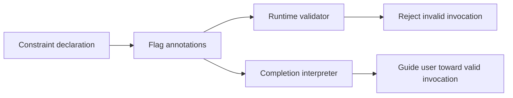

# Constraint Metadata Drives Validation and Completion

## Why this note exists

A cross-field rule is often implemented twice: once as a runtime error check and again as UI or completion logic that tries to keep users from constructing the invalid state. Those copies drift. Cobra's flag groups show a stronger design: encode the relationship as annotations on the flags, then let runtime validation and shell completion interpret the same metadata.

> [!summary]
> **Pattern:** represent a constraint as schema metadata when more than one interpreter needs to understand it.
>
> **Law:** validation and assistance should consume the same declaration of the relationship, even when they produce different behavior.

## Concrete shape

Cobra exposes three group declarations:

- `MarkFlagsRequiredTogether(a, b, ...)`: if any member is set, all members must be set;
- `MarkFlagsOneRequired(a, b, ...)`: at least one member must be set;
- `MarkFlagsMutuallyExclusive(a, b, ...)`: at most one member may be set.

Each method records the group as an annotation on every participating flag. The annotation stores the member names rather than embedding a callback.

`ValidateFlagGroups` scans flags, reconstructs group state from those annotations, and runs the relevant law. It sorts group keys and error details to keep output deterministic for tests and scripts.

`enforceFlagGroupsForCompletion` scans the same annotations but interprets them as assistance policy:

- once one flag in a required-together group is present, the remaining members are marked required so completion proposes them;
- if no flag in a one-required group is present, members are marked required for completion;
- once a mutually exclusive member is present, the other members are hidden from completion.

## Why it works

The metadata captures the **relationship**, not one presentation of the relationship. Validation asks “is the current assignment legal?” Completion asks “which next assignments remain legal or required?” Both questions are projections of the same constraint graph.

This design prevents a common failure: runtime adds a new rule but completion continues suggesting combinations that runtime rejects.

## Behavioral contract

### Guarantees

- Constraint declarations fail fast if a named flag does not exist when the group is marked.
- Persistent and inherited flags can participate in groups when all members are visible on the invoked command.
- Validation considers a group only when all named flags are defined in the effective flag set.
- Deterministic sorting makes the first reported group/error stable.
- Completion reads the same group annotations and adjusts suggestions accordingly.

### Non-guarantees

- The annotation strings are not a general theorem prover. They encode three finite group relations.
- Completion guidance is not validation. A user can still type an invalid combination manually; runtime enforcement remains authoritative.
- Mutating flags to guide completion can affect the in-memory model for that completion execution. Reusers should decide whether assistance interpreters should mutate schema state or return a derived view.

## Failure modes and tricky details

### Duplicate constraint logic outside metadata

If application code separately checks equivalent relations in `PreRunE` or `RunE`, the schema again has two authorities. Prefer attaching reusable declarative constraints to the model and reserve callbacks for rules that truly require dynamic state.

### Partial visibility

Cobra intentionally ignores a group if all its members are not present on the invoked command. That avoids enforcing a relation whose vocabulary is incomplete, but it means inherited/local scoping determines whether the constraint exists at a particular node.

### Constraint assistance needs monotonic reasoning

Completion can safely hide a mutually exclusive peer after one member is chosen because that choice narrows the legal set. More complex constraints may require a solver or a non-mutating candidate filter rather than simple flag annotations.

## Testing and evidence

`flag_groups_test.go` exercises passing and failing required-together, one-required, and mutually-exclusive groups, including persistent and inherited flags and deterministic first-error behavior. `completions_test.go` separately tests completion behavior for grouped flags. This is important evidence: the reuse of metadata is behavioral, not merely structural.

## Applicability

Reuse this pattern for forms, CLI schemas, configuration editors, IDE completion, API request builders, policy consoles, and workflow designers where the same constraints must drive both rejection and guidance.

Do not force dynamic business rules into static metadata when validity depends on remote state, authorization, time, or side effects. In those cases, retain a runtime authority and expose a clearly weaker advisory interpreter.

## Candidate ecosystem guidance

> **When validation and assistance must agree, store the invariant as data and give each feature an interpreter. Keep rejection authoritative; let completion or UI guidance be a projection of the same law.**

## Evidence and references

- `flag_groups.go`: group annotations, validation, deterministic ordering, and completion enforcement.
- `flag_groups_test.go`: cross-flag validation including inherited/persistent flags.
- `completions_test.go`: completion behavior for constrained flag groups.
