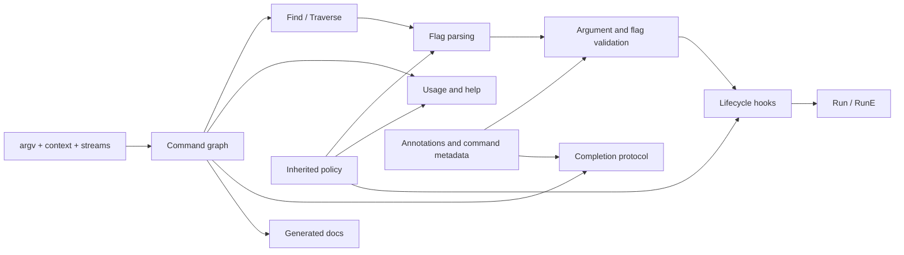

# Architecture Garden — Cobra

Cobra is a Go library for building hierarchical command-line applications. Its most reusable architectural lesson is not the syntax of `cobra.Command`; it is the decision to make one mutable command graph the semantic authority for dispatch, flags, validation, help, completion, context propagation, and generated documentation.

> [!summary]
> - **Command graph as semantic authority**: the same tree drives routing, help, completion, validation, and docs.
> - **Hierarchical policy inheritance with local shadowing**: persistent flags, streams, templates, error behavior, and normalization can flow down the tree while children retain explicit override points.
> - **Staged command execution pipeline**: resolve → parse → validate arguments → run inherited/local pre-hooks → validate flag contracts → execute → run post-hooks.
> - **Late defaults with user override**: help/version/completion commands and flags are synthesized as late as practical and only when the application has not supplied them.
> - **Constraint metadata drives validation and completion**: annotations encode cross-flag laws once, then runtime validation and completion both interpret them.
> - **Hidden protocol commands for interactive tooling**: shell completion is exposed through an internal command protocol rather than a separate executable or duplicated parser.
> - **Injectable process boundaries for deterministic tests**: args, context, stdin, stdout, and stderr are properties of the command graph, allowing in-process execution tests.
> - **Generate documentation from the runtime model**: Markdown generation walks the same command graph and inherited/local flag model used at runtime.

## Snapshot identity and evidence

| Field | Value |
|---|---|
| Repository | `spf13/cobra` |
| Branch | `main` |
| Commit | `adbc8813901bba65827259daa8e22ff94ec1f30e` |
| Commit subject | `fix: resolve macOS test link failure and update lint rules (#2429)` |
| Primary implementation | `command.go`, `completions.go`, `flag_groups.go`, `args.go` |
| Primary tests | `command_test.go`, `completions_test.go`, `flag_groups_test.go` |

This study uses runtime code and tests as primary evidence. It treats comments and public documentation as intent unless behavior is also present in code or tests.

## Architecture in one diagram

The important boundary is that routing, user assistance, validation, and tooling do not maintain independent copies of the CLI schema. They inspect one graph.

## Candidate common vocabulary

| Proposed term | Cobra shape | Invariant |
|---|---|---|
| **Semantic command graph** | `Command.parent`, `Command.commands`, `AddCommand`, `Find`, `Traverse` | One structural model defines command identity and parent/child scope for every interpreter of the CLI. |
| **Inherited policy** | persistent flags, streams, help/usage funcs/templates, error prefix, normalization | A descendant resolves policy locally first and then upward, unless a local value shadows the ancestor. |
| **Execution pipeline** | `execute` / `ExecuteC` | Effects occur only after routing, parsing, argument validation, lifecycle preparation, and flag-contract validation. |
| **Late synthesized default** | help/version flags, help/completion commands | Framework defaults are added only when needed and do not overwrite an explicit application definition. |
| **Constraint metadata** | flag annotations | Cross-field laws are represented as data attached to the schema rather than buried only in execution code. |
| **Interactive protocol command** | `__complete`, `__completeNoDesc` | External interactive tooling queries the live command model through a machine protocol whose parsing semantics match normal execution. |
| **Injectable process boundary** | `SetArgs`, `SetIn`, `SetOut`, `SetErr`, `ExecuteContext` | The CLI can be executed as an in-process component without depending directly on global process I/O for tests and embedding. |
| **Model-derived documentation** | `doc.GenMarkdown*` | Documentation traverses the same runtime command and flag model instead of a second hand-maintained schema. |

## Pattern studies

1. [[Research/Software Architecture Garden/cobra/01 - Command Graph as Semantic Authority|Command Graph as Semantic Authority]] — the central pattern.
2. [[Research/Software Architecture Garden/cobra/02 - Hierarchical Policy Inheritance with Local Shadowing|Hierarchical Policy Inheritance with Local Shadowing]] — scoped defaults without flattening the tree.
3. [[Research/Software Architecture Garden/cobra/03 - Staged Command Execution Pipeline|Staged Command Execution Pipeline]] — explicit ordering of parse, validation, hooks, and effects.
4. [[Research/Software Architecture Garden/cobra/04 - Late Defaults with User Override|Late Defaults with User Override]] — framework convenience without stealing application authority.
5. [[Research/Software Architecture Garden/cobra/05 - Constraint Metadata Drives Validation and Completion|Constraint Metadata Drives Validation and Completion]] — one declaration, multiple interpreters.
6. [[Research/Software Architecture Garden/cobra/06 - Hidden Protocol Commands for Interactive Tooling|Hidden Protocol Commands for Interactive Tooling]] — reuse the executable as the completion server.
7. [[Research/Software Architecture Garden/cobra/07 - Injectable Process Boundaries for Deterministic Tests|Injectable Process Boundaries for Deterministic Tests]] — command graphs as embeddable/testable components.
8. [[Research/Software Architecture Garden/cobra/08 - Generate Documentation from the Runtime Model|Generate Documentation from the Runtime Model]] — operational schema and documentation stay coupled.

## Maturity assessment

| Pattern | Maturity | Evidence / limitation |
|---|---|---|
| Command graph as semantic authority | **Established** | Core routing, help, completion, docs, and tests all consume `Command`. |
| Hierarchical policy inheritance with local shadowing | **Established** | Flags, streams, help/usage functions/templates, error prefix, and normalization walk parents; tests cover inherited flag shadowing. |
| Staged command execution pipeline | **Established** | `execute` has explicit ordered stages and tests cover hook behavior. |
| Late defaults with user override | **Established** | Default help/version/completion structures are initialized lazily and presence-checked. |
| Constraint metadata drives validation and completion | **Established** | Flag group annotations feed both `ValidateFlagGroups` and completion enforcement, with tests for both families. |
| Hidden protocol commands for interactive tooling | **Candidate ecosystem pattern** | Strong implementation and extensive shell-completion tests; applicability extends beyond CLIs to self-query protocols. |
| Injectable process boundaries for deterministic tests | **Established** | Public setters plus in-process test helpers exercise routing, output, errors, and context. |
| Generate documentation from the runtime model | **Candidate ecosystem pattern** | Markdown/man/reST generators walk runtime commands; reuse is broad but generators remain CLI-specific. |
| Global compatibility switches and registries | **Architecture debt / compatibility tradeoff** | `EnablePrefixMatching`, `EnableCaseInsensitive`, `EnableTraverseRunHooks`, template funcs, initializers/finalizers, and completion function registry are process-global. |
| Finalization as cleanup guarantee | **Open correctness obligation / non-guarantee** | Cobra finalizers run via `defer` after `preRun`, but command lifecycle post-hooks are not equivalent to `defer`; errors in `RunE` skip `PostRun*` and `PersistentPostRun*`. |

## Architecture debt and patterns not to repeat

### Process-global extension state

Cobra exposes several package globals: behavior switches, template functions, initializer/finalizer slices, and the flag-completion registry. This is effective for backwards compatibility and simple applications but weakens instance isolation. A library borrowing Cobra's patterns should prefer graph-owned or executor-owned configuration unless process-global semantics are intentional.

### Post-hooks are not `finally`

`postRun()` finalizers are deferred after initialization, but `PostRunE`, `PostRun`, `PersistentPostRunE`, and `PersistentPostRun` are ordinary later stages. If argument validation, required-flag validation, flag-group validation, or `RunE` returns an error, those lifecycle post-hooks do not run. Do not use them as a general resource-release guarantee.

### Mutable model requires ownership discipline

Cobra's graph is intentionally mutable: commands can be added/removed, flags merged, default commands synthesized, and completion enforcement can mark flags required/hidden. This makes composition easy, but concurrent mutation and execution are not a general contract. Build or mutate the graph under a clear owner, then execute it under a stable topology.

## Candidate ecosystem guidelines

1. **Use one semantic model for all interpreters of an interface.** Dispatch, validation, assistance, completion, and docs should consume the same schema whenever their semantics must agree.
2. **Make inheritance explicit and shadowable.** Parent defaults are useful only if descendants can locally override them and tooling can distinguish local from inherited state.
3. **Represent cross-field constraints as metadata when multiple interpreters need them.** Validation, completion, forms, docs, and editors can then consume one law.
4. **Install framework defaults late and presence-check them.** Convenience should not outrank application intent.
5. **Expose interactive tooling as a protocol over the live model when possible.** Avoid writing a second parser for completion or introspection.
6. **Inject process boundaries.** Arguments, context, input, output, and errors should be controllable without mutating OS globals.
7. **Generate reference documentation from executable schema, but document non-guarantees separately.** Model-derived docs prevent drift; they do not explain operational failure semantics by themselves.
8. **Do not confuse lifecycle hooks with guaranteed cleanup.** If cleanup must happen on every exit path, use a construct with `finally`/`defer` semantics around the effect-owning scope.

## Index

See [[Research/Software Architecture Garden/cobra/Index of Design Patterns|Index of Design Patterns]] for reader-memory lookup and [[Research/Software Architecture Garden/cobra/Index of Design Patterns - Rationale|its rationale]] for why each term was included.
