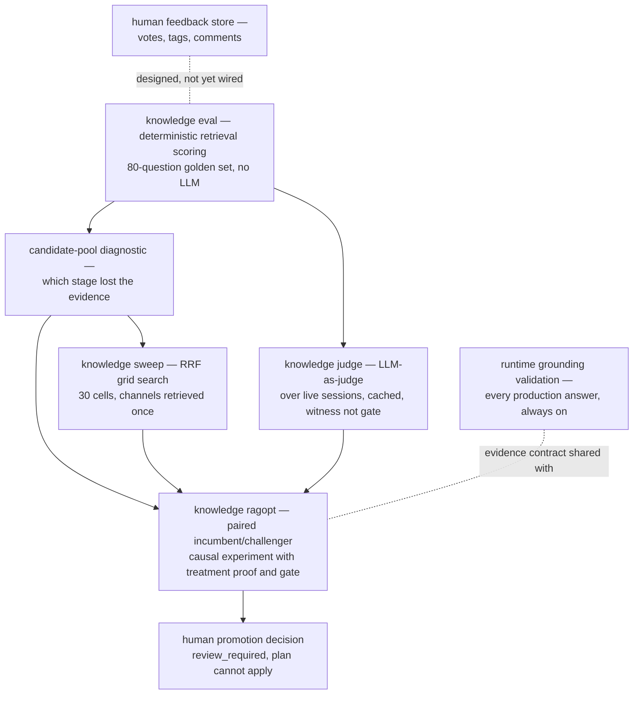

# Architecture Garden — CoinVault

CoinVault is the admin-chat analyst application for Gold Eagle Coin: a Geppetto/Pinocchio tool-loop chatbot that answers operator questions from two authoritative sources, a read-only production MySQL store (through parser-validated `sql_query` and curated `sql_doc` tools) and an immutable digest-addressed RAG knowledge bundle (through `knowledge_search`). The chatbot itself is competent, conventional composition over [[Research/Software Architecture Garden/geppetto/README|Geppetto]], [[Research/Software Architecture Garden/pinocchio/README|Pinocchio]], [[Research/Software Architecture Garden/ragkit/README|Ragkit]], and [[Research/Software Architecture Garden/sessionstream/README|Sessionstream]]. What makes the repository worth a Garden entry is something else: roughly half of its distinctive code is an evaluation, judging, and causal-optimization apparatus wrapped around that chatbot. This overview surveys that apparatus as a coherent system — what generates candidates, what executes them, what judges them, what gates them, and what a human must still do — and reads it against GEPA-style reflective optimization frameworks, whose discipline it deliberately adopts while refusing their autonomy.

This is the first document for the project. It is a survey; later documents will dive into individual subsystems. The upstream intellectual lineage is [[Research/Software Architecture Garden/rag-ttc/README|rag-ttc]] (the judge pipeline is a port of RAG-TTC-JUDGE-001, and the optimization discipline adapts RAG-TTC-GEPA-OPT-001) and [[Research/Software Architecture Garden/ragopt/README|Ragopt]], the generic incumbent/challenger experiment kernel that was extracted *from* this work and that CoinVault now consumes as a pinned dependency (`ragopt v0.0.1`, its revision itself verified at preflight).

> [!summary]
> - CoinVault contains six distinct judging/validating/optimizing loops that form an instrument ladder ordered by cost and epistemic strength: a deterministic retrieval eval over an 80-question golden set, a stage-by-stage candidate-pool diagnostic that names the pipeline stage responsible for each miss, an RRF hyper-parameter sweep that re-fuses cached channel rankings in memory, a two-step decomposed LLM judge whose faithfulness is computed rather than asked, a paired incumbent/challenger causal experiment loop built on Ragopt, and runtime grounding validation inside every production answer.
> - The optimization loop is a GEPA-shaped program with the reflection step deliberately kept outside the binary: mutation surfaces are single bounded text or config assets in frozen candidate bundles, trajectories and receipts are durable native artifacts, but the proposer is a human or an assistant acting under review, selection is a hard lexicographic gate rather than a Pareto frontier, and promotion always requires human application.
> - The system's strongest original contribution is the treatment-exercise proof: a measured delta counts only when the harness demonstrates from the observed event stream that the mutation actually determined runtime behavior in the challenger arm; otherwise the cell fails as `treatment_not_exercised` and the judge is never invoked.
> - Instruments are frozen before they measure: the eval set is digest-locked, the judge prompt version participates in the durable cache key, and a source lock pins seventeen files — including the judge implementation itself — whose drift aborts the run at preflight.
> - The held-out validation split is structurally closed: candidate bundles ship a sentinel file in its place and the CLI hard-errors on `--split validation`, so held-out leakage is prevented by mechanism, not convention.
> - Open boundaries remain: the reviewed suite lock is enforced only from tests, human chat feedback is collected but not yet connected to the eval corpus, Ragopt's blinded-review package is unused, and judge token spend is bounded only by call count.

## Snapshot identity and evidence

| Field | Value |
|---|---|
| Repository | `/home/manuel/workspaces/2026-08-12/deploy-dev-indexer/coinvault` |
| Remote | `git@github.com:goldeneagle/coinvault` |
| Branch | `task/deploy-dev-indexer` |
| Commit | `10d1a8d8c5b281f78b4e73d3956be573dcc8fad1` (2026-08-14, "Docs: design CoinVault per-profile credentials") |
| Worktree | Dirty on webchat per-profile credential files; the evaluation surface analyzed here is committed source |
| Go module | `github.com/go-go-golems/gec-rag` (directory renamed to `coinvault`; "GEC" = Gold Eagle Coin) |
| Analysis date | 2026-08-14 |
| Analysis scope | The judging/validating/optimizing surface: `internal/knowledge`, `cmd/coinvault/cmds/knowledge*`, `internal/webchat/evalchat`, evidence/projection grounding, feedback store, `configs/ragopt/`, `data/`, and the `ttmp/` experiment record. Ragopt v0.0.1 was read from the Go module cache. No live provider campaign was run for this study. |

Study code was read only from this workspace checkout, per the working agreement for this analysis. The `ttmp/` docmgr corpus (roughly ninety tickets, including fifty-five numbered terminal experiment receipts under GEC-RAG-OPT-002) was treated as design-intent and historical-result evidence, subordinate to runtime code where they disagree.

## 1. The system under evaluation

Understanding the loops requires a one-paragraph picture of the thing they measure. At index time, `internal/knowledgebuild` extracts products, category buying guides, and curated SQL schema docs from MySQL, strips shingle-frequency boilerplate, chunks (1600/200/120 runes), embeds through a cached embedder, and publishes an immutable digest-addressed bundle containing a Bleve lexical index, a vectors SQLite, and a content SQLite. At query time, `knowledge.Service.Search` runs lexical BM25 and vector kNN, authorizes each channel *before* fusion, applies weighted reciprocal-rank fusion (k = 60, vector weight 1.0, over-fetch depth = limit × 8), optionally reranks with a cross-encoder, hydrates, truncates, re-authorizes as defense in depth, and admits results into an `EvidenceLedger` that assigns stable `E1..En` labels under a hard budget of 12 items and 18 000 runes (`internal/knowledge/evidence.go:28`). The Geppetto tool loop (max 20 iterations, parallelism 3, retry 2) produces a final answer with `[E#]` citations and a `<gec:sources:v1>` projection block whose IDs the server resolves against its own record of what retrieval returned.

Three identity strings travel with every search result and every evaluation trace: `QueryTransformID`, `RetrievalPolicyID`, and `EvidenceLedgerID` (the ledger's is literally `gec-evidence-ledger/v1;scope=run;dedupe=chunk;max_items=12;max_runes=18000`, `internal/knowledge/evidence.go:52`). These exist so that a quality delta can never silently mix two retrieval configurations. This is the first appearance of the repository's governing idea, and it is worth stating as a law before any loop is described:

```text
A measurement is attributable only when everything that could have caused it
is either frozen and digest-identified, or observed and recorded.
```

Every subsystem below is an application of that law at a different cost point.

## 2. The instrument ladder

The six loops are not redundant. They form a ladder: each rung is more expensive and answers a question the rung below cannot.



| Loop | Verdict producer | Cost per run | Question answered |
|---|---|---|---|
| Retrieval eval (`internal/knowledge/eval.go`) | Deterministic set membership | Retrieval only | Did the expected documents reach top-k? |
| Candidate-pool diagnostic (`internal/knowledge/candidate_pool.go`) | Deterministic stage classification | Two raw searches per question | Which pipeline stage removed the evidence, and why? |
| RRF sweep (`internal/knowledge/sweep.go`) | Deterministic, reuses eval scoring | Two channel searches per question for all 30 cells | Which fusion constants dominate on the frozen set? |
| LLM judge (`internal/knowledge/judge.go`) | Judge model, structurally validated | Live sessions + judge calls, durable cache | Are the answer's claims entailed by admitted evidence, and does the answer address the question? |
| RAGOPT paired loop (`cmd/coinvault/cmds/knowledge_ragopt.go`) | Contract + treatment proof + judge + gate policy | 24 full tool-loop cells under hard budgets | Did this one mutation cause a gated improvement? |
| Runtime grounding (`internal/webchat/evidence_cache.go`, projection feature) | Server-side resolution | Free (inline) | Is every cited source something the server actually retrieved? |

The ladder embodies a cost discipline: cheap deterministic instruments run broadly and often; the expensive causal loop runs only on candidates whose hypotheses already cite diagnostic evidence from the cheap instruments (`configs/ragopt/*/candidate.yaml` carries `evidence.diagnostic_manifest_digest` pointing at a specific candidate-pool run artifact). Nothing enters the expensive loop on intuition alone.

## 3. Deterministic retrieval evaluation

`internal/knowledge/eval.go` defines `EvalSet` version 3: a strict-YAML, digest-locked file of 80 questions (`data/knowledge-eval.yaml`), each in exactly one of three modes — `positive`, `authorization-negative`, or `judge-only` — enforced by `validateEvalQuestion` (`eval.go:91`), which rejects any question declaring zero or two modes. Positive questions carry `ExpectedDocumentGroups`, where each group is satisfied by *any* of its `AnyOf` document IDs and groups are complementary: coverage is satisfied-groups over required-groups, and `Complete` means all groups hit. This two-level structure encodes a real property of retrieval ground truth that flat relevance lists cannot: documents within a group are interchangeable evidence for one facet of the question, while the groups themselves are jointly necessary.

`RunEval` (`eval.go:237`) executes sequentially, one search per question per route, and `Summarize` (`eval.go:363`) reports per-stratum and aggregate `CompleteHitRate`, `MeanCoverage`, `MRR`, `NegativePassRate`, concentration statistics (`MeanUniqueDocuments`, `MeanMaxChunksPerDoc`), failure rate, and nearest-rank p95 latency. Two details show the harness was built by people who had been burned:

- A per-question search failure is recorded in `EvalResult.Failure` and scored as a miss rather than aborting the run (`eval.go:280-284`), so one transport error cannot erase a baseline.
- Expected document IDs that do not exist in the corpus surface as warnings, never silent misses (`eval.go:256-263`), so golden-set rot is visible rather than absorbed into the metrics.

The command layer adds an in-process A/B verdict: when two routes are evaluated, `retrievalSummaryWins` (`cmd/coinvault/cmds/knowledge.go:1656`) declares a challenger the winner only under no regression on completeness, coverage, first-hit responsiveness, or authorization-negative safety, plus at least one improvement. This is the constraint-before-preference gate shape of [[Research/Software Architecture Garden/ragopt/README|Ragopt]] appearing in miniature, in a place Ragopt is not even involved.

The golden set's authoring rules are recorded in the file header: expectations hand-verified against the corpus, paraphrases forbidden from reusing the expected documents' distinctive title words, and every non-obvious expectation justified in a comment. The strata (guide-keyword, facet-product, multi-doc, paraphrase, schema-keyword, scope-negative, unanswerable, jargon-paraphrase, document-concentration, schema-paraphrase) are a deliberate failure-mode taxonomy, not a topic taxonomy.

## 4. The candidate-pool diagnostic: blame assignment as a first-class instrument

Most evaluation harnesses report *that* retrieval failed. `internal/knowledge/candidate_pool.go` (950 lines) reports *where*. It scores every intermediate stage of the retrieval pipeline — raw lexical, raw vector, authorized lexical, authorized vector, fused, authorized-fused, reranked, returned, admitted (`candidate_pool.go:15-26`) — at multiple depths, and then classifies each missed expectation group into one of six diagnosis classes (`candidate_pool.go:28-34`): absent from both channels, below the fused measurement cutoff, removed by scope authorization, below the result budget, below the budget with concentration (the duplicate-chunk crowd-out failure, fired when the surviving top slice is dominated by more than two chunks of a single document), or admitted at final depth.

Two design choices give it its character:

- **Determinism by prefix derivation.** `candidatePoolRankings` (`candidate_pool.go:336`) retrieves once at maximum depth and derives every shallower depth as a stable prefix of the same ordered list — one embedding call per question, no depth-dependent nondeterminism.
- **Refusal to measure a confounded route.** The command refuses to run with a reranker or synonyms enabled (`cmd/coinvault/cmds/knowledge.go:1245-1250`), so the diagnostic always describes the frozen incumbent route. The artifact writer refuses to overwrite an existing run artifact (`knowledge.go:1407`).

The output `CandidatePoolRun` (schema `gec-candidate-pool-eval/v2`) records the bundle ID, corpus digest, suite digest, and the three semantic identity strings, and the CLI emits its SHA. This is what makes the diagnostic *citable*: an optimization candidate's `candidate.yaml` binds its hypothesis to a specific `diagnostic_manifest_digest`. In GEPA vocabulary, this artifact is the reflection input — the textual/structural record from which the next mutation is proposed — except that here it is a typed, digest-addressed measurement rather than a free-form trajectory dump.

## 5. Hyper-parameter search under the one-change rule

`internal/knowledge/sweep.go` grid-searches RRF rank constants {20, 40, 60, 90, 120} × vector weights {0.5, 0.8, 1.0, 1.25, 1.6, 2.0}. The engineering is in what it holds still. Per question, both collapsed channel rankings are computed once at over-fetch depth and authorized independently; each of the 30 cells then re-fuses those rankings *in memory* (`sweep.go:44-55`), so the whole grid costs two channel searches per question and cannot drift between cells. The serving default cell (60, 1.0) is force-included even if the operator's grid omits it (`expandGrid`, `sweep.go:145`), so the baseline is always present in the comparison. The reranker is excluded from sweeps by design — the recorded reason is the one-change-per-candidate rule of the optimization program — because a sweep that varied fusion and reranking together could not attribute its winner. `BestCell` (`sweep.go:182`) is lexicographic (complete-hit rate, then coverage, then MRR, then lower rank constant, then grid order): preference is total, deterministic, and reproducible from the artifact.

## 6. The LLM judge: a witness under discipline

`internal/knowledge/judge.go` is the port of rag-ttc's judge pipeline, and its design comment states the thesis outright: answers come from live sessions against the running stack — the true production path — and *"the judge is a witness, not a gate"* (`judge.go:20-26`). The judging protocol is a two-step decomposition whose separation is the point:

1. **Statement extraction** (`ExtractStatements`, `judge.go:402`) sees the question and the answer, never the evidence. It extracts every distinct factual claim as a standalone sentence, with explicit rules that hedges, offers of help, and self-referential statements are not claims, and that partial uncertainty does not make an answer an abstention.
2. **Verdicts** (`JudgeVerdicts`, `judge.go:425`) see the statements and the evidence, never the freedom to restate the claims. Each verdict must reference statement *n* in order and cite admitted evidence labels; the rubric line is "a statement is supported only if the evidence entails it; general plausibility is not support."

Faithfulness is then *computed* as supported-over-total (`JudgeAnswer`, `judge.go:519`) — the model is never asked for a score it could flatter. An answer with zero extracted statements is an abstention with vacuous faithfulness 1.0, but the verdict step still runs to obtain relevance and the judge's own abstention flag, so abstention quality remains measurable.

The judge's own output is treated as an untrusted structured producer. `JudgeVerdicts` rejects (`judge.go:453-496`): verdict count mismatching statement count, relevance absent or outside [0,1] or non-finite, missing abstention flag, out-of-order statement references, missing support flags, empty reasons, evidence labels outside the admitted `E1..En` ∪ `SQL1..SQLn` set, duplicate labels, and — the sharpest one — `supported: true` with no cited evidence. A structural rejection triggers exactly one repair round-trip (`judgeRepairGenerator`, `judge.go:384`), which re-issues the prompt with the validation error attached; the single repair budget is shared across both steps (`judge.go:500-509`). This is retry-with-feedback bounded to one reflection, applied to the *instrument* rather than the subject.

Three further decisions carry recorded operational lessons:

- **Evidence admitted to the judge includes non-knowledge tool results.** The comment at `judge.go:262-266` records why: the first baseline run scored every SQL-grounded claim as unsupported because the judge saw only knowledge-ledger evidence. A judge that cannot see the evidence the production answer actually used produces confidently wrong faithfulness.
- **The judge is cached durably and version-keyed.** `CachedGeneratorWithObserver` keys flowkit's content-addressed file cache on `(step, judgePromptVersion, model, prompt)` (`judge.go:296-346`), so bumping `judgePromptVersion` (currently `v2`) invalidates the entire judged population at once. An instrument change and a data change cannot be confused.
- **The judge runtime is budget-fenced and retry-wrapped.** `judgeGeneratorRuntime` (`cmd/coinvault/cmds/knowledge.go:2095`) pre-reserves each provider call and rolls back on ceiling breach, seeds spend on resume, and wraps the engine in a three-attempt backoff because "transient provider/transport failures killed a full baseline run once" (`knowledge.go:2221-2236`). The reporting layer keeps explicit separate denominators — metric, faithfulness (abstentions excluded), relevance, completion rate, judge success rate (`emitJudgeSummaries`, `knowledge.go:1991`) — so a judge outage cannot masquerade as a quality change.

The same-family caveat is documented rather than hidden: `gpt-5.6-luna` judging `gpt-5.6-luna-low` answers is a labeled configuration, not a claim of judge independence (`knowledge.go:2085-2088`).

## 7. The RAGOPT loop: a GEPA-shaped program with the reflection step held outside

The centerpiece is `knowledge ragopt` (`cmd/coinvault/cmds/knowledge_ragopt.go`, 1651 lines), CoinVault's product adapter over the generic [[Research/Software Architecture Garden/ragopt/README|Ragopt]] kernel. One run executes a frozen candidate bundle — parent and challenger snapshots differing in exactly one mutable asset, independently verified by Ragopt's `Mutation` computation — over the 12-case feedback suite, both arms, sequentially, under hard-locked budgets (216 answer calls, 192 embeddings, 72 judge calls, 1 000 000 answer tokens; `knowledge_ragopt.go:43-54`, any deviation is an error), through the *canonical* product boundary: each cell builds a fresh `evalchat.ConfiguredRunner` with its own per-cell timeline and turns databases and drives the real HTTP/WS composition (`internal/webchat/evalchat/configured_runner.go`). Then, per cell:

```text
budget.AllowAnswerRun
→ execute the full tool loop, observing every event
→ deterministic answer contract        (generation → route → retrieval → contract stages)
→ treatment-exercise proof             (did the mutation actually determine behavior?)
→ LLM judge                            (only if the contract and treatment checks pass)
→ atomic native artifact               (gec-ragopt-native/v5, private)
→ scalar Outcome to Ragopt             (public metrics + artifact digest only)
```

and, at the end: `compare.Build → gate.Evaluate → report.Build`, producing `gate-decision.json`, `promotion-review.md`, and a `promotion-plan.json` whose state is fixed at `review_required` with `human_apply_required: true`. Nothing in the loop can mutate production.

### 7.1 The treatment-exercise proof

This is the repository's strongest original pattern, and it exists because of a concrete failure. Six successive versions of the `default_results 5→8` experiment measured nothing: the model supplied an explicit `limit: 5` on every knowledge call, so the mutated fallback default never determined behavior, and both arms ran identically while appearing to be an A/B experiment. The recorded conclusion — "configuration is not behavior" — became a mechanism.

Every candidate bundle carries a locked `treatment-contract.yaml` (`knowledge_ragopt_treatment.go:19`) declaring the mechanism (one of nine: tool default/forced result budgets, comparison decomposition/intent, grounding/routing/policy prompt suffixes, reranker, tool description), the per-arm expected knob values, the invariant identity strings, per-case applicability, and an *exact sorted set* of required checks per mechanism — a check cannot be silently dropped (`knowledge_ragopt_treatment.go:186-209`). After each cell, `evaluateGECRagoptDefaultResultsTreatment` (`knowledge_ragopt.go:845`) proves from the observed trace that the treatment fired: for a default-budget mutation, at least one knowledge call whose effective limit came from the fallback default at the expected value; for a prompt mutation, the digest of the actually-installed suffix matching the arm's declared digest; for a reranker mutation, configured *and applied* per call; for all mechanisms, the observed `QueryTransformID`/`RetrievalPolicyID`/`EvidenceLedgerID` matching the contract. If the treatment was applicable but not exercised, the cell fails with class `treatment_not_exercised`, and the judge is never called (`knowledge_ragopt.go:635`) — the system refuses to spend judgment on a cell that cannot attribute.

The law is worth stating in general form, because it transfers to any optimization loop:

```text
A delta between arms is evidence about a mutation only if the run proves
the mutation was causally live in the challenger and absent in the incumbent.
Equal configuration is not equal treatment; observed behavior decides.
```

### 7.2 The trace collector as validator

`gecRagoptTraceCollector.Observe` (`knowledge_ragopt_trace.go:127`) is not a passive recorder. It errors on duplicate provider-call IDs, tool results without matching requests, missing semantic identities in search outputs, invalid effective-limit provenance, and result/request comparison-intent disagreement. The trace records, per knowledge call, the full limit-resolution story (`requested`, `configured default`, `maximum`, `forced`, `effective`, `source ∈ {server_forced, explicit, default, explicit_clamped}`) — exactly the observability the treatment proof needs. `HasOutstandingProviderCalls` feeds the budget's most conservative move: if a timed-out cell cannot prove all provider spend was accounted, `CloseForUncertainProviderSpend` closes the budget for the remainder of the run, stickily (`knowledge_ragopt.go:1146`). Under-counted spend is treated as worse than a shortened campaign.

### 7.3 The deterministic answer contract

Before any model judges anything, `buildGECRagoptAnswerContractReport` (`knowledge_ragopt_contract.go:45`) applies deterministic checks staged as generation → route → retrieval → contract: terminal success, session identity, provider accounting; allowed/required/forbidden tools per case; required evidence groups satisfied; no unresolved runtime errors, projection validity, every `[E#]` citation resolvable against admitted evidence, knowledge evidence actually cited, protected abstention honored. `FirstFailure` walks the stages in fixed order so the first responsible stage names the failure class. The report validates itself (`validateGECRagoptAnswerContractReport`, `:189`): a `Valid` flag disagreeing with the conjunction of its own checks is a hard error. Case inputs (`gec-chat-eval-case/v2`) are cross-validated at suite level too — schema cases must require both SQL tools and forbid knowledge search; authorization-boundary cases must forbid all tools and be protected (`knowledge_ragopt_case.go:124`).

### 7.4 The preflight: environment identity before spend

`validateGECRagoptEnvironment` (`knowledge_ragopt.go:1253-1436`) runs before any provider call and asserts, in order: exact application and model profiles; the *resolved* runtime identity (engine, reasoning effort, reasoning summary) rather than mere profile slugs; eight snapshot dimensions cross-checked against opened-bundle reality (scopes, models, bundle ID, evaluator, source roles, split, tool loop); the corpus digest; the byte digests of the lexical manifest and vectors SQLite; mechanism-specific asset digests in both arms; the `ragopt_revision` dimension against the pseudo-version actually parsed from `go.mod`; and a `source-lock.yaml` pinning seventeen files — including `internal/knowledge/judge.go`, the service, the tool, the eval set, `go.mod`/`go.sum`, and the prompt-pack templates — every one re-hashed. The instrument, the environment, and the harness are all part of the frozen identity. `--preflight-only` exercises all of this with zero spend.

### 7.5 The information boundary and the double verdict

Ragopt sees only scalars and an artifact digest: faithfulness, relevance, unsupported-claim rate, citation-resolution and evidence-citation rates, contract and route booleans, abstention correctness, call counts (`knowledge_ragopt.go:671-713`). Answer text, SQL rows, and evidence bodies stay in the private native artifact (`gec-ragopt-native/v5`), which retains the full trace, judge score with per-statement verdicts, treatment report, contract report, budgets, and termination accounting. The generic kernel can therefore be reused across products without leaking product data, while the product retains everything needed for reflection.

The terminal receipts show why this richness matters. The `grounded-answer-v2` decision record (`ttmp/2026/08/07/GEC-RAG-OPT-002/reference/31-...`) rejects whole-chat promotion under the frozen gate — five of twenty-four cells failed — while simultaneously accepting the causal diagnostic conclusion that the grounding instruction works (comparison-case faithfulness 0.46 → 1.00 and 0.38 → 0.96). The apparatus is built to produce exactly this double verdict: *gate outcome* and *causal learning* are different results, and conflating them is the category error the program's own evidence ledger later diagnosed in itself — "it asked each isolated, one-mechanism experiment to satisfy the release gate for the entire chatbot." The component evidence ledger (GEC-RAG-OPT-003) accordingly tracks statuses `structurally_invalid`, `component_rejected`, `historically_supported`, `conditional_evidence`, `release_rejected`, `release_promoted` — and no entry has ever reached `release_promoted`, which the record treats as information, not embarrassment.

## 8. The GEPA correspondence, stated precisely

The design documents are explicit about lineage: the optimizer role "runs a pragmatic version of rag-ttc's GEPA-inspired loop (RAG-TTC-GEPA-OPT-001). The full loop mutates prompts via a reflection model; here the optimizer is the assistant itself, but the discipline is identical" (GEC-RAG-OPT-001 design doc). Reading CoinVault against GEPA-style reflective prompt evolution — sample trajectories, reflect on failures in natural language, propose a prompt mutation, evaluate, keep a Pareto frontier of candidates — the correspondence is real but deliberately partial:

| GEPA element | CoinVault realization | Deliberate difference |
|---|---|---|
| Mutation surface | One bounded text/config asset per candidate: prompt suffixes, tool descriptions, result budgets, comparison plans, reranker config. `grounded-answer-v2`'s entire mutation is one paragraph replacing an empty file. | Identical in kind; narrower per step (exactly one asset, enforced by Ragopt's independent mutation computation). |
| Trajectories | Native artifacts: full traces, per-statement verdicts, treatment and contract reports, stage diagnostics. | Typed and digest-addressed rather than free-form transcripts; the candidate-pool diagnostic is a structured reflection input. |
| Reflection model | A human or an assistant working *outside the binary*, reading receipts and diagnostics, authoring the next candidate bundle. `candidate.Proposer.Kind` records who proposed but changes no behavior. | No code feeds failing traces to an LLM to author the next mutation. Reflection is governed, reviewable, and slow by choice. |
| Metric / feedback function | The two-step judge plus deterministic contracts, all frozen by version keys and source locks. | The judge is a witness; the *gate* is a deterministic lexicographic policy (hard constraints before target before regressions before cost tie-breakers), and the judge's numbers enter it only as metrics. |
| Candidate selection | Hard gate policy per candidate; a component evidence ledger accumulates cross-candidate status. | No Pareto frontier, no population, no automated survival. Twenty-four sequential bundles, each a hypothesis with declared regression risks and kill criteria. |
| Train/validation hygiene | Feedback split (12 cases) for iteration; validation split (24 held-out cases) structurally closed by a sentinel file and a hard CLI error until feedback passes and reproduces. | Stronger than typical practice: held-out leakage is impossible by mechanism, and "if feedback fails, do not use validation as another source of tuning data" is enforced, not advised. |
| Deployment of winners | Promotion plan with `human_apply_required: true`; no apply command exists. | Autonomy ends at evidence. Application authority is entirely human. |

The honest summary: CoinVault implements GEPA's *evaluation discipline* — bounded mutations, rich trajectories, frozen metrics, iterative candidates — while explicitly rejecting GEPA's *autonomy* — automated reflection, population search, and self-applied winners. The rejected half is not missing infrastructure; it is a governance position, recorded in three standing rules: the judge is a witness, never a gate; the answering model may draft eval questions but never author its own unreviewed exam; instruments are frozen before they measure. DSPy is nowhere referenced; there is no signature/teleprompter-style abstraction, and prompt assets are plain files under digest custody.

## 9. Runtime grounding: the always-on loop

Independent of any campaign, every production answer passes a grounding validation that shares its evidence contract with the eval stack. The `runEvidenceCache` (`internal/webchat/evidence_cache.go:30`) observes every `knowledge_search` result per run key and resolves the model's cited IDs against server-retrieved items — "source cards can only contain server-retrieved documents, never model-authored provenance." If the model emits a `<gec:sources:v1>` block citing IDs that match nothing the server returned, the widget build fails, the failure surfaces as a projection-error event (`internal/webchat/coinvault_projection_feature.go:331-341`), and — closing the loop — the RAGOPT trace collector records it and the `projection_valid` contract check fails the cell. Projection blocks validate structurally (`internal/projectionblocks/types.go`): evidence IDs match a strict pattern, and the answer's epistemic grade must come from the closed set `measured | estimate | association | hypothesis`. The model chooses what to cite and what to claim; the server owns all resolved content. Production and evaluation thus enforce the same law at the same boundary, which is what makes eval results transferable to production behavior at all.

Two reconciliation instruments complete the runtime picture: the debug recorder builds an on-demand SQLite with set-difference views between backend pipeline, WebSocket transport, provider events, and frontend logs (`internal/webchat/debugrecorder/`, views like `missing_transport_fanout`), and the provider-accounting reconciliation described in §7.2 turns unprovable spend into a closed budget rather than an optimistic count.

## 10. Human feedback: collected, not yet closed-loop

`internal/webchat/sessionstream/feedback.go` stores per-message and per-conversation votes (−1/0/1), bounded tags, and append-only comments in SQLite behind authorized HTTP routes, surfaced in the UI with preset tags (`helpful`, `incorrect`, `incomplete`, `needs sql`, `pricing`). Nothing currently reads this into the eval corpus. The design record prescribes the path — sanitized, classified production failures feed the governed corpus backlog, never raw conversations — and the failure-triage decision table (product defect → one isolated candidate; case defect → fix the corpus, don't tune the product; known limit → tracked, non-gating; investigate → gather evidence first) defines how a complaint would become either a candidate or a case. The loop from production dissatisfaction to governed experiment is designed and unbuilt. That is the correct order — the triage vocabulary exists before the pipe — but it is the largest open edge of the system.

## 11. Authority and identity map

| Object family | Owner/authority | Identity coordinate | Must not be confused with |
|---|---|---|---|
| Knowledge bundle | Build pipeline | `rk-<digest>` + corpus digest + index byte digests | Serving configuration or retrieval policy |
| Retrieval configuration | Service | `QueryTransformID`, `RetrievalPolicyID`, `EvidenceLedgerID` | Bundle identity; these vary independently |
| Eval set | Human authors; loader admits | Version 3 + `sha256:` byte digest | Chat suites; judge population |
| Chat suite case | Human-reviewed corpus | `gec-chat-eval-case/v2` case ID + group membership + suite digest | Retrieval eval question; production conversation |
| Candidate | Proposer declares; Ragopt independently verifies | Parent/child snapshot digests + computed single mutation | Applied change; the run that measures it |
| Treatment contract | Candidate bundle (locked asset) | Mechanism + per-arm knob values + exact check set | The mutation itself; configuration ≠ exercised behavior |
| Cell | Ragopt runner | Run config + (suite, policy bytes, candidate, snapshot, case, repeat, arm) + hash chain | Retry attempt; production session |
| Native artifact | Product adapter creates; Ragopt takes custody | Run-relative path + digest, `gec-ragopt-native/v5` | The scalar `Outcome` projection Ragopt compares |
| Judge score | Judge runtime; structurally validated | (step, prompt version, model, prompt) cache key; verdicts per statement | A gate decision; ground truth |
| Gate decision | Pure policy evaluator | Policy byte + semantic digests over the comparison | Promotion; scientific proof |
| Promotion plan | Reporter | Run/candidate/decision binding, state fixed `review_required` | Apply authority — none exists in the binary |
| Human feedback | Operators | (session, subject, scope, target) upsert + append-only comments | Eval corpus input (not yet wired) |

Identity discipline mirrors Ragopt's: bundle digest ≠ retrieval policy ≠ suite digest ≠ candidate digest ≠ run ID ≠ cell digest; a judge score is not a gate; a gate pass is not promotion; a promotion plan is not application.

## 12. Pattern maturity assessment

| Pattern or law | Maturity | Evidence or limitation |
|---|---|---|
| Deterministic retrieval eval with mode-per-question golden set and grouped any-of expectations | Established | 80-question digest-locked set, tests, consumed by sweep and diagnostics; failure-as-miss and unknown-ID warnings show operational hardening |
| Stage-attributing candidate-pool diagnostic with typed diagnosis classes | Candidate ecosystem pattern | One strong implementation; cited by candidate hypotheses via artifact digest; comparison target is rag-ttc's diagnostic lineage |
| Cached-channel hyper-parameter sweep under the one-change rule | Established | Deterministic re-fusion, forced baseline cell, lexicographic best; local to RRF constants |
| Two-step decomposed judge with computed faithfulness, structural output validation, and one repair retry | Candidate ecosystem pattern | Ported from rag-ttc (extraction lineage, not independent confirmation); frozen by version key and source lock; same-family judge caveat documented |
| Treatment-exercise proof (`treatment_not_exercised` failure class) | Candidate ecosystem pattern | Born from the v1–v6 default-results failure; enforced per mechanism with exact check sets; strongest novel contribution, no second implementation yet |
| Preflight environment-identity validation (resolved runtime identity, dimension cross-checks, byte digests, dependency revision, source lock) | Candidate ecosystem pattern | One implementation; unusually complete; `--preflight-only` gives a zero-spend dry run |
| Hard budget accounting with pre-reservation, resume seeding, and sticky close on unprovable spend | Established | Enforced ceilings, resume replay from native artifacts, recorded operational incident driving the retry wrapper |
| Structurally closed held-out split | Candidate ecosystem pattern | Sentinel file + hard CLI error; leakage prevented by mechanism |
| Runtime citation grounding with server-owned provenance | Established | Production path plus projection-error propagation into eval contracts; shared contract between prod and eval |
| Human promotion authority outside the binary | Established (inherited) | Ragopt's `review_required`/`human_apply_required` plan; no apply command exists in either module |
| Reviewed suite lock enforced on the command path | Architecture debt | `validateGECRagoptSuiteLock` is exercised only from tests; suite identity is carried by bundle asset SHA instead — two overlapping mechanisms, one unwired |
| Human feedback feeding the governed corpus | Emergent | Store, UI, and triage vocabulary exist; the pipe does not |
| Blinded human review integrated with gating | Emergent | Ragopt's `pkg/review` (structural blinding, separate unblinding key) is entirely unused by CoinVault |
| Judge token budgeting | Open correctness obligation | Only judge calls are ceilinged; token spend is acknowledged as unbounded in the program's own textbook |

## 13. Architecture debt and open laws

### Suite identity has two mechanisms and one enforcement gap

**Required law:** the suite measured by a run must be the reviewed suite, provably. **Current evidence:** every candidate bundle locks `feedback-suite.json` by SHA, and preflight verifies it; a separate reviewed-suite lock (`gec-chat-suite-lock/v1`, with review status and reviewer date) exists with a validator. **Gap:** the validator is called only from tests; nothing on the `ragopt` command path proves the bundle's locked suite equals the *reviewed* suite. A bundle could lock an unreviewed suite and pass every check. **Likely validation:** call `validateGECRagoptSuiteLock` during preflight against the bundle's suite digest.

### Feedback-to-corpus is designed, not built

**Required law:** production failure signal must reach the eval corpus only through sanitization, classification, and review — and it must eventually reach it, or the corpus measures yesterday's failure modes. **Current evidence:** the feedback store and the four-way triage table. **Gap:** no reader, no backlog integration. **Likely validation:** a periodic triage export whose output is corpus-change proposals (new cases, case fixes) with the same review lock the suites already have.

### Judge spend is call-bounded, not token-bounded

The judge runtime ceilings calls (72) with pre-reservation, but a pathological answer could inflate per-call tokens without limit. The program's own documentation records this. The budget type already counts tokens for the answer path; extending the ceiling to judge tokens is mechanical.

### Minor observations

`gecRagoptTrace.sourceRoleMatch` (`knowledge_ragopt_trace.go:397`) appears unreferenced. The eval matrix is strictly sequential by design (budget accounting, exact-root resume, and hash-chained cells all assume it); any future parallelization must re-derive those three mechanisms rather than merely adding a worker pool. Ragopt's blinded-review package awaits a product need; wiring it before defining durable review-bundle identity would repeat the mistake its own package documentation warns against.

## 14. Candidate ecosystem patterns

1. **Treatment-exercise proof.** An A/B harness must demonstrate from observed behavior that the treatment was causally live in the challenger arm and absent in the incumbent, and must fail the cell — before judging — when it cannot. Configuration is not behavior. This deserves a second implementation (any system with feature-flag or prompt A/B experiments is a target) before promotion to guideline.
2. **Instrument freezing by version key and source lock.** Every component that produces a score (judge prompts, judge implementation, eval set, harness source, dependency revision) participates in a frozen, digest-verified identity checked before spend; changing the instrument invalidates the population by construction (cache-key versioning) rather than by memo.
3. **Witness/gate separation.** LLM judges produce metrics under structural validation; admission decisions are made by deterministic, product-authored constraint-first policies over those metrics; application decisions are made by humans. Three authorities, never merged.
4. **Structurally closed held-out splits.** Ship a sentinel in place of the held-out data and hard-error on the flag until the promotion criteria for opening it are met.
5. **Blame-assigning diagnostics as citable artifacts.** Stage-attributed failure classification, digest-addressed, referenced by the hypothesis of every expensive experiment. The cheap instrument justifies the expensive one.

Patterns 2 and 3 have partial second occurrences (Ragopt itself, and the rag-ttc lineage), but those are extraction lineage rather than independent confirmation — the same caveat the [[Research/Software Architecture Garden/ragopt/README|Ragopt study]] records for its own consumer evidence.

## 15. Open questions and next investigations

1. Should the reviewed-suite lock be folded into the preflight, or should the lock file be retired in favor of review metadata inside the bundle's locked assets? Two mechanisms will drift.
2. What is the minimal governed pipe from `coinvault_feedback` to corpus-change proposals, and which triage decisions can be pre-classified mechanically from the native-artifact vocabulary (contract stage, treatment class) already attached to eval failures?
3. The component evidence ledger holds `historically_supported` verdicts for several mechanisms while the release gate has promoted nothing. The `canonical-seed-stack-v1` cumulative candidate is the designed answer; a deep-dive document should follow its run and test whether stacked primitives interact.
4. Can the treatment-exercise proof be generalized in Ragopt itself (a product-supplied `TreatmentReport` in the cell contract), making the pattern reusable without CoinVault's bespoke adapter?
5. If an automated reflection step is ever added, which of the three governance rules bends first — and can the proposer remain recorded-but-inert (`Proposer.Kind`) while a reflection model authors drafts that still pass human review before freezing?
6. Deep-dives to write next for this Garden folder: the judge protocol (02), the treatment/trace/contract triad (03), budget and termination custody (04), and the runtime grounding boundary shared between production and eval (05).

## Related studies

- [[Research/Software Architecture Garden/coinvault/Index of Design Patterns|Index of Design Patterns]] — back-of-the-book index of this study's patterns and vocabulary, with a companion [[Research/Software Architecture Garden/coinvault/Index of Design Patterns - Rationale|rationale]]
- [[Research/Software Architecture Garden/README|Software Architecture Garden]]
- [[Research/Software Architecture Garden/ragopt/README|Ragopt]] — the generic incumbent/challenger kernel this project consumes and helped shape
- [[Research/Software Architecture Garden/ragkit/README|Ragkit]] — the RAG primitives underlying the knowledge service
- [[Research/Software Architecture Garden/rag-ttc/README|rag-ttc]] — the judge and GEPA-loop lineage
- [[Research/Software Architecture Garden/rag-ttc/optimization/01 - Optimization Judging and Improvement Loops - Overview|rag-ttc — Optimization, Judging, and Improvement Loops]] — the companion study of the ancestor loops this project ported and hardened
- [[Research/Software Architecture Garden/geppetto/README|Geppetto]] — inference engines, tool loop, events
- [[Research/Software Architecture Garden/pinocchio/README|Pinocchio]] — chat application composition
- [[Research/Software Architecture Garden/sessionstream/README|Sessionstream]] — event/timeline streaming and the canonical eval boundary
