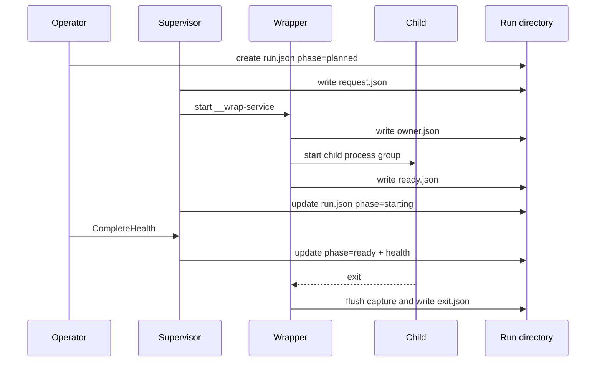

# Durable State, Process Identity, and Wrapper Evidence

Long-running local processes outlive the command that starts them. A correct operator must therefore persist enough information for a later invocation to answer four questions: which service attempt is current, which process belongs to that attempt, whether startup completed, and how the process terminated. `devctl` answers these questions with a versioned environment index, immutable run directories, process start identities, atomic writes, and wrapper-owned handshake artifacts.

## Environment state is not run history

`pkg/runstate/schema.go` defines two primary records:

```go
type EnvironmentState struct {
    Version   int
    RepoRoot  string
    Profile   string
    Revision  uint64
    CreatedAt time.Time
    UpdatedAt time.Time
    Services  map[string]ServiceSlot
}

type ServiceSlot struct {
    Name         string
    CurrentRunID string
    LastRunID    string
    Desired      DesiredState
}
```

The environment document is small and mutable. It identifies the repository, profile, current revision, desired state, and pointers into run history. It does not contain the entire process lifecycle.

A `RunRecord` represents one attempt:

```go
type RunRecord struct {
    Version     int
    RunID       string
    Service     string
    Phase       RunPhase
    Spec        ServiceSpecRecord
    Wrapper     *ProcessIdentity
    Child       *ProcessIdentity
    ChildPGID   int
    Health      *HealthResult
    Exit        *ExitSummary
    ArtifactDir string
    LastError   *ErrorRecord
}
```

This separation prevents restart from destroying evidence. The service name remains stable while every attempt receives a UUIDv7 run ID. A service slot can move its current run to `LastRunID` and point to a new run without rewriting the old attempt.

The persisted layout is:

```text
.devctl/
├── state.json
├── lock
└── runs/
    └── <uuid-v7-run-id>/
        ├── run.json
        ├── request.json
        ├── owner.json
        ├── ready.json
        ├── stdout.log
        ├── stderr.log
        ├── logs.jsonl
        └── exit.json
```

The environment is a current index. The run directory is evidence. This is the first candidate ecosystem rule: when a named unit can execute repeatedly, keep mutable selection separate from immutable attempt history.

## Desired state and observed phase

`DesiredState` contains `running` and `stopped`. `RunPhase` contains `planned`, `starting`, `ready`, `stopping`, `exited`, `failed`, and `unknown`.

These vocabularies answer different questions:

| Field | Question |
|---|---|
| `ServiceSlot.Desired` | What does the operator intend? |
| `RunRecord.Phase` | What has the current attempt demonstrated? |
| `HealthResult` | What did the readiness contract observe? |
| `ExitSummary` | How did the process terminate? |

A service may be desired running while its run is failed. That is not a contradiction. It is the state needed to tell the user that the environment has not reached its desired condition.

## Atomic publication

Individual JSON documents use an atomic write algorithm in `pkg/runstate/atomic.go`. The implementation writes a complete temporary file in the destination directory, applies permissions, synchronizes and closes it, renames it over the destination, and synchronizes the parent directory where supported.

```text
function writeJSONAtomic(destination, value):
    bytes = encodeAndValidate(value)
    temp = createTemporaryFile(parent(destination))
    writeAll(temp, bytes)
    chmod(temp, 0600)
    fsync(temp)
    close(temp)
    rename(temp, destination)
```

Readers therefore observe the old complete document or the new complete document. They do not observe truncated JSON from an interrupted write.

Atomicity of one file does not make a multi-file lifecycle transaction atomic. Creating a run, updating the environment index, starting a wrapper, and recording an outcome spans several documents and external processes. `pkg/runstate.Locker` serializes lifecycle mutations per repository. Lock metadata records the operation and command for diagnosis.

`EnvironmentState.Revision` supplies optimistic conflict detection inside the lock and protects callers that update from an earlier snapshot. `Store.Update` requires the expected revision and increments it on success.

## Process identity is PID plus start token

Operating systems reuse PIDs. A stored PID can later identify an unrelated process. `ProcessIdentity` combines a PID with a start token:

```go
type ProcessIdentity struct {
    PID        int
    StartToken string
}
```

On Linux, `pkg/runstate/identity_linux.go` reads the process start time from `/proc/<pid>/stat`. Inspection yields one of three meaningful results:

- the process is absent;
- the PID and start token match;
- the PID exists but the start token differs.

The third result is a safety condition, not a normal liveness result. Stop logic must never signal that PID. Reconciliation marks the run unknown and reports an identity mismatch.

```text
function inspect(storedIdentity):
    if /proc/pid does not exist:
        return absent
    actualToken = readProcessStartToken(pid)
    if actualToken != storedIdentity.startToken:
        return mismatch
    return matches
```

The pattern should be reused by any local tool that persists process ownership across invocations. PID-only state is insufficient whenever persisted state can outlive a process.

## Why a wrapper remains necessary

The initiating CLI must return while services continue. Directly starting a detached child from the CLI would leave several responsibilities without a durable owner:

- capturing output after the CLI exits;
- recording the child exit;
- maintaining a process group;
- publishing the exact child identity;
- distinguishing wrapper startup from child readiness.

`devctl __wrap-service` is an internal command. The supervisor writes `request.json` and starts a new devctl process with that request. The wrapper consumes and removes the request, records its own identity, starts the service child in a process group, captures both output streams, publishes the child identity, waits for termination, and writes `exit.json`.



The artifact names define publication boundaries:

- `request.json` means the controller has prepared immutable wrapper input.
- `owner.json` means the wrapper accepted ownership.
- `ready.json` means the child exists and its identity and process group are known.
- a healthy `RunRecord` means the configured readiness contract succeeded.
- `exit.json` means the wrapper observed termination after output capture completed.

The names must not be collapsed into one boolean `running` flag. Each artifact establishes a different fact.

## Environment sanitization

The planned service specification is copied into the run record for diagnosis. Environment persistence passes through `state.SanitizeEnv`, preventing known sensitive values from being copied into durable state. This is an important interaction between observability and security: a run should preserve enough context to explain execution without turning `.devctl` into a secret archive.

Sanitization is not a complete secret-management system. A service can still print a secret to stdout or stderr, and arbitrary environment key names may evade name-based rules. The architectural rule is narrower: durable diagnostic state must have an explicit sanitization boundary rather than serializing a process environment indiscriminately.

## Failure modes and their representation

| Failure | Durable response |
|---|---|
| Controller stops before wrapper ownership | Planned run later reconciles to failed with `START_NOT_OBSERVED` |
| Owner artifact exists but no readiness or exit evidence | Run becomes unknown rather than ready |
| Ready artifact names another run or service | Handshake contradiction |
| PID exists with different start token | Process identity mismatch; do not signal |
| Exit artifact exists while owned process is live | Exit-with-live-process contradiction |
| Health fails | Failed run with unhealthy result and last error; owned process is stopped |
| Wrapper or child exits without exit artifact | Missing-exit diagnostic rather than invented exit code |

The system prefers an explicit unknown state over unsafe certainty. This is a strong design choice. A status tool that guesses may look simpler during normal operation but becomes dangerous when asked to terminate processes.

## Reuse criteria

Another project should reuse this pattern when:

- a process survives the initiating command;
- later commands must inspect or terminate it;
- multiple attempts of one named service need separate evidence;
- a filesystem is the shared coordination medium;
- post-failure diagnosis matters.

It should not be copied wholesale into a foreground tool or a service already managed by an external orchestrator. The essential reusable parts are the separation of intent and attempt, atomic evidence publication, and PID/start-token ownership.

## Key points

- The environment index selects runs; it does not contain run history.
- UUIDv7 run IDs make every service attempt independently inspectable.
- Desired state and observed phase are intentionally different values.
- Atomic files protect document integrity; the repository lock protects lifecycle transactions.
- A persisted process identity requires both PID and start token.
- Wrapper artifacts make detached startup and exit observable across commands.
- Unknown is a safety-preserving result when evidence contradicts or is incomplete.
