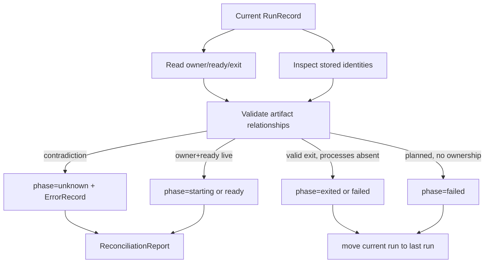

# Reconciliation and the Shared Operator Boundary

Persisted state becomes stale whenever an external process changes after the last write. `devctl` does not prevent this. A service may exit while no CLI is running, and the wrapper may publish `exit.json` after the stored run phase was marked ready. The architecture restores truth through reconciliation: a deterministic comparison of desired state, run records, handshake artifacts, exit artifacts, and current process identity.

The same package exposes lifecycle operations and snapshots. This makes reconciliation part of one application boundary rather than a utility that each interface invokes differently.

## The controller is an application service

`operator.Controller` coordinates domain packages but does not render output. Its requests model user intent:

```go
type UpRequest struct {
    RepoRoot string
    Profile  string
    Select   Selection
    Policy   PipelinePolicy
}

type SnapshotRequest struct {
    RepoRoot      string
    IncludeRuns   bool
    IncludeHealth bool
}
```

`PipelinePolicy` holds configuration path, working directory, strictness, dry-run, timeout, phase skips, and selected build or preparation steps. These fields are explicit because the controller must be callable without Cobra globals.

Results and events have distinct purposes. `OperationResult` is the final summary, including per-service outcomes. `OperatorEvent` is a versioned progress record suitable for incremental rendering:

```go
type OperatorEvent struct {
    Version     int
    OperationID string
    At          time.Time
    Kind        EventKind
    Phase       string
    Service     string
    Status      string
    Message     string
    Error       *OperatorError
    Fields      map[string]any
}
```

This separation avoids forcing a streaming CLI to reconstruct progress from a final result, and avoids forcing a synchronous caller to retain every event to learn the outcome.

## Reconciliation algorithm

`reconcile` first loads the environment and indexes current and last run IDs. It then processes current runs in deterministic service-name order. For each current run, `reconcileCurrentRun`:

1. loads and validates the run record;
2. checks that the run belongs to the environment slot;
3. reads `exit.json`, `owner.json`, and `ready.json` if present;
4. inspects stored wrapper and child identities;
5. validates artifact versions, run IDs, service names, and identities;
6. selects a safe phase or contradiction;
7. updates the run;
8. clears terminal runs from `CurrentRunID` into `LastRunID`.



The algorithm does not treat artifact existence as sufficient. A ready artifact without an owner artifact is contradictory. An exit artifact while an owned process remains live is contradictory. A process-group mismatch is contradictory. These checks protect the operator from acting on partially copied or unrelated state.

## Preserving successful health

The analyzed snapshot contains a subtle but important rule from PR review #11. When owner and child identities are live and a ready artifact exists, reconciliation chooses:

```text
if no health check:
    phase = ready
else if existing phase == ready and HealthResult.Healthy:
    phase = ready
else:
    phase = starting
```

The existing healthy result is evidence produced by `CompleteHealth`. Reconciliation should validate and preserve it, not downgrade the run merely because the service has a health specification. Conversely, a bare `ready.json` does not prove the application health endpoint succeeded. That distinction keeps wrapper readiness and application readiness separate.

## Reconciliation on reads

The final design reconciles during `Snapshot`, under the same repository lock used by lifecycle mutations. This behavior was added after live tmux testing found a stale-status defect. A short-lived service reached ready, exited, and produced `exit.json`; status continued to show ready because snapshots only read `run.json`.

Calling `Snapshot` now performs:

```text
store = NewStore(repoRoot)
if no environment:
    return Exists=false

with repositoryLock:
    reconcile(store)

environment = reloadState()
return buildTypedSnapshot(environment)
```

This means a read from the user's perspective can repair derived state. The mutation is not arbitrary. It records evidence already published by the wrapper and updates the environment index accordingly.

`Doctor` deliberately differs. Tests assert that doctor reports contradictions without reconciling or mutating state. Diagnosis and projection have different contracts:

- snapshot returns the best current projected state and may reconcile;
- doctor inspects and reports evidence without changing it.

This is a useful ecosystem distinction. A diagnostic command should not silently repair the system it is trying to explain unless repair is its explicit contract.

## Lifecycle composition

### Up

`Up` plans before acquiring the lifecycle lock, then locks, reconciles, rejects already-running selections, creates all planned runs, publishes desired state, starts all wrappers, and completes all health checks. Per-service failures produce partial outcomes rather than erasing successful starts.

### Down

`Down` locks and reconciles before selecting current runs. It verifies complete ownership through the supervisor, requests process-group termination, records outcomes, and updates desired state. A failure to stop one service retains its current ownership instead of claiming the environment stopped.

### Restart

`Restart` plans before stopping. This ordering prevents an invalid new configuration from taking down a working current service. Under one operation identity it performs the selected down path and then the selected up path, preserving both outcomes.

### Snapshot

`Snapshot` reconciles and returns typed `ServiceSnapshot` values. Run history and health inclusion are request options, which lets lightweight clients avoid unnecessary work.

## Error taxonomy

`OperatorError` carries a stable code, message, cause, and optional service/run details. Codes distinguish:

- usage and missing or invalid configuration;
- state version and corruption;
- operation busy;
- unknown service;
- health timeout;
- partial failure;
- cancellation.

The CLI maps these codes to exit status centrally. The TUI displays the same typed errors. This is more stable than requiring clients to match prose.

The error taxonomy is also an architecture test. If a new failure cannot be classified without embedding presentation knowledge in a lower layer, the boundary may be incomplete.

## Events are progress, not state

The controller emits `operation.started`, phase events, service-planned, starting, ready, unhealthy, stopping, exited, failed, unknown, diagnostics, and `operation.finished`.

Events describe the operation as it happens. They are not the durable state authority. A client that reconnects should ask for a snapshot and logs rather than replaying only in-memory operation events. This prevents an event stream from becoming an accidental second database.

## Why one controller matters

Before the redesign, the TUI had an action runner, stream runner, state watcher, event bus, several models, and transformation code that duplicated lifecycle interpretation. The replacement made the TUI a controller client.

The shared boundary creates these invariants:

- the CLI and TUI cannot choose different stop safety rules;
- both see reconciliation results from the same implementation;
- structured scripts and interactive use receive the same error categories;
- controller tests cover behavior independently of terminal rendering;
- a future HTTP or editor client can reuse domain operations without shelling out.

## Failure modes and limits

Reconciliation is only as strong as its evidence. If a process disappears without an exit artifact, the operator can prove absence but may not know the exit code. It records unknown rather than inventing terminal detail.

The filesystem lock serializes cooperative devctl commands, not arbitrary external edits. A user can still corrupt `.devctl` manually. Schema validation and contradiction reporting reduce damage but cannot make external mutation safe.

Snapshot reconciliation means status can return operation-busy while another lifecycle command holds the lock. This is consistent—the snapshot cannot safely project a moving multi-file transaction—but clients must handle it as a temporary operational condition.

## Candidate ecosystem guidance

- Put lifecycle semantics behind one typed application service shared by every interface.
- Separate final results from progress events.
- Make reconciliation deterministic, idempotent, and evidence-based.
- Preserve stronger existing evidence; do not downgrade a proven state to an earlier phase.
- Let diagnostic commands report without mutation and repair commands mutate explicitly.
- Plan a replacement before stopping the current system.
- Represent partial failure per unit rather than claiming atomic rollback where none exists.

## Key points

- Durable files require reconciliation because external processes change between invocations.
- Reconciliation validates relationships among state, artifacts, and current process identity.
- Snapshot reconciliation repairs stale projections; doctor remains non-mutating.
- Health-ready evidence must survive reconciliation.
- One controller keeps CLI and TUI lifecycle behavior identical.
- Events report progress, while runstate remains the durable authority.
