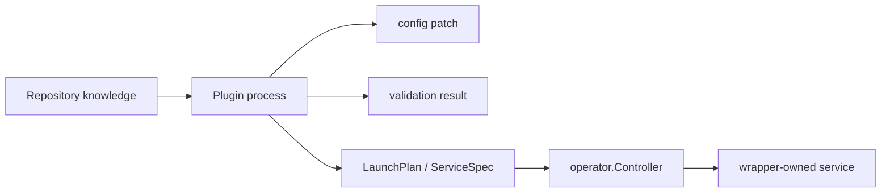
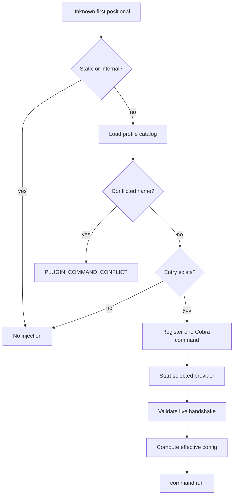

# Declarative Plugins and Validated Dynamic Commands

`devctl` plugins move repository-specific policy outside the core binary while retaining one orchestration implementation. A plugin is a long-lived process that speaks protocol-v2 NDJSON on stdin and stdout. It can derive configuration, validate prerequisites, run finite phases, return service descriptions, and advertise commands. The plugin does not become a second supervisor.

This subsystem contains two related patterns:

1. **Declarative provider boundary**: plugins return data describing configuration and services.
2. **Validated metadata injection**: plugin command metadata may extend the CLI, but cached discovery data is revalidated before execution.

## Protocol shape

The first stdout frame is a handshake:

```json
{
  "type": "handshake",
  "protocol_version": "v2",
  "plugin_name": "example",
  "capabilities": {
    "ops": ["config.mutate", "validate.run", "launch.plan"],
    "commands": [
      {"name": "db-reset", "help": "Reset the development database"}
    ]
  }
}
```

After the handshake, devctl writes request frames with a request ID and operation name. The plugin returns a response with the same request ID and may emit event frames for progress.

Stdout is protocol-only. Human diagnostics go to stderr. This rule prevents the transport parser from guessing whether a line is data or commentary.

`pkg/protocol` owns frame types and validation. `pkg/runtime` owns process startup, handshake timeout, request routing, response correlation, event dispatch, and close behavior. `pkg/engine` owns the ordered semantics of supported operations.

## Policy and supervision are separate

The most important plugin boundary is `launch.plan`. A service specification contains the name, argument vector, working directory, environment, and health contract. The plugin returns this specification; it does not start the service.



This keeps language-independent extensibility without distributing process ownership. A plugin can be implemented in Python or shell because the protocol is data. The operator remains in Go because its safety rules are centralized.

The migration guide at `pkg/doc/topics/devctl-plugin-migration.md` makes this boundary operational. Existing plugins should remove PID files, backgrounding, self-restart loops, service log redirection, and post-plan health loops. Build steps and migrations remain plugin responsibilities because they are finite repository policy; long-running processes become launch-plan entries.

## Pipeline composition

The engine asks only for operations a provider declares. Multiple selected plugins can mutate configuration and contribute phases. Strictness determines how conflicting or failing contributions are treated. The planner produces one selected profile and one launch plan for the operator.

The operation order is meaningful:

```text
config.mutate
build.run
prepare.run
validate.run
launch.plan
operator supervision
```

Configuration must be derived before later phases consume it. Build and preparation are finite. Validation prevents known-invalid launch. The launch plan is the boundary between description and lifecycle.

This sequencing is an ecosystem candidate because many go-go-golems applications need repository-specific extension without allowing plugins to own the host's core state.

## Dynamic top-level commands

Plugins can advertise command specifications in the handshake. An unambiguous command becomes directly invokable:

```text
devctl db-reset --force
```

Top-level injection is ergonomically useful but creates namespace and startup problems. If devctl started every plugin while constructing root help or shell completion, ordinary CLI use would become slow and fragile. If two plugins advertised the same name, load order could choose an unintended provider. If cached metadata drifted from the executable, devctl could execute a command under a stale contract.

The command catalog addresses these problems.

## Catalog as discovery cache

`pkg/plugincatalog.Catalog` stores command entries, provider identities, conflicts, profile context, and fingerprints. Its role is to answer which provider might implement an unknown positional command without starting every provider on every invocation.

The resolver in `cmd/devctl/cmds/dynamic_commands.go` first parses repository flags and positionals. It returns without plugin discovery when:

- there is no positional command;
- the name is an internal command;
- completion is running;
- the name belongs to a static command or alias.

Static commands always win. This rule keeps the core CLI namespace authoritative.

For an unknown name, the resolver loads the repository and catalog. Conflicts are sorted and reported as `PLUGIN_COMMAND_CONFLICT`. An unambiguous entry registers one Cobra command whose `RunE` starts only the selected provider.



## Discovery is not execution authority

The catalog can identify a candidate provider, but cached metadata is not trusted to authorize execution. After starting the selected provider, `validateRuntimeCatalog` checks:

- support for `command.run`;
- provider/plugin identity;
- the complete sorted set of command names, help, and argument specifications;
- continued selection of the provider in the active profile.

A mismatch yields `PLUGIN_CATALOG_STALE` and requires `devctl plugins refresh`.

This is a strong general pattern: a cache can accelerate selection while a live authority validates the action. The cache is useful even though it is not trusted for execution.

## Conflict handling

Two providers can advertise the same command. The catalog retains the conflict rather than choosing a winner. The user may:

- rename one command;
- select a profile that contains only one provider;
- invoke `devctl plugins run <provider> <command> -- ...`.

Provider qualification is the explicit escape from a concise ambiguous namespace. This is preferable to priority-based selection because command execution is an operator action, not passive metadata merging.

## Exit and configuration behavior

Dynamic execution starts the selected provider, validates it, loads stacked configuration, applies strictness, invokes `config.mutate`, and finally calls `command.run` with name, arguments, and effective config.

A provider-reported nonzero exit becomes `PluginCommandExitError`. The CLI preserves valid exit codes in the range used for commands. A plugin command therefore participates in shell automation without being flattened into a generic devctl success or failure.

## Failure modes

| Failure | Response |
|---|---|
| Non-JSON stdout before handshake | Protocol contamination error |
| Unsupported protocol version | Handshake validation failure |
| Provider command collides with static command | Static command remains authoritative |
| Two providers advertise one name | Deterministic conflict |
| Cached command list differs from live handshake | Stale-catalog error |
| Selected provider removed from profile | Stale provider error |
| Provider does not support `command.run` | Stale/unsupported error |
| Provider returns nonzero | Exit code propagated |
| Help or completion requested | No eager startup of all providers |

## Cross-project implications

The validated catalog should be compared with:

- xgoja provider descriptors, where generated hosts select modules;
- Widget component registries, where JSON names select React adapters;
- Glazed help metadata, where slugs and command associations drive discovery;
- release catalogs, where cached dependency graphs select work but Git state authorizes mutation.

The reusable invariant is not “store a catalog.” It is: **metadata used for discovery must have a named authority and a validation point before side effects**.

## Candidate ecosystem guidance

- Keep extension protocols data-oriented and versioned.
- Reserve stdout for protocol data and stderr for diagnostics.
- Let plugins describe services; keep process ownership in the host.
- Sequence plugin phases according to data dependency.
- Give static host commands precedence over injected names.
- Report ambiguity rather than choosing by discovery order.
- Use cached metadata for selection, then revalidate the live provider before execution.
- Preserve provider exit status for shell automation.
- Add plugin abstractions only where independently maintained providers reveal real variation.

## Key points

- Plugins own repository policy, not supervision.
- The launch plan is the boundary between description and lifecycle.
- The command catalog improves discovery without becoming execution authority.
- Static precedence and deterministic conflicts make injection predictable.
- Live handshake revalidation detects drift before side effects.
- Provider-qualified execution resolves ambiguity explicitly.
