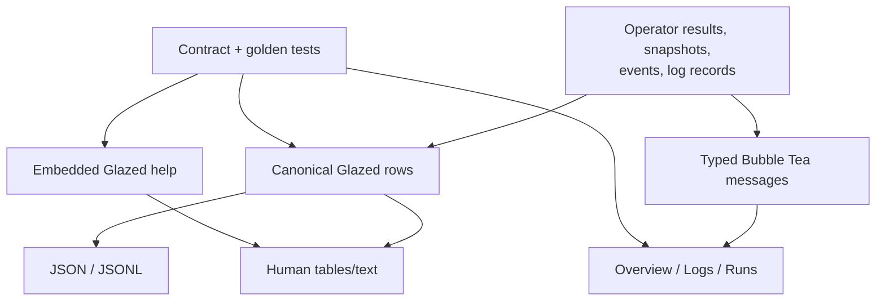

# CLI, TUI, Help, and Contract-Shaped Presentation

A program with several interfaces can either share a domain contract or share formatted text. `devctl` follows the first path. Cobra commands, Glazed renderers, JSONL streams, Bubble Tea views, and embedded help all depend on typed operator and runlog values. Presentation code decides how to show a fact; it does not decide whether the fact is true.

## Root composition

`cmd/devctl/main.go` constructs the application root. It:

1. adds the Glazed logging section;
2. creates a Glazed help system;
3. loads embedded Markdown from `pkg/doc`;
4. installs the help command once;
5. registers static devctl commands;
6. conditionally injects one requested dynamic plugin command.

This ordering matters. Static command registration establishes the reserved namespace before dynamic injection. Help is loaded without starting every plugin. Logging is initialized in the root persistent pre-run hook, making flags available to all commands.

The root also centralizes error-to-exit-code mapping. Operator errors, plugin command exit errors, cancellation, Cobra usage errors, and catalog failures are rendered consistently. A child command does not call `os.Exit` or invent its own exit convention.

## CLI as a typed adapter

Lifecycle commands convert fields and positional selections into `operator.UpRequest`, `DownRequest`, or `RestartRequest`. They pass an event sink when incremental output is requested, then convert results to Glazed rows.

The machine contract is based on fields:

```text
operation_id
operation
service
run_id
before
after
changed
status
error_code
error_message
```

Human tables are renderings of those fields. Scripts should request JSON or JSONL explicitly.

Streaming output uses one complete JSON object per line. This matters for long-running operations: an array cannot be valid until the final bracket is written, while JSONL consumers can process each event immediately.

```text
controller event
    -> canonical event row
    -> Glazed renderer
        -> table/text for human
        -> JSON object for batch
        -> compact JSONL for stream
```

The architecture tests cover JSONL framing and command behavior so the contract does not depend only on documentation.

## Command consolidation as architecture

The v2 CLI removed overlapping lifecycle forms:

| Previous form | Current form |
|---|---|
| `stop-service api` | `down api` |
| `logs --service api` | `logs api` |
| `logs --stderr api` | `logs api --stream stderr` |

This cleanup is not merely naming. Positional service selection is shared across lifecycle and logs commands. Removed commands do not remain as hidden aliases. The repository explicitly chose a breaking cleanup rather than preserving several semantic entry points.

That decision follows a useful rule: if two commands perform the same domain operation, keep one interface and migrate callers. Compatibility aliases are appropriate only when consumers and removal criteria justify them.

## TUI as an operator client

The TUI has three views:

- **Overview** for current services, desired state, phase, health, and actions;
- **Logs** for bounded structured records;
- **Runs** for attempt history and terminal outcomes.

`pkg/tui.Model` owns UI state: current view, dimensions, selection, modal input, confirmation, palette, in-flight operation state, and bounded log records. It does not own process state.

Bubble Tea commands invoke the controller and return typed messages:

```text
key event
  -> construct controller request
  -> tea.Cmd calls Controller
  -> result/error/snapshot becomes typed tea.Msg
  -> Update changes UI model
  -> View renders
```

`pkg/tui/messages.go` defines the messages crossing the asynchronous Bubble Tea boundary. The model tests use a fake `operator.Controller`, which demonstrates that the TUI depends on the public application interface rather than concrete supervisor internals.

## Reduced information architecture

The prior TUI contained separate models for dashboard, event log, pipeline, plugins, services, streams, and root navigation, plus action runners, stream runners, state watchers, and an event bus. The replacement removed thousands of lines and kept the operator tasks a heavy user needs most often.

This reduction works because durable state and journals already contain the needed information. A screen does not justify a separate model if it only presents another formatting of the same facts.

The three-view structure also exposes the fundamental runtime objects:

- Overview projects the current environment.
- Logs projects run journals.
- Runs projects immutable attempt history.

The UI organization follows domain structure rather than the internal package tree.

## Exact confirmation and command palette

Lifecycle operations can affect several processes. The TUI uses explicit selections and confirmations for destructive or broad actions. The command palette contains executable actions, not labels disconnected from behavior.

This is an interaction contract:

- the selected service set must be visible;
- the requested action must be named;
- confirmation must not be inferred from arbitrary key input;
- completion must produce a typed operation result;
- errors must remain visible after the asynchronous command returns.

These rules belong in model tests because they govern safety, not visual preference.

## Terminal bounds and untrusted output

Golden files cover `44x16`, `80x24`, and `120x30` terminal sizes. Narrow layouts reveal whether tables, status lines, help, and modal content assume unavailable width. The log view sanitizes service output and bounds retained records.

Presentation safety is layered:

| Layer | Protection |
|---|---|
| runlog framer | bounds a record |
| runlog reader | validates schema and journal identity |
| TUI model | bounds aggregate history |
| TUI renderer | sanitizes control characters and clips to dimensions |

No one layer substitutes for the others.

## Embedded Glazed help

`pkg/doc/doc.go` embeds `topics/*` and loads them into `help.HelpSystem`. The help entries use structured frontmatter for title, slug, topics, commands, flags, visibility, and section type.

The current topics include:

- user guide;
- scripting guide;
- profiles guide;
- plugin authoring;
- plugin migration;
- TUI guide;
- v2 upgrade.

Embedding operational documentation in the binary gives version alignment: `devctl help plugin-migration` describes the installed binary's contract rather than a website that may document another release.

The help content is not a substitute for command `--help`. Command help covers syntax and flags; tutorial entries explain sequences, ownership boundaries, failure modes, and migration.

## How presentation contracts are woven together



The same domain values support interactive and automated use. The formats are different because their consumers differ. The architecture remains coherent because those formats do not become competing sources of truth.

## Failure modes

| Failure | Architectural defense |
|---|---|
| Script parses a human table | Explicit JSON/JSONL renderers and scripting guide |
| Follow emits an unfinished JSON array | One object per line |
| TUI action differs from CLI action | Shared controller |
| Service output injects terminal controls | Sanitization before rendering |
| Long-running service fills TUI memory | Bounded record history |
| Tiny terminal panics or corrupts layout | dimension-aware rendering and goldens |
| Migration instructions drift from binary | embedded versioned help |
| Dynamic plugin startup breaks root help | no eager provider startup for help/completion |

## Candidate ecosystem guidance

- Make CLI and TUI adapters over one typed application boundary.
- Treat output fields and JSONL framing as public contracts.
- Centralize exit-code mapping at the executable root.
- Organize interactive views around domain objects and operator tasks.
- Keep human tables out of automation contracts.
- Embed detailed help when operational guidance must match the installed version.
- Test terminal bounds and untrusted output explicitly.
- Remove duplicate commands rather than retaining unowned compatibility aliases.

## Key points

- CLI, TUI, and help are different presentations of shared domain contracts.
- Glazed rows provide stable fields; JSONL provides incremental machine output.
- Bubble Tea messages carry typed results rather than scraped command text.
- Three views are sufficient because the domain model is explicit.
- Embedded help couples migration guidance to the installed binary.
- Golden and contract tests make presentation behavior reviewable.
