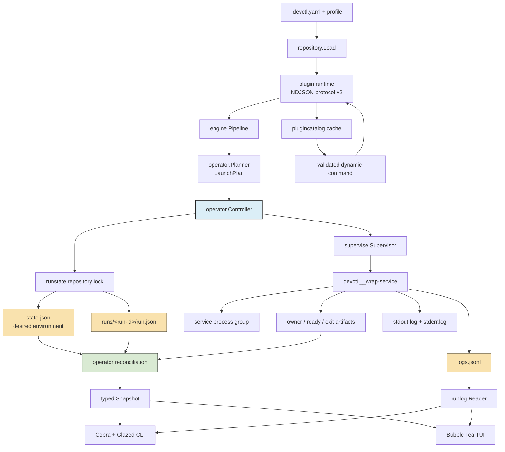

# Architecture Garden — devctl

This study examines `devctl` as a local development-environment operator. The repository is especially valuable to the Architecture Garden because it combines several patterns that recur across go-go-golems applications: declarative plugins, typed pipeline phases, wrapper-owned child processes, durable local state, structured logs, Cobra and Glazed command surfaces, embedded help, and a Bubble Tea terminal interface. The current design does not treat these as independent features. They are joined by one operator contract and one evidence model.

> [!summary]
> - The central pattern is **durable evidence plus reconciliation**. Process state is not inferred from a single PID or kept only in memory; it is reconstructed from versioned state, run records, process identities, wrapper artifacts, health results, and exit records.
> - The `operator.Controller` is a **shared application boundary**. CLI commands and the TUI submit typed requests and consume typed results instead of implementing separate lifecycle semantics.
> - The log system is a **dual representation**: exact raw streams remain available, while sequenced JSONL records provide stable query, follow, and rendering contracts.
> - Dynamic plugin commands demonstrate **validated metadata injection**. Cached discovery metadata can select a command, but execution revalidates the live provider before granting authority.
> - The architecture is strong where it has one owner for a fact. Its remaining debt is concentrated in coexistence with older low-level state and supervisor APIs, manual retention, polling, and a few test fixtures whose timing assumptions are narrower than the production contracts.

## Snapshot identity

Every conclusion in this directory is tied to a precise source state.

| Field | Value |
|---|---|
| Repository | `/home/manuel/workspaces/2026-07-07/prod-tiny-idp/devctl` |
| Canonical remote | `git@github.com:go-go-golems/devctl.git` |
| Analyzed ref | `task/prod-tiny-idp` |
| Code snapshot | `303e264ab9f0d9721fc8a03eac8ed95e822735c8` |
| Snapshot date | 2026-07-26 |
| Commit subject | `fix(operator): address lifecycle review findings` |
| Worktree state | Clean |
| Go module | `github.com/go-go-golems/devctl` |
| Primary ticket | `DEVCTL-OPERATOR-UX-001` |

The snapshot includes the fixes from pull request review #11: all selected wrappers start before health completion, log following observes durable exit artifacts, and reconciliation preserves successful health state. Future analysis should compare its source commit to this hash before treating behavioral claims as current.

## Reading path

The documents are ordered from the whole system toward individual mechanisms and then back toward ecosystem guidance.

1. [[Research/Software Architecture Garden/devctl/01 - Project Architecture Overview|Project Architecture Overview]] defines the system boundary, execution path, package responsibilities, and central invariants.
2. [[Research/Software Architecture Garden/devctl/02 - Durable State Process Identity and Wrapper Evidence|Durable State, Process Identity, and Wrapper Evidence]] studies versioned state, run identity, atomic publication, locking, and the wrapper handshake.
3. [[Research/Software Architecture Garden/devctl/03 - Reconciliation and the Shared Operator Boundary|Reconciliation and the Shared Operator Boundary]] explains desired versus observed state, lifecycle transactions, repair on read, and typed errors and events.
4. [[Research/Software Architecture Garden/devctl/04 - Structured Run Journals and Observable Execution|Structured Run Journals and Observable Execution]] covers raw streams, JSONL records, sequence cursors, bounded framing, query/follow behavior, and terminal detection.
5. [[Research/Software Architecture Garden/devctl/05 - Declarative Plugins and Validated Dynamic Commands|Declarative Plugins and Validated Dynamic Commands]] follows the NDJSON provider boundary from handshake through pipeline planning and top-level command injection.
6. [[Research/Software Architecture Garden/devctl/06 - CLI TUI Help and Contract Shaped Presentation|CLI, TUI, Help, and Contract-Shaped Presentation]] examines how several user interfaces remain clients of the same domain layer.
7. [[Research/Software Architecture Garden/devctl/07 - Architecture Evidence Debt and Ecosystem Guidelines|Architecture Evidence, Debt, and Ecosystem Guidelines]] evaluates the tests as executable architecture evidence, identifies limits, and proposes cross-project rules.

## Pattern map

The diagram shows the main architectural claim. Configuration and plugins describe what should run. The controller decides how lifecycle operations proceed. The wrapper owns the service process and its evidence. Reconciliation converts durable evidence into a current snapshot. Presentation surfaces read the snapshot and journal; they do not invent another process model.

## Pattern maturity summary

| Pattern | Maturity | Assessment |
|---|---|---|
| Desired environment plus immutable run records | Candidate ecosystem pattern | Separates current intent from execution history and gives every attempt stable evidence. |
| PID plus start-token ownership | Established locally | Prevents signaling a reused PID; supported by Linux-specific tests. |
| Atomic JSON publication plus repository lock | Established locally | Protects individual documents and multi-document lifecycle transactions. |
| Wrapper-owned request/owner/ready/exit handshake | Candidate ecosystem pattern | Makes detached process ownership observable across CLI invocations. |
| Reconciliation before mutation and snapshot | Candidate ecosystem pattern | Repairs stale derived state from durable evidence and prevents false status. |
| Start-all, then health-all lifecycle staging | Established locally | Supports services whose readiness depends on later services in the same plan. |
| Typed operator shared by CLI and TUI | Candidate ecosystem pattern | Removes duplicated lifecycle authority and permits independent clients. |
| Raw logs plus sequenced structured journal | Candidate ecosystem pattern | Preserves exact bytes while providing stable machine-oriented records. |
| Cursor-based follow with durable exit detection | Established locally | Supports resumption and natural termination after final records. |
| Declarative NDJSON plugins | Established locally | Keeps repository policy outside the core binary while retaining typed orchestration. |
| Cached dynamic command catalog with live revalidation | Candidate ecosystem pattern | Separates discovery performance from execution authority. |
| Cobra/Glazed commands with embedded Glazed help | Candidate ecosystem pattern | Unifies machine output, CLI fields, tutorials, and discoverability. |
| Three-view TUI as controller client | Candidate ecosystem pattern | Reduces terminal architecture to Overview, Logs, and Runs without duplicating supervision. |
| Contract tests and terminal goldens | Established locally | Protect schemas, command trees, JSONL framing, reconciliation, and visual bounds. |
| Manual run retention | Architecture debt | Preserves evidence safely but has no bounded cleanup policy. |
| Poll-based follow and TUI refresh | Emergent | Simple and correct at current scale; performance limits are not yet measured. |
| Coexisting older state/supervisor APIs | Architecture debt | The new operator boundary is clear, but lower-level historical surfaces still require a consumer audit. |

## Why devctl is a useful ecosystem study

Many architecture discussions begin from request/response servers or static build pipelines. `devctl` instead manages long-lived local processes across repeated invocations. This exposes facts that ordinary in-memory designs can avoid: the initiating command exits, children continue running, processes crash independently, PIDs are reused, logs outlive clients, and several interfaces may inspect or change the same environment.

The design responds by treating the filesystem as a durable coordination boundary without introducing a daemon. That decision is significant for the ecosystem. A daemon could own all processes and keep authoritative state in memory, but it would add installation, version skew, socket discovery, daemon failure, and shutdown concerns. `devctl` obtains persistence through explicit artifacts and reconstructs truth through reconciliation. This is not universally preferable, but it is a strong pattern for repository-local tools whose operators already share a filesystem.

The repository also demonstrates a productive division between extensibility and authority. Plugins may describe configuration, build steps, validation, services, and commands. They do not own the service process lifecycle. The CLI and TUI may initiate operations and render results. They do not own state transitions. The wrapper may capture process evidence. It does not decide repository policy. Each extension point is constrained by a named boundary.

## Cross-project comparison targets

This study introduces several candidates that should be tested against other repositories:

- Compare versioned atomic local state with `go-go-datadrop`, transcript tools, and other repository-local applications.
- Compare the typed operator boundary with deploy controllers, release-train tools, and long-running workflow CLIs.
- Compare run-scoped journals with `go-minitrace`, Watermill event logs, and application-specific audit trails.
- Compare validated command catalogs with Glazed command registration, xgoja provider declarations, and Widget registries.
- Compare embedded Glazed help plus structured output with other Cobra applications.
- Compare wrapper-owned process evidence with local demo systems in `tiny-idp`, generated application hosts, and dev servers.

The study does not promote these patterns by itself. It names the invariant, records evidence, and identifies where another project can confirm or disprove reuse.

