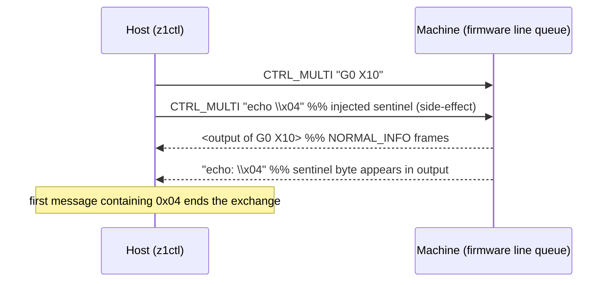

# Sentinel-Delimited Command Completion over an Ordered Line Queue

This note records a reusable pattern for **command/reply correlation over a
line protocol the host does not own**. A host that can only write commands into
a device's ordered line queue, and cannot frame the device's replies, can still
delimit each command's output by *injecting a sentinel through a side-effect
command* and splitting the reply stream on the sentinel. The pattern is
portable to CNC firmware, embedded serial shells, bootloaders, and Expect-style
automation. Its value is exactly matched by its hazard: **a constant sentinel
is a delimiter, not a correlation identifier**, and treating it as the latter
turns a FIFO convenience into a correctness axiom the peer never promised.

The pattern was observed in `z1ctl`'s Makera Z1 controller
(`makera-z1-cli/pkg/makera/client.go`). The machine firmware is
Smoothieware-derived, which is why the idiom is recognizable: it is the same
"echo a marker into the shell's line queue and wait for it to come back" trick
used across that family of CNC firmware and, more generally, across any
ordered-line shell that lacks a stable prompt.

> [!summary]
> - The host does not own the device's output stream, so it cannot frame
>   replies directly. It injects a sentinel by sending a command whose
>   *effect* is to emit the sentinel (`echo <EOT>`), then splits the FIFO
>   output on the sentinel byte.
> - Correlation is recovered **by position** (FIFO order + drain-before-send),
>   not **by value**. This is correct only under two axioms: strict FIFO of
>   the device's line queue, and *no late arrival* of a timed-out command's
>   output across the next exchange's boundary.
> - The second axiom is the one peers do not provide. The fix is to make the
>   sentinel **unique per command** (correlation by value) or to treat any
>   ambiguous timeout as a **session fault** (quarantine + resync), never as a
>   silently resumable exchange.
> - The pattern is reusable wherever a host commands a device through an
>   ordered line queue it cannot reframe. It must **not** be used where
>   replies are already framed, where the peer supports a correlation id, or
>   where a lost/delayed reply is a safety event rather than debug chatter.

## Why this note exists

While studying the `z1ctl` controller for the MZ1-005 ticket, the most
generative finding was not any single bug but the *mechanism* underneath half
of them: the `echo \x04` sentinel. Several communication defects
(late-sentinel desync, lossy shared queue, mid-session codec reassignment)
reduce to one design choice — using a **constant delimiter** as if it were a
**correlation identifier**. That choice is portable knowledge: any engineer
writing a controller for an ordered-line device will reach for the same trick,
and will hit the same failure unless the delimiter/identifier distinction is
named up front. This note exists to name it once, in a form that survives the
repository.

## Pattern statement

> **Law.** When a host cannot frame a device's replies, it may delimit
> per-command output by injecting a sentinel through a side-effect command and
> splitting the ordered reply stream on the sentinel. The sentinel is a
> **delimiter**: a constant sentinel recovers correlation only **by position**,
> which is correct solely under strict FIFO plus no-late-arrival. A correct
> design recovers correlation **by value** (a per-command nonce echoed by the
> peer) or, where the peer cannot echo a nonce, treats any ambiguous timeout as
> a **session fault** requiring quarantine and resynchronization — never as a
> silently resumable exchange. Motion or other non-idempotent commands are
> delivered **at-most-once**; an ambiguous outcome is reported as *unknown*,
> not *failed*, and is never retried.

The pattern deliberately does **not** promise: that a timed-out command did not
execute; that the next command's reply belongs to the next command; that
draining a buffer is equivalent to the old command having completed; or that a
constant sentinel is unique in time.

## Concrete architecture

The Makera Z1 link is a single TCP connection (port 2222, one client at a
time) carrying a framed binary protocol. The host writes a text command as a
`CTRL_MULTI` frame and a sentinel command immediately after; the firmware
processes its line queue in order, so when the sentinel's byte comes back,
everything before it belongs to the preceding command.



Ownership and lifecycle:

- **One reader** (`readLoop`) decodes frames and enqueues `Message`s onto a
  buffered channel; it is the only goroutine touching `Transport.Read`.
- **One mutex** (`cmdMu`) serializes a single `drain → write command → write
  sentinel → collect until sentinel` exchange. It does **not** serialize an
  *operation* (preflight + all commands + final status).
- **One sentinel constant**, reused for every command. The host `drain()`s the
  channel before each exchange so a stale reply cannot be mistaken for the
  current one — a position-based uniqueness fix.
- **One out-of-band realtime lane** (`? ! ~ 0x18 0x19 0x1A`) bypasses the
  exchange entirely; its replies are undifferentiated messages on the same
  queue.

## Implementation details

The sentinel is defined literally (`makera-z1-cli/pkg/makera/client.go`):

```go
// sentinel terminates a command's output. The firmware processes its line
// queue in order, so when `echo \x04` comes back, everything before it
// belongs to the command that preceded it. Confirmed on hardware, where the
// reply arrives as a NORMAL_INFO frame carrying "echo: \x04".
const (
	sentinelCmd  = "echo \x04"
	sentinelByte = "\x04"
)
```

The exchange (`commandUnchecked`) writes the command and the sentinel back to
back, then collects until a message contains the sentinel byte:

```go
c.drain()
c.write(c.proto.EncodeCommand([]byte(cmd)))
c.write(c.proto.EncodeCommand([]byte(sentinelCmd)))   // "echo \x04"
for {
    select {
    case m := <-c.msgs:
        if strings.Contains(m.Text, sentinelByte) { return out, nil }
        ...
    case <-deadline.C:
        return out, errors.Errorf("timeout after %s waiting for %q ...", ...)
    }
}
```

Two details are load-bearing for the failure analysis:

1. The sentinel is a **constant**, not a per-command value. There is no
   request id, sequence number, or nonce.
2. Completion is **inferred** by observing the sentinel, not **asserted** by
   the firmware. A timeout returns with no knowledge of whether the command
   executed.

The framing codec strips only **trailing** CR/LF
(`makera-z1-cli/pkg/makera/protocol.go`, `EncodeCommand` =
`bytes.TrimRight(data, "\r\n")`), so a single frame may carry multiple logical
lines — relevant to the companion classifier pattern, not to this one directly,
but it shows the peer's line queue is the real framer.

The wire specification is in `makera-z1-cli/docs/protocol.md`; the framing
codec (CRC-16/CCITT, no byte-stuffing, documented false-header lock-on) is in
`makera-z1-cli/pkg/makera/frame.go`.

## Behavioral contract

**Guaranteed (under the two axioms):**

- Replies are delivered to the host in the order the firmware emits them.
- Within one exchange, the host receives exactly the output produced between
  the command and the sentinel, provided the sentinel is observed.
- The realtime lane can preempt a command exchange (feed hold, jog stop).

**Not guaranteed:**

- That a timed-out command did not execute (the honest outcome is *unknown*).
- That a late sentinel from command *N* will not terminate the exchange of
  command *N+1*.
- That draining the channel proves the old command finished — it only
  discards whatever has arrived so far.
- That the sentinel is unique across a reconnect or across a long job.
- That alarms and safety events on the shared queue survive a drain or a
  full buffer.

## Mathematical / CS foundations

This is the part the MZ1-005 study developed in depth; the portable summary is
here.

**The line queue is a FIFO channel**, i.e. a total order on messages under
Lamport happens-before (`→`):

```
send(c_i) → send(c_j)   ⇒   recv(r_i) → recv(r_j)        (FIFO axiom)
```

**The sentinel is a separator.** Splitting a byte stream `w` on a separator
`s` is a monoid homomorphism from the free monoid on bytes to the free monoid
on *messages*: `split(w₁ · w₂) = split(w₁) · split(w₂)`. The pattern turns an
unbounded stream into a sequence of messages. The `echo` trick exists because
the host does not own the output stream: it can only inject a separator by
sending a command whose *effect* is to emit it. So this is *injected
separation via side-effect*.

**Correlation is the inverse problem:** given a stream of sends
`c₁, c₂, …` and a stream of reply segments `r₁, r₂, …`, recover the map
`c_i ↦ r_i`.

- With a **constant** separator, the map is recovered **by position** under
  the FIFO axiom **plus** the *no-late-arrival* axiom: a timed-out `c_i`'s
  segment must not be delivered after `send(c_{i+1})`. The peer does not
  promise this; the host enforces a weak version by draining before send,
  which only discards what has *already* arrived.
- With a **unique** separator (a per-command nonce `s_i`), the map is
  recovered **by value**: `correlate(c_i, r) ⇔ r carries s_i`. A late segment
  with the wrong `s_i` is simply ignored, so correctness needs the FIFO axiom
  alone.

**Collision probability (constant separator).** Let `p_t` be the per-command
timeout probability and `p_l` the probability a late sentinel lands in the next
exchange's window. Per-command desync is `p_t · p_l`; over a job of `n`
commands the probability of at least one desync is
`1 − (1 − p_t p_l)^n ≈ 1 − e^{−n p_t p_l}`. With illustrative `p_t = 10⁻³`,
`p_l = 0.5`, `n = 10⁴`: `≈ 1 − e^{−5} ≈ 0.993` — almost certain over a long
job, rare only because `p_t` is small in benign conditions. A unique
separator drives the collision term to **zero** (a late sentinel carries the
wrong value), making the argument **structural** rather than probabilistic.

**Nonce uniqueness bound.** For a `b`-bit monotonic, *reconnect-persistent*
nonce and `N` commands in flight at once, uniqueness requires `2^b > N`. A
per-session counter reset to 0 on reconnect collides with a late reply from
the previous session; the nonce must be globally monotone (clock-derived or
persisted). With `b = 32`, wraparound is ~49 days at 1000 cmds/s — safe; `b =
16` is ~65 s — too short for long jobs.

**Two-generals / delivery semantics.** Over an unreliable channel,
exactly-once is impossible without idempotency. Motion is non-idempotent, so
its safe delivery semantic is **at-most-once**: sacrifice the move on
ambiguity rather than risk a duplicate. The honest return for a timed-out
motion command is *unknown*, not *failed* — which is why `z1ctl`'s no-retry
rule is correct and why a "retry on timeout" is wrong even though it feels
helpful.

**Time.** A timeout is a wall-clock bound, not a causal proof (FLP: you cannot
detect a crashed peer purely by message passing). So quarantine-on-timeout is
the safe choice: rather than distinguish "slow" from "dead" (impossible
asynchronously), treat an ambiguous timeout as a session fault and *prove*
recovery by re-handshaking.

## Design-pattern vocabulary

The pattern is known under several names; naming them helps a reader
recognize it in other codebases and avoid re-deriving the failure.

- **In-band signaling with a sentinel/marker** — the general
  networking/telecom term: control information embedded in the same channel as
  data, delimited by a reserved sequence. The echo-EOT is in-band signaling at
  the command-completion layer.
- **Sentinel / flag-byte framing** (HDLC `0x7E`, SLIP `0xC0`, PPP) — the
  byte-level analogue. Here the separator is a *line* echoed back, not a byte
  in the stream, but the self-synchronization problem is the same family.
- **Echo marker / command-completion sentinel** — the embedded serial-shell
  idiom. Smoothieware/GRBL-derived firmware (the Makera/Carvera lineage), U-Boot,
  BusyBox getty, and Expect-style automation all inject a unique prompt or
  marker and wait for it when the shell lacks a stable prompt. The `echo`
  variant is specifically the trick for a shell that *echoes* input.
- **Magic cookie** — an opaque token used to delimit or identify; the EOT byte
  is a cookie.
- **Correlation by sequence position vs. by value** — the distributed-systems
  framing. A constant delimiter correlates by position; a nonce correlates by
  value. The whole correctness argument is the move from the former to the
  latter (or to quarantine).

Related, deliberately distinguished:

- **Length-prefixed framing** is the alternative when the host *can* frame the
  peer (or the peer self-frames). This pattern is for when it cannot.
- **Heartbeat / dead-man** is a *liveness* mechanism (absence ⇒ stop); the
  sentinel is a *delimiting* mechanism (presence ⇒ boundary). `z1ctl`'s jog
  keepalive is the heartbeat counterpart and is the model fail-safe design
  this pattern should aspire to.

## Why the tempting alternatives are wrong

- **"Just retry on timeout."** Motion is non-idempotent; a retry can execute
  the move twice. Correct: at-most-once + quarantine.
- **"Drain harder / wait longer before the next command."** A longer drain
  only discards what has *arrived*; a late sentinel arriving *after* the drain
  and *before* the new sentinel still desyncs. The position-based fix cannot
  close a position-independent failure.
- **"Use a longer command timeout."** A timeout is a bound, not a proof; a
  longer bound masks a dead peer and does not remove the late-sentinel
  collision, which is cumulative in job length.
- **"Treat the sentinel as a request id."** It is a constant; it carries no
  identity. The fix is to *give it* identity (a nonce) or to stop trusting
  position (quarantine), not to read identity into a delimiter.

## Failure modes and tricky details

These are the concrete defects observed in `z1ctl`, each a symptom of using a
constant delimiter as a correlation identifier (full evidence in MZ1-005):

- **Late-sentinel desync (MC-03).** After a timeout, `commandUnchecked`
  returns and releases `cmdMu`; the firmware may still emit the late output and
  the late `0x04`. The next exchange's `drain()` discards it *if it has
  arrived*, but is powerless if it arrives after the drain and before the new
  sentinel — a late sentinel from command *N* terminates command *N+1*. The
  cumulative probability grows with job length (see above).
- **Shared lossy queue (MC-06).** All inbound classes (alarms, replies,
  telemetry, chatter) share one FIFO with drop-oldest, and `drain()` runs
  before each exchange. A drain can discard a safety event. The delimiter
  problem forces a single shared stream; the fix separates QoS classes.
- **Mid-session codec reassignment (MC-04).** `ProtocolFromAnnouncement`
  matches substrings in reply text and reassigns the codec unsynchronized; an
  ordinary reply quoting the announcement phrase can switch dialects while
  bytes from the old dialect are in flight. This is the information-flow dual:
  untrusted reply data writing a trusted control variable. The immutable-
  after-handshake rule is the same discipline as "don't let a delimiter
  impersonate an identifier."
- **Short writes (MC-05).** `write()` ignores the `n` from
  `Transport.Write`; a partial command or sentinel frame is treated as
  complete. The sentinel split then never observes a sentinel — a silent
  timeout.
- **Non-self-synchronizing framing (MC-10).** No byte-stuffing means a false
  header can lock the decoder and swallow frames until the bare footer fails;
  `Drops` is a counter, not a session fault. Desync at the *framing* layer
  mirrors desync at the *sentinel* layer.

## Testing and verification

The MZ1-005 study proposes protocol-level gates; the subset specific to this
pattern:

- **Late-sentinel fault injection:** time out an exchange, then deliver its
  sentinel during the next exchange; assert the next command is not
  mis-correlated and the session quarantines.
- **Nonce monotonicity:** assert the nonce is monotonic across reconnects (a
  reconnect-persistent counter or clock derivation), so a late reply from the
  old session carries a strictly smaller value.
- **At-most-once motion:** fault-inject a timeout on a motion command; assert
  it is reported *unknown*, never retried, and the session quarantines.
- **Drain-vs-safety:** fill the shared queue, deliver an alarm, then `drain()`;
  assert the alarm survives (this is the QoS-separation test, but it exists
  because of the single-stream consequence of the sentinel design).
- **Property/fuzz:** for any interleaving of sends and late arrivals, the
  correlation map is correct (no command receives another's output).

## Applicability and non-applicability

**Use when:**

- The host commands a device through an ordered line queue it cannot reframe.
- The device has no native request/reply correlation id and no stable prompt.
- A lost or delayed reply is operational (debug, status), not a safety event,
  *or* safety events are carried on a separate latched channel.

**Do not use (as-is) when:**

- The peer already frames replies (use length-prefix/framing directly).
- The peer supports a correlation id (use it — correlation by value for
  free).
- A delayed reply is itself a safety event and there is no separate safety
  channel. Then the constant-sentinel shared stream is the wrong substrate;
  quarantine + QoS separation become mandatory, not optional.
- Commands are idempotent and cheap and the peer is reliably reachable — then
  at-least-once + dedup may be simpler than sentinel discipline.

## Candidate ecosystem guidance

Rules portable to any command-control line protocol, to be compared with other
repositories before promotion to `Validated`:

1. **Name the delimiter.** A constant sentinel is a delimiter; never treat it
   as a correlation identifier. If you need identity, give every command a
   unique value.
2. **Prefer correlation by value.** A per-command nonce (monotonic, reconnect-
   persistent, ≥32 bits) makes a late reply harmless. If the peer cannot echo
   a nonce, quarantine on timeout instead.
3. **At-most-once for non-idempotent commands; report *unknown*, not
   *failed*, on timeout; never retry on ambiguity.**
4. **Quarantine, don't resume.** Any ambiguous timeout, partial write, decoder
   loss, or late sentinel is a session fault: close, reconnect, re-handshake.
   Recovery is proof-based, not timer-based.
5. **Separate safety from chatter.** A single shared FIFO with drop-oldest is
   correct for telemetry and wrong for alarms; the delimiter's single-stream
   consequence demands QoS separation.
6. **Freeze the codec after handshake.** Untrusted reply text must not write
   control-plane variables.

## Open questions

- Can the Makera/community firmware be extended to echo a per-command nonce
  (e.g. `#<id>` prefix), which would move this design from quarantine-on-timeout
  to correlation-by-value with no host-side work? (Community firmware is open
  source; stock is not.)
- Is the cumulative-desync probability (`1 − e^{−n p_t p_l}`) measurable on
  hardware over a long job, to size the quarantine deadline from data rather
  than from an illustrative `p_t`?
- Does the pattern compose cleanly with a heartbeat/dead-man lane, or do they
  share a state-machine region that should be modeled once (TLA⁺)?

## Evidence and references

- `makera-z1-cli/pkg/makera/client.go` — `sentinelCmd`/`sentinelByte`,
  `commandUnchecked`, `drain`, `deliver`, `readLoop`, protocol reassignment.
- `makera-z1-cli/pkg/makera/protocol.go` — `EncodeCommand` (trailing newline
  strip), `ProtocolFromAnnouncement`.
- `makera-z1-cli/pkg/makera/frame.go` — framing, CRC-16/CCITT, false-header
  lock-on.
- `makera-z1-cli/docs/protocol.md` — wire protocol reference.
- docmgr ticket `MZ1-005` (in-repo, branch `task/cnc-control-dropcut`): the
  full evidence-led study — wire analysis, CS theory, mathematical
  underpinnings, target design, gates F-1..F-10, decision record D1..D11.
- Theory: Lamport, *Time, Clocks, and the Ordering of Events* (happens-before,
  FIFO channels); Alpern & Schneider (safety/liveness); Fischer–Lynch–Paterson
  (FLP, timeout-as-signal); the two-generals problem (at-most-once for
  non-idempotent commands); HDLC/SLIP framing (sentinel/flag self-
  synchronization).
