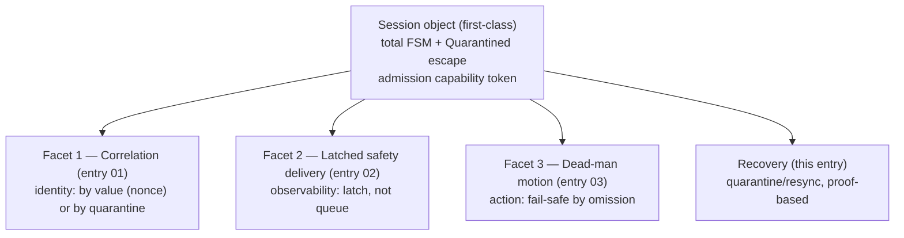

# First-Class Session Object with a Typed State Machine, Unique Correlation, and Quarantine Recovery

This note records the **overarching pattern** of a command-control protocol
session: the link is not a set of locally-correct I/O routines that share a
connection, a mutex, and a channel by convention; it is a **first-class session
object** that owns a **typed, total state machine**, admits operations under a
**unique correlation token** (a linear capability), and recovers from any
ambiguity through a **quarantine/resync discipline** rather than a silent
resume. The three subpatterns documented separately — sentinel-delimited
correlation (entry 01), latched safety delivery (entry 02), and dead-man
fail-safe motion (entry 03) — are *facets* of this one session: correlation
is the session's identity layer, the latch is its safety-observability layer,
and the dead-man is its fail-safe action layer. This entry is the skeleton
that holds them in one shape.

The pattern was observed as an *absence* in `z1ctl`: the controller serializes
individual command exchanges with a mutex but has no operation-spanning
transaction; it correlates by a constant sentinel rather than a unique token;
it has no authoritative session state, so illegal transitions are
representable; and it treats ambiguous timeouts as silently resumable rather
than as session faults. The review's SYS-02 finding names this directly: the
controller lacks "one authoritative session model." The proper pattern is the
remedy, and it is the one whose removal makes the subpatterns unnecessary to
argue in isolation — get the session right and most defects dissolve.

> [!summary]
> - A command-control session is a **first-class object** owning the
>   connection, the codec, an admission capability, and a typed state. It is
>   not a grab-bag of routines sharing globals.
> - Its state machine is **total** (every (state, event) pair is defined) and
>   has a **`Quarantined` escape** reached by *any* ambiguity whose effect
>   cannot be bounded — timeout, partial write, decoder loss, late sentinel,
>   protocol anomaly. Illegal transitions go to `Quarantined`, never to a
>   silent no-op.
> - Operations are admitted under a **unique, linear correlation token**
>   (capability): preflight → decide → all commands → release is one atomic
>   transaction; the token is unforgeable outside the package, so a
>   state-enabling action without it is a compile error, not a convention.
> - Recovery is **proof-based, not timer-based**: quarantine closes,
>   reconnects, re-handshakes, and returns to `Ready` only when a fresh
>   handshake proves a clean decoder and identity. It never returns to
>   `Ready` by a timeout.
> - The three subpatterns are this session's facets: **correlation** (01,
>   identity), **latched safety delivery** (02, observability), and
>   **dead-man motion** (03, fail-safe action). Build the session and the
>   facets compose; build the facets without the session and they fight each
>   other for the same mutex and channel.

## Why this note exists

Entries 01–03 each document a *facet* — correlation, delivery QoS, fail-safe
action. Each is reusable on its own, but in `z1ctl` they share one defect
that none of them, individually, fixes: **there is no session object**. The
mutex serializes one exchange, not one operation; the sentinel correlates one
command, but only by convention; the queue multiplexes all traffic with one
QoS; the codec is mutable from reply text; the classifier trusts one token.
Each is a local optimization; together they are a protocol with no invariant
layer. This entry names the invariant layer — the session — and shows that
the three facets are its projections. It exists so a future engineer builds
the skeleton first and hangs the facets on it, rather than building the
facets and discovering they have nothing to hang on.

## Pattern statement

> **Law.** A command-control link is governed by a first-class **session
> object** whose state space is a **total finite-state machine** with a
> universal `Quarantined` escape; whose operations are admitted under a
> **unique, linear capability token** minted by preflight and consumed by
> release; whose correlation is **by value** (a per-command nonce) or, where
> the peer cannot echo one, **by quarantine-on-timeout**; and whose recovery
> from any unbounded ambiguity is **proof-based** (close, reconnect,
> re-handshake) never **timer-based** (wait and hope). The session is the
> single authority: a state-enabling or motion action without the admission
> token is unrepresentable; an ambiguous exchange is a session fault, not a
> resumable one; a stop is always admissible out-of-band.

The pattern deliberately does **not** promise: that the peer is correct (it
guarantees only that the *host's* model is total and recovered); that
quarantine is fast (it is correct, and correctness is the priority); that
every command is delivered (motion is at-most-once, ambiguous on timeout);
or that the session is crash-fault-tolerant across host reboots without
persistent state (the nonce must be reconnect-persistent; see entry 01).

## The session and its three facets

The session has one job: make the protocol's invariants **structural** rather
than probabilistic. Its three facets are the layers where those invariants
live:



| Facet | Question it answers | Subpattern |
|---|---|---|
| Correlation | "which reply belongs to which command?" | Sentinel-delimited completion → nonce or quarantine (entry 01) |
| Safety delivery | "did the safety event survive to be observed?" | Latched safety channel (entry 02) |
| Fail-safe action | "does the hazard stop when authority ceases?" | Dead-man keepalive (entry 03) |
| Admission | "is this action authorized in this state?" | Linear capability token (this entry) |
| Recovery | "what happens when an exchange is ambiguous?" | Quarantine/resync (this entry) |

Build the session and the facets compose: the token is the session's
authority; the nonce is its correlation; the latch is its observability; the
dead-man is its fail-safe action; quarantine is its recovery. Build the
facets without the session and they contend: the sentinel's drain races the
latch's ack; the dead-man's stop fights a command exchange for the same mutex;
the classifier's authority is a string check a caller can forget.

## Concrete architecture (the target)

The session is one object owning the connection, the codec, the admission
token, and the live state. Its state machine:

```text
 Disconnected
   → Handshaking        (connect + protocol negotiation; codec frozen here)
   → Ready              (read-only; no admission token held)
   → Admitted(token)     (preflight passed; token held; one operation may run)
   → Executing          (commands of the admitted operation are in flight)
   → Held               (feed-hold active; motion paused)
   → Completing         (final status read; token release pending)
   → Ready

 Quarantined            (any ambiguous timeout, partial write, decoder loss,
                         protocol anomaly, drop count > 0, half-open conn)
   → close → reconnect → Handshaking

 Out-of-band (always active, never blocked by the above):
   Stop region:  Suspend / Abort / FeedHold / JogStop   (ClassStop)
   Telemetry:    status snapshots, alarms (latched, entry 02)
```

Admission is a linear capability:

```go
type Session struct{ ... }
type admitToken struct{ _ opaque }   // unexported: unforgeable outside pkg

func (s *Session) Admit(ctx, class, opts) (admitToken, PreflightReport, error)
func (s *Session) Execute(ctx, t admitToken, req) (MotionResult, error)
func (s *Session) Release(t admitToken)               // consumed; linear
func (s *Session) ReleaseFeedHold(ctx, t admitToken, opts) error // needs the hold token
```

A caller cannot construct `admitToken` without `Admit`; `Execute`/`Release`
will not compile against a non-token. `CycleStart()` (the leak in `z1ctl`'s
`jobctl.go`) becomes `ReleaseFeedHold(ctx, holdToken, ...)`, which fails to
typecheck without the `holdToken` that proves the matching hold was
established in this session.

## Implementation details (what the session replaces in z1ctl)

The session object replaces a set of conventions. In `z1ctl` today:

- **One mutex** (`cmdMu`, `client.go`) serializes one `drain → write →
  collect` exchange. It does **not** serialize an operation (preflight + all
  commands + final status are separate acquisitions) — the TOCTOU of MC-02.
  The session's `Admitted(token)` state holds the lock for the whole
  operation span.
- **One constant sentinel** (`echo \x04`, `client.go`) correlates by
  position, not value — the late-sentinel desync of MC-03. The session's
  nonce correlates by value, or quarantines on timeout (entry 01).
- **One mutable codec** (`c.proto`, reassigned from reply text in `readLoop`)
  — the dialect-switch race of MC-04. The session freezes the codec after
  `Handshaking`; announcements outside it are logged and ignored.
- **One lossy shared queue** (`msgs`, cap 256, drop-oldest, drainable) —
  MC-06. The session dispatches by class to a latched safety channel plus
  lossy telemetry/log channels (entry 02).
- **One fail-open classifier** (`Classify`, first-token, unknown → Read) —
  MC-01. The session's generic path holds only a read capability; a
  fail-closed total grammar is enforced by the *type* of the capability.
- **No authoritative state** — SYS-02. The session's total FSM makes illegal
  transitions unrepresentable.
- **Silent resume on timeout** — MC-03. The session's `Quarantined` escape
  makes any ambiguity a session fault.

The dead-man jog (entry 03) is the one facet `z1ctl` already implements
correctly, and it composes cleanly: its keepalive lane and stop region are
the orthogonal region of the session's statechart, never blocked by the
admission lock.

## The five invariants of the session

1. **Totality of the transition function.** `δ: S × E → S ∪ {Quarantined}`
   is a total function: every (state, event) pair is defined. An event with no
   defined effect goes to `Quarantined`, never to a silent no-op. (Entry 02's
   drain-invariant and entry 01's no-late-arrival axiom are instances of
   totality: an undefined input is handled, not dropped.)
2. **Codec immutability after handshake.** `c.proto` is set in `Handshaking`
   and frozen for the session; untrusted reply text (an announcement) is a
   sink, never a source, for the codec. (The information-flow half of MC-04;
   the quantitative half is the CRC authentication gap, entry 01 §6.7.)
3. **Linear admission capability.** `Admit` mints an unforgeable token;
   `Execute`/`Release` consume it; a state-enabling or motion action without
   it is a compile error. (MC-02 and MC-08; the type-theoretic form of "the
   authority is a value, not the absence of a check.")
4. **Quarantine on any unbounded ambiguity.** Triggers: command timeout,
   short write, decoder loss (`Drops > 0`), a late sentinel for a
   non-current nonce, an announcement outside `Handshaking`, a half-open
   connection. Recovery is proof-based (close → reconnect → re-handshake),
   never timer-based. (The union of MC-03, MC-04, MC-05, MC-10.)
5. **Out-of-band stop, always.** The Stop region (Suspend, Abort, FeedHold,
   JogStop) is an orthogonal statechart region active in every state; it
   never takes the admission lock. (Preserves `z1ctl`'s correct
   `cmdMu`-exempt design for stop; the dead-man of entry 03 lives here.)

## Mathematical / CS foundations

### Labeled transition systems and totality

The session is an LTS `(S, s₀, A, →)` whose transition relation is a **total
function** `δ: S × E → S ∪ {Quarantined}`. Totality is the fail-closed
principle (entry 01 §5.8) applied to *state*: an event with no defined effect
goes to the fault state, not to a silent no-op. The guarantee totality buys:
**there is no input that leaves the session in an undefined state** — which
is exactly where MC-03 (late sentinel in an undefined post-timeout state),
MC-04 (codec switch in an undefined mid-session state), and SYS-02 (no
authoritative model) live today.

### State-space size: exhaustively testable / model-checkable

The proposed machine has `|S| ≈ 8` (Disconnected, Handshaking, Ready,
Admitted, Executing, Held, Completing, Quarantined) and `|E| ≈ 15`. The
transition table is `8 × 15 = 120` cells — small enough to **exhaustively**
test and to model-check in TLA⁺ in minutes. The cost of the fix is one struct
and a `switch`; the guarantee is that "can the session be in state X after
event Y?" always has a defined answer. State-space minimization (Hopcroft)
confirms the 8 states are distinguishable, so no collapse is needed.

### Linearizability and the admission transaction

An operation is a **transaction**: preflight → decide → all commands →
final status, under one admission lock, appearing to occur at a single
instant between `Admit` and `Release`. This is **linearizability** of the
operation (entry 01 §5.9). The linear capability token makes the transaction
*linear* (consumed once), borrowing from linear logic / session types: a
session of type `Admit · Command* · Release` must be used exactly once, in
order. MC-02 (TOCTOU) and MC-08 (cycle-start without a token) are both
violations of this linearity — one by interleaving, one by skipping `Admit`.

### Refinement: implementation LTS ⊑ service LTS

The session is correct when its implementation LTS **refines** the service
spec LTS: every trace of the implementation is a trace of the spec. The
spec's safety properties (no motion without admission; no codec change
outside Handshaking; an unacknowledged alarm is never lost) are preserved by
refinement, so proving them on the spec proves them on the implementation.
The model-checking route (TLA⁺/PlusCal) writes the session LTS and asks for
a trace violating a property — e.g. "exists a reachable state where
`Executing` is entered without `Admitted`" (catches MC-02/MC-08), or "exists
a trace where a late sentinel terminates a different command" (catches
MC-03). This is the §5.14 verification route made concrete.

### Failure models and the quarantine decision

The session tolerates **crash-recovery + omission** (entry 01 §5.4): the
peer may crash and restart, and messages may be lost or duplicated. It
treats the strongest ambiguity — a **half-open connection** (one side
believes it is alive while the other has dropped it) — as a session fault,
because a half-open connection silently swallows writes until a TCP timeout.
The decision rule is: **any ambiguity whose effect cannot be bounded by the
session's own state goes to `Quarantined`.** Bounded effects (a dropped
telemetry snapshot, entry 02) are handled in-place; unbounded effects (did
the command execute? did the codec change? did the frame desync?) are not
guessable, so they quarantine. This is the formal version of "when in doubt,
reconnect."

### Compositional assume-guarantee with the facets

Each facet is a component with an assume-guarantee contract (entry 01
§6.10): the latch assumes the dispatcher classifies at decode (entry 02); the
nonce assumes the peer echoes it (entry 01) or the session quarantines on
timeout; the dead-man assumes a device-side watchdog (entry 03). The session
is the composition: it guarantees the admission lock, the frozen codec, and
the quarantine escape that the facets assume. Prove each facet's contract
under the session's guarantees and the whole composes; build the facets
without the session and the contracts have no common substrate, which is the
`z1ctl` defect.

## Design-pattern vocabulary

- **Session object / first-class session** — the protocol's state is an
  object, not scattered locals. The OO/protocol-design term.
- **Total finite-state machine with a fault/panic state** — the LTS whose
  `δ` is total and whose undefined cases go to a single recovery state.
  Classic in protocol verification (SDL, Estelle, TLA⁺).
- **Linear capability / session type** — admission as an unforgeable,
  consumed-once token; a session of type `Admit · Command* · Release`. From
  linear logic and session types (Honda, Takeyama, Vasconcelos).
- **Capability-based authorization** (entry 01 §5.7) — authority is a value,
  not the absence of a check; the generic path gets only a read capability.
- **Quarantine / resynchronization / reconnection** — the recovery
  discipline: proof-based, not timer-based. The distributed-systems analogue
  of "close and reopen" after an ambiguous failure (vs. retry-in-place).
- **Atomic transaction / linearizability** — the operation as one
  indivisible unit spanning preflight through release.
- **Orthogonal regions (statecharts)** — the Stop region is always active,
  never blocked by the command region; the dead-man lives here.

Deliberately distinguished:

- **Per-exchange mutex** (what `z1ctl` has) serializes one exchange, not one
  operation — it is *not* a session. The session serializes the operation.
- **Retry-on-timeout** is the opposite of quarantine: it bets the peer did
  not act. Quarantine bets it might have, and refuses to find out the hard way.
- **A bigger buffer / longer timeout** is parameter tuning; the session is
  structure. No parameter fixes an undefined state.

## Why the tempting alternatives are wrong

- **"Just hold the mutex for the whole operation."** Necessary but not
  sufficient: it fixes MC-02 but not MC-03 (late sentinel), MC-04 (codec),
  MC-08 (token). The session adds the *state* and the *token* the mutex
  lacks.
- **"Add a retry-on-timeout for commands."** Motion is non-idempotent; a
  retry can double-execute (entry 01 §5.3). The session quarantines instead,
  reporting *unknown*, never retrying motion.
- **"Treat timeout as failure and resume."** Resuming assumes the session
  is in a known state; a late sentinel / codec switch / half-open connection
  means it is not. Quarantine proves recovery by re-handshake.
- **"Make the buffer bigger / timeout longer."** Lowers probabilities, never
  reaches zero, does nothing for `drain()` or undefined states. The session
  makes the invariants structural (probability 0).
- **"Keep stop on the same lock for simplicity."** A stop that waits for the
  admission lock is a safety regression; a dead-man that waits is lethal
  (entry 03). The orthogonal Stop region is non-negotiable.

## Failure modes the absence of a session produces

Each is a facet defect that the session makes unrepresentable:

- **MC-02 (TOCTOU):** preflight and execution are separate mutex acquisitions;
  another goroutine interleaves. The session's `Admitted(token)` spans the
  operation.
- **MC-03 (late sentinel):** a timed-out exchange leaves a late sentinel that
  desyncs the next. The session quarantines on timeout; the nonce (or
  quarantine) makes the late sentinel harmless or session-fatal.
- **MC-04 (codec race):** reply text reassigns the codec unsynchronized. The
  session freezes the codec after `Handshaking`.
- **MC-08 (cycle-start leak):** `CycleStart()` writes `~` with no token. The
  session requires `ReleaseFeedHold(ctx, holdToken, ...)`.
- **MC-10 (false-header, no quarantine):** `Drops` is a counter, not a fault.
  The session quarantines on `Drops > 0` before motion admission.
- **SYS-02 (no authoritative model):** illegal transitions are representable.
  The total FSM makes them go to `Quarantined`.

## Testing and verification

- **Totality:** enumerate all `|S|·|E|` cells; assert each is defined (goes
  to a named state or `Quarantined`), never undefined.
- **No-Executing-without-Admitted:** a TLA⁺/model-check trace proves no path
  reaches `Executing` without `Admitted` (catches MC-02/MC-08).
- **Quarantine-on-ambiguity:** fault-inject each trigger (timeout, short
  write, `Drops > 0`, late sentinel, out-of-handshake announcement,
  half-open); assert the session reaches `Quarantined`, not `Ready`.
- **Proof-based recovery:** from `Quarantined`, assert the session returns to
  `Ready` only after a fresh handshake; never by a timeout.
- **Stop-always-admissible:** in every state, issue a stop; assert it is
  delivered without waiting on the admission lock (the orthogonal region).
- **Facet composition:** with all three facets wired, run the entry-01/02/03
  tests; assert each passes under the session (the contracts compose).

## Applicability and non-applicability

**Use when:**
- A command-control link has safety-relevant actions and an unreliable or
  ambiguous peer (CNC, robotics, industrial control, any host commanding a
  device it does not own).
- Any timeout, loss, or desync could leave the session in an unknown state.
- Multiple facets (correlation, safety delivery, fail-safe action) must
  coexist without contending for shared globals.

**Do not use when:**
- The peer is a pure function with no state and no ambiguity (a stateless
  query API needs no session; a REST GET is fine).
- The link is purely best-effort and lossy with no safety content (a
  telemetry-only stream is entry 02's lossy channel alone).
- A single facet suffices and there is no admission/authorization question
  (a read-only status poller needs correlation, not a full session).
- The cost of quarantine (reconnect/re-handshake) is unacceptable and the
  peer provably never produces ambiguity — a rare and strong assumption.

## Candidate ecosystem guidance

1. **Make the session first-class.** One object owns the connection, the
   codec, the admission token, and the live state. No globals, no scattered
   locals.
2. **Make the state machine total with a `Quarantined` escape.** Every
   (state, event) is defined; undefined goes to `Quarantined`, never to a
   silent no-op.
3. **Admit under a linear, unforgeable capability token.** `Admit` mints,
   `Execute`/`Release` consume; a state-enabling action without it is a
   compile error.
4. **Freeze the codec after handshake.** Untrusted reply text is a sink,
   never a source, for control-plane variables.
5. **Quarantine on any unbounded ambiguity; recover by proof, not timer.**
   Close, reconnect, re-handshake. Never resume silently from an ambiguous
   timeout.
6. **Keep stop out-of-band.** The Stop region is an orthogonal statechart
   region, always active, never blocked by the admission lock.
7. **Hang the facets on the session.** Correlation (01), safety delivery
   (02), and dead-man action (03) compose under the session; build the
   skeleton first.

## Open questions

- Should the session persist its nonce/sequence across host reboots so a
  late reply from a previous *host* process does not collide? (Entry 01
  §6.2; the session makes this a persistence question, not a protocol one.)
- Can the session be **model-checked end-to-end** in TLA⁺ with the three
  facets as separate but composed modules, proving the assume-guarantee
  contracts? This is the route to `Validated` maturity.
- Should `Quarantined` force a latch read on entry (entry 02) so a desync
  cannot hide an alarm — i.e. compose quarantine with latched observability?
- Is there a minimal session for non-safety links (read-only pollers) that
  drops the capability token but keeps totality + quarantine, or does the
  token always come with the session?

## Evidence and references

- `makera-z1-cli/pkg/makera/client.go` — the absent session: `cmdMu`
  serializes one exchange; `c.proto` reassigned from reply text; `msgs`
  shared queue; `drain()`; the sentinel exchange.
- `makera-z1-cli/pkg/makera/safety.go` — `RiskClass` as classification
  without a token; `Classify` fail-open first-token.
- `makera-z1-cli/pkg/makera/motion.go` — `Motion` admission loop (separate
  mutex acquisitions); the dead-man jog (the facet that composes).
- `makera-z1-cli/pkg/makera/jobctl.go` — `CycleStart()` the capability leak.
- docmgr ticket `MZ1-005` (in-repo, branch `task/cnc-control-dropcut`): the
  full study, §5.6 (FSM/statecharts/session types), §5.7 (capabilities),
  §5.9 (linearizability), §5.14 (formal verification), §6.6 (FSM counts),
  §7.1 (the session FSM target), §7.4 (admission token), §7.7 (quarantine).
- Subpattern entries: [[Research/Software Architecture Garden/dropcut-studio/designs/01 - Sentinel-Delimited Command Completion over an Ordered Line Queue|01]] (correlation), [[Research/Software Architecture Garden/dropcut-studio/designs/02 - Latched Safety Channel over a Lossy Inbound Queue|02]] (delivery), [[Research/Software Architecture Garden/dropcut-studio/designs/03 - Dead-Man Keepalive - Fail-Safe Motion by Causal Inversion|03]] (action).
- Theory: labeled transition systems and totality; linearizability (Herlihy
  & Wing); linear logic / session types (Honda et al.); capability
  security; refinement mappings (Abadi & Lamport); model checking (TLA⁺).
  See `../sources/` for related papers and reference pages.
