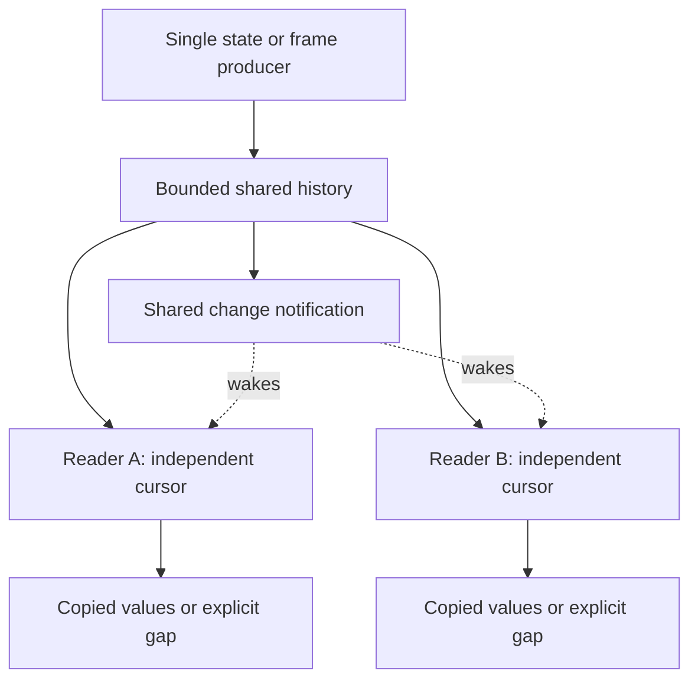

# Bounded Cursor Broadcast — Independent Readers with Explicit Gaps

A producer often needs to make the same sequence of updates available to several consumers without waiting for any of them. A controller publishes machine state to a UI while operation handling continues. A protocol reader publishes received frames while a command collector separately interprets replies. In both cases, consumers need independent progress, but retaining every update indefinitely is unnecessary or impossible.

The pattern is a bounded shared history with a cursor for each reader. Publishing retains a value and wakes readers; consuming advances only that reader's cursor. When a reader falls behind retention, the system reports a gap instead of silently skipping evidence or blocking the producer.

This pattern is implemented twice in the Makera controller: once for raw protocol observations and once for public controller snapshots. The mechanisms are similar, but they have not yet been extracted into a generic package.

> [!summary]
> - Retain one bounded sequence of values, not one delivery queue per subscriber.
> - Give each reader an independent generation/revision cursor.
> - Report retention loss explicitly; never silently reinterpret incomplete history as complete.
> - Keep publication, subscription lifetime and machine-operation lifetime separate.

## 1. Why a shared channel is not sufficient

Receiving from a Go channel consumes an item. If two readers receive from the same channel, they ordinarily divide the items rather than both observing every item. That behavior is appropriate for distributing work. It is wrong when a UI and an operation observer each need to inspect the same received status.

Creating one channel for every subscriber changes the problem but does not settle it. A publisher must decide whether to block on a slow subscriber, drop an update, allocate more memory or terminate the subscription. It must also manage subscriber registration and cleanup. These are real choices, but a separate queue is not necessary when all consumers can read a common retained sequence.

A **cursor** identifies the last update a reader consumed. An update is retained once and can be copied to any reader whose cursor precedes it. The publisher does not need to track the reader's progress to continue publishing.

## 2. The minimal data model

The shared buffer stores a generation, a monotonically increasing revision, a bounded ordered collection of values, a change-notification channel and a closed flag. A subscriber stores a cursor and its own cancellation context.

The **generation** distinguishes one incarnation of the producer. Revisions from a previous connection or controller instance must not be mistaken for current revisions after a restart. In the current controller implementation, the generation-like field is an opaque `Session` string. In the protocol implementation it is an owner-supplied numeric `Generation`.

```text
Shared state:
    generation
    current revision
    at most C retained values
    changed notification channel
    closed flag

Reader state:
    generation
    last consumed revision
    cancellation context
```

No broker, topic registry, durable journal or per-reader worker is required.



The notification only tells a reader that something changed. It does not carry the value and does not consume the update on behalf of another reader.

## 3. Publication and wake-up ordering

Publication assigns a revision and stores the value under a short mutex. It then closes the current notification channel and installs a new one. Closing the old channel wakes all readers currently waiting on it.

The following is a mechanism sketch, not the API of an extracted library:

```text
publish(value):
    lock shared state
    revision += 1
    append an owned copy tagged with generation and revision
    remove the oldest entry if retention exceeds C
    publish the corresponding query snapshot, if applicable
    oldNotification = changed
    changed = a new channel
    close oldNotification
    unlock
```

A reader obtains the current notification channel while holding the same mutex used to inspect retained history. That ordering prevents a missed wake-up: either the new item is already visible, or the reader holds the channel that the next publication will close.

“Nonblocking publication” means the producer does not wait for a subscriber to consume an item. It does not mean lock-free execution or zero copying cost. The current implementations perform bounded work under mutexes. User callbacks and socket I/O do not run inside these publication critical sections.

## 4. Reading and detecting a gap

Let `r` be the reader's last consumed revision, `a` the oldest retained revision, and `z` the latest published revision. For a matching generation:

- `r > z` is an invalid future cursor.
- `r < a - 1` means unread updates have already been evicted.
- Otherwise, the reader may consume retained entries with revision greater than `r`.

The `a - 1` boundary is intentional. If revisions 101 through 132 are retained, a reader at 100 can still obtain every subsequent update. A reader at 99 has lost revision 100 and must receive a gap error.

```text
next(cursor):
    reject cancelled subscription or read context
    lock shared state
    validate generation and cursor range
    if an unread retained value exists:
        copy it, advance this reader's cursor, unlock and return
    if closed:
        unlock and return EOF
    notification = changed
    unlock
    wait for notification or cancellation
    repeat
```

Gap handling belongs partly to the consumer. A display that only needs current state can obtain a fresh snapshot and resume from its new cursor. A completion evaluator that requires uninterrupted distinct observations must mark its evidence incomplete rather than silently reset the cursor and claim continuity.

## 5. Snapshot followed by subscription

A common caller sequence is to fetch current state and then subscribe to changes. Without a shared revision contract, an update can occur between these calls and disappear from the caller's view.

The controller solves this by including its publication cursor in each query snapshot:

```go
snapshot := controller.Snapshot()
subscription, err := controller.Watch(ctx, snapshot.Cursor)
// Handle err, then use subscription.Next(ctx).
```

Suppose the snapshot has revision 42, and revision 43 is published before Watch is called. The subscription reads revision 43 from retained history. If enough updates occurred to evict it, registration or reading reports a gap. There is no silent interval between snapshot acquisition and subscription registration.

Revision assignment, retained storage and the atomic query-snapshot update happen under the same publication lock, before subscribers wake. Identical controller-state publications do not advance revision; an idle coordinator tick is not itself a state update.

## 6. Two concrete implementations

| Property | Protocol observations | Controller subscriptions |
|---|---|---|
| Value | Validated wire frame plus receipt metadata | Controller snapshot including operation state |
| Capacity | 256 frames in a connection | 32 snapshots |
| Cursor | Numeric generation and receipt sequence | Controller-session string and publication revision |
| Producer | Protocol reader | Single-owner coordinator |
| Read shape | Bounded pages after a caller-held cursor | Single-reader subscription with `Next` |
| Copy policy | Copy frame payload on append and read | Copy operation slice when publishing and reading |
| Close behavior | Drain retained frames, then EOF | Drain retained snapshots, including final disconnected state, then EOF |

These values represent different information. A controller publication revision is not a firmware sample number. Public snapshot subscriptions must not replace the protocol observation feed used to evaluate completion from fresh distinct observations.

The storage policies are also distinct from the controller's **recent operation history**. That history retains 128 resolved outcomes plus unresolved work. The subscription feed retains 32 versions of controller state. The two capacities answer different questions: how many operation results remain queryable, and how far behind an update reader may fall.

Neither is a durable lossless journal or a request-deduplication store. Those facilities are explicitly deferred in MZ1-016.

## 7. Cancellation, closure and ownership

A subscription's context governs subscription lifetime. The context supplied to `Next` governs that particular wait. Neither context governs an admitted machine operation. Closing a browser subscription must not implicitly cancel a move.

The current controller Subscription permits one concurrent `Next` reader per handle; separate subscriptions read independently. `Close` can run concurrently with `Next`. There is no subscriber queue or goroutine allocated by Watch.

Controller shutdown first publishes its final disconnected snapshot and then closes the shared feed. A reader may consume retained updates before receiving EOF. Closing the feed is a software lifecycle fact, not physical motion-stop evidence.

Payload ownership is equally important. Returning a slice that aliases retained state would allow one reader to modify another reader's evidence. The implementations copy the mutable payload portions at their boundaries. If future snapshot fields introduce new mutable slices or maps, their copy policy must be extended; the pub/sub mechanism does not automatically make arbitrary Go values immutable.

## 8. A justified extraction, not an implemented generic framework

The reusable mechanism is now visible in two actual consumers. A future extraction could share revision assignment, bounded retention, generation validation, gap detection, notification and closure. It should leave the following policies with the callers:

- Which values are published and when state counts as changed.
- How mutable parts of those values are copied.
- Whether reads return one value or a bounded page.
- What a gap means for display, completion or diagnostics.
- How query snapshots are published consistently with revisions.

A possible generic shape is `Buffer[T]` plus cursor-based reads, but that name and API are only an extraction proposal. There is currently no standalone package providing it. Extracting the mechanism should replace the two implementations, not add a third version behind another facade.

For capacity `C`, average retained value size `S` and `K` live reader handles, the basic retained memory is proportional to `C × S + K`, excluding temporary reader copies. Full controller snapshots are larger than raw individual frames; retaining a bounded number is not the same as retaining negligible memory. That is a reason to expose capacity deliberately, not a reason to add persistence or a general event framework.

## 9. Evidence and limits

The implementation checkpoint is `3a64a1c` in `dropcut-studio`. The focused controller race suite passed when subscriptions were added. Tests cover:

- Publication between initial snapshot acquisition and Watch registration.
- Independent readers and isolated copies.
- No new revision for unchanged state.
- Retention gaps, wrong generations and invalid future cursors.
- Final disconnected snapshot followed by EOF.
- Cancellation of a subscription while the admitted operation continues to completion.

These establish software contracts. The public subscription API itself has not been qualified through the future browser/HTTP adapter, and it does not establish physical machine behavior. The protocol feed's hardware use is recorded in the P1/P2 report, but that does not turn either feed into a guarantee of complete physical history.

## Source navigation

All paths below are relative to `/home/manuel/workspaces/2026-08-11/cnc-control-dropcut/dropcut-studio/`:

- `makera-z1-cli/pkg/controller/subscriptions.go`: shared retained snapshots and public subscription handles.
- `makera-z1-cli/pkg/controller/coordinator.go`: state publication and unchanged-state filtering.
- `makera-z1-cli/pkg/controller/subscriptions_test.go`: cursor, copying, gap and shutdown scenarios.
- `makera-z1-cli/pkg/controller/controller_test.go`: subscription cancellation independent of operation completion.
- `makera-z1-cli/pkg/makera/protocol/observations.go`: the related bounded frame-history implementation.
- `makera-z1-cli/pkg/makera/protocol/observations_test.go`: independent readers, generation checks and retention behavior.
- `ttmp/2026/09/13/MZ1-016--controller-architecture-refactor-before-embedded-scripting/reference/01-architecture-investigation-and-delivery-diary.md`: implementation reasoning and checks, especially Step 15.

## Related entries

- [[Research/Software Architecture Garden/dropcut-studio/README|dropcut-studio Garden project]]
- [[Research/Software Architecture Garden/dropcut-studio/designs/06 - Consecutive Evidence Observer - Completion Without Owning the Operation|Consecutive Evidence Observer]] — consumes evidence under domain policy; a feed gap cannot be silently treated as continuity.
- [[PROJ - Makera Z1 Control - P1 and P2 Protocol Ownership and Hardware Evidence]] — protocol architecture and installed-machine experiments preceding the public subscription implementation.
