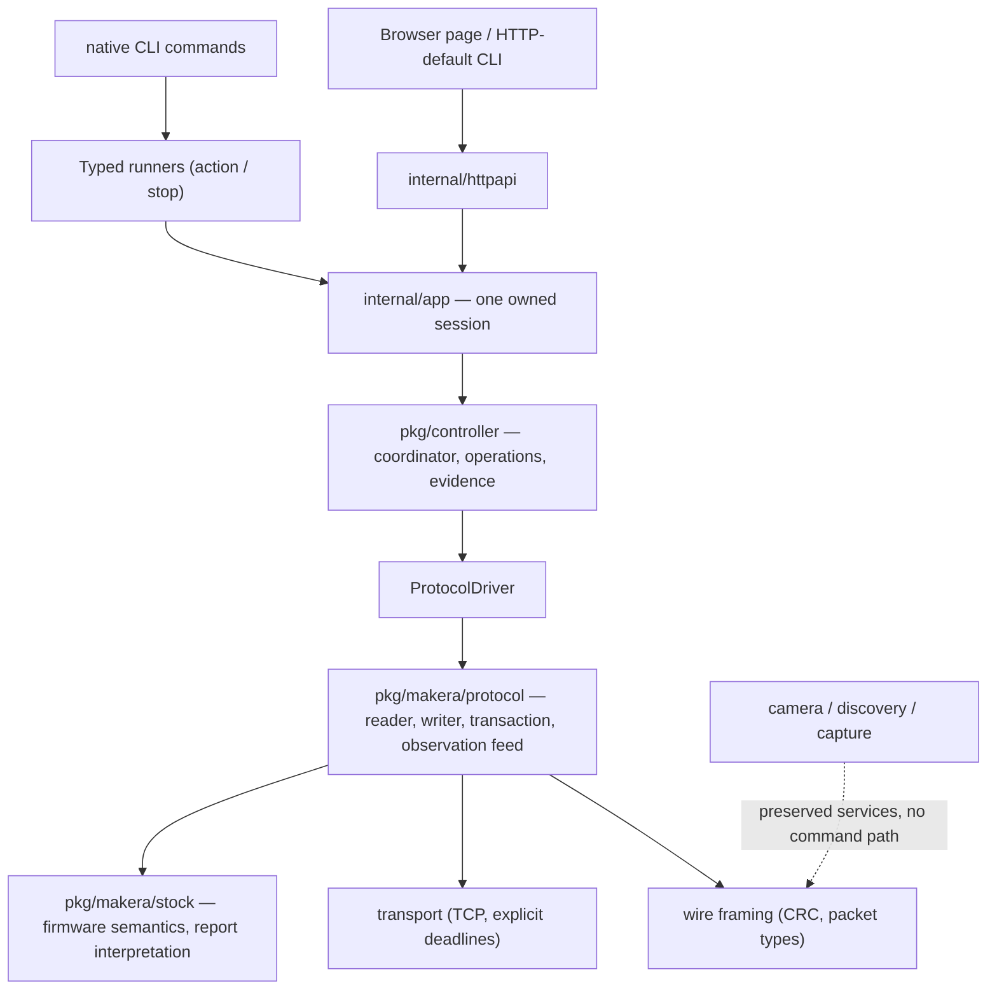

# Evidence Before Success — The Z1 Controller Refactor from Protocol to Hardware

This report analyzes the MZ1-016 refactor end to end: the protocol redesign, the single-owner controller, the adapter cutover that deleted the previous execution architecture, and the staged hardware qualification that followed. The reader should finish with three things: a model of the layered ownership that replaced a shared-consumer client; the evidence rules that separate transaction completion from machine facts; and a concrete picture of how the system behaved when physical safety mechanisms — soft limits and the emergency stop — were exercised deliberately on the installed machine.

Every claim about machine behavior in this report comes from an archived receipt in the ticket workspace. Where a property is only designed or only tested offline, the text says so.

## 1. The constraints that shaped the design

The Makera Z1 presents three constraints that determine the architecture, before any software preference is considered.

First, the machine accepts exactly one TCP control connection. Every host-side consumer — the browser control page, the command-line tool, any future scripting runtime — must share one owner of that connection, or none of them can make consistent claims about what was sent.

Second, the machine executes stored G-code programs from its own SD card. The host does not stream motion. A host process can exit while a program continues to run, which means operation lifetimes must be independent of request lifetimes: an HTTP request timing out cannot cancel machining, and a browser tab closing cannot make a spindle-start request disappear.

Third, the firmware's reports are samples, not acknowledgements. A status frame reading `Idle` is a fact about the instant it was received. It does not state that a command completed, that an axis is physically at rest, or that a program succeeded. A text reply ending in the echo sentinel states that the firmware processed a command string; it does not state that the commanded physical effect finished or will happen.

The pre-refactor architecture violated all three constraints gradually: a long-lived client serialized every exchange behind one mutex, an HTTP server added a second admission flag, and any callback error dropped the session so the next request could silently dial again. None of this was incorrect for sequential requests; it was unmanageable for operations that outlive their callers and for urgent commands that must not wait behind slow ones.

## 2. The layer model

The replacement assigns each concern to one package with a one-directional dependency rule: adapters depend on the controller, the controller depends on the protocol, the protocol depends on wire framing and transport, and nothing below depends on anything above.



| Layer | Owns | Must never do |
|---|---|---|
| Transport | Connection, deadlines, bounded writes | Interpret frames |
| Wire | Framing, CRC, packet types, drop counting | Route or decode semantics |
| Protocol | Reader, bounded writer, one transaction collector, observation feed | Admit application operations |
| Stock | Firmware semantics: report grammars, halt bands, encodings | Hold state |
| Controller | Operation records, admission, evidence, cancellation | Touch a socket |
| App | Constructing and closing the one session | Reconnect, replay, expose raw commands |
| Adapters | Decode, authenticate, translate, encode responses | Own machine pointers or locks |

Two preserved services sit deliberately outside the command path. The camera streams from the machine's WiFi module over its own connection, and UDP discovery passively enumerates machines on the LAN. Neither can execute a machine command; the camera is a display service and discovery never becomes an implicit connection target.

The `internal/app` package is the enforcement point for the single-connection constraint. Its constructor dials exactly once, assembles transport → protocol connection → driver → controller, assigns a fresh random observation generation, and exposes only the controller, the driver's reviewed read-only queries, and decoder diagnostics. There is no redial: a transport loss leaves the session faulted until the process is restarted, and restarting the server is documented as a lifecycle action, never as a way to stop the machine.

## 3. Transaction completion versus machine evidence

The protocol separates two data paths that the old client merged.

The transaction collector owns one text exchange at a time. A command is written together with an exact echo sentinel (`echo \x04`); the collector accumulates reply lines until the sentinel arrives, then publishes the result. If the write fails, the reply overruns its bounds, or the window expires, the session is quarantined: every later conflicting operation refuses, because a lost reply cannot distinguish "the firmware never saw the command" from "the firmware saw it and the reply was lost". No component retries into that uncertainty.

The observation feed is independent. Status replies to the realtime `?` query are stamped with a session generation and a monotonic sequence, appended to a bounded broadcast buffer, and readable by any number of consumers without consuming each other. A transaction can wait minutes for a homing cycle while the feed continues to deliver fresh machine state.

On top of the feed, the controller defines operation completion as concrete, machine-specific predicates — not as a configurable rule engine:

| Operation family | Completion evidence |
|---|---|
| Finite jog, positioning | Three fresh `Idle`/zero-feed samples with every selected axis within 0.02 mm of target; work-frame completion additionally requires the machine-minus-work offset to be unchanged |
| Homing | Observed `Home` state after dispatch, then three stable `Idle`/zero-feed/zero-RPM samples; the ambiguous −1,−1,−1 rest position is never treated as homing proof |
| Spindle start | Three fresh `Run` samples with RPM within 5 % (minimum 50 RPM) of the request |
| Spindle stop | Bounded window of fresh samples at or below 50 RPM; one Ctrl-X software halt escalation only if M5 evidence fails |
| Job play | Source Player reply accepted; the operation stays running — status `Idle` never completes a program |
| Job inspection | The Player's own `progress` text: only "Not currently playing" resolves the job, as *ended, machining success unverified* |
| Accessory output | Dispatch only; the record states that physical output state is unverified |

The pattern in this table is the central design decision of the refactor: each predicate encodes what the firmware can actually report, and the record text says exactly what the evidence proves and what it does not. `JobEnded` never means the part was machined correctly. A completed spindle start means the spindle is observed spinning, not that it is safe to touch.

## 4. One owner, three lifetimes

The controller is a single goroutine that mutates all operation state. Requests, worker results, observations and timer events reach it as typed values; no transition performs socket I/O or waits on the machine. Three lifetimes are deliberately distinct:

- **The request lifetime.** `Start` uses its caller's context for admission only. The generated operation ID is published even if the caller stops waiting, so a timed-out request can be inspected rather than retried.
- **The worker lifetime.** Bounded workers perform blocking work: preflight checks, command execution, holds, stop evidence. Two fixed, identified slots (command and review) hold the owning operation ID; only a completion event carrying the matching token and ID releases a slot.
- **The operation lifetime.** An operation resolves when its evidence predicate is satisfied, when it is refused before dispatch, or when uncertainty makes resolution impossible. A resolved operation can still have a live worker (the write finished; the goroutine is draining). A finished worker never implies the machine reached the requested state.

The consequence is that `unknown` and `held` operations remain admission blockers after their requesters are gone. Deleting the record would convert loss of control into permission for new motion, so unresolved work pins itself in bounded history and every enabling route consults the same snapshot the coordinator published.

## 5. Uncertainty, alarms, and the two evidence fixes

The hardware qualification produced the most instructive finding of the project, and it came from a deliberate mistake.

**The event.** During the spindle-start test the operator had engaged the physical emergency stop before the command started. The command failed in under a second and printed:

```
z1ctl: observation stream fault: observation stream fault
```

Two defects hide in that line. First, the text names no machine fact: the machine was latched in `Alarm` with halt reason 13, and the operator had to run a separate diagnostic to learn what the controller already knew. Second, the text appears twice because the CLI wrapped the operation's error string around a wait error that carried the same string.

**The first diagnosis, and its correction.** The initial analysis inferred from the error string that the `M3` command had been dispatched. That inference was wrong. The string `observation stream fault` is written on two different paths: the coordinator's cancellation of a still-preparing operation (nothing dispatched) and its hold of an already-dispatched operation. The operator's information — that the E-stop was engaged before the command ran — plus a deliberate reproduction established the actual sequence: the watch stream observed `Alarm`, the session faulted, and the operation was cancelled *before dispatch*. No `M3` byte was sent; the RPM never left zero; the refusal was correct, fast, and twice reproducible. The lesson recorded in the ticket diary is a receipt-discipline rule: phases are facts in the record, not properties to be inferred from strings shared across paths.

**The fixes.** The alarm branch of the coordinator now builds the concrete evidence text and applies it to the operation record whichever way the fault's intervention resolved it:

```go
note := alarmFaultText
if o.HaltReasonValid {
    if text, _, known := stock.HaltReason(o.HaltReason); known {
        note = fmt.Sprintf("%s (halt reason %d: %s)", alarmFaultText, o.HaltReason, text)
    }
}
active := s.active
c.event(s, event{kind: eventFault, err: errors.New(alarmFaultText)})
if active != nil {
    op := &s.snapshot.Operations[active.index]
    switch op.Phase {
    case Cancelled: // preparing: nothing was dispatched
        op.Error = note + "; cancelled before dispatch"
    case Dispatching, HoldRequested, Observing: // bytes may have moved
        op.Phase = Unknown
        op.Error = note + "; outcome unresolved"
        active.cancel()
        s.active = nil
    }
}
```

The same reproduction after the fix printed, in 1.1 seconds:

```
z1ctl: machine reports Alarm (halt reason 13: emergency stop button pressed); cancelled before dispatch
```

The distinction the code now makes is the honest one: a preparing operation cancelled by an alarm proves nothing was sent (`cancelled before dispatch`), while a dispatched operation resolved by an alarm proves only that the target was not reached (`outcome unresolved`). The CLI runner separately stopped double-wrapping error text.

**The alarm also resolves work for a structural reason, not convenience.** An alarmed machine cannot reach any operation's target, so the alarm is terminal evidence for the active operation. Other fault kinds — stale telemetry, generation mismatch, transport loss — carry no machine fact and keep the deadline path. This boundary keeps the alarm resolution from becoming a generic "faults resolve operations" rule.

## 6. The recovery loop: unlock as a typed operation

The firmware latches an alarm on emergency stop, on soft limit trips, and on probe faults, and it refuses motion until the alarm is cleared. The stock firmware reports the cause as a numeric `H:` code whose recovery band is known from the halt table:

| Band | Meaning | Recovery |
|---|---|---|
| ≤ 20 | e.g. 10 soft limit, 13 emergency stop | Unlock (`$X`) is sufficient |
| 21–40 | e.g. 21 hard limit, motor errors | Reset required |
| > 40 | e.g. 41 spindle alarm | Power cycle required |

Because an `Alarm` state faults the controller session, unlock cannot be an ordinary admitted operation — it would be blocked by the very fault it exists to clear. It is therefore independently admitted, like the spindle stop, with its own evidence chain: fresh `Alarm` status with a halt reason in the unlock band, fresh emergency-stop-clear and closed-cover diagnostics, exactly one `$X`, then a bounded observation of the machine leaving `Alarm` (two fresh non-Alarm reports). A refusal before dispatch resolves and frees the attempt; a failure after bytes were sent stays `unknown` and retains its blocker so nothing silently resends `$X`. Success clears exactly the alarm-caused session fault — a held session's reconciliation requirement and every transport fault survive it.

The qualification exercised this loop twice on the machine, with receipts:

```json
{
  "cleared": true,
  "halt_meaning": "emergency stop button pressed",
  "halt_reason": 13,
  "operation_id": "d8c0e78db60dc9a487a77742b48a37ac",
  "phase": "succeeded",
  "state_after": "Idle"
}
```

The same shape cleared a soft-limit alarm (`H:10`) earlier in the session. The full physical cycle — deliberate limit approach, alarm latch, alarm surviving E-stop release, evidence-gated unlock, observed return to `Idle` — ran entirely through the new stack.

## 7. The cutover: deleting the second owner

An adapter cutover in this design is not a rewrite of the handlers; it is the removal of every alternative path to the machine. The work proceeded in committed increments:

1. **Contract relocation** (`b6bc28a`): the protobuf payloads moved out of the doomed web package; responses gained `operation_id`/`phase`; the zeroing request lost its inactive-work-system selector and gained the mandatory Z tool-offset acknowledgement; play and resume gained the operator's `homed` declaration. Frontend, generated TypeScript, and Go regenerated together.
2. **HTTP cutover** (`e44f2c2`): `internal/httpapi` serves every route through the owned session; guard behavior (host validation, same-origin, token) is byte-for-byte ported; the old package with its broad callback lock and second admission flag was deleted, not wrapped.
3. **Native CLI cutover** (`6a04c91`): two runners translate typed intents; `--dry-run` renders the intent's exact command text without connecting; stops never require confirmation while every enabling write does; `--homed` is an explicit operator declaration because stock telemetry cannot prove homing.
4. **Owner deletion** (`3e61460`): the legacy client, motion renderer (including its invalid G53 ordering), transfer mode, preflight and job control paths were removed — 4,238 lines — leaving camera, discovery, capture, the offline codec, and the raw-command risk classification.

The exit condition was a source-search proof, not a test pass: no reference to the deleted client exists; the raw command surface (`app.Raw`) is reachable only from the explicit experimental `exec` command, which refuses motion-class text before connecting; the HTTP layer imports the legacy package for the camera service only. Every enabling route crosses controller admission — there is no second execution owner to drift.

Two behaviors changed openly rather than silently: `serve` now fails to start if the machine is unreachable (no per-request redial exists to hide behind), and filesystem mutations plus uploads require fresh idle admission (the old client ran them in any state). Both are documented in the served page's own help text.

## 8. Hardware qualification: method and results

Qualification ran under a fixed operator protocol: each batch was described, stopped, and executed only after a fresh go-ahead, with the operator at the machine and the physical E-stop authoritative. Receipts are archived per command with raw output, operation rows and post-state reads.

| Batch | Scope | Result on the machine |
|---|---|---|
| 1 | Read-only native commands; serve with all read-only HTTP endpoints | All green; the digest of a known SD file matched a 2026-08 hardware record, cross-validating the new digest path against historical evidence; one live-found response-typing bug fixed (`e084ffd`) |
| 2 | Homing; six bounded machine-coordinate moves (±X, ±Y, ±Z); slow jog into the limit | Homing completed with observed `Home`→`Idle` evidence; all six moves completed at target; the jog tripped the **soft limit (H:10) with no physical switch impact** and position unchanged; unlock recovered to `Idle` |
| 2 (remainder) | Work-coordinate move; active-WCS zeroing through the serve route | Work move completed at target in the work frame; zeroing produced WPos X exactly 0.000 with machine position unchanged — the first live mutating HTTP route through the new stack |
| 3 | Spindle on 10 000 RPM; spindle off | Start completed with observed-RPM evidence in 9.2 s; stop completed with M5 + bounded evidence in 3.3 s, no escalation; E-stop-engaged start refusal reproduced twice (cancelled before dispatch, ~1 s); halt-reason evidence fix verified live |

The limit test deserves its own note because it measured the machine, not just the software. The axis rested approximately 2 mm from its maximum switch; a jog at 10 % of axis maximum speed toward the switch tripped the firmware's soft limit in planning, latched `H:10`, and left the position unchanged. The physical switch was never struck. The stock configuration therefore protects its own switches; the qualification verified that the host reports the event honestly (alarm latched, unlock-eligible band, evidence-gated recovery) rather than testing mechanical crash behavior.

## 9. What was deliberately not built

Four capabilities were removed from scope by explicit decision during the work, each with a recorded reason:

- **Park / fixed safe-Z.** The historical host coordinates (`Z-3`, then `X-197 Y-206`) conflict with the only retained example file (`X-295 Y-205`, then `Z-50`), and the bytes of the installed machine's own pack file were never retained. Unverifiable coordinates combined with unknown fixture clearance do not become a controller action. The legacy command was deleted at cutover.
- **Generic recovery.** A reusable acknowledge/retry/reconnect/replay subsystem would add state machinery while being unable to prove output state or prior-command disposition. Uncertain outcomes stay blockers; unlock and cycle-start are narrow typed operations with their own evidence chains.
- **Host-side inactive-WCS management.** Selecting or editing a work coordinate system that is not the firmware's active one has no current workflow requirement; stored programs select their own WCS in their own G-code; and the stock P-slot mapping came from community folklore rather than verified source.
- **Continuous jog and spindle PID tuning.** Continuous-jog semantics remain deferred for stock firmware; the routes return an explicit not-implemented response and the held-jog server machinery was deleted. PID tuning (`M958`) is a maintenance write outside the reviewed catalogue and is refused with a pointer to the experimental `exec` surface.

The common rule: a capability enters only with a concrete evidence source and a real consumer. A deferral is a documented decision with an explicit refusal message, never a silent downgrade or a hidden fallback route.

## 10. Complexity accounting

The refactor's size is best measured by what it did not add. The controller package implements its coordinator, evidence predicates, cancellation, and recovery operations without a scheduler, a workflow engine, an evidence DSL, leases, request deduplication, or a durable journal. The two command/review worker slots exist because stale-result and cancellation races were demonstrated, not because an activity framework was wanted. The subscription contract is one bounded broadcast buffer with copied snapshots and explicit gap errors.

The deletion side is concrete: the cutover removed 4,238 lines of legacy execution code in one commit, after which the full module — 13 test packages under the race detector, the embedded frontend's type check and 34 component tests, protobuf lint, and the rendered help topics — passes offline. Validation effort concentrated where behavior changed: per-operation race scenarios, byte-level protocol fixtures over in-memory pipes, and the staged machine batches in Section 8.

## 11. Status and remaining work

Implemented, committed and hardware-qualified at repository commit `70141f2`: the layered protocol and controller, the complete adapter cutover with owner deletion, and the read-only, motion, limit, alarm/recovery and spindle/spindle-stop batches described above. One live-found HTTP response-typing bug and the two alarm-evidence fixes were committed with receipts (`e084ffd`, `0dc4e30`).

Not yet exercised on the machine: accessory outputs (dispatch-only by design), the filesystem scratch cycle and file transfers, the benign stored-program lifecycle (play → progress → suspend → resume → abort), and the hold → cycle-start release drill. These follow the same stop-and-confirm protocol. Downstream, the MZ1-015 embedded-JavaScript work receives its seam as-is: a Goja facade over the controller registers operations, awaits results through operation IDs, and uses the urgent hold path — the concurrency questions it would otherwise raise were answered by this refactor rather than left to it.

> [!summary]
> - One owned session replaced a shared-consumer client; every enabling route crosses the same controller admission, and source-search proofs show no second owner survived the cutover.
> - Transaction completion (sentinel-terminated text exchange) and machine evidence (fresh, concrete, operation-specific observations) are separate paths with separate meanings; no record claims more than its evidence proves.
> - Request, worker and operation lifetimes are distinct; `unknown` and `held` operations block new enabling work rather than being cleared by the disappearance of their callers.
> - Alarms resolve active operations with the halt reason as evidence — immediately, with the dispatched/not-dispatched distinction made explicit — and unlock is a narrow, evidence-gated operation that clears only the alarm-caused fault.
> - The machine's own protections held under deliberate testing: a soft limit stopped a switch-approaching jog with no physical impact, and an E-stop-engaged spindle start was refused before dispatch in about one second.
> - Scope discipline was enforced by deletion, not deferral: park, generic recovery, inactive-WCS management and continuous jog are refused with explicit reasons and have no hidden fallback.

## Related entries

- [[Research/Software Architecture Garden/dropcut-studio/designs/08 - Bounded Cursor Broadcast - Independent Readers with Explicit Gaps|08 — Bounded Cursor Broadcast]]
- [[Research/Software Architecture Garden/dropcut-studio/designs/09 - Single-Owner CNC Controller - Worker Ownership Separate from Operation Evidence|09 — Single-Owner CNC Controller]]
