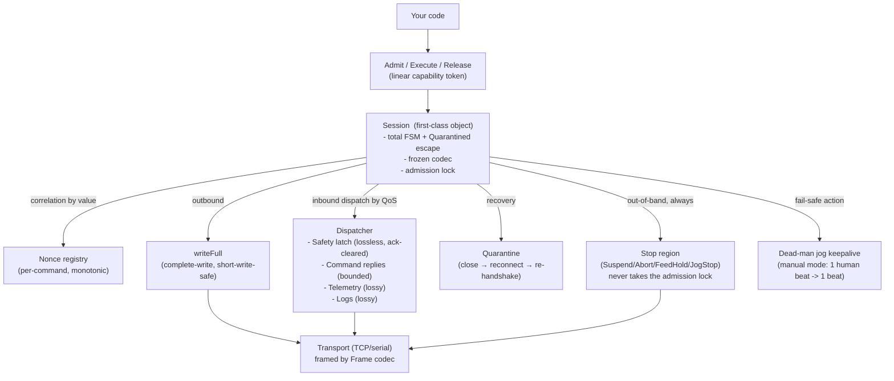

# Z1 Communication API — Design and Implementation Guide (Intern Edition)

> **What this is.** This is a *proposal* in the go-go-parc Software
Architecture Garden: a concrete API design for a new package (`pkg/z1session`)
that realizes the four design patterns studied in this project's design
entries. It is more prescriptive than a design entry (it says "build this")
and less mature than an adopted guideline (it is `candidate`, not `adopted`).
It is the API-shaped distillation of the MZ1-005 study's §7 target design,
written for an intern who will implement it.
>
> **Reader.** You are a new engineer who needs to write code that commands a
> Makera Z1 CNC machine from Go. You should first read the four design
> entries this proposal builds on (linked in the frontmatter and §15):
> the overarching **first-class session** (design 04) and its three facets —
> **sentinel-delimited correlation** (design 01), **latched safety channel**
> (design 02), and **dead-man keepalive** (design 03). This guide turns those
> into an API you can implement. You are not patching `pkg/makera`; you are
> building its successor.

## 0. The one-paragraph mental model

A Z1 is a CNC machine whose firmware exposes **one TCP socket** (port 2222,
one client at a time) speaking a **framed binary protocol**. You send it text
commands and single-byte realtime controls; it sends you replies, status
reports, alarms, and file-transfer frames. The machine moves metal at
thousands of RPM. The single rule that shapes this entire API:

> **Motion is never a side effect. It happens only when a caller has said so,
> in code, with an unforgeable token, while a first-class session is in a
> state that admits it — and any ambiguity about whether it happened is a
> session fault that requires quarantine, never a silent resume.**

Everything in this guide follows from that sentence and from four design
patterns the team studied in MZ1-005: the **first-class session object**,
**sentinel-delimited correlation**, the **latched safety channel**, and the
**dead-man keepalive**. Read the Garden entries for depth; this guide is the
API that realizes them.

## 1. Why a new API (what's wrong with `pkg/makera` today)

The current `pkg/makera` (`makera-z1-cli/pkg/makera/`) is a god-object:
`Client` (`client.go:90`) owns the TCP connection, the protocol codec, the
single read loop, the one shared inbound queue (`msgs`, cap 256,
`client.go:133`), the `cmdMu` mutex that serializes *one exchange*
(`client.go:99`), and the jog session — all at once. Its public surface
reflects that:

- `Command(ctx, cmd string)` (`client.go:308`) takes **free text**. A
  `RiskClass` classifier (`safety.go:156`) gates it, but the classifier is
  **fail-open and first-token-only**: unknown verbs return `ClassRead`, and
  `EncodeCommand` (`protocol.go:80`) strips only trailing CR/LF, so one
  frame can carry multiple logical lines (`version\nG0 X10`). This is
  finding MC-01: the generic "read-only" path can transit motion.
- An unexported `commandUnchecked` (`client.go:317`) bypasses the guard and
  is reachable by `Unlock`, `QueryDiagnose`, and the motion loop — so the
  "authority is a string check a caller can forget" (MC-08: `CycleStart`,
  `jobctl.go:68`, writes `~` with no preflight, no token).
- Correlation is by a **constant sentinel** (`echo \x04`,
  `client.go:34`). A timed-out exchange leaves a late sentinel that can
  desynchronize the next command (MC-03). There is no per-command token.
- The codec is **reassigned mid-session from reply text**
  (`client.go`, `readLoop` → `ProtocolFromAnnouncement`), unsynchronized
  (MC-04).
- Inbound traffic of all QoS classes — alarms, replies, telemetry, chatter —
  shares one drop-oldest FIFO and is **drained** before each exchange
  (`drain`, `client.go:294`). An unacknowledged alarm can be dropped or
  drained (MC-06).
- Writes ignore the short-write count (`client.go:275`, MC-05). Decoder
  drops are a counter, not a fault (MC-10). There is **no session state
  machine** (SYS-02): illegal transitions are representable.

The good ideas to *keep* are real: typed `MotionOp` constructors
(`motion.go`), the `RiskClass` ladder and its "max over ops" rule, the
no-retry rule for motion, fresh preflight, the dead-man jog
(`motion.go:860+`), and the single-reader / transfer-mode-ownership model.
The new API preserves those and gives them a first-class skeleton to live in.

## 2. The architecture at a glance



The `Session` is the skeleton (Garden entry 04). Its facets are the nonce
(entry 01), the dispatcher's safety latch (entry 02), and the dead-man (entry
03). Recovery is quarantine (entry 04). The `Transport` and `Frame` codec
are the only pieces reused from `pkg/makera` almost verbatim — they are
correct; the layer *above* them is what is rebuilt.

## 3. Package layout (what you will create)

```text
pkg/z1session/
  doc.go            # this guide, condensed: the laws and the FSM
  session.go        # Session, State, Event, δ (total), admission lock
  token.go          # admitToken: unforgeable, linear
  admit.go          # Admit / Execute / Release / ReleaseFeedHold
  nonce.go          # monotonic, reconnect-persistent nonce registry
  dispatch.go       # inbound dispatcher: safety latch + command + telemetry + logs
  classify.go       # fail-closed total grammar (replaces Classify)
  motion.go         # MotionOp types (kept from pkg/makera, retargeted)
  jog.go            # JogSession: dead-man keepalive, manual + auto
  transport.go      # Transport interface + TCP impl (reused)
  frame.go          # Frame codec, CRC, scan-forward decoder (reused, hardened)
  protocol.go       # codec interface, frozen-after-handshake
  quarantine.go     # quarantine triggers, proof-based recovery
  errors.go         # typed outcomes: Completed / TimedOut / Faulted / Unknown
  *_test.go         # gate tests F-1..F-10 from MZ1-005
```

Each file maps to a section below. The rule of thumb: if a piece of logic
needs to know "are we in a state that admits this?", it lives in `session.go`
or `admit.go`; if it needs to know "what does this byte mean?", it lives in
`frame.go`/`protocol.go`; everything else is a facet that hangs off the
session.

## 4. The first-class Session and its total state machine

### 4.1 Why first-class

A protocol session has state that outlives any one function call: which codec
is negotiated, whether an operation is admitted, whether the decoder has
dropped frames, whether we are quarantined. In `pkg/makera` that state is
*implicit* — program counters inside `commandUnchecked`, a mutable `c.proto`,
a `Drops` counter nobody reads. The first law (Garden entry 04) is that this
state is an **explicit, named object** with a **total** transition function:
every `(state, event)` pair is defined, and undefined pairs go to
`Quarantined`, never to a silent no-op.

### 4.2 The state machine

```text
 Disconnected
   → Handshaking        (connect + protocol negotiation; codec FROZEN here)
   → Ready              (read-only; no admission token held)
   → Admitted(token)    (preflight passed; token held; one operation may run)
   → Executing          (commands of the admitted operation are in flight)
   → Held               (feed-hold active; motion paused)
   → Completing         (final status read; token release pending)
   → Ready

 Quarantined           (any ambiguous timeout, partial write, decoder loss,
                        protocol anomaly, drop count > 0, half-open conn)
   → close → reconnect → Handshaking

 Out-of-band (orthogonal region, ALWAYS active, never blocked):
   Stop region:  Suspend / Abort / FeedHold / JogStop
```

Mathematically this is a **labeled transition system** `(S, s₀, E, →)` whose
transition relation is a *total function* `δ : S × E → S ∪ {Quarantined}`
(MZ1-005 §5.6, §6.6). The state space is tiny — `|S| ≈ 8`, `|E| ≈ 15`, so
`8 × 15 = 120` cells — which means totality is **exhaustively testable** and
the whole machine is **model-checkable in TLA⁺ in minutes**. That smallness
is a feature: illegal transitions are not just discouraged, they are
unrepresentable.

### 4.3 The Go skeleton

```go
// pkg/z1session/session.go
package z1session

type State int

const (
    StDisconnected State = iota
    StHandshaking
    StReady
    StAdmitted
    StExecuting
    StHeld
    StCompleting
    StQuarantined
)

// Event is anything that can move the session. Listing them all is what
// makes δ total: an event with no defined effect goes to StQuarantined.
type Event int

const (
    EvConnect Event = iota
    EvHandshakeDone
    EvAdmit
    EvFirstCommand
    EvReplyMatched   // a reply carrying the current nonce
    EvSentinel       // the sentinel for the current nonce arrived
    EvHold          // feed hold
    EvResume
    EvRelease
    EvTimeout
    EvShortWrite
    EvDecoderDrop
    EvAnnouncement  // a protocol-announcement line outside Handshaking
    EvHalfOpen
    EvClose
    EvStop          // out-of-band: always admissible
)

// Session is the first-class object. It owns the transport, the (frozen)
// codec, the admission lock, the nonce registry, and the inbound dispatcher.
// Nothing here is global; nothing is shared by convention.
type Session struct {
    tr      Transport
    codec   Codec         // frozen after StHandshaking
    state   State
    admMu   sync.Mutex    // the ADMISSION lock (spans an operation, not an exchange)
    nonce   *NonceReg
    disp    *Dispatcher
    jog     *JogSession   // at most one; the dead-man lives in the stop region
    // ... logger, options, latches ...
}

// transition is total: every (state, event) returns a defined next state.
// A case that "can't happen" goes to StQuarantined — never a silent no-op.
func (s *Session) transition(e Event) (next State) {
    switch s.state {
    case StReady:
        switch e {
        case EvAdmit:        return StAdmitted
        case EvStop:         return StReady      // stop is always admissible
        case EvAnnouncement: return StQuarantined // codec must not change now
        case EvTimeout, EvDecoderDrop, EvShortWrite, EvHalfOpen:
            return StQuarantined
        default:             return StQuarantined // undefined -> quarantine
        }
    case StAdmitted:
        switch e {
        case EvFirstCommand: return StExecuting
        case EvRelease:      return StReady
        case EvStop:         return StAdmitted
        default:             return StQuarantined
        }
    // ... one case per state; EVERY case has a default -> StQuarantined ...
    }
}
```

**Why this and not `Client`**: `pkg/makera`'s `Client` has no `State` type at
all — "are we mid-exchange?" is a held mutex, "did we time out?" is a returned
error, "is the codec settled?" is nothing. Here, those questions have one
answer each, and the answer is `s.state`. The transition function is the
single authority; everything else consults it.

### 4.4 The admission lock spans an operation, not an exchange

`pkg/makera`'s `cmdMu` (`client.go:99`) serializes one `drain → write →
collect` exchange. `Preflight` (`preflight.go:88`) does `QueryStatus` and
`QueryDiagnose` as **separate** exchanges, and `Motion` (`motion.go:807`)
calls `commandUnchecked` **once per command** — each acquiring and releasing
`cmdMu`. Between any two acquisitions another goroutine can interleave. This
is the time-of-check/time-of-use race of MC-02.

The new admission lock is held for the whole `Admit → Execute* → Release`
span, which is the **linearizability** of the operation (it appears to occur
at a single instant between `Admit` and `Release`):

```go
// pkg/z1session/admit.go
func (s *Session) Admit(ctx context.Context, class RiskClass, opts PreflightOptions) (AdmitToken, PreflightReport, error) {
    s.admMu.Lock()           // held until Release; spans preflight + all commands
    if err := s.requireState(StReady, "Admit"); err != nil { s.admMu.Unlock(); return ... }
    rep, err := s.preflight(ctx, class, opts)   // fresh, under the lock
    if err != nil || len(rep.Failures()) > 0 { s.admMu.Unlock(); return ... }
    s.transition(EvAdmit)    // -> StAdmitted
    return AdmitToken{s: s, seq: s.nonce.Next()}, rep, nil
}
```

## 5. The admission token — a linear, unforgeable capability

### 5.1 Why a token

`pkg/makera` has two ways to restart motion: `Resume` (`jobctl.go:52`)
preflights and runs under the motion path; `CycleStart` (`jobctl.go:68`)
writes `~` directly, with no preflight and no token. Both do the same
physical thing with different authority — the textbook capability leak
(MC-08). The fix (Garden entry 04, §5.12 of the study) is to make authority
a **value**: an unforgeable token minted by `Admit`, required by any
state-enabling or motion action, consumed by `Release`. A caller without a
token **does not compile**.

### 5.2 The Go shape

```go
// pkg/z1session/token.go
package z1session

// AdmitToken is the linear capability that authorizes one operation.
// It is unforgeable outside the package: the only constructor is Admit,
// because the seq field is unexported and there is no exported setter.
// It is LINEAR: Execute/Release consume it; it must not be reused.
type AdmitToken struct {
    s   *Session
    seq uint64        // the nonce this token admits; unexported
    // _ opaque would also work; seq being unexported is enough to forbid
    // construction from outside the package.
}

// Execute runs the typed ops of one admitted operation. It consumes the
// token on the first failure or completion; the caller does not reuse it.
func (s *Session) Execute(ctx context.Context, t AdmitToken, req MotionRequest) (MotionResult, error) {
    if !t.validFor(s) { return MotionResult{}, ErrTokenNotAdmitted } // wrong session / consumed
    s.transition(EvFirstCommand) // -> StExecuting
    // ... render + writeFull + correlate-by-nonce per command, no retry on ambiguity ...
}

// Release ends the admitted operation and returns to StReady.
func (s *Session) Release(t AdmitToken) error {
    if !t.validFor(s) { return ErrTokenNotAdmitted }
    s.transition(EvRelease)
    s.admMu.Unlock()
    t.invalidate()
    return nil
}

// ReleaseFeedHold restarts HELD motion. It requires the hold token that
// PROVES the matching hold was established in this session. This is the
// replacement for pkg/makera's CycleStart(); there is no public method that
// can resume motion without a token.
func (s *Session) ReleaseFeedHold(ctx context.Context, t AdmitToken, opts PreflightOptions) error {
    if !t.validFor(s) || s.state != StHeld { return ErrTokenNotAdmitted }
    // preflight (allowing the paused job), then resume, under the token.
}
```

**API reference.** `Admit(ctx, class, opts) → (AdmitToken, PreflightReport, error)` · `Execute(ctx, token, req) → (MotionResult, error)` · `Release(token) → error` · `ReleaseFeedHold(ctx, token, opts) → error`. There is **no** `Command(ctx, cmd string)` and **no** `CycleStart()` on the public API. Raw text and raw realtime resume are private to the package's own internals; a consumer cannot reach them.

## 6. Correlation by value — the nonce registry

### 6.1 Why not the constant sentinel

`pkg/makera` sends `echo \x04` after every command and treats the first
inbound `\x04` as the end of that command's output (`client.go:34`,
`commandUnchecked`). Correlation is **by position** (FIFO + drain-before-send),
which is correct only under an axiom the firmware does not provide: that a
timed-out command's sentinel never arrives during the next exchange. It can
(MC-03), and the desync probability is **cumulative in job length**
(`1 − e^{−n·p_t·p_l}`; MZ1-005 §6.8). A constant sentinel is a *delimiter*,
not a *correlation identifier* (Garden entry 01).

### 6.2 The nonce

The new design correlates **by value**: each command carries a unique,
monotonic nonce; a reply is accepted only if it carries the current nonce.
A late reply from a previous command carries the wrong nonce and is
ignored — the collision probability becomes **structurally zero**, not
probabilistically small.

```go
// pkg/z1session/nonce.go
package z1session

// NonceReg issues monotonic, reconnect-persistent command ids.
// "Reconnect-persistent" is the load-bearing word: a per-session counter
// reset to 0 on reconnect collides with a late reply from the previous
// session. Derive from a monotonic clock or persist across reconnects.
// 64-bit => wraparound is ~584 years at 1e9 cmd/s; never reuse a value
// within the lifetime of any in-flight or late reply.
type NonceReg struct {
    mu sync.Mutex
    n  uint64
}

func (r *NonceReg) Next() uint64 { r.mu.Lock(); r.n++; r.mu.Unlock(); return r.n }
```

If the firmware can be extended (community firmware is open source) to echo
the nonce, the command is prefixed `#<nonce> <cmd>` and the sentinel becomes
`echo #<nonce> \x04`. If it cannot (stock firmware), the fallback is not
"reuse the constant sentinel and hope" but **quarantine-on-timeout** (§9): a
timed-out command's nonce is retired, and the session does not admit a new
command until it has *proven* the old sentinel was consumed (close +
reconnect + re-handshake, or a bounded fresh-sentinel probe). The honest
outcome of a timed-out motion command is `Unknown`, not `Failed`, and it is
**never retried** (motion is non-idempotent — at-most-once, Garden entry 01
§5.3).

```go
// pkg/z1session/errors.go
type Outcome int
const (
    Completed Outcome = iota
    TimedOut          // = Unknown for non-idempotent ops; never retried
    Faulted
)
```

## 7. Inbound dispatch by Quality of Service — the latched safety channel

### 7.1 Why not one FIFO

`pkg/makera`'s `msgs` (`client.go:133`, cap 256, drop-oldest) carries
**everything**: alarms, command replies, telemetry, chatter. `drain()`
(`client.go:294`) discards all of it before each exchange. The queueing
result (Garden entry 02, MZ1-005 §6.3): a shared buffer forces the
alarm-loss probability to equal the chatter-loss probability — drop-oldest is
right for telemetry and wrong for alarms. Little's law (`L = λW`) says the
safety channel need not be large, only **lossless**.

### 7.2 The dispatcher

Classify **at decode, not at consume**. The single reader routes each
decoded message by class to the channel whose loss policy matches its
semantics. `drain` is redefined to act on the command/log channels only —
it is the **identity** on the safety latch.

```go
// pkg/z1session/dispatch.go
package z1session

type MsgClass int
const (
    ClSafety MsgClass = iota  // alarms, halt reasons, cover/endstop
    ClCommand                  // reply to the current command (matches nonce)
    ClTelemetry                // status/diagnose snapshots; latest-wins
    ClLog                      // informational chatter; drop-oldest
)

type Dispatcher struct {
    safety   SafetyLatch   // lossless, monotone-merge, ack-cleared
    command  chan Message  // bounded by the one in-flight operation
    telem    chan Message  // cap 1-4; drop-oldest
    log      chan Message  // cap 256; drop-oldest
}

// Dispatch routes one decoded message. The loss policy is decided HERE, by
// class, not later by a consumer that may have fallen behind. The reader
// never blocks: the latch is constant-time; the lossy channels may drop.
func (d *Dispatcher) Dispatch(m Message) {
    switch classifyInbound(m) {
    case ClSafety:    d.safety.Merge(m)     // never drops; monotone
    case ClCommand:   select { case d.command <- m: default: /* overrun -> quarantine */ }
    case ClTelemetry: d.pushDropOldest(d.telem, m)
    case ClLog:       d.pushDropOldest(d.log, m)
    }
}

// Drain discards stale command replies and logs so the next command's reply
// cannot be confused with older output. It is the IDENTITY on the latch:
// draining a command queue never clears safety state.
func (d *Dispatcher) Drain() {
    drainChan(d.command); drainChan(d.log)   // safety latch untouched
}
```

### 7.3 The latch as a join semilattice

The safety channel is **not a FIFO**; it is a **latch** — a register holding
the latest safety state, cleared only by an explicit ack. Model the safety
state as a join semilattice `(S, ⊔)` merging by severity (`Alarm ⊔ Idle =
Alarm`); a new event does `latch := latch ⊔ s'` (monotone, never loses
severity); the only permitted decrease is an ack (`latch := ⊥`).
Formally, `drain(safety_latch) = safety_latch` (Garden entry 02). An
unacknowledged alarm survives a full buffer and a `Drain()`.

```go
// pkg/z1session/dispatch.go (continued)
type SafetyLatch struct {
    mu   sync.Mutex
    cur  SafetyState   // ⊥ = idle; Alarm{code, since} otherwise
}
func (l *SafetyLatch) Merge(m Message) { /* latch := latch ⊔ fromMsg(m) */ }
func (l *SafetyLatch) Snapshot() SafetyState { ... }
func (l *SafetyLatch) Ack() { /* latch := ⊥ */ }
```

## 8. The dead-man keepalive — fail-safe motion by causal inversion

### 8.1 Why the dead-man is the model

The jog is the one thing `pkg/makera` gets right (`motion.go:860+`): the
firmware moves while keepalives (`? + 0x1A`) arrive every 200 ms and stops
the axis when they cease. The safe state is reached by **omission** — the
easy failure — so the design fails safe. The proper version (Garden entry
03) makes the **human the sole causal source** of each keepalive: one
button-press → one keepalive, forwarded 1:1, so no server timer can outlive
the human. `JogStartManual` (`motion.go:902`) is the proper pattern;
`JogStart` (auto, host ticker) is the near-miss, correct only when
`process == human` (a CLI holding a terminal).

### 8.2 The API

```go
// pkg/z1session/jog.go
package z1session

// JogStartManual begins a continuous jog whose keepalives the CALLER emits
// by calling Keepalive — one call, one write, forwarded 1:1. This is the
// proper dead-man: when the calls stop (released button, hidden tab,
// crashed browser), the firmware's own watchdog stops the axis. No server
// timer exists that could keep motion alive without a human.
func (s *Session) JogStartManual(ctx context.Context, axis Axis, positive bool, speed JogSpeed, opts PreflightOptions) (*JogSession, error)

// JogStart is the auto/timer mode: keepalives emitted by THIS PROCESS on a
// ticker. Correct ONLY when the process IS the human (a CLI holding a
// terminal). When a UI front-end drives a long-lived backend, use Manual.
func (s *Session) JogStart(ctx context.Context, axis Axis, positive bool, speed JogSpeed, opts PreflightOptions) (*JogSession, error)

// Keepalive forwards one human beat. Refuses once Stop has begun so a late
// beat cannot fight the stop. The digram is written atomically (one write).
func (s *JogSession) Keepalive() error

// Stop suppresses keepalives FIRST, then sends the stop byte, then awaits
// the ack. Even if the stop byte is lost, "keepalives have ceased, so the
// firmware's dead-man stops the axis" — omission is sufficient; the
// explicit stop is an optimization to stop FASTER than the watchdog.
func (s *JogSession) Stop(ctx context.Context) error
```

The dead-man lives in the **stop region** of the session's statechart — an
orthogonal region always active, never blocked by the admission lock. The
mathematical guarantee is **bounded liveness with a device-owned bound**
(`◇_{≤τ_f} (stopped)`; Garden entry 03): the host cannot violate it, because
`τ_f` is the firmware's watchdog, not the host's timer. The schedulability
condition is `τ_k + Δ_clock + Δ_network < τ_f` — keep the keepalive on its
own goroutine so a 15 s command exchange cannot starve it.

## 9. Quarantine — proof-based recovery, not timer-based

### 9.1 Why quarantine

`pkg/makera` treats a timeout as "the command didn't finish; try the next
one." But a timeout is a **wall-clock bound, not a proof** (FLP; MZ1-005
§5.13): you cannot know whether the command executed. Resuming assumes the
session is in a known state; a late sentinel, a codec switch, or a
half-open connection means it is not. The safe choice is **quarantine**:
treat any unbounded ambiguity as a session fault and *prove* recovery by
re-handshaking.

### 9.2 The triggers and the recovery

```go
// pkg/z1session/quarantine.go
package z1session

// quarantineTriggers: any ambiguity whose effect the session cannot bound.
//   - command timeout (Outcome == TimedOut)
//   - short write / write error
//   - decoder drop (Drops > 0)
//   - a late sentinel for a non-current nonce
//   - an announcement arriving outside StHandshaking (codec must not change)
//   - a half-open connection (writes go silently unacked until TCP timeout)
func (s *Session) quarantine(reason error) {
    s.transition(EvTimeout) // or the matching event -> StQuarantined
    // The stop region stays active throughout: a feed-hold still works.
    s.recover()
}

// recover is PROOF-BASED, not timer-based: close, reconnect, re-handshake,
// and return to StReady ONLY when a fresh handshake confirms identity and a
// clean decoder. It never returns to StReady by a timeout.
func (s *Session) recover() {
    s.tr.Close()
    // ... redial, re-negotiate codec (now frozen for the new session), re-identify ...
    s.transition(EvHandshakeDone) // -> StReady, codec frozen
}
```

The decoder hardening (reused from `frame.go` but with two changes, MZ1-005
§7.9): on a bad length/footer/CRC it **scans forward** to the next valid
header instead of trusting a wrong declared length, and `Drops > 0` is a
**quarantine trigger**, not a diagnostic counter (`Client.Drops()` in
`pkg/makera` is a counter nobody gates on — MC-10).

## 10. Complete writes — honoring the `io.Writer` contract

`pkg/makera`'s `write` (`client.go:275`) ignores the `n` from
`Transport.Write`; a short write becomes a silent success (MC-05). The new
`writeFull` finishes the current frame on a short write, and any write error
during a motion or realtime command is a quarantine trigger, never a silent
success (and never a semantic retry — the no-retry rule is preserved and
extended from "command execution" to "frame delivery"):

```go
// pkg/z1session/session.go
func (s *Session) writeFull(b []byte) error {
    for len(b) > 0 {
        n, err := s.tr.Write(b)
        if err != nil { return err }
        b = b[n:]
    }
    return nil
}
```

## 11. The fail-closed total grammar (replacing `Classify`)

### 11.1 Why fail-closed

`pkg/makera`'s `Classify` (`safety.go:156`) classifies the **first token**
and returns `ClassRead` for unknown verbs. It is partial and fail-open; a
payload `M5 G0 X10` classifies as `stop` (only `M5` is seen), masking the
motion (MC-01). A security-relevant parser must be **total** and
**fail-closed**: unknown → Deny.

### 11.2 The grammar

The generic (read-capability) path accepts only a **single logical line**
(no embedded `\n`/`\r`/NUL — rejected lexically so "first token masks a
second line" is unrepresentable), then classifies **every token** and takes
the **maximum risk across all of them** — the dual of the motion path's own
`max-over-ops` rule. This makes the risk function **monotone** in the input
(adding content can only raise risk, never lower it), which is what makes a
fuzzer able to prove "never understates the maximum risk" (Gate F-3).

```go
// pkg/z1session/classify.go
package z1session

// Classify is total and fail-closed over the WHOLE payload.
//   1. lexical: reject CR/LF/NUL and any non-whitelisted byte; single line only.
//   2. syntactic: for every token, risk(token); result = max over tokens.
//   3. unknown token, unknown code, or malformed input -> Deny (not Read).
func Classify(payload string) RiskClass {
    if !isSingleLine(payload) { return ClassDeny }
    max := ClassRead
    for _, tok := range tokenize(payload) {
        r := riskOfToken(tok)     // Read/Stop/Accessory/Data/StateEnabling/Motion/Deny
        if r == ClassDeny { return ClassDeny }
        if r > max { max = r }
    }
    return max
}
```

The generic `Command(ctx, cmd string)` is **removed** from the public API.
A consumer with only a read capability gets typed read methods (`Status`,
`Diagnose`, `Identify`); raw text execution lives behind a separately named
diagnostic interface, disabled by default, never used by the web UI.

## 12. The motion types (kept, retargeted)

`pkg/makera`'s typed `MotionOp` constructors are **good** — they keep
ordinary callers away from raw command strings (`motion.go`: `StepJog`,
`ContinuousJog`, `RapidTo`, `SafeZ`, `Park`, `Home`, `SpindleOn`,
`SpindleOff`, `Accessory`). The new package keeps them, with two changes:
they render through the session's `writeFull` + nonce correlation (not the
old `commandUnchecked`), and `MotionRequest.Class()` is still the **max
over ops**, enforced by the `AdmitToken` path. The risk-class ladder
(`ClassRead < ClassStop < ClassAccessory < ClassData < ClassStateEnabling <
ClassMotion`, `safety.go:30`) is kept verbatim — it is a sound capability
classification; what was missing was the *token* (§5).

## 13. How the pieces compose — one operation end to end

```text
Your code:
  tok, _, err := s.Admit(ctx, ClassMotion, opts)      // preflight under admMu
  res, err    := s.Execute(ctx, tok, req)             // nonce per command
  err         = s.Release(tok)                        // -> StReady, unlock

Session.Execute (one op):
  for each MotionOp in req.Ops:
    for each rendered cmd:
      nonce := s.nonce.Next()
      s.writeFull(codec.EncodeCommand(nonce, cmd))
      s.writeFull(codec.EncodeCommand(nonce, sentinel))
      replies, outcome := s.collect(nonce)            // accept only matching nonce
      switch outcome {
      case Completed: res.Replies = append(...)
      case TimedOut:   s.quarantine(...) ; return res, ErrUnknown  // never retry
      case Faulted:    return res, err
      }
  s.collect final status; return res

Meanwhile, out-of-band (always):
  Stop region: FeedHold/Suspend/Abort/JogStop  -- never take admMu
  Safety latch: alarms Merge into the latch, observable until Ack
  Dead-man: JogSession.Keepalive forwards human beats on its own goroutine
```

The composition is the point: the admission lock, the nonce, the latch,
and the dead-man all assume the session's guarantees (frozen codec,
total FSM, quarantine escape). Prove each facet's contract under the
session and the whole composes (MZ1-005 §6.10, assume-guarantee). Build the
facets without the session and they contend for the same mutex and channel
— which is the `pkg/makera` defect.

## 14. Acceptance gates (what "done" means)

These are the protocol-level gates from MZ1-005 §8 (the subset relevant to
this API). Each is a test:

- **F-1** Session FSM is total; no `StExecuting` without `StAdmitted`; codec
  immutable outside `StHandshaking`; stop always active.
- **F-2** A late sentinel never mis-correlates; timeout → quarantine.
- **F-3** Classifier never understates max risk; unknown → Deny (fuzz over
  token pairs, whitespace, casing, comments, newlines).
- **F-4** Preflight→execute is atomic; no interleaving between preflight
  and command.
- **F-5** Alarms survive channel-full and `Drain()`; safety latch is lossless.
- **F-6** Short writes never become silent success; ambiguity → quarantine.
- **F-7** Every ambiguous trigger reaches `StQuarantined`, not `StReady`;
  stop works during quarantine.
- **F-8** `Play` distinguishes `Started` / `NeverStarted` / `StartUnverified`.
- **F-9** Decoder scan-forwards within bounded bytes; `Drops>0` blocks
  admission.
- **F-10** Remote mode refuses plaintext; no token in URLs (deployment).

## 15. What to read next

Within the Garden (read these first — this proposal realizes them):

- [[Research/Software Architecture Garden/dropcut-studio/designs/04 - First-Class Session with Typed State Machine, Unique Correlation, and Quarantine Recovery|Design 04 — First-Class Session (overarching pattern)]] — the skeleton this API realizes.
- [[Research/Software Architecture Garden/dropcut-studio/designs/01 - Sentinel-Delimited Command Completion over an Ordered Line Queue|Design 01 — Sentinel-Delimited Command Completion (facet: correlation / identity)]] — why the nonce.
- [[Research/Software Architecture Garden/dropcut-studio/designs/02 - Latched Safety Channel over a Lossy Inbound Queue|Design 02 — Latched Safety Channel (facet: safety delivery / observability)]] — why the dispatcher.
- [[Research/Software Architecture Garden/dropcut-studio/designs/03 - Dead-Man Keepalive - Fail-Safe Motion by Causal Inversion|Design 03 — Dead-Man Keepalive (facet: fail-safe action)]] — why the jog API.
- [[Research/Software Architecture Garden/dropcut-studio/sources/SOURCES|Theory sources index]] — the papers and reference pages that ground the theory (Lamport, Alpern–Schneider, FLP, two-generals, CRC, framing).

The deeper study and the decision record:

- **MZ1-005 design doc** (in-repo, branch `task/cnc-control-dropcut`):
  `ttmp/2026/08/14/MZ1-005--…/design-doc/01-cnc-z1ctl-command-control-protocol-wire-analysis-and-correct-design-theory.md`
  — the full study (wire analysis, CS theory, math, target design, gates,
  decision record D1–D11). This guide is the API-shaped distillation of its §7.
- **GitHub tracking issue**: <https://github.com/wesen/dropcut-studio/issues/5>
  (first-class session) plus facet issues #2 (sentinel), #3 (latch), #4
  (dead-man) — all `Documented` in the
  [Architecture & Pattern Catalog](https://github.com/orgs/go-go-golems/projects/3).

The current code being replaced:

- `makera-z1-cli/pkg/makera/` — read `client.go`, `safety.go`, `motion.go`,
  `frame.go` to see each defect this guide fixes, and to salvage
  `frame.go`/`transport.go`/the `MotionOp` types.

## 16. File references (current code, for the "why")

| New piece | Replaces | Why it changes |
|---|---|---|
| `session.go` | `Client` (`client.go:90`) | first-class object; total FSM (MC-02/03/04, SYS-02) |
| `token.go` | (nothing — `commandUnchecked` was the hole) | linear unforgeable capability (MC-08) |
| `admit.go` | `Motion` + `commandUnchecked` (`motion.go:807`, `client.go:317`) | admission spans the operation (MC-02) |
| `nonce.go` | constant sentinel (`client.go:34`) | correlation by value (MC-03) |
| `dispatch.go` | `msgs` + `deliver` + `drain` (`client.go:133/250/294`) | QoS separation + latch (MC-06) |
| `classify.go` | `Classify` (`safety.go:156`) | total, fail-closed, monotone (MC-01) |
| `jog.go` | `JogSession` (`motion.go:876`) | keep, but document manual=proper, auto=near-miss |
| `quarantine.go` | (nothing — silent resume was the hole) | proof-based recovery (MC-03/04/05/10) |
| `frame.go` | `frame.go` (reused, hardened) | scan-forward + drop-as-fault (MC-10) |
| `transport.go` | `transport.go` (reused) | unchanged |
| `session.writeFull` | `Client.write` (`client.go:275`) | honor io.Writer contract (MC-05) |

That last table is the whole guide in one image: each new file exists
because a studied defect made the old shape unsound, and each is backed by
a named pattern and a gate.

---

**Source.** MZ1-005 study (in-repo, branch `task/cnc-control-dropcut`),
design doc §7 (target design), §8 (gates); Garden designs 01–04; theory
sources in `../sources/`. **Current code.**
`makera-z1-cli/pkg/makera/{client,protocol,frame,safety,preflight,motion,jobctl,transport,halt}.go`.
**Crosslinks.** This proposal realizes [[Research/Software Architecture Garden/dropcut-studio/designs/04 - First-Class Session with Typed State Machine, Unique Correlation, and Quarantine Recovery|design 04]] and its facets [[Research/Software Architecture Garden/dropcut-studio/designs/01 - Sentinel-Delimited Command Completion over an Ordered Line Queue|01]], [[Research/Software Architecture Garden/dropcut-studio/designs/02 - Latched Safety Channel over a Lossy Inbound Queue|02]], [[Research/Software Architecture Garden/dropcut-studio/designs/03 - Dead-Man Keepalive - Fail-Safe Motion by Causal Inversion|03]]; theory in [[Research/Software Architecture Garden/dropcut-studio/sources/SOURCES|sources]].
