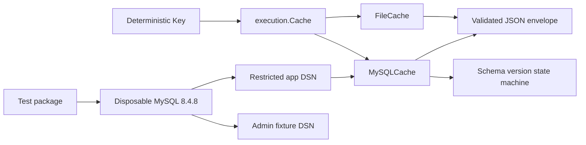

# Architecture Garden — flowkit

`flowkit` provides reusable bounded execution, durable item caching, and pipeline composition. PR #4 adds a MySQL implementation of `execution.Cache`; its review and repair expose three reusable patterns that matter beyond one cache table.

> [!summary]
> - A cache backend is substitutable only when it preserves the full validated envelope and key equality, not merely the decoded value.
> - MySQL DDL and schema-version writes do not form one transaction; a durable initialization marker turns interruption into an explicit retryable state.
> - Integration tests should own their database lifecycle while keeping runtime credentials separate from fault-injection authority.
> - These designs are locally validated by real MySQL 8.4.8 tests, repeated hosted execution, restart tests, corruption tests, and schema-state tests.

## Architecture under study



The shared `Cache` contract has only `Load` and `Store`, but its observable behavior includes key validation, maximum-entry limits, corruption classification, strict JSON decoding, restart durability, and equality. The MySQL adapter therefore reuses the same `cacheEnvelope` as `FileCache` rather than inventing a second wire shape.

## Design entries

### Validated envelopes preserve cache meaning across backends

[[Research/Software Architecture Garden/flowkit/designs/01 - Validated Envelopes Preserve Cache Meaning Across Backends|Design 01]] treats the stored envelope as a backend-neutral proof obligation. Schema identity, full key identity, and value digest are checked before decoding into a caller-owned target.

### Initialization markers make implicit DDL commits recoverable

[[Research/Software Architecture Garden/flowkit/designs/02 - Initialization Markers Make Implicit DDL Commits Recoverable|Design 02]] models schema setup as a small state machine. Version `0` means initialization is owned but incomplete; version `1` is recorded only after the complete table shape is verified.

### Test-owned databases separate runtime and fault authority

[[Research/Software Architecture Garden/flowkit/designs/03 - Test-Owned Databases Separate Runtime and Fault Authority|Design 03]] combines disposable infrastructure ownership with least privilege. The adapter receives a restricted DSN; test setup retains a separate administrator DSN for schema fixtures and fault injection.

## Shared laws

```text
Envelope law:
  Load(Store(k,v), k) = v only after schema, key, and digest validation.

Initialization law:
  version = 1 implies the complete version-1 table contract exists.

Authority law:
  credentials passed to production code do not include test-administration authority.

Isolation law:
  a required integration run cannot discover or mutate a developer's persistent database.
```

## Maturity assessment

| Pattern | Maturity | Evidence |
|---|---|---|
| Validated backend-neutral cache envelope | Validated locally | File/MySQL compatibility fixture, corruption tests, strict decoding, restart round trip |
| Exact storage equality | Validated locally and cross-project | `VARBINARY` digest columns; Sessionstream and Pinocchio provide related evidence |
| Recoverable versioned DDL initialization | Validated locally | interruption-marker retry test, structural v1 verification, advisory-lock serialization |
| Test-owned split-authority database | Validated locally | Testcontainers MySQL 8.4.8, random database/port, restricted grants, hosted `-count=2` |
| Batched cache lookup | Open design question | Current `Cache` interface performs one `Load` per key |

## Evidence

- Flowkit PR #4: https://github.com/go-go-golems/flowkit/pull/4
- `execution/cache.go`: reference envelope, key, limits, and corruption contract.
- `execution/mysql_cache.go`: adapter, schema state machine, exact SQL representation, advisory lock.
- `execution/mysql_cache_test.go`: compatibility, identity, restart, corruption, concurrency, schema, and recovery tests.
- `internal/testsupport/mysqltest/mysqltest.go`: disposable lifecycle and credential separation.
- `.github/workflows/mysql-integration.yml`: required real-engine path.

## Related studies

- [[Research/Software Architecture Garden/sessionstream/designs/07 - Storage Equality Is a Domain Identity Contract|Storage Equality Is a Domain Identity Contract]] supplies the broader equality law; Flowkit validates it for content-addressed cache digests.
- [[Research/Software Architecture Garden/sessionstream/designs/05 - Volatile Admission Is Not Durable Append|Volatile Admission Is Not Durable Append]] distinguishes accepted work from durable completion; MySQL cache `Store` returns only after the database operation completes.
- [[Research/playbooks/creating-github-issues-and-software-design-garden-entries|Creating GitHub Issues and Software Design Garden Entries]] defines this note/issue/catalog workflow.
