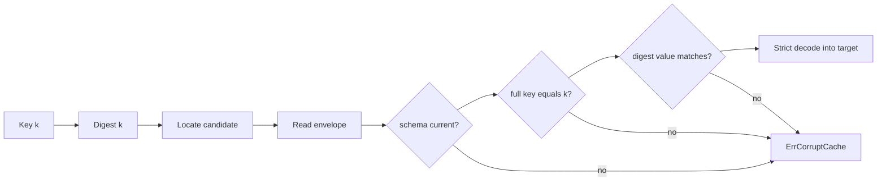

# Validated Envelopes Preserve Cache Meaning Across Backends

A durable cache entry is not merely serialized output. It is a claim that one value belongs to one deterministic key under one schema. A new backend preserves cache meaning only when it validates that claim before exposing the value.

> [!summary]
> - Persist schema identity, the complete semantic key, a value digest, and the value together.
> - Treat a key-digest lookup as an index optimization, not sufficient evidence of identity.
> - Decode strictly and classify malformed existing entries as corruption rather than cache misses.
> - Use one envelope across file and database adapters so backend changes do not change validation semantics.
> - SQL equality and capacity limits remain part of substitutability even when the envelope is byte-identical.

## Why this note exists

Flowkit's `FileCache` writes `cacheEnvelope` JSON containing `SchemaVersion`, the complete `Key`, `ValueDigest`, and raw value. PR #4's `MySQLCache` stores that same envelope in `value_json`, keyed by `Key.Digest()`.

The decision prevents the database adapter from becoming a weaker cache with a similar method signature. `Load` repeats FileCache's strict checks and returns `ErrCorruptCache` for malformed, oversized, wrong-schema, wrong-key, or wrong-value-digest rows.

## Pattern statement

> **A durable cache adapter should persist and validate one backend-neutral evidence envelope.** The lookup coordinate locates a candidate entry; schema, full-key, and value-digest checks establish that the candidate means what the caller requested.

## Envelope law

For key $k$, value $v$, schema $s$, canonical serialization $J$, and digest $H$:

$$
E(k,v)=(s,k,H(J(v)),J(v)).
$$

A load for $k'$ succeeds only if:

$$
s=s_{current}\land k=k'\land H(value)=valueDigest.
$$

The key digest $H(J(k))$ is a lookup projection. It is not a replacement for comparing the stored full key.

```go
type cacheEnvelope struct {
    SchemaVersion string
    Key           Key
    ValueDigest   string
    Value         json.RawMessage
}
```

## Concrete architecture



FileCache locates the envelope by a sharded digest path. MySQLCache locates it by a `VARBINARY(64)` primary key. The location mechanism differs; the evidence interpreted after lookup does not.

## Behavioral contract

The pattern guarantees:

- a missing coordinate returns `(false, nil)`;
- a present invalid entry fails closed;
- successful loads validate the complete key and value bytes;
- file and MySQL adapters share schema evolution;
- maximum entry size applies to both writes and existing reads;
- successful MySQL `Store` completes its database publication before returning.

It does not guarantee:

- the computed value is semantically correct;
- a cache write is immutable forever;
- two nondeterministic computations for one key produce the same output;
- a SHA-256 collision is impossible;
- batch efficiency for many keys.

## Exact storage identity

The SQL primary key stores lowercase hexadecimal SHA-256 text as `VARBINARY(64)`. This makes equality byte-exact and avoids locale, case, accent, and padding rules. It is one concrete application of [[Research/Software Architecture Garden/sessionstream/designs/07 - Storage Equality Is a Domain Identity Contract|Storage Equality Is a Domain Identity Contract]].

`step` and `version` are metadata copies of the full key. Because `Key` imposes no 255-character limit, the MySQL schema uses `MEDIUMTEXT`, while the complete envelope remains bounded by `MaxEntryBytes`. A backend-only `VARCHAR(255)` limit would violate substitutability even though ordinary keys worked.

## Why alternatives fail

### Store only the decoded result

There is no evidence that the value belongs to the requested key or current schema. A row mix-up can become a valid decode with incorrect meaning.

### Trust the primary-key digest

The digest finds a row, but comparing the stored full key detects wrong-row insertion, implementation mistakes, and non-equivalent key serialization.

### Treat corruption as a miss

Silent recomputation hides storage damage and can repeatedly spend money or produce divergent outputs. `ErrCorruptCache` makes the difference observable.

### Define a second SQL envelope

Two envelope formats create two validation policies and two schema-evolution paths. Byte compatibility is a stronger and simpler contract.

## Testing and verification

The implementation tests:

- round trip and missing entry;
- restart durability through a fresh connection pool;
- direct corruption of `schema_version`;
- oversized rows inserted outside `Store`;
- FileCache envelope bytes inserted directly into MySQL;
- concurrent stores of one content-addressed key;
- 1,024-character step and version fields;
- exact SQL column types.

A useful property suite should run the same generated keys, values, malformed envelopes, and size boundaries against every adapter.

## Applicability

Use this pattern for expensive deterministic computations, artifact caches, resumable pipeline stages, compiler intermediates, model outputs, and generated bundles where a wrong hit is worse than a visible failure.

A disposable best-effort memoization map may not need a self-validating envelope. If entries are authoritative records rather than recomputable results, use a domain record and migration model rather than calling the structure a cache.

## Candidate ecosystem guidance

1. Make cache keys cover every input that can change the result.
2. Persist full key evidence beside the lookup projection.
3. Share one envelope across adapters.
4. Fail closed on present-but-invalid entries.
5. Preserve equality and length semantics at every backend.
6. Apply size limits on load and store.
7. Test compatibility by moving raw envelope bytes between backends.

## Open questions

- Should `Cache` expose batch lookup without weakening per-entry validation?
- Should overwriting one key with a different value be rejected as nondeterminism rather than accepted as refresh?
- Should schema evolution migrate envelopes, invalidate them, or namespace new tables?
- Which metrics distinguish miss, corrupt entry, schema mismatch, and decode failure?

## Evidence and references

- Flowkit PR #4: https://github.com/go-go-golems/flowkit/pull/4
- `execution/cache.go`: `Key`, `cacheEnvelope`, `FileCache.Load`, `FileCache.Store`.
- `execution/mysql_cache.go`: `MySQLCache.Load`, `MySQLCache.Store`.
- `execution/mysql_cache_test.go`: cross-backend compatibility and corruption fixtures.
