# Initialization Markers Make Implicit DDL Commits Recoverable

Schema setup often looks transactional in application code while the database commits DDL independently. If a process creates a table and dies before recording its version, later constructors cannot distinguish interrupted owned work from an unknown prototype. A durable initialization marker resolves that ambiguity.

> [!summary]
> - Model initialization as explicit states, not `CREATE TABLE IF NOT EXISTS` plus hope.
> - Record an incomplete marker before nontransactional DDL.
> - Verify the complete schema contract before promoting the marker to a supported version.
> - Serialize the database-level registry and component DDL with one connection-owned advisory lock.
> - Continue to reject existing unmarked tables; recovery must not become implicit adoption.

## Why this note exists

Flowkit MySQLCache originally used only `CREATE TABLE IF NOT EXISTS`. The repaired design added a component version registry, but a review exposed another interruption window:

```text
CREATE TABLE cache_entries  -- implicitly commits
process dies
INSERT schema version       -- never happens
```

Every retry then sees an existing unversioned table and fails permanently. Automatically adopting it would be unsafe because the same state can represent an older prototype with a different schema.

## Pattern statement

> **Before executing nontransactional initialization work, persist a component-owned incomplete marker. On retry, an incomplete marker authorizes resume only after the resulting object is structurally verified. An existing object without that marker remains unknown and fails closed.**

## State machine

Let the schema state be:

```text
Absent       = no component row, no managed table
Unknown      = no component row, managed table exists
Initializing = component version 0
Ready(v)     = component version v and verified table
Broken(v)    = recorded version v but missing/malformed table
```

Allowed transitions:

```mermaid
stateDiagram-v2
    [*] --> Absent
    Absent --> Initializing: insert component, version 0
    Initializing --> Initializing: create/verify table
    Initializing --> Ready1: verify exact v1; update 0→1
    Ready1 --> Ready1: verify on startup
    Unknown --> Rejected
    Broken1 --> Rejected
    Ready1 --> Rejected: unsupported/malformed
```



The central invariant is:

$$
version=1 \Rightarrow Schema(table)=SchemaV1.
$$

Version `0` is not a supported runtime schema. It is durable recovery evidence.

## Concrete algorithm

```go
conn := db.Conn(ctx)                // advisory locks are connection-scoped
GET_LOCK(databaseScopedName, 30)
defer RELEASE_LOCK(...)

inspect versionRegistry and table

if registry absent && table present:
    reject unknown prototype
if registry absent:
    create registry

version := lookup(component)
if component absent && table present:
    reject unknown prototype
if component absent:
    insert(component, 0)
    version = 0

if version == 0:
    if table absent:
        create table
    verify exact columns and primary key
    update component from 0 to 1
    return

if version != 1:
    reject unsupported version
verify exact columns and primary key
```

## Why the advisory lock is database-scoped

Configurable cache tables share `flowkit_schema_version`. A lock derived only from one table serializes creation of that table but allows two constructors to race while creating or changing the shared registry.

The implementation hashes the selected database identity into a bounded lock name and performs lock acquisition, inspection, DDL, version mutation, and release on one dedicated `*sql.Conn`.

```text
one database
  ├── flowkit_schema_version   shared mutation
  ├── cache_A                  component A
  └── cache_B                  component B

therefore lock scope = database, not component table
```

This intentionally trades parallel schema startup for simple correctness. Runtime cache operations do not hold the lock.

## Structural verification

A version row alone is only a claim. Flowkit verifies:

- the exact seven-column set;
- `VARBINARY(64)` digest fields;
- `MEDIUMTEXT` metadata/value fields;
- non-nullability;
- `BIGINT` timestamp;
- `key_digest` as the primary key.

The metadata lookup uses `BINARY table_name = BINARY ?` because quoted table identifiers are case-sensitive on Linux MySQL when `lower_case_table_names=0`. Migration inspection must use the same identity relation as DDL and runtime queries.

## Failure windows

| Interruption | Durable state | Retry behavior |
|---|---|---|
| before marker insert | absent | restart initialization |
| after marker, before table | version 0, no table | create and verify table |
| after table's implicit commit | version 0, table exists | verify and finalize |
| after version 1 | ready | verify and open |
| old prototype predating marker | table, no component | reject explicitly |

The marker does not make DDL transactional. It makes each partial state interpretable.

## Why alternatives fail

### Create table, then record version

The post-DDL interruption state is ambiguous and permanently stranded under fail-closed startup.

### Record version 1, then create table

A crash exposes a supported version whose promised table does not exist. The implication `version=1 ⇒ schema=v1` is false.

### Adopt any existing table

An interrupted current initializer and an incompatible historical prototype have the same surface shape. Adoption guesses provenance.

### Use `CREATE TABLE IF NOT EXISTS`

It suppresses one SQL error but does not validate columns, keys, types, collation, or ownership.

### Acquire the lock through `*sql.DB`

MySQL advisory locks belong to physical connections. Pool calls can acquire, migrate, and release on different sessions.

## Testing and verification

The Flowkit suite creates a version-0 marker and exact table directly, simulating interruption after DDL commit but before final version update. A new constructor must validate the table, promote to version 1, and open successfully.

Other useful fixtures:

- marker exists, table absent;
- marker exists, malformed table;
- version 1, table absent;
- version 1, wrong type or primary key;
- unsupported version;
- unmarked prototype;
- simultaneous constructors for distinct components in one database;
- identifiers differing only by case.

## Applicability

Use this pattern for libraries that self-initialize database tables where DDL is nontransactional or auto-committing, especially when multiple independently versioned components share one registry.

Do not use it as a replacement for an operational migration system when changes require data transformation, online backfill, rollback, or fleet-wide orchestration. The marker is a local initialization protocol, not a complete deployment migration framework.

## Candidate ecosystem guidance

1. Write the schema states before writing migration SQL.
2. Reserve an explicit incomplete version or status.
3. Persist incomplete ownership before nontransactional effects.
4. Verify structure before publishing a supported version.
5. Keep unknown unmarked objects fail-closed.
6. Scope locks to every shared mutation artifact.
7. Hold connection-scoped locks and DDL on one connection.
8. Match metadata identity rules to runtime identifier rules.

## Open questions

- Should incomplete markers include owner instance, start time, and migration digest?
- How long may a version-0 marker remain before operator alerting?
- Should schema verification include engine, charset, indexes, and check constraints?
- How should a future v1→v2 data migration represent resumable progress?
- When should library initialization yield to an external migration controller?

## Detailed implementation report

The package-level Testcontainers execution that exposed the registry race, the interrupted-DDL fixture, and the hosted validation sequence are documented in [[Research/2026/08/19/ARTICLE - Flowkit MySQL Cache Testing with Testcontainers|Flowkit MySQL Cache Testing with Testcontainers]].

## Evidence and references

- Flowkit PR #4: https://github.com/go-go-golems/flowkit/pull/4
- Review finding: https://github.com/go-go-golems/flowkit/pull/4#discussion_r3809208521
- `execution/mysql_cache.go`: `migrate`, `validateMySQLCacheSchemaV1`, advisory lock.
- `execution/mysql_cache_test.go`: `TestMySQLCacheMigrationRecoversFromInitializationMarker` and case-sensitive identity test.
