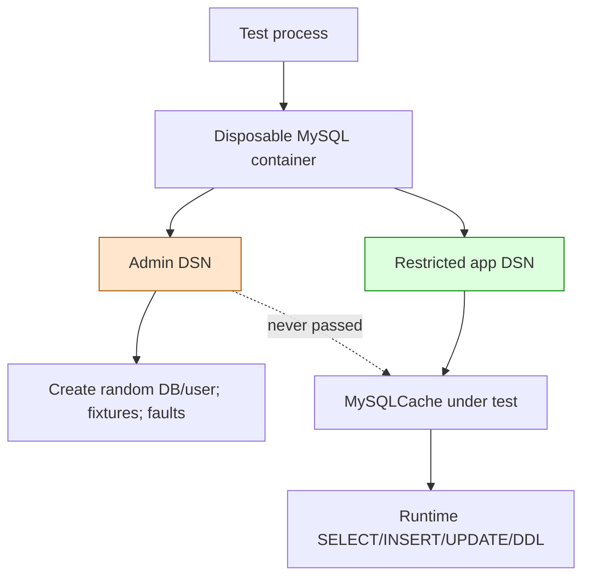

# Test-Owned Databases Separate Runtime and Fault Authority

A real-engine integration test needs more authority than the adapter it validates. Schema-state fixtures may create databases, install faults, or corrupt rows deliberately. Passing those privileges through the application adapter invalidates least-privilege evidence. The test harness should own infrastructure and administration while the system under test receives only runtime credentials.

> [!summary]
> - The test process owns a disposable server with no reused name, fixed port, or persistent volume.
> - The adapter under test receives only a database-scoped application DSN.
> - A separate administrator DSN exists only for fixture construction and fault injection.
> - Package-level lifecycle amortizes startup while preserving fresh invocation state.
> - Hosted CI explicitly enables the real-engine path and fails if provisioning fails; ordinary unit tests remain Docker-free.

## Why this note exists

Early Flowkit MySQL tests read `FLOWKIT_MYSQL_CACHE_DSN` and skipped when it was absent. They were commonly run against a persistent shared developer database. Stable test table names and raw fixture inserts required cleanup, stale schemas influenced later runs, and hosted unit CI did not execute the database contract.

The preceding Pinocchio and Sessionstream work also needed trigger-based rollback faults. That exposed a broader authority mistake: an application account should not gain global trigger or database-administration privileges merely because tests need to manufacture failures.

## Pattern statement

> **A real-database integration harness owns server lifecycle and administrative authority. It derives a restricted runtime credential for the adapter under test and retains a separate administrator credential for test-only state construction. The required CI path provisions this environment explicitly and never falls back to a persistent developer database.**

## Authority decomposition

Let $A$ be administrator capabilities and $R$ runtime capabilities. The desired relation is:

$$
R \subset A
$$

but the adapter receives only $R$.



Flowkit grants the application account only database-scoped:

```text
SELECT, INSERT, UPDATE, DELETE, CREATE, ALTER, INDEX, DROP
```

The root/admin connection creates the random database and user. It remains inside test support.

## Lifecycle ownership

The harness starts pinned `mysql:8.4.8` through Testcontainers Go. It uses:

- a random mapped host port;
- a random database name;
- a random application password;
- no bind mount or named volume;
- no fixed container name;
- no reuse mode;
- explicit bounded termination plus the Testcontainers resource reaper.

These are not convenience settings. Together they make accidental mutation of the developer Compose database structurally impossible in the required path.

## Package-scoped amortization

One container per test is maximally isolated but slow. One external server across invocations is fast but stale. Flowkit uses one disposable container per `execution` package invocation.

```text
TestMain
  start container once
  create random database/user
  set app/admin test environment
  run all package tests
  terminate container
```

Tests use distinct table/component identities and clean their own rows/schema records. Schema-state tests can create isolated databases or components when they need incompatible states.

## Required versus diagnostic modes

```text
FLOWKIT_MYSQL_TESTCONTAINERS=1
    => provision disposable MySQL or fail

FLOWKIT_MYSQL_CACHE_DSN=<external DSN>
    => diagnostic external-server mode

neither
    => database tests skip for ordinary local unit runs
```

Hosted `.github/workflows/mysql-integration.yml` sets the Testcontainers flag and runs `GOWORK=off go test -p 1 -count=2 ./execution`. The explicit flag changes provisioning failure from a skip into a failed required check.

## Why real MySQL remains necessary

Mocks and SQLite cannot establish:

- MySQL identifier quoting and reserved-word behavior;
- `VARBINARY` equality;
- `MEDIUMTEXT` capacity;
- `information_schema` metadata semantics;
- DDL implicit commits;
- `GET_LOCK` connection ownership;
- `ON DUPLICATE KEY UPDATE` behavior;
- Linux table-name case rules;
- connection-pool restart durability.

The disposable server is test isolation; it is not a substitute for contract-focused assertions.

## Why alternatives fail

### Run everything as root

The adapter passes tests with powers unavailable in production. Privilege regressions remain invisible.

### Reuse the application DSN for fault injection

Tests pressure the production account toward `TRIGGER`, global DDL, or database creation privileges. The fixture's needs leak into the runtime contract.

### Reuse a developer Compose database

Persistent volumes retain stale schemas and rows. Destructive fixtures can modify valuable local state. Parallel agents collide.

### Skip whenever Docker is unavailable

A required hosted integration job that silently skips gives a green check without exercising the storage backend.

### Use only a service container configured in YAML

A service container can be valid, but lifecycle and credentials often become workflow-global and harder to share with package-local tests. The key law is test ownership and split authority, not the Testcontainers brand.

## Failure containment

The harness should register cleanup immediately after container creation. If later database/user setup fails, it terminates the partially initialized container. Normal cleanup uses a bounded context and converts termination failure into a package-test failure when tests otherwise passed.

Secrets are generated in process and must not be logged. No DSN belongs in Garden notes, issue bodies, CI output, or assertion messages.

## Testing and verification

Verify the harness itself at two levels:

### Docker-free unit tests

- generated identifier alphabet and uniqueness;
- identifier quoting;
- SQL-string escaping or, preferably, parameterized alternatives;
- DSN derivation.

### Real-engine tests

- app DSN can perform every adapter operation;
- app DSN cannot perform admin-only operations;
- admin DSN can construct malformed states without entering production APIs;
- restart uses the same disposable database but a fresh pool;
- repeated `-count=2` runs leave no cross-run state;
- container terminates on success and setup failure;
- no Compose container or volume identity changes.

## Applicability

Use for adapters whose correctness depends on a real database, broker, object store, or protocol implementation and whose tests require stronger setup authority than production runtime code.

Do not use disposable infrastructure to avoid writing unit tests. Pure key, envelope, state-machine, and DSN logic should remain fast and Docker-free. Do not claim Aurora-specific guarantees from a MySQL container when engine behavior differs.

## Candidate ecosystem guidance

1. Let tests own disposable infrastructure.
2. Give production code only production-shaped credentials.
3. Keep test administration out of adapter APIs.
4. Use random ports, databases, and secrets.
5. Disable reuse and persistent mounts for destructive schema tests.
6. Make required CI provisioning fail closed.
7. Keep a clearly labeled external-DSN diagnostic mode.
8. Pin both test library and server image.
9. Validate the transitive test dependency graph for vulnerabilities.

## Open questions

- Should the harness expose random-database creation as a first-class fixture API?
- How should container logs be retained on hosted failure without leaking credentials?
- Should app grants exclude `DROP` once migrations are moved out of runtime startup?
- Can the same split-authority interface cover PostgreSQL, Redis, and object-store tests?
- How should CI distinguish Docker infrastructure failure from adapter failure?

## Evidence and references

- Flowkit PR #4: https://github.com/go-go-golems/flowkit/pull/4
- `internal/testsupport/mysqltest/mysqltest.go`: container, random database, credentials, grants, cleanup.
- `execution/mysql_testmain_test.go`: package lifecycle and explicit opt-in.
- `execution/mysql_cache_test.go`: real-engine contract tests.
- `.github/workflows/mysql-integration.yml`: required hosted path.
- Related Testcontainers design: `/home/manuel/workspaces/2026-08-13/ragkit-coinvault-mysql/coinvault/ttmp/2026/08/13/COINVAULT-MYSQL-STATE-001--move-durable-file-based-state-caches-turns-timeline-to-mysql-aurora/design-doc/05-testcontainers-mysql-integration-test-harness-design-and-implementation-plan.md`.
