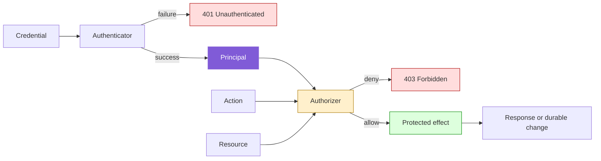
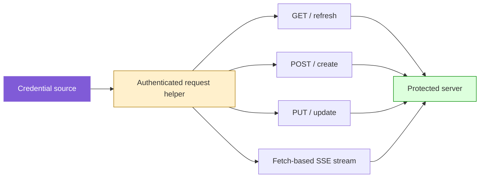

# Authentication Is Not Authorization - Preserve the Principal to the Effect Boundary

Authentication establishes who a requester is. Authorization decides whether that principal may perform a specific action on a specific resource. A system that authenticates correctly and then discards the principal cannot enforce principal-specific policy. It has reduced a structured security decision to the statement “some accepted credential was present.”

The load-bearing design rule is simple: retain the authenticated principal until the policy-enforcement point, authorize the requested action and resource immediately before the protected effect, and make the effect unreachable when authorization fails. On the client side, retain the credential source until every protected request—including refresh, retry, and streaming requests—has been constructed. Authentication context is useful only when it reaches the operation whose behavior depends on it.

> [!summary]
> - Authentication should return a principal, not only a boolean success value.
> - Authorization is a relation over principal, action, and resource: `allow(principal, action, resource)`.
> - Sensitive effects require complete mediation: every path to the effect performs the same authorization check.
> - Principal authority commonly forms a partial order through grant-set inclusion; an agent with fewer grants must not become equivalent to a human after authentication.
> - Protected clients require one credential-aware transport for normal requests, retries, refreshes, and long-lived streams.
> - Negative tests are part of the pattern: a valid lower-authority credential must reach authentication and then receive a deliberate authorization denial.

## Why this pattern exists

Many systems begin with one bearer token and one authenticated user class. In that initial state, authentication can appear to be sufficient because every accepted principal has the same permissions. Code often grows a helper with this shape:

```go
func authenticate(w http.ResponseWriter, r *http.Request) bool
```

Handlers call it and proceed when it returns `true`. This works only while the set of authenticated principals is also the set of principals authorized for every protected operation.

The assumption fails as soon as the system introduces differentiated authority:

- human and agent principals;
- administrators and ordinary users;
- organization owners and organization members;
- service accounts with read-only scopes;
- support operators with metadata access but no content access;
- API keys restricted to one project or resource class.

At that point, authentication success no longer implies permission. If the principal is discarded, later code cannot distinguish authority levels. Every valid credential enters one undifferentiated class.

RAG-TTC PR #8 provided the first Garden evidence for this general pattern. The workbench server defines a human principal and an agent principal. The human grant contains proposal sealing and restricted artifact access. The agent grant contains catalog read, proposal compilation, and preview, but intentionally excludes sealing and restricted artifact access.

The work API authenticates every bearer token, but its helper discards the principal and returns a boolean. A raw artifact endpoint then serves sealed answers, evidence prose, and judge reports to any authenticated principal. The authenticator works correctly. The authorization policy exists. The sensitive route bypasses that policy because the value connecting authentication to authorization is gone.

A second finding exposed the client-side complement. The document server was correctly changed to require bearer authentication, but the custom synchronization transport sent no credentials and used native `EventSource`, which cannot attach an `Authorization` header. The credential existed in application state but did not reach the network operations that required it.

These failures are one pattern viewed from opposite sides of the protocol:

```text
server:
    credential -> principal -> authorization -> protected effect

client:
    credential source -> authenticated request -> protected endpoint
```

The required security context must remain explicit along the complete path.

## Pattern statement

> **Authentication produces a principal; it does not grant every protected effect. Preserve that principal to a policy-enforcement point that checks `(principal, action, resource)` immediately before sensitive I/O. On the client, route every protected request through one current credential source. Do not reduce authentication to a boolean, and do not reconstruct authority from ambient state after it has been discarded.**

The pattern has four required stages:

```text
1. Resolve credential to principal.
2. Validate the principal and retain it.
3. Authorize principal + action + resource.
4. Perform the protected effect only after authorization succeeds.
```

For client transports:

```text
1. Read the current credential from one source.
2. Construct the request with the required authentication material.
3. Perform every protocol operation through that transport.
4. Re-evaluate credentials when retrying or reconnecting.
```

## Abstract security model

Let:

- $K$ be the set of credentials;
- $P$ be the set of principals;
- $A$ be the set of actions;
- $R$ be the set of resources;
- $D=\{Allow,Deny\}$ be the authorization decision set.

Authentication is a partial function:

$$
authenticate:K\rightarrow P+Error.
$$

A credential may be invalid, expired, malformed, or unknown. Successful authentication returns a principal. It does not return an action grant.

Authorization is a decision function:

$$
authorize:P\times A\times R\rightarrow D+Error.
$$

The protected effect has domain input $I$ and output $O$:

$$
effect:I\rightarrow O+Error.
$$

The secure composition is:

$$
secureEffect(k,a,r,i)=
\begin{cases}
effect(i) & \text{if } authenticate(k)=p \land authorize(p,a,r)=Allow\\
Unauthenticated & \text{if } authenticate(k)=Error\\
Forbidden & \text{if } authenticate(k)=p \land authorize(p,a,r)=Deny.
\end{cases}
$$

The insecure reduction is:

$$
authenticated:K\rightarrow\{true,false\}
$$

followed by:

$$
authenticated(k)=true\Rightarrow effect(i).
$$

This reduction removes $P$, $A$, and $R$ from the decision. Once they are absent, the system cannot implement least privilege for the effect.

## Authority as a partial order

A principal $p$ may have a grant set $G(p)\subseteq A$. Define an authority order:

$$
p_1\preceq p_2 \iff G(p_1)\subseteq G(p_2).
$$

This is a partial order when different principals have incomparable grant sets. One service account may write invoices but not read user profiles; another may read profiles but not write invoices. Neither necessarily dominates the other.

In the RAG-TTC case:

```text
G(agent) = {
    catalog.read,
    proposal.compile,
    preview.run
}

G(human) = G(agent) union {
    proposal.seal,
    artifact.read.restricted,
    artifact.write.restricted
}
```

Therefore:

$$
agent\prec human.
$$

If a handler maps both principals to `authenticated=true`, it collapses a strict authority relation into equality:

$$
agent\sim human.
$$

That collapse is valid only for operations whose policy is genuinely “any authenticated principal.” It is invalid for restricted artifact reads or proposal sealing.

## Concrete architecture



The components have separate responsibilities:

| Component | Responsibility | Must not decide |
| --- | --- | --- |
| Authenticator | Resolve credential to validated principal | Whether one action is allowed on one resource |
| Authorizer / policy decision point | Decide principal-action-resource policy | How to load or mutate the resource |
| Handler / policy enforcement point | Retain principal, invoke authorizer, prevent bypass | Domain policy independently of the authorizer |
| Projector or repository | Resolve and return durable facts safely | HTTP authentication or principal policy |
| Client credential source | Supply current credential | Server-side authorization outcome |
| Authenticated transport | Attach credentials to every protected request | Whether the server should allow the action |

This separation permits a pure projector to be reused by CLI or tests without fabricating HTTP principals, while still ensuring every HTTP path to sensitive content is mediated.

## Complete mediation

Complete mediation requires every access to a protected object to be checked. In application terms:

```text
all paths to restricted effect
    -> same authorization decision
    -> effect unreachable on denial
```

The requirement is stronger than “the route group has authentication middleware.” Authentication middleware proves only principal identity. Complete mediation for differentiated authority requires an action/resource check on every sensitive path.

If the same artifact can be reached through:

- an explicit artifact route;
- an export route;
- a debug endpoint;
- a stream;
- a batch API;
- a background job;

then each path needs equivalent authorization. Hiding one path from the UI is not mediation. Calling a route “internal” is not mediation. Checking only the common case is not mediation.

A practical design is to classify routes by required policy:

| Route class | Required context | Example |
| --- | --- | --- |
| Public | none | health check with no sensitive detail |
| Authenticated | principal identity | bounded job metadata visible to every seat |
| Authorized | principal + action + resource | restricted artifact body |
| Approval-gated | principal + action + resource + one-shot grant | agent-requested dangerous command |

The classification should be explicit in code review and tests.

## Principal-carrying handler design in Go

A server with differentiated principals should make its dependencies required:

```go
type Server struct {
    Projector     Projector
    Authenticator Authenticator
    Authorizer    Authorizer
}

func (s Server) Handler() (http.Handler, error) {
    if s.Authenticator == nil {
        return nil, errors.New("authenticator is required")
    }
    if s.Authorizer == nil {
        return nil, errors.New("authorizer is required")
    }
    // register routes
}
```

Authentication retains the principal:

```go
func (s Server) authenticate(
    w http.ResponseWriter,
    r *http.Request,
) (Principal, bool) {
    principal, err := s.Authenticator.Authenticate(r)
    if err != nil {
        writeError(w, http.StatusUnauthorized, "unauthenticated")
        return Principal{}, false
    }
    return principal, true
}
```

Authorization occurs before protected I/O:

```go
func (s Server) restrictedArtifact(w http.ResponseWriter, r *http.Request) {
    principal, ok := s.authenticate(w, r)
    if !ok {
        return
    }

    resource := Resource{
        Kind: "benchmark-unit-artifact",
        ID:   artifactResourceID(r),
    }
    if err := s.Authorizer.Check(
        r.Context(),
        principal,
        ActionArtifactReadRestricted,
        resource,
    ); err != nil {
        writeAuthorizationError(w, err)
        return
    }

    view, err := s.Projector.ReadArtifact(resource.ID)
    if err != nil {
        writeDomainError(w, err)
        return
    }
    writeJSON(w, http.StatusOK, view)
}
```

The effect boundary is `Projector.ReadArtifact`. Authorization occurs before it. The projector remains responsible for path safety and data validity, but not principal policy.

## Authorization context as a required value

A further refinement can represent successful authorization as a value rather than a control-flow fact:

```go
type Authorized[T any] struct {
    Principal Principal
    Resource  T
    Action    Action
}
```

A policy-enforcement function returns `Authorized[Resource]` only after a successful check. Sensitive application functions can accept that value:

```go
func ReadRestrictedArtifact(
    ctx context.Context,
    grant Authorized[ArtifactResource],
) (Artifact, error)
```

This makes omission visible in the type signature. It is most useful when several internal layers must carry authorization proof. It is unnecessary for a short HTTP handler that checks policy immediately before one projector call. Use the value when it removes real bypass paths; do not add it only for nominal type complexity.

## Resource identity is part of authorization

An action-only policy answers:

```text
May principal p read some restricted artifact?
```

A resource-aware policy can answer:

```text
May principal p read artifact r in project x, organization y, or run z?
```

Resource identity should be:

- stable;
- canonical;
- specific enough for policy;
- derived before authorization;
- independent of display labels;
- resistant to path ambiguity.

Example:

```go
Resource{
    Kind: "benchmark-unit-artifact",
    ID: jobID + "/" + unitID + "/" + artifactKind,
}
```

If the resource ID can be represented in multiple spellings, normalize before authorization and before lookup. Otherwise policy and storage may evaluate different objects.

Authorization does not replace path safety. A caller authorized for one journal-referenced artifact should not be able to choose `../../other-run/secret`. The handler authorizes the canonical resource, and the projector resolves only paths admitted by the durable journal.

## Client-side credential propagation

Server authorization cannot run if the client omits its credential. Protected clients need the dual of principal retention: one current credential source must reach every network operation in the protocol.



A minimal credential contract is:

```ts
export interface CredentialSource {
  getToken(): string | null;
  subscribe(listener: () => void): () => void;
}
```

A request helper reads the credential at request time:

```ts
async function authenticatedFetch(
  source: CredentialSource,
  input: RequestInfo | URL,
  init: RequestInit = {},
): Promise<Response> {
  const headers = new Headers(init.headers);
  const token = source.getToken();
  if (token) headers.set("Authorization", `Bearer ${token}`);
  return fetch(input, { ...init, headers });
}
```

Reading at request time matters for:

- token rotation;
- logout;
- reconnect;
- retry after 401;
- long-lived synchronization clients;
- session-only credentials when persistent storage is unavailable.

Copying the token once during client construction creates stale authority.

## Long-lived transports must support the authentication contract

A protocol may include ordinary requests and a long-lived stream. Every leg is protected.

Native browser `EventSource` does not accept arbitrary headers. It is incompatible with bearer-header authentication unless the server also supports cookies or another credential channel. Query-string tokens should not be used because URLs commonly enter logs, diagnostics, histories, and intermediary metadata.

Under a bearer-header contract, use fetch-based SSE:

```ts
const response = await authenticatedFetch(source, streamURL, {
  headers: { Accept: "text/event-stream" },
  signal: controller.signal,
});
```

The stream owner must also react to credential changes:

```text
token replaced
    -> abort old stream
    -> authenticate startup/refresh with new token
    -> open new stream

token removed
    -> abort protected stream
    -> preserve declared local/offline behavior
```

A transport abstraction that cannot carry the required credential is the wrong implementation for that protocol.

## Authentication and authorization error semantics

Clients and operators need to distinguish identity failure from policy denial.

| Condition | HTTP status | Meaning |
| --- | ---: | --- |
| Credential absent, malformed, expired, or unknown | 401 | No accepted principal was established |
| Principal established but action/resource denied | 403 | Principal is known and lacks authority |
| Authorized resource does not exist | 404 | Domain lookup failed after policy check |
| Request shape invalid | 400 / 422 | Input contract failed |
| Protected effect failed internally | 500-class | Server could not complete an allowed operation |

A 401 response should usually carry `WWW-Authenticate` for bearer protocols. A 403 should not instruct the client to repeat the same credential as if authentication had failed.

Systems may deliberately return 404 instead of 403 to conceal resource existence. That is a separate policy decision and should be consistent across equivalent routes. It does not remove the need for an authorization decision.

## Reference monitor and policy-enforcement point

The classic reference-monitor requirements remain useful:

1. **Complete mediation:** every protected access is checked.
2. **Tamper resistance:** ordinary domain code cannot bypass or rewrite the policy boundary.
3. **Verifiability:** the enforcement mechanism is small enough to test and review.

Modern systems commonly split this into:

- a **policy decision point** that evaluates principal, action, and resource;
- a **policy enforcement point** that blocks the effect unless the decision allows it.

In a small Go service, the authorizer is the decision point and the HTTP/application handler is the enforcement point. They need not be separate processes. The conceptual separation still matters because policy and resource projection evolve for different reasons.

## Relationship to RBAC and capabilities

### Role-based access control

RBAC assigns permissions to roles and roles to principals:

$$
Principal\rightarrow Roles\rightarrow Permissions.
$$

The handler still needs principal, action, and resource context. RBAC supplies one implementation of `authorize`; it does not justify reducing authentication to a boolean.

### Capability-based authority

A capability is an unforgeable value that both designates a resource and conveys authority over it. If an application passes capability values directly, possession may replace a separate principal/action lookup for that operation.

The same preservation law applies:

```text
capability established
    -> capability retained
    -> capability consumed by protected effect
```

Do not replace a capability with `hasCapability=true` and then permit a caller-chosen resource. That loses designation and scope.

### One-shot approval grants

Approval-gated systems may mint a one-shot grant for one dangerous action and subject. The grant should bind:

```text
principal or requester
verb/action
resource/subject
approval identity
consumption state
```

A boolean `approved=true` loses those coordinates and permits replay or subject substitution.

## Safety properties

### Principal retention

If authentication establishes principal $p$, every downstream authorization decision for that request uses $p$ or an explicitly derived delegation:

$$
authenticate(k)=p\Rightarrow authorizeInput.principal=p.
$$

### No unauthorized effect

$$
effect(p,a,r)\Rightarrow authorize(p,a,r)=Allow.
$$

### Denial noninterference

A denied request does not perform protected I/O:

$$
authorize(p,a,r)=Deny\Rightarrow effectCount(p,a,r)=0.
$$

This can be tested with a spy repository or an impossible fixture.

### Grant monotonicity

If $G(p_1)\subseteq G(p_2)$, an action allowed solely through the shared grant set should not be available to $p_1$ when absent from its grants:

$$
a\notin G(p_1)\Rightarrow Deny(p_1,a,r).
$$

Grant monotonicity does not require every action allowed to $p_1$ to be allowed to $p_2$ when resource predicates or separation-of-duty rules apply. Grant sets are one policy input, not the entire policy language.

### Credential completeness

For every protected client operation $q$ under a bearer contract:

$$
Protected(q)\land token\ne\varnothing
\Rightarrow
AuthorizationHeader(q)=Bearer(token).
$$

The quantified set includes refresh, retry, create, update, delete, stream, and reconnect operations—not only the first request.

## Negative tests are part of the pattern

A positive authorization test proves that one intended principal can perform the operation. It does not prove least privilege.

The minimum server matrix is:

| Credential | Authentication | Authorization | Expected |
| --- | --- | --- | ---: |
| none | fail | not evaluated | 401 |
| unknown | fail | not evaluated | 401 |
| valid low-authority principal | succeed | deny | 403 |
| valid high-authority principal | succeed | allow | success |

The low-authority case is decisive. It proves that authentication and authorization are not accidentally equivalent.

Additional tests should establish:

- the protected repository/projector is not invoked on denial;
- resource A authority does not permit resource B;
- action X authority does not permit action Y;
- an approval grant cannot be replayed or applied to another subject;
- all client request variants carry the current credential;
- token replacement restarts long-lived transports;
- token removal terminates protected streams;
- credentials never appear in request URLs.

## Failure modes

### Principal reduced to `bool`

```go
if !authenticate(w, r) {
    return
}
readRestrictedArtifact()
```

The policy can no longer distinguish authenticated principals.

### Principal stored only in ambient global state

Background work, nested calls, or tests may execute without the expected global binding. Pass the principal or a request context value with one documented owner; do not rely on mutable process-global identity.

### Action checked without resource

A principal authorized to read one project may read another project if the authorizer sees only `artifact.read`.

### Resource checked after I/O

Reading the artifact before authorization can expose timing, cache, logging, or side effects even when the response is later denied. Authorize before protected I/O.

### UI hides an action but the server permits it

Presentation is not policy. Programmatic clients and altered browsers can call the route directly.

### One route is authorized and another equivalent route is not

Export, debug, batch, stream, and direct-read routes require the same classification when they expose the same protected resource.

### Bearer token added to ordinary fetch but not streaming

The initial page appears authenticated while synchronization or event delivery repeatedly receives 401.

### Token captured once

Rotation or login after startup leaves the client using stale or absent credentials.

### Token placed in URL

The request works but the credential enters URL-bearing infrastructure. This is not an acceptable bearer-header substitute.

### Every authorization failure returned as 401

The client cannot distinguish invalid credentials from insufficient authority, and operators may repeatedly rotate valid tokens that can never receive the action grant.

## Why tempting alternatives fail

### “The route group is authenticated”

Route-group authentication establishes identity. It does not establish operation-specific permission.

### “There is only one sensitive endpoint”

One endpoint still requires complete mediation. A small explicit check is cheaper than treating all valid principals as equivalent.

### “The agent cannot reach the button”

The API remains callable. UI reachability is not authority.

### “The token maps to grants, so authentication already authorizes”

The authenticator may internally know the grant record, but if it returns only a principal or boolean and does not evaluate action/resource, no operation-specific decision has occurred.

### “Put the check in the data projector”

This couples resource interpretation to transport policy and makes non-HTTP callers fabricate security context. Enforce policy at the application boundary, then keep the projector pure and path-safe.

### “Pass roles instead of the principal”

Roles may be derived from the principal, but resource ownership, delegation, audit identity, and dynamic policy may still require the principal. Preserve the richer value unless a deliberately scoped authorization proof replaces it.

### “Retry 401 after the user enters a token”

A retry mechanism helps only if it observes token changes, applies credentials to every protocol operation, and replaces unauthenticated long-lived transports.

## Applicability

Use this pattern when:

- more than one authenticated principal class exists;
- principals have different grant sets or resource scopes;
- sensitive content or mutations are exposed;
- an agent or service account has less authority than a human;
- APIs include both metadata and restricted-body routes;
- a browser or daemon maintains protected long-lived streams;
- approvals grant temporary or one-shot authority;
- auditing must name the actor who performed an effect.

The pattern remains useful with one principal class because it prepares the system for differentiated authority, but the cost should match the risk. A private local-only tool with one operator may reasonably require authentication only at the process boundary. The decision should be explicit.

Do not interpret the pattern as requiring a remote policy engine. A local `Authorizer.Check` implementation is sufficient when policy is local and small.

## Concrete evidence: RAG-TTC workbench

RAG-TTC supplies two direct failures and one explicit policy model.

### Differentiated grants

The serve command defines human and agent action sets. The agent lacks `proposal.seal` and both restricted artifact actions. Tests already prove agent seal returns 403 while human seal passes authorization.

### Restricted artifact bypass

`workapi.authenticate` discards the principal. `unitArtifact` then calls `BenchmarkUnitArtifact`, which returns raw sealed-answer and judge-report JSON. The agent's valid token passes authentication and reaches content excluded from its grant set.

The design documentation had stated the stronger contract before implementation:

```text
restricted artifact text reaches the agent only under
artifact.read.restricted
```

The defect is therefore an enforcement gap, not an undefined product decision.

### Anonymous document synchronization

The workbench document host was placed behind bearer authentication. Its custom browser sync still sent bare GET/POST/PUT requests and used native `EventSource`. The stored token existed and RTK Query attached it correctly elsewhere, but the custom transport did not share that credential source. A 401 moved sync into permanent local-only behavior.

Source analysis and implementation plan:

- [[PROJECT REPORT - RAG-TTC PR 8 - Explicit Context at Authorization Transport and Custody Boundaries]]
- [RAG-TTC PR #8](https://github.com/wesen/rag-ttc/pull/8)

This evidence supports candidate maturity. Comparison with independent organization-scoped, sandbox-capability, or service-account implementations should precede established ecosystem guidance.

## Relationship to other Garden patterns

### Command, not authority

[[Research/Software Architecture Garden/sessionstream/Index of Design Patterns#Command, not authority|Command, not authority]] states that a serializable command does not grant permission. The current pattern supplies the complementary server rule: current authority must remain available when the host interprets the command or read request.

### Typed intent, host-owned effect

[[Research/Software Architecture Garden/sessionstream/Index of Design Patterns#Typed intent, host-owned effect|Typed intent, host-owned effect]] places effect ownership in the host. The host must therefore mediate the effect with current principal/action/resource policy.

### Capability re-entry

[[Research/Software Architecture Garden/locki/designs/03 - Capability Re-entry for Host Git and Collaboration Effects|Capability Re-entry for Host Git and Collaboration Effects]] addresses effects that cross from a restricted runtime back into host authority. Both patterns require authority to be explicit at the effect boundary rather than inferred from the fact that a request arrived.

## Recommended implementation sequence

1. Enumerate principal classes and their grant sets.
2. Classify routes or operations as public, authenticated, authorized, or approval-gated.
3. Change authentication helpers to return principals.
4. Add a required authorizer dependency to sensitive application boundaries.
5. Define stable action and resource identities.
6. Authorize immediately before protected I/O.
7. Preserve 401/403 distinctions.
8. Route every client operation through one credential source.
9. Replace transports that cannot carry the authentication contract.
10. Add negative low-authority tests and denial noninterference tests.
11. Audit alternate routes to the same effect.
12. Record the policy in design documentation and public API help.

## Candidate ecosystem guidance

1. Authentication returns identity; authorization permits an action on a resource.
2. Never reduce a principal to `authenticated=true` before differentiated policy is complete.
3. Model authority as explicit grants, roles, capabilities, or policy inputs with stable action/resource names.
4. Perform authorization before sensitive I/O.
5. Keep projectors and repositories path-safe and policy-free when enforcement can occur at the application boundary.
6. Require authenticators and authorizers as constructor dependencies; avoid fail-open defaults.
7. Classify every route by its minimum security context.
8. Test a valid lower-authority principal, not only missing and valid credentials.
9. Use one credential source for every client transport path.
10. Do not put bearer tokens in URLs to compensate for an incompatible streaming API.
11. Re-evaluate credentials on retry, refresh, and reconnect.
12. Treat hidden UI actions as presentation, never as server policy.

## Open questions

- Should the Garden split authenticated transport completeness into a second pattern under `general/authn/` once another independent implementation supplies evidence?
- When should successful authorization be represented as a typed proof value rather than immediate control flow?
- Which resource identity conventions remain stable across HTTP, CLI, background workers, and audit logs?
- Should metadata routes require named read actions, or is “any authenticated principal” an explicit and sufficient policy?
- When is concealment-by-404 preferable to explicit 403, and how should equivalent routes remain consistent?
- Which existing Garden projects provide independent evidence for the grant-set partial order and negative-principal test matrix?
- How should revocation propagate to already-open long-lived streams?

## Testing and verification

### Table-driven policy tests

```go
for _, test := range []struct {
    name       string
    credential string
    action     Action
    resource   Resource
    wantStatus int
}{
    {"missing", "", readRestricted, artifact, 401},
    {"unknown", "wrong", readRestricted, artifact, 401},
    {"agent denied", agentToken, readRestricted, artifact, 403},
    {"human allowed", humanToken, readRestricted, artifact, 200},
} {
    // execute real handler and assert status
}
```

### Effect noninterference

Use a projector spy:

```text
denied request
    -> authorization returns deny
    -> projector call count remains zero
```

### Resource isolation

Grant access to resource A and request B. The result must be denial even when both resources exist.

### Transport completeness

Record every browser request and assert the current bearer header on:

```text
startup GET
create POST
update PUT
conflict refresh GET
stream GET
reconnect GET
```

### Credential lifecycle

Force:

```text
startup without token
401
set token
restart synchronization
open authenticated stream
replace token
abort old stream
open stream with new token
remove token
abort protected stream
```

No correctness test should depend on a hidden browser global or query-string token.

## Review checklist

### Server

- [ ] Authentication returns a principal.
- [ ] The principal is not reduced to a boolean before policy completes.
- [ ] Sensitive actions have stable names.
- [ ] Resources have canonical identities.
- [ ] Authorization precedes protected I/O.
- [ ] 401 and 403 are distinct.
- [ ] Lower-authority negative tests exist.
- [ ] Denial does not invoke the protected repository/projector.
- [ ] Alternate routes to the same resource are mediated.

### Client

- [ ] One credential source owns current token state.
- [ ] Every protected request uses the authenticated transport.
- [ ] Streams support the required credential mechanism.
- [ ] Token changes restart or terminate long-lived requests correctly.
- [ ] 401 is not confused with endpoint absence.
- [ ] Credentials do not appear in URLs.
- [ ] Logout removes active authenticated connections.

### Policy

- [ ] Principal classes and grant relationships are documented.
- [ ] UI capability and server authority are not conflated.
- [ ] Approval grants bind action, resource, identity, and consumption state.
- [ ] Audit records retain the actor that performed the effect.

## Key points to internalize

- Authentication establishes a principal. It is not an operation-specific permission.
- Authorization requires principal, action, and resource context.
- A boolean authentication helper destroys information needed for least privilege.
- Lower-authority valid credentials are the decisive authorization test.
- Complete mediation applies to every route and transport path to a protected effect.
- Client credential propagation is part of the protected protocol, including streams and reconnects.
- A transport that cannot express the authentication contract should be replaced.
- Server policy, not UI visibility, determines authority.
- Preserve the richest security value until a deliberately narrower authorization proof replaces it.

## Evidence and references

- RAG-TTC PR #8: https://github.com/wesen/rag-ttc/pull/8
- RAG-TTC work API: `/home/manuel/workspaces/2026-08-24/use-optkit/rag-ttc/pkg/ttc/workapi/http.go`
- RAG-TTC restricted artifact projector: `/home/manuel/workspaces/2026-08-24/use-optkit/rag-ttc/pkg/ttc/workapi/benchmark.go`
- RAG-TTC principal grants: `/home/manuel/workspaces/2026-08-24/use-optkit/rag-ttc/cmd/rag-ttc/cmds/experiments/optkitrag/principals.go`
- RAG-TTC document sync: `/home/manuel/workspaces/2026-08-24/use-optkit/rag-ttc/apps/workbench/web/src/sync.ts`
- [[PROJECT REPORT - RAG-TTC PR 8 - Explicit Context at Authorization Transport and Custody Boundaries]]
- Saltzer and Schroeder, “The Protection of Information in Computer Systems” — complete mediation and least privilege.
- NIST RBAC model — users, roles, permissions, sessions, and constraints.
- OAuth 2.0 Bearer Token Usage — bearer credentials in the HTTP `Authorization` header.
- OWASP Authorization Cheat Sheet — deny by default, validate permissions on every request, and test authorization logic.

## Closing conclusion

Authentication, authorization, and protected effects form one ordered protocol:

```text
credential
    -> principal
    -> principal/action/resource decision
    -> protected effect
```

Removing the principal from that protocol removes least-privilege enforcement. Omitting the credential from a client operation prevents the protocol from starting. The robust design keeps security context explicit, checks it at the effect boundary, and proves denial with valid lower-authority principals.
