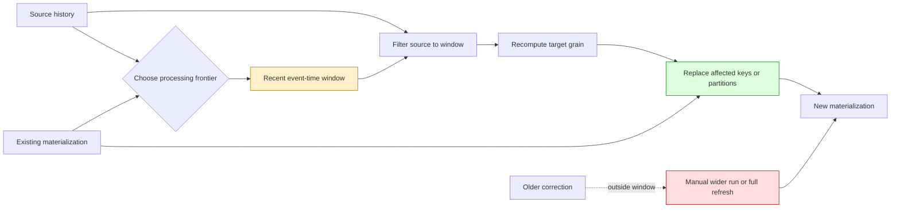

# Bounded Correction Lookback for Incremental Materializations

An incremental materialization should not assume that every fact arrives once, in order, and never changes. Real pipelines receive delayed events, corrected values, retried imports, clock-skewed records, and source updates that become visible after their nominal business date. Rebuilding all history handles those cases but makes runtime grow with the age of the system. Processing only records newer than a strict watermark keeps runtime bounded but silently misses corrections behind that watermark.

A bounded correction lookback occupies the useful space between those two extremes. Each run processes new data and deliberately recomputes a small recent interval. The interval is large enough to absorb ordinary lateness and small enough that cost depends on a fixed operational horizon rather than total history.

> [!summary]
> - A bounded correction lookback recomputes a fixed recent event-time window on every incremental run.
> - The materialization promises automatic correction inside the window, not across all historical time.
> - The target grain, replacement operation, time boundary, and recovery path are parts of the pattern—not implementation details.
> - Partition replacement is safer than key-only upsert when source rows can disappear or aggregates can lose members.
> - Choose the window from measured lateness and correction distributions, then preserve a wider-run or full-refresh escape hatch.

## Why this pattern exists

Suppose a daily aggregate is computed from an append-only operational history. On September 1, the target already contains daily results through August 31. A strict incremental query might read only source rows whose timestamp is greater than the target's latest timestamp. That query is fast, but it cannot observe an August 30 correction that arrives on September 1.

A full rebuild observes the correction because it reevaluates every day. Its cost, however, increases as source history accumulates:

```text
strict incremental:
    cost ≈ newly arrived rows
    correction coverage ≈ only rows beyond the watermark

full rebuild:
    cost ≈ all historical rows
    correction coverage ≈ all retained history

bounded lookback:
    cost ≈ new rows + fixed recent interval
    correction coverage ≈ fixed recent interval
```

The pattern makes that third contract explicit. It does not pretend to offer unrestricted historical correction. It gives ordinary late data a predictable automatic repair path while keeping routine work bounded.

## Pattern statement

> **Maintain a keyed or partitioned materialization by recomputing a fixed event-time interval behind the current processing frontier on every run. Replace the affected target keys or partitions atomically, retain an explicit full-refresh path for older corrections, and measure whether the chosen interval contains the source's actual lateness distribution.**

The important word is **bounded**. The interval has a configured maximum width. If the repeated interval grows with table age, the pipeline is still a full rebuild under another name.

The term is **lookback**, not “loopback.” The process looks backward from a frontier; it does not route records through a cycle.

## The core model

Let source records have:

- a logical key $k$;
- an event-time coordinate $t_e$ describing the business time represented by the row;
- an observation or ingestion time $t_i$ describing when the pipeline can see the row;
- a value $v$.

Let $F(S, p)$ be the correct materialized value for target partition $p$ when computed from source set $S$. A daily inventory close, for example, might be:

$$
F(S,(product,day)) = \operatorname*{arg\,max}_{r \in S}
    \{r.eventTime \mid r.product=product \land date(r.eventTime)=day\}.
$$

Let $H$ be the greatest event-time partition represented by the target, and let $L$ be the configured lookback duration. A normal run recomputes the window:

$$
W(H,L) = [H-L,\; now].
$$

The new target is:

$$
T' = (T \setminus W) \cup F(S \cap W).
$$

This expression captures the safest form of the pattern: remove the old target contents for the affected window, then insert the recomputed truth for that window. It handles updates, inserts, and deletions. A key-only upsert is equivalent only when every changed or deleted logical key is guaranteed to appear in the incremental result.

## Concrete architecture



A run has four semantic steps:

1. Establish the frontier from existing target state, source ingestion state, or an explicit run coordinate.
2. Derive an inclusive processing interval with documented timezone and boundary rules.
3. Recompute complete target truth for that interval.
4. Replace the corresponding target state in a retry-safe operation.

The SQL syntax can vary. These four semantics should not.

## A worked example

Assume the target stores one row per `(product_id, day)`. At the start of September 1 it contains:

| Product | Day | Closing quantity |
|---|---|---:|
| A | Aug 28 | 10 |
| A | Aug 29 | 12 |
| A | Aug 30 | 14 |
| A | Aug 31 | 13 |

The pipeline uses a lookback of three preceding days. Its interval begins at August 28 if the rule is:

```text
start = max(target.day) - 3 days
```

Because the lower bound is inclusive, the run recomputes four calendar dates: August 28 through September 1. During that run, the source reveals:

- an ordinary September 1 observation;
- a delayed August 31 observation;
- a corrected August 29 quantity;
- an August 20 correction.

The automatic result is:

| Source change | Inside window? | Normal-run outcome |
|---|---:|---|
| September 1 observation | Yes | Included |
| Delayed August 31 observation | Yes | Included |
| Corrected August 29 observation | Yes | Included |
| Corrected August 20 observation | No | Deferred to wider run/full refresh |

Nothing is “eventually” going to pick up August 20 under the normal policy. Once a partition is older than the moving lower bound, it remains outside every later normal run. That is why the recovery command and correction monitoring are part of the contract.

## The pattern has two watermarks

Many implementations speak of “the watermark” as if one coordinate settles everything. In late-data systems, two times matter:

```text
event time:      when the fact says it happened
observation time: when this pipeline learned about it
```

A bounded correction lookback normally partitions by event time because the target is organized by business date. Monitoring should also record observation time so the team can measure lateness:

$$
lateness(r) = t_i(r) - t_e(r).
$$

If the source exposes only event time, the pipeline cannot distinguish an old row that has always existed from one that became visible recently. It can still use a lookback, but it cannot measure whether the interval is sufficient without another audit signal.

CDC offsets, update timestamps, source commit coordinates, or ingestion ledgers provide stronger evidence. They answer a different question from the event-time partition:

- Event time says **which target partition must be repaired**.
- Ingestion position says **which source changes have not yet been considered**.

Robust systems often use both.

## Choosing the frontier

### Frontier from the target

A common batch implementation anchors the window on the greatest target partition:

```sql
SELECT MAX(day) FROM target;
```

This is simple and supports first-run/full-refresh behavior. The source query has no upper bound, so new days beyond the target maximum are still included.

Edge cases need policy:

- If the target is empty, process all source history or a declared bootstrap interval.
- If the target has a future-dated corrupt row, the frontier can skip valid current data.
- If the target contains gaps, `MAX(day)` does not prove every earlier partition exists.

### Frontier from wall-clock time

A scheduled daily job can anchor on the current business date:

```text
start = business_today - lookback
```

This avoids target corruption determining the interval, but it assumes scheduler time and business-event time share a defined timezone.

### Frontier from an ingestion cursor

A CDC or append-log consumer can persist a durable source offset and identify every changed event. The event-time lookback then becomes a correction policy layered over exact source progress, not a substitute for source progress.

The correct frontier depends on the source contract. It should be named and tested rather than hidden in one `MAX()` expression.

## Choosing the lookback length

A lookback should come from evidence, not convenience. Measure observed correction lateness over a representative period:

```text
P50 lateness
P95 lateness
P99 lateness
maximum ordinary lateness
known exceptional repair processes
```

A reasonable initial policy is:

$$
L = P_{99}(lateness) + operational\ margin.
$$

The margin covers scheduler jitter, delayed upstream commits, and clock-boundary ambiguity. Exceptional repairs should use an explicit wider run rather than forcing every routine run to cover the largest incident in system history.

The chosen length balances:

| Larger window | Smaller window |
|---|---|
| Catches more late corrections automatically | Recomputes less data |
| Costs more on every run | Requires more manual historical repair |
| Tolerates upstream delays | Makes lateness monitoring more important |
| May hide chronically late producers | Exposes contract violations sooner |

A fixed “three days” is a hypothesis until production lateness measurements justify it.

## Replacement semantics

### Key delete-and-insert

When the incremental query emits every changed logical key, an adapter may create a temporary result, delete matching target keys, and insert replacements:

```sql
CREATE TEMPORARY TABLE delta AS
SELECT ... FROM source_window;

DELETE FROM target
WHERE (product_id, day) IN (
    SELECT product_id, day FROM delta
);

INSERT INTO target
SELECT * FROM delta;
```

This works for append-only observations whose daily key remains present. It does not remove a target key when all of that key's source rows disappear, because the key is absent from `delta` and therefore absent from the delete predicate.

### Partition replacement

When deletion or aggregate membership removal is possible, replace the entire bounded interval:

```sql
START TRANSACTION;

DELETE FROM target
WHERE day >= :window_start;

INSERT INTO target
SELECT ...
FROM source
WHERE event_time >= :window_start
GROUP BY ...;

COMMIT;
```

This implements the formal replacement law directly. It is often the safer default for date-partitioned aggregates.

### Merge/upsert

Databases with reliable `MERGE` or conflict-update support can upsert emitted keys. Deletion still needs tombstones or partition cleanup. “Upsert” is not a complete correction strategy unless absence has no meaning.

## Generic pseudocode

```text
function incrementalRefresh(target, source, lookback):
    if target does not exist:
        result = recompute(source, all_time)
        create target from result
        establish indexes and constraints
        return

    frontier = chooseFrontier(target, source)
    windowStart = normalizeToPartition(frontier - lookback)

    sourceWindow = source where eventTime >= windowStart
    replacement = recompute(sourceWindow, windowStart..now)

    transaction:
        remove target partitions in windowStart..now
        insert replacement
        verify target key uniqueness
    commit
```

The algorithm is idempotent when `recompute` is deterministic and replacement covers exactly the same interval on retry.

## dbt implementation shape

A dbt model must filter the source during incremental runs. Changing only the materialization does not reduce computation.

```sql
{{ config(
    materialized='incremental',
    unique_key='product_id, day'
) }}

WITH source_window AS (
    SELECT *
    FROM {{ source('app', 'inventory_history') }}

    
    WHERE created_at >= DATE_SUB(
        (SELECT MAX(day) FROM {{ this }}),
        INTERVAL {{ var('history_lookback_days', 3) }} DAY
    )
    
), latest AS (
    SELECT
        product_id,
        DATE(created_at) AS day,
        MAX(created_at) AS max_created_at
    FROM source_window
    GROUP BY product_id, DATE(created_at)
)
SELECT s.*
FROM source_window s
JOIN latest l
  ON l.product_id = s.product_id
 AND l.max_created_at = s.created_at;
```

Both references use `source_window`. Filtering only the aggregation while joining back to the full source leaves unnecessary historical work and can make query plans harder to reason about.

Adapter behavior matters. Some adapters merge, some append, and some delete matching keys before insert. Composite unique keys, transactions, schema change, and partition deletion are not portable assumptions. Read the installed adapter's materialization macros and compile the generated SQL before relying on the configuration.

## Index and hook lifecycle

Table models are often decorated with post-hooks that create indexes:

```sql
ALTER TABLE target
ADD UNIQUE INDEX target_product_day (product_id, day);
```

A full table rebuild creates a new relation, so the hook can add the index each time. An incremental model preserves the relation. The second run will attempt to add an index that already exists unless the hook is conditional or idempotent.

Safe options include:

- create indexes only when the relation is first established or during full refresh;
- query metadata before creating an index;
- manage stable target indexes through migrations instead of per-run hooks;
- use an adapter operation that guarantees `IF NOT EXISTS` semantics for the database/version in use.

Materialization changes relation lifecycle. Every DDL hook should be reviewed under that new lifecycle.

## Correctness contract

A bounded lookback should state what it guarantees.

### In-window correctness

After a successful run at frontier $H$, every target partition in $[H-L, now]$ equals a full recomputation over the source rows visible to that run.

### Stable historical prefix

Partitions before $H-L$ are preserved as they were. The normal run makes no claim that newly visible historical corrections before the boundary have been incorporated.

### Retry idempotence

Repeating a run with the same source-visible state and frontier produces the same target state.

### Recovery completeness

A full refresh or explicitly widened interval can restore equality with complete retained source history.

These four clauses are more useful than saying “the model is incremental.” They define observable behavior.

## Failure modes

### Materialization changed without source filtering

```text
materialized='incremental'
query still reads all history
```

The adapter builds a full temporary result and then updates the target. Runtime may remain unchanged or become worse.

### Append used for mutable keys

Appending recomputed days creates duplicate `(key, partition)` rows. A uniqueness test may catch this after consumers have already read inconsistent results.

### Key-only deletion misses disappearance

If a source correction removes the final member of an aggregate key, that key does not appear in the temporary result. Deleting only emitted keys leaves stale target state. Replace partitions or propagate tombstones.

### The window is applied to only one source branch

A query may aggregate a filtered CTE and join back to an unfiltered raw table. The logical result can remain correct while the expensive historical scan survives.

### Event time and ingestion time are conflated

Filtering `event_time > watermark` cannot detect an old event that arrived today. A lookback reduces the damage but does not provide exact ingestion tracking.

### Boundary semantics are undocumented

“Three-day lookback” may mean three total dates or the current date plus three previous dates. Inclusive SQL bounds turn this ambiguity into an extra partition of cost and correction coverage.

### Timezone changes the partition

`DATE(timestamp)` uses a database/session timezone unless conversion is explicit. An event near midnight can move between days when source, scheduler, and target interpret zones differently.

### Index hooks are not idempotent

The first incremental run succeeds; the second fails while adding an existing index. A test suite that exercises only bootstrap misses the defect.

### The oldest correction is never observed

A bounded window is a policy, not an all-history guarantee. Without correction-age telemetry, data can remain stale indefinitely outside the interval.

### Full refresh is theoretically possible but operationally unusable

If a complete rebuild exceeds maintenance windows, lock budgets, or storage headroom, it is not a credible recovery path. Recovery must be exercised and timed.

## Testing and verification

A correct test suite distinguishes bootstrap, steady state, correction, boundary, deletion, retry, and recovery.

### Reference/full-refresh equivalence

1. Build a full-refresh reference.
2. Preserve it under a separate relation.
3. Run the incremental model through representative changes.
4. Full-refresh another target from the same final source.
5. Compare keys and every value in both directions.

Counts and checksums are useful diagnostics but not sufficient evidence of row equality.

### No-change idempotence

Run the model twice without source changes. Assert:

- row count and row values are unchanged;
- unique-key tests pass;
- no duplicate index/constraint operation fails;
- the second run scans only the bounded window.

### New partition

Add source rows for a new day. The normal run must create the new partition without rewriting historical partitions outside the window.

### In-window late correction

Insert or update a row two days behind the frontier. The normal run must change the corresponding daily result.

### Outside-window correction

Change a row older than the lower bound. The normal run must leave the target unchanged. A widened-window run and full refresh must incorporate it. This test proves the limitation is deliberate and recoverable.

### Exact lower-bound correction

Change a row exactly at `window_start`. This catches `>` versus `>=` mistakes and timezone truncation errors.

### Source deletion

Remove every source member for one target key inside the window. The target key must disappear if source absence means target absence. This distinguishes partition replacement from incomplete key upsert.

### Interrupted run and retry

Fail after target deletion, during insertion, and before commit. The transaction or staging/swap strategy must prevent partially replaced partitions from becoming authoritative.

### Performance evidence

Capture:

- source rows examined;
- temporary/result rows;
- partitions replaced;
- runtime;
- bytes read/written;
- lock duration;
- downstream critical-path runtime.

Correctness is necessary; bounded work is the reason to adopt the pattern.

## Observability

A production implementation should expose:

| Metric | Purpose |
|---|---|
| Processing frontier | Shows how current the target claims to be |
| Window start/end | Makes each run's correction scope explicit |
| Source rows scanned | Detects accidental return to full scans |
| Target rows replaced | Explains write volume |
| Maximum observed lateness | Tests whether the configured window is sufficient |
| Corrections by age bucket | Supports evidence-based window sizing |
| Oldest unincorporated correction | Signals need for wider repair |
| Last full-refresh age/runtime | Establishes recovery readiness |
| Duplicate-key/test failures | Detects replacement contract violations |

A healthy runtime graph alone does not prove correction coverage. Lateness and repair metrics are part of data quality.

## Source retention is a separate decision

Incremental daily materialization reduces routine computation. It does not require deleting raw history.

These decisions answer different questions:

```text
incremental materialization:
    How much source data must routine recomputation inspect?

retention:
    How long must detailed source evidence remain available?
```

Raw history may support audits, dispute reconstruction, model changes, or future analyses at a finer grain. Establish those requirements before partition expiration or archival. It is reasonable to make daily analytics incremental while retaining raw hourly history indefinitely; it is also reasonable to retain hourly detail for a fixed period and daily aggregates permanently. The policies should not be coupled accidentally.

## When to use this pattern

Use a bounded correction lookback when:

- history is large enough that full rebuild cost is material;
- most changes arrive near their event-time partition;
- the target has a stable key or replaceable partition grain;
- recomputation within a window is deterministic;
- old corrections can use an explicit exceptional repair path;
- the system can measure or estimate lateness.

Common applications include daily financial summaries, inventory closes, attribution windows, usage billing, CDC-derived dimensions, search/index projections, and event-time feature tables.

## When not to use it

Do not use the pattern as the primary correctness mechanism when:

- regulations require every historical correction to appear automatically within a fixed SLA regardless of age;
- the source cannot identify event time or changed partitions;
- target rows depend on global all-history state that cannot be decomposed by a bounded interval;
- deletions cannot be represented or partitions cannot be replaced safely;
- the dataset is small enough that a full rebuild is simpler and comfortably bounded;
- no credible full-refresh or historical repair path exists.

A bounded lookback is not an excuse to accept unknown correctness. It is a declared operational contract with a bounded automatic repair horizon.

## Concrete evidence: TTC inventory history

The Tree Center inventory pipeline provided the first Garden evidence for this general pattern:

- current inventory metrics are refreshed every minute;
- product and location histories are captured hourly;
- production showed 24 snapshots per complete day with 58–61 minute gaps;
- `inventory_metrics_history` held approximately 142.6 million rows, 16.22 GiB of data, and 17.97 GiB of indexes;
- nightly dbt rebuilt all models as tables;
- the product/day reduction took about 15 minutes;
- its dependent location/day reduction took about 5 minutes 48 seconds;
- the complete 78-model run had a 30-run median of about 21 minutes 18 seconds.

The source history is append-only in the observed application path. Its daily model selects the latest `(product_id, day)` observation, making it a strong candidate for incremental recomputation. The local dbt-mysql adapter uses temporary-table delete-and-insert semantics and requires explicit source filtering, composite-key validation, and idempotent index hooks. The evidence supports the pattern but does not yet establish the proposed three-day window; correction-age measurements must choose that value.

Source analysis:

```text
/home/manuel/code/ttc/ttc/ttmp/2026/08/28/REPORTS-SYNC--investigate-prod-reports-thetreecenter-com-sync-and-missing-woocommerce-order-data/analysis/02-inventory-history-collection-daily-combing-and-dbt-runtime-analysis.md
```

## Candidate ecosystem guidance

1. Name the event-time partition, ingestion frontier, and target grain separately.
2. Recompute complete truth for a bounded interval; do not merely append recent rows.
3. Use partition replacement when absence and deletion must propagate.
4. Make lower-bound inclusivity and timezone part of the public contract.
5. Choose lookback length from measured lateness, not a round number.
6. Keep normal bounded repair and exceptional historical repair as separate operations.
7. Exercise the second incremental run; relation-preserving lifecycle exposes hooks that bootstrap tests miss.
8. Preserve a timed, tested full-refresh path.
9. Monitor correction age as well as runtime.
10. Decide raw retention independently from incremental materialization.

## Open questions

- Which source systems expose both event time and ingestion/change coordinates?
- Should the Garden distinguish key-replacement lookback from partition-replacement lookback as separate named variants?
- What adapter-neutral contract should dbt projects test for composite incremental keys?
- How should pipelines record corrections older than the automatic window so repair is not dependent on operator discovery?
- Which other projects can provide independent evidence and move the pattern from candidate to established Garden guidance?

## Key points to internalize

- Incremental means “preserve prior target state,” not “perform bounded work.” The query must impose the bound.
- Lookback means automatic correction within a declared recent event-time interval.
- The replacement unit must match the target's correctness grain.
- Upsert does not handle disappearance unless tombstones or partition deletion are present.
- Late-data coverage is measurable. Use the distribution to set policy.
- Full refresh is part of incremental design because every bounded policy has an outside.

## Evidence and references

- TTC source analysis: `/home/manuel/code/ttc/ttc/ttmp/2026/08/28/REPORTS-SYNC--investigate-prod-reports-thetreecenter-com-sync-and-missing-woocommerce-order-data/analysis/02-inventory-history-collection-daily-combing-and-dbt-runtime-analysis.md`
- TTC dbt model: `/home/manuel/code/ttc/ttc/sql/dbt/models/inventory/daily_inventory_metrics_history.sql`
- TTC cron schedule: `/home/manuel/code/ttc/ttc/tadmin/plugin/src/Cron/InventoryMetricsCron.php`
- TTC snapshot writer: `/home/manuel/code/ttc/ttc/tadmin/plugin/src/Model/InventoryMetrics.php`
- [[Research/Software Architecture Garden/README|Software Architecture Garden]]
