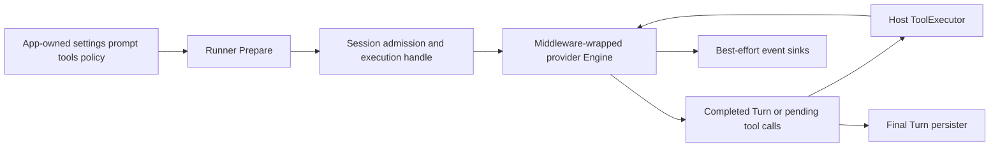

# Architecture Garden — Geppetto

Geppetto is a provider-neutral LLM runtime kernel. Applications supply inference settings, prompts, middleware, tool capabilities, event sinks, and persistence policy; Geppetto composes those inputs around a mutable typed `Turn`, invokes a provider `Engine`, interprets model tool calls through host-owned executors, and returns a completed turn. Its Goja module keeps runtime-thread access, storage, and registries in Go. Host-injected renewable credentials also remain in Go for engines built through `gp.engine()`, but the direct `gp.agent().inference(settings).build()` path bypasses that credential source.

This study belongs in the Garden because it separates typed conversational state, execution occurrences, external effects, live observations, and final materializations without claiming they are one event-sourced model.

> [!summary]
> - The provider-neutral `Turn`/`Engine` boundary and explicit tool loop are established locally.
> - Serializable tool intent interpreted by a host-owned effect capability is a candidate ecosystem pattern.
> - Events are best-effort observations; final turns are mutable snapshots persisted by upsert, not an append-only event log.
> - Persistence outcome, retry idempotency, session admission linearization, snapshot isolation, and durable profile CAS remain open laws.

## Snapshot identity and evidence

| Field | Value |
|---|---|
| Repository | `/home/manuel/code/wesen/go-go-golems/geppetto` |
| Remote | `git@github.com:go-go-golems/geppetto.git` |
| Branch | `main` |
| Commit | `8e105d9208920cc0ed80fb343c788b648c9b7c11` |
| Commit date | `2026-08-07T13:49:25-04:00` |
| Commit subject | `Merge pull request #408 from go-go-golems/task/add-cohere-reranking` |
| Worktree | Dirty only because of one unrelated untracked file; analysis uses committed source only |
| Analysis scope | Inference/session/tool runtime, profiles, events, Goja, SQLite turn storage, tests, CI and release |

Claims are pinned to committed `HEAD`. The unrelated untracked file `ttmp/2026/06/14/HIST-2026-03-14-TO-2026-06-14--geppetto-history-for-last-three-months/various/history.sqlite` was excluded from analysis. No staged target files were present. Runtime code and current topic documentation take precedence over the root README, whose profile responsibilities and removed JavaScript namespaces describe an older model. Evidence includes `pkg/inference`, `pkg/events`, `pkg/engineprofiles`, `pkg/js/modules/geppetto`, provider adapters, focused tests, `Makefile`, CI workflows, and `.goreleaser.yaml`. No live provider call was required.

Validation at this snapshot passed with `GOWORK=off go test ./pkg/inference/session ./pkg/inference/toolloop/... ./pkg/inference/tools ./pkg/inference/middleware ./pkg/engineprofiles ./pkg/js/modules/geppetto ./pkg/js/modules/geppetto/provider ./pkg/steps/ai/openai ./pkg/steps/ai/openai_responses ./pkg/steps/ai/claude ./pkg/steps/ai/gemini -count=1`. The Garden validator reported `21 wikilinks, 0 errors, 0 warnings`; exact-heading resolution and `git diff --check` also passed.

## Architecture and runtime path

The calculator example in `cmd/examples/runner-tools/main.go` supplies a complete path.

1. `runCommand.RunIntoWriter` resolves settings, chooses the system prompt and exposed tool names, registers `calculator`, and calls `runner.Run` (`cmd/examples/runner-tools/main.go:85-121`). Profiles do not own this application policy.
2. `Runner.Run` enters `Start` and `Prepare`. `Prepare` validates input, creates the provider engine, filters the tool registry, creates a `Session`, installs `enginebuilder.Builder`, creates a fresh turn, and clears a cloned seed's `Turn.ID` (`pkg/inference/runner/run.go:10-35`; `pkg/inference/runner/prepare.go:15-86`).
3. `StandardEngineFactory.CreateEngine` validates settings and selects OpenAI chat/Responses, Claude, or Gemini. A host `BearerTokenSource` overrides static credentials (`pkg/inference/engine/factory/factory.go:18-45,82-87,105-163,225-246`).
4. `Session.StartInference` rejects an absent builder, empty input, or another active run; assigns `Turn.ID`, `SessionID`, and fresh `InferenceID`; builds the runner; installs a cancellable `ExecutionHandle`; and launches execution (`pkg/inference/session/session.go:189-279`).
5. `enginebuilder.Builder.Build` wraps middleware in declared order and captures registry, loop policy, sinks, snapshot hook, executor, and persister (`pkg/inference/toolloop/enginebuilder/builder.go:31-74,78-111,136-208`). `middleware.Chain` reverse-wraps to realize `m1(m2(...engine))` (`pkg/inference/middleware/middleware.go:8-22`).
6. `Loop.RunLoop` records serializable tool configuration and function-free definitions on the turn, emits a `pre_inference` snapshot, annotates provider-call identity, and invokes the wrapped engine (`pkg/inference/toolloop/loop.go:92-136,176-235`). OpenAI translates turn blocks and tool schemas into a provider request and checks `ctx.Done()` while consuming the stream (`pkg/steps/ai/openai/engine_openai.go:55-83,126-181,184-284`).
7. If the provider returns tool-call blocks, `executeTools` converts them to typed `tools.ToolCall` values. `BaseToolExecutor.ExecuteToolCall` performs registry lookup, `IsAllowed`, observations, context-aware execution, and configured retry/backoff (`pkg/inference/toolloop/loop.go:267-309`; `pkg/inference/tools/base_executor.go:221-312`). Result positions and call IDs are preserved; result blocks are appended before the next provider iteration.
8. The loop succeeds when no pending calls remain or fails at `MaxIterations` (`pkg/inference/toolloop/loop.go:127-174`). Builder stamps inference metadata and invokes the final-turn persister only on success, but discards the persister error (`pkg/inference/toolloop/enginebuilder/builder.go:209-240`). Session settles the handle, copies a replacement pointer into its retained latest turn when needed, and clears active state (`pkg/inference/session/session.go:258-279`).

`ExecutionHandle.Cancel` is API-idempotent and cancels the run context; `Wait` returns the terminal turn/error (`pkg/inference/session/execution.go:49-70`). Session tests establish cancellation and basic one-active-run behavior (`pkg/inference/session/session_test.go:100-120,157-180,202-218`). Provider deltas may already have reached sinks when cancellation occurs, but persistence is skipped after a failed or canceled run.

### Goja authority path

`pkg/js/modules/geppetto/module.go:28-79,182-230` registers the CommonJS module per runtime and exports profile, engine, embedding, reranking, agent, turn-store, and tool APIs. `Options` injects the runtime owner, registries, sinks, storage, and renewable bearer source; the credential capability is never exported to JavaScript. `gp.engine().inference(settings).build()` constructs through `moduleRuntime.newEngineFromSettings`, which applies the host source (`pkg/js/modules/geppetto/api_engine_builder.go:40-72`). In contrast, the direct `gp.agent().inference(settings).build()` path calls `enginefactory.NewEngineFromSettings` without the source (`pkg/js/modules/geppetto/api_agent.go:238-252`). Thus Go retains the secret object, but host credential authority does not dominate every public JavaScript engine-construction path.

`gp.agent()` accumulates a Go-owned engine/settings wrapper, ordered middleware, tools, loop policy, event sinks, and persistence policy (`pkg/js/modules/geppetto/api_agent.go:68-271`). `agent.session()` creates a stable Go `Session`; `runAsync()` starts through `Session.StartInference`, waits in a Go goroutine, and posts Promise settlement to the runtime owner (`pkg/js/modules/geppetto/api_session.go:685-779`). Event emitters likewise queue Goja access through the owner (`pkg/js/modules/geppetto/api_event_emitters.go:76-145`). Tests establish that a delta is observed before Promise resolution and that close/cancel reaches engine context (`pkg/js/modules/geppetto/api_event_emitters_test.go:296-404,465-535`).

The SQLite `TurnStore` upserts YAML snapshots under `(conv_id, session_id, turn_id, phase)` and chooses latest by `created_at_ms DESC` (`pkg/js/modules/geppetto/provider/sqlite_turn_store.go:18-32,80-109,151-179`). `PersistTurn` derives one session ID and binds it as both `conv_id` and `session_id`, so this implementation cannot persist a distinct conversation coordinate even though its schema and query API expose both. Reusing a turn identity replaces a row. This storage is a final materialization, not event sourcing or a replay cursor.

## Authority and state map

| Object | Owner and symbol | Identity/revision | Durable? | Must not be confused with |
|---|---|---|---|---|
| Conversation snapshot | `turns.Turn`, `pkg/turns/types.go:8-26` | `Turn.ID`, ordered blocks | Optional | Immutable event/history |
| Execution occurrence | `session.ExecutionHandle` | `SessionID` + `InferenceID` | No | Turn or provider call |
| Provider effect | `engine.Engine.RunInference` | Per-call correlation | External | Tool orchestration |
| Tool definition | `tools.ToolDefinition` | Name, optional version | Advertisement serializes | Authorization decision |
| Tool intent/result | `ToolCall` and tool blocks | `ToolCall.ID` | In completed turn | Executable capability |
| Capability catalog | `tools.ToolRegistry` | Tool name | No | Policy; default executor allows registered calls |
| Live observation | `events.EventSink` | Correlation product | Not inherently | Durable commit/audit event |
| Engine profile | `engineprofiles.EngineProfile` | Registry/profile slug and metadata version | YAML/memory/SQLite | Prompt/tool/middleware runtime |
| Final materialization | `TurnStoreSnapshot` | Conversation/session/turn/phase/time | Optional SQLite | Append-only history |
| Runtime owner | `runtimeowner.RuntimeOwner` | One Goja runtime lifecycle | No | Application authorization |

`Correlation` combines optional session, run, turn, provider-call, segment, and tool-call IDs (`pkg/events/correlation.go:3-20`; validation in `pkg/events/correlation_validation.go:5-51`). It supports joins. It is neither a global clock nor causal order.

## Candidate common vocabulary

| Proposed term | Project-local name | Invariant | Nearby ecosystem names | Difference retained |
|---|---|---|---|---|
| **Typed conversation snapshot** | `Turn` | Ordered blocks and versioned extensions form provider-neutral inference state. | Session snapshot/materialization | Mutable and not an event-prefix cut. |
| **Execution occurrence** | `ExecutionHandle`, `InferenceID` | One cancelable and waitable run inside a stable session. | Run/attempt | Distinct from turn and provider-call identities. |
| **Advertised intent schema** | `ToolDefinitionSnapshot` | Provider sees name/schema without executable function. | PBUI `ActionSpec`, typed plan | One model-generated request, not a complete plan. |
| **Effect capability catalog** | `ToolRegistry` | Resolves admitted names to host-owned functions. | Module registry | Membership is not authorization. |
| **Effect interpreter** | `ToolExecutor` | Rechecks and performs requested effects under context/policy. | Host action runtime | Default policy permits every registered tool. |
| **Live observation** | `Event`, `EventSink` | Best-effort lifecycle/provider/tool signal. | Telemetry/UI event | Not durable evidence or PBUI mounted occurrence. |
| **Final snapshot persister** | `TurnPersister`, `TurnStore` | Stores a successful completed turn. | Materialization store | Failure is currently not reflected in outcome. |
| **Runtime owner** | `RuntimeOwner` | Sole authority for Goja-bound access and settlement. | Scoped runtime | Lifecycle authority, not user authority. |

## Mathematical and computer-science foundations

### 1. Ordered middleware composition

Let $H$ denote handlers `Context × Turn -> Turn × Error`, acknowledging observable turn mutation, and let each middleware be an endomorphism $m:H\to H$. `Chain(h,m_1,...,m_n)` constructs

$$m_1(m_2(\cdots m_n(h))).$$

Function composition is associative, so regrouping without reordering preserves the wrapper construction. It is not commutative: safety, prompt, and observation middleware can see one another's changes. The operational consequence is that a middleware list has lawful grouping but authoritative order (`pkg/inference/middleware/middleware.go:8-22`).

### 2. Bounded tool-loop transitions

Let $T$ be concrete `Turn` values. One iteration is the labeled transition

$$T\xrightarrow{provider}T_{calls}\xrightarrow{tool\ effects}T_{results}.$$

The terminal family is usefully specified as

$$O=Completed(T)+Failed(error)+Cancelled(error)+IterationLimit(T,error).$$

The implementation uses `(*Turn,error)` rather than this explicit sum. The iteration budget bounds orchestration loops, but does not guarantee a provider or tool returns unless it honors context/deadline.

### 3. Prefix growth and snapshot limit

For session history $H_n=[T_1,\ldots,T_n]$, append intends $H_n$ to be a prefix of $H_{n+1}$. Fresh turn identity separates occurrences. However `Session.Append` stores a pointer and `Turn.Clone` shallow-copies reference-typed values (`pkg/turns/types.go:28-62,116-127`; `pkg/inference/session/session.go:174-186`). Therefore deep historical immutability is not established.

### 4. Retry idempotence is an external obligation

For stable tool-call key $k$, arguments $a$, and the tool's external observation boundary, safe duplicate retry requires

$$execute(k,a);execute(k,a)\equiv execute(k,a).$$

Geppetto preserves `ToolCall.ID` but provides neither persistent deduplication nor a tool-idempotence declaration (`pkg/inference/tools/base_executor.go:248-278`). No exactly-once consequence follows.

## Correlation with the Pattern Zoos

| Geppetto evidence | Zoo relation | Strength and boundary |
|---|---|---|
| Schema-bearing tool request interpreted by the host | [[Transcripts/Research/09 - RAG-MATHS Pattern Zoo#Pattern 4 — Typed Plans and Multiple Interpreters|RAG 4 — Typed Plans and Multiple Interpreters]] | **Partial.** One typed effect request is not a complete plan with preview/replay interpreters. |
| Execution handle, observations, and terminal turn/error | [[Transcripts/Research/09 - RAG-MATHS Pattern Zoo#Pattern 5 — Explicit Outcomes and Observation Algebra|RAG 5 — Explicit Outcomes and Observation Algebra]] | **Partial.** Outcomes are traceable, but there is no exhaustive public sum or observation-combine algebra. |
| Best-effort events and mutable turn upserts | [[Transcripts/Research/09 - RAG-MATHS Pattern Zoo#Pattern 7: Append-Only Events, Pure Reducers, and Observable Idempotence|RAG 7 — Append-Only Events, Pure Reducers, and Observable Idempotence]] | **Non-equivalent.** There is no append-only durable fold or redelivery law. |
| Fixed provider adapters map common turns, tools, and events to provider wire values | [[Transcripts/Research/10 - PBUI-MATHS Pattern Zoo Handbook#Pattern 6 — Explicit Translation|PBUI 6 — Explicit Translation]] | **Adjacent.** These are concrete boundary adapters, not PBUI's typed semantic-reference translation graph: there is no path selection, provenance, or coherence law. |
| Explicit provider package and strict duplicate rejection for host contributions | [[Transcripts/Research/10 - PBUI-MATHS Pattern Zoo Handbook#Pattern 9 — Registry and Module Boundary|PBUI 9 — Registry and Module Boundary]] | **Partial.** Packaging and duplicate checks exist, but contributions are sequential and there is no versioned dependency manifest, immutable frozen snapshot, or order-independent compatible composition. |
| Session identity and per-runtime Goja owner | [[Transcripts/Research/10 - PBUI-MATHS Pattern Zoo Handbook#Pattern 10 — Scoped Runtime and Context|PBUI 10 — Scoped Runtime and Context]] | **Strong** for lifecycle scope; no tenant-isolation claim follows. |
| Profile slug, resolver, and expected version | [[Transcripts/Research/10 - PBUI-MATHS Pattern Zoo Handbook#Pattern 11 — Authoritative State, Resolver, and Revision|PBUI 11 — Authoritative State, Resolver, and Revision]] | **Partial.** SQLite multi-writer CAS is not enforced at the database boundary. |

A Geppetto event is not a PBUI mounted occurrence. A `Turn` is not an immutable release or canonical append-only event. Correlation coordinates name runtime occurrences, not reproducible experiment semantics.

## Cross-project comparison

| Project | Shared invariant | Grade and retained difference |
|---|---|---|
| [[Research/Software Architecture Garden/sessionstream/README|sessionstream]] | Session scope, typed observations, cancellation, projections, and correlation | **Partial.** Sessionstream can retain canonical append-only events and exposes declared snapshot ordinals with a snapshot-before-live transport fence; its SQLite reads do not prove one coherent prefix cut. Geppetto persists mutable final turns and emits best-effort observations. |
| [[Research/Software Architecture Garden/rag-evaluation-system/04 - Serializable Actions and Host Owned Effects|rag-evaluation-system actions]] | Inspectable intent is interpreted by a trusted host | **Partial.** Geppetto definitions may retain executable Go/JS handlers; only advertised snapshots are serializable. |
| [[Research/Software Architecture Garden/rag-evaluation-system/05 - XGoja Provider and Runtime Packaging|rag-evaluation-system xgoja provider]] | Per-runtime CommonJS packaging and host-owned runtime access | **Strong.** Geppetto adds long-running Promise settlement, streams, stores, and Go-only renewable credentials. |
| [[Research/Software Architecture Garden/rag-ttc/02 - Recoverable and Resource-Bounded Execution|rag-ttc execution]] | Cancellation, bounded concurrency, retry, and occurrence identity | **Adjacent.** Geppetto has no durable work admission, tool-effect dedupe, or required persistence outcome. |

## Pattern maturity assessment

| Pattern or law | Maturity | Evidence or limitation |
|---|---|---|
| Provider-neutral `Turn`/`Engine` boundary | **Established** | All provider adapters implement one interface and translate typed blocks. |
| Ordered middleware composition | **Established** | Small implementation plus chain and runner tests; order is material. |
| Tool-call interpreter loop | **Established** | Loop/executor/correlation/retry tests and runnable calculator example. |
| Session single-flight and cancellation | **Established** | Established locally through mutex, handle, context, and focused Go/JS tests; admission race remains. |
| Deterministic profile stack resolution | **Established** | Cycle/depth/duplicate checks and source-chain tests. |
| Host-owned Goja capability package | **Candidate ecosystem pattern** | Runtime ownership and Go-only capability objects have strong tests, but direct agent engine construction bypasses the injected credential source. |
| Serializable intent, host-owned tool effect | **Candidate ecosystem pattern** | Clear interpreter seam; executable handlers/default allow narrow the claim. |
| Immutable session snapshots | **Architecture debt** | Stored pointers and shallow nested values permit mutation. |
| Honest durable completion | **Open correctness obligation** | Final persister errors are discarded. |
| Retry idempotency and authorization | **Open correctness obligation** | Stable call ID exists; dedupe and product policy do not. |

## Architecture debt and open laws

### Persistence must participate in the declared outcome

If an API claims durable completion, persistence must succeed or the result must state `CompletedButNotPersisted`. Current code ignores `PersistTurn` failure (`pkg/inference/toolloop/enginebuilder/builder.go:236-238`). A sentinel-error persister test should require either run failure or an explicit persistence outcome.

### Session admission needs one linearization point

`StartInference` unlocks while `Builder.Build` runs and installs `active` later (`pkg/inference/session/session.go:208-249`). During that interval an append can become latest, leaving the admitted run to mutate an older turn. A blocking-builder concurrency test should establish whether append is rejected, start reserves state before build, or the session exposes an explicit preparing state.

### Snapshots need an isolation contract

Mutation of an appended input or nested `any` value can change retained history. Tests should mutate caller-owned and nested values after append and after snapshot retrieval; implementation or naming must then match the chosen ownership law.

### Tool authorization and retry must dominate effects

Every effect path must cross current product authorization, and repeated execution under one `ToolCall.ID` must either be idempotent or rejected. The default `IsAllowed=true` and direct retry do not establish either property (`pkg/inference/tools/base_executor.go:86-94,236-268`).

### Goja credential authority must dominate engine construction

A host-injected renewable source reaches `gp.engine().inference(settings).build()` but not `gp.agent().inference(settings).build()` (`pkg/js/modules/geppetto/api_engine_builder.go:40-72`; `pkg/js/modules/geppetto/api_agent.go:238-252`). This is an active public-path authority bypass: engines built through the direct agent path can fall back to static settings credentials. Route every settings-based engine construction through the module factory and add a negative test proving no public builder bypasses the host source.

### Durable profile updates need database CAS

The SQLite profile store checks expected version against an in-memory mirror and then unconditionally upserts (`pkg/engineprofiles/sqlite_store.go:102-135,212-233`). Two-store tests against one WAL database should prove that exactly one stale competitor commits and that a failed SQL write cannot leave memory ahead of durable state.

Additional debt includes sync/async JS lifecycle divergence (`pkg/js/modules/geppetto/api_session.go:608-779`), wall-clock-only `LoadLatestTurn` ordering, weak sink delivery guarantees, and stale root/profile/JS documentation.

## Implications for composable APIs

1. Brand `SessionID`, `TurnID`, `InferenceID`, `ProviderCallID`, and `ToolCallID`; they are not substitutable strings.
2. Return an explicit terminal sum covering completion, cancellation, failure, iteration limit, and persistence failure.
3. Name current events as live best-effort observations. Reserve `replayFrom` or `snapshotThenLive` for APIs with a durable cursor and gap contract.
4. Treat registries as catalogs and keep authorization at the effect interpreter.
5. Make retry safety explicit through an idempotent capability marker, host dedupe adapter, or disabled automatic retry for effectful tools.
6. Unify synchronous and asynchronous JavaScript execution on one session state machine; Promise settlement is transport, not separate lifecycle authority.

## Candidate ecosystem patterns

1. **Typed intent, host-owned effect** — a serializable intent/schema crosses the model boundary while the trusted host retains executable functions, credentials, policy, and retry behavior.
2. **Runtime-owner capability package** — a module is installed per Goja runtime and every runtime-bound callback or Promise settlement returns through one owner.

Promotion requires another independent implementation with the same authority and failure laws; shared dependencies or vocabulary alone are insufficient.

## Recommended next investigations

1. Add concurrency tests around session preparing/append and multi-writer SQLite profile updates.
2. Decide and test persistence outcome and tool retry/authorization contracts.
3. Audit deep-copy ownership and reconcile current README/topic prose with the hard-cut API.

## Related studies

- [[Research/Software Architecture Garden/README|Software Architecture Garden]]
- [[Research/Software Architecture Garden/pinocchio/README|Pinocchio]]
- [[Research/Software Architecture Garden/sessionstream/README|sessionstream]]
- [[Research/Software Architecture Garden/rag-evaluation-system/README|rag-evaluation-system]]
- [[Research/Software Architecture Garden/rag-ttc/README|rag-ttc]]
- [[Transcripts/Research/09 - RAG-MATHS Pattern Zoo|RAG-MATHS Pattern Zoo]]
- [[Transcripts/Research/10 - PBUI-MATHS Pattern Zoo Handbook|PBUI-MATHS Pattern Zoo Handbook]]
