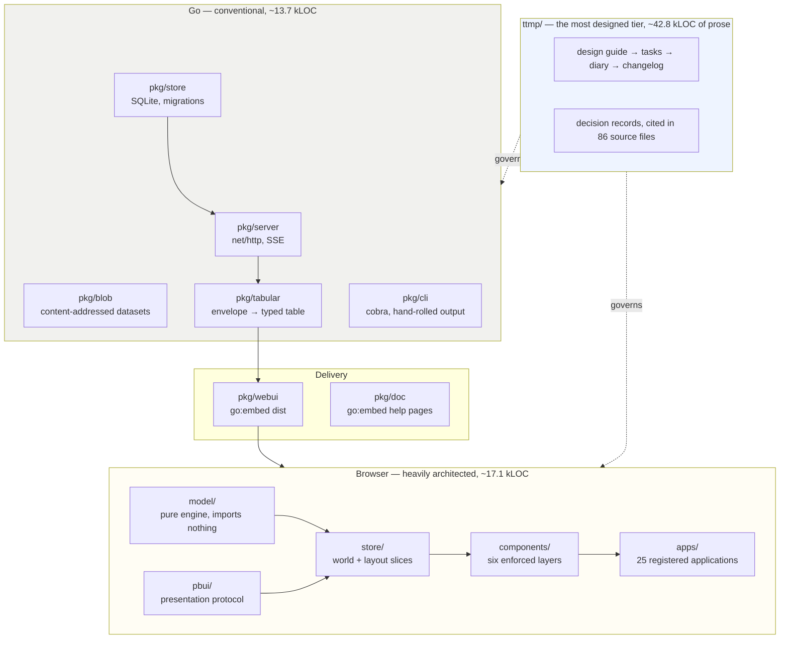

# Project Architecture Overview

This document describes what `go-go-datadrop` is made of and, more usefully, explains why its three tiers are architected to very different depths. That unevenness is the first thing a reader should understand, because copying from the wrong tier is the most likely way to misuse this study.

## The problem the system solves

A researcher has instruments, scripts and collaborators producing small structured events, and no good place to put them. The available options are a spreadsheet that loses types, a time-series database that demands a schema before the first measurement, or a cloud service that requires an account before a single row can be stored.

`go-go-datadrop` takes a narrower position: append-only events with a self-describing envelope, one SQLite file, one binary, and a browser interface that can draw them without anyone having declared what they are in advance. Types are inferred from the data and reported **with their provenance**, so a column typed quantitative because a schema said so and one typed quantitative because two thousand sampled values happened to parse are distinguishable facts on screen.

## The three tiers



### Tier one: the Go server is conventional, and that is fine

`net/http` with no router library, SQLite through `modernc.org/sqlite` so there is no cgo, migrations as embedded SQL, ULIDs for event identity, and an SSE endpoint that is a `for` loop over a channel. There is no dependency injection container, no service layer, no repository interface with one implementation.

This is not a criticism and it is not an accident. The system's hard problems are all elsewhere: type inference with honest provenance, a projection from event envelopes to a typed table, and an interface in which every object carries its verbs. The storage layer's job is to be boring, and it is.

**What a reader should take from tier one: nothing.** It is competent, ordinary Go. The one exception is `pkg/tabular`, described below, which is genuinely load-bearing.

### `pkg/tabular` is the seam between the tiers

The projection from a stream of self-describing envelopes to a typed, columnar table lives on the server, and both the CLI and the browser consume its output rather than reimplementing it.

```go
// pkg/tabular/table.go
// events, in order. Payload columns follow, prefixed "data." and sorted.
const DataPrefix = "data."
```

That prefix is the whole reason a field chip in the browser workbench and a column name in a CSV export agree. A second flattener anywhere in the system would produce two vocabularies that look alike, and [[Research/Software Architecture Garden/go-go-datadrop/08 - Architecture Debt and Patterns Not to Repeat|document 08]] records that the CLI came close to acquiring one.

### Tier two: the browser workbench is where the architecture is

Roughly 17 000 lines organised into a one-way dependency graph of nine layers, with a presentation protocol underneath in which every visible object carries its type and therefore its verbs. Twenty-five applications register themselves into a map; a tile names one by id and holds nothing else.

This tier is the subject of documents [[Research/Software Architecture Garden/go-go-datadrop/02 - The Presentation Protocol|02]] through [[Research/Software Architecture Garden/go-go-datadrop/05 - Structural Guard Tests as a Genre|05]].

The important structural fact is that the engine at the bottom — `model/`, containing the pipeline evaluator, the grammar-of-graphics plot builder and the table types — **imports nothing at all**, not even React. That is enforced rather than intended, and it is what lets the whole grammar of graphics be exercised by tests with no DOM and no server. Every other decision in the browser tier is downstream of that one.

### Tier three: the documentation system, which nobody would call architecture

Nine tickets under `ttmp/`, each with a design guide written for a newcomer, a task list, an implementation diary in a strict format, and a changelog. Decisions are numbered in one global sequence — DR-1 through DR-85 at the analyzed commit — and, crucially, **cited from the code**:

```console
$ grep -rl "DR-[0-9]" ui/src ui/test | wc -l
86
```

Eighty-six source files name a decision record. That is what makes the design documents load-bearing rather than archival: a reader who encounters an odd-looking line finds a pointer to the argument for it, and an author who wants to change that line finds the argument they have to answer.

Two structural tests exist purely to keep documentation and code in agreement — the module rack must name exactly the registered applications, and every design token referenced in a stylesheet must be declared. Documentation that is checked by a test is a different kind of object from documentation that is not.

**This is the tier most worth stealing, and the one nobody would think to look at.**

## The unevenness is a finding, not a flaw

A reasonable reaction to the above is that the effort is misallocated: 42 800 lines of prose governing 30 800 lines of code, with a storage layer nobody bothered to abstract.

The allocation follows the risk, and the risk is not uniform. A bug in the SQLite layer produces a test failure or a wrong row, and both are findable. A bug in the browser tier produces a chart that is subtly wrong and looks fine — a field chip resolving against the wrong table, a statistic reported without the window it covers, a filter silently emptying a result set. [[PROJECT REPORT - go-go-datadrop v0.7 - What Makes a Defect Findable|The v0.7 report]] catalogues four such defects and the four different mechanisms that found them, none of which was the test suite.

The prose exists because that class of defect is argued into non-existence rather than tested into it.

## What is deliberately absent

- **No CSS framework.** The visual language is 137 lines of custom properties. A component that wants 12.5px text has to justify it in review, because there is no token for it.
- **No component library.** Every atom is written here, which is why the design system's rules can be enforced by tests over the source tree.
- **No state-management abstraction over Redux.** The two slices are plain RTK, and the division between them — the world owns what the user decided, the query cache owns what the server said — is the whole design.
- **No server-side rendering, no router library, no GraphQL.** The interface is a single page with a split-tree window manager, and the URL carries exactly one thing: a chart specification in the fragment.

## Where the tiers meet

Three boundaries are worth naming, because each is a place where a wrong decision would have been expensive.

**The typed table.** Server projects, browser consumes. One vocabulary.

**The embedded bundle.** `pkg/webui` embeds the built SPA with `//go:embed`, so the binary is the deployment unit and Node exists only at build time. This directly corroborates a candidate from the first Garden project; see [[Research/Software Architecture Garden/go-go-datadrop/09 - Candidate Ecosystem Guidelines|document 09]].

**The bearer token.** It lives in `sessionStorage` and nowhere else. The absence of a secret field on the token presentation value is load-bearing rather than an omission, and a persistence guard refuses to write any payload containing credential-shaped keys. The rule is stated in three places and enforced in one.

## Related notes

- [[Research/Software Architecture Garden/go-go-datadrop/README|Architecture Garden — go-go-datadrop]]
- [[Research/Software Architecture Garden/go-go-datadrop/02 - The Presentation Protocol]]
- [[Research/Software Architecture Garden/go-go-datadrop/05 - Structural Guard Tests as a Genre]]
- [[Research/Software Architecture Garden/go-go-datadrop/08 - Architecture Debt and Patterns Not to Repeat]]
