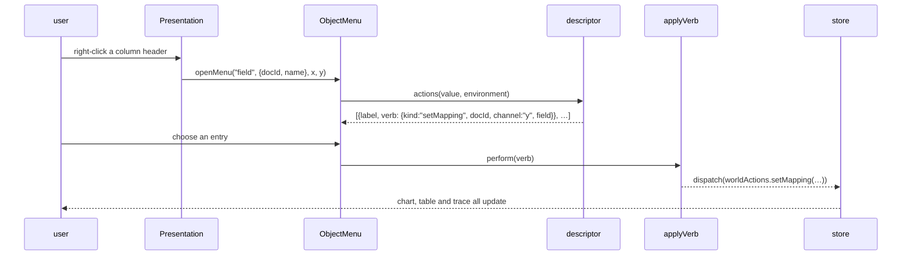

# The Presentation Protocol

**Maturity: Established. Deliberately not proposed as an ecosystem guideline.**

This is the most distinctive structure in the repository and the one a reader is most likely to want to copy. This document explains it, and then argues that copying it would usually be a mistake — while extracting exactly one idea from it would not.

## 1. What problem is being solved

A data workbench has to answer a question that ordinary form-based interfaces avoid: *what can I do with the thing I am looking at?*

A column header, a mark in a chart, a category in a legend, a step in a pipeline, a saved snapshot and a document are all objects a user might want to act on, and the actions differ per kind. The conventional solutions are a toolbar that acts on an implicit selection, or a context menu written per call site. The first makes the target ambiguous; the second means the verbs of a field are defined in five places, because a field appears in five.

The requirement was a third option: every object on screen carries its type, and its type determines its verbs, wherever it appears.

## 2. The concrete shape

Four pieces, all under `ui/src/pbui/`, which imports the engine and the typography foundation and nothing else.

**A presentation type vocabulary.** Fifteen types at the analyzed commit — `field`, `source`, `doc`, `step`, `geom`, `channel`, `datum`, `cat`, `chart`, `tile`, `workspace`, plus four account types. The important framing is in the source:

> A presentation type is the type as the *interface* understands it, which is not always the type the language understands. `{docId, name}` and `{docId, channel}` are both objects to TypeScript; to the interface one is a field with the verbs of a field, and the other is a channel with the verbs of a channel.

**One component.** `<Presentation ptype value>` wraps anything that is an object. It handles right-click to open a menu, left-click to fire the default verb, keyboard equivalents, and the accept protocol below. It is the only component that does this, and it never learns what a chart is.

**A descriptor per type.** One file each in `pbui/descriptors/`, eleven at the analyzed commit:

```ts
interface PresentationDescriptor<V> {
  ptype: PresentationType;
  label(value: V, env: PbuiEnvironment): string;      // menu headers, the mouse-doc bar
  describe(value: V, env: PbuiEnvironment): unknown;  // the inspector; JSON-serialisable
  actions(value: V, env: PbuiEnvironment): Action[];  // the menu, likeliest first
  tone: string;
}
```

**Verbs as data.** An `Action` pairs a label with a *serialisable object*, not a closure:

```ts
{ kind: "addFilter", docId: "…", field: "data.temp_c", op: ">", value: "20" }
```

Thirty-two verb kinds at the analyzed commit. `ui/src/store/applyVerb.ts` is the only place that maps one onto a reducer.

## 3. How it is woven into the rest of the application



Three couplings make this work and each is a deliberate restriction.

**The descriptor cannot reach the store.** It sees a narrow `PbuiEnvironment` — a schema lookup, a table lookup, the active document id, a name lookup and per-document type overrides. That narrowness is what lets `actions` be tested with a literal object, no provider and no DOM.

**The descriptor holds no React.** The chip that draws a presentation lives in `components/atoms/`, and the mapping from type to chip lives there with it, because `pbui` may not import components. Putting a component in a descriptor would make the layer graph cyclic.

**Every presentation minted inside a document-bound tile carries its document.** `FieldRef` is `{docId, name}`, not `name`. Clicking a mark in a tile showing document β filters β, not whichever document is active. Where there genuinely is no owner — a field chip in the source browser — `docId` is `null`, the verb falls back to the active document, and the menu header names which one.

## 4. Why it works

The value comes from one property: **`actions(value, env)` is a pure function returning serialisable values.**

That makes menu behaviour directly assertable. A test can state that right-clicking a mark in a tile showing document β produces `{kind: "addFilter", docId: "β", …}` with no store, no provider and no DOM. `ui/test/descriptors.test.ts` does exactly this, and the targeting rules — which are easy to get wrong and invisible when wrong — are the part it checks.

It also created a seam between implementation phases. The first phase rendered verbs and reported them; the second dispatched them. Nothing in `pbui/` changed between the two.

The second property worth naming: **an unavailable verb is shown, disabled, with its reason**, rather than hidden.

> Hiding an unavailable verb hides the rule that makes it unavailable: a user who never sees "Map to y" on a nominal column never learns that y requires a quantitative one.

This recurs throughout the interface and is the reason its menus are longer than strictly necessary.

## 5. What goes wrong

**Two declared types have no descriptor.** `tile` and `workspace` are in the vocabulary, are wrapped in real `<Presentation>` elements, and have no entry in the descriptor map — so right-clicking a tile produces "no verbs for this object yet". Worse, the workspace strip has displayed the help text *"R for duplicate / delete"* since DATADROP-4, describing a feature that has never existed. Recorded as debt in [[Research/Software Architecture Garden/go-go-datadrop/08 - Architecture Debt and Patterns Not to Repeat|document 08]]; DATADROP-8 is the ticket that fixes it.

**The environment was too narrow in one direction and too wide in another.** It exposed a table lookup that evaluates the whole pipeline, and a helper called during render used it — 144 ms per frame at the largest row budget. The repair split the interface along the line between schema and rows; see [[Research/Software Architecture Garden/go-go-datadrop/04 - The Enforced Layer Graph and the Container Panel Split|document 04]].

**The accept protocol needs a non-serialisable value.** Asking the user to point at an object returns a promise, so a resolver has to live somewhere. It lives in a React ref beside a `useState` flag, never in the store, because Redux state must be serialisable. This is the canonical exception in the codebase and it is documented as such.

**Nested accepts are refused rather than queued.** Two pending resolvers and one click is a defect that is unpleasant to find, and a command that silently replaced another's request would apply the wrong argument to the wrong command.

## 6. When should another project reuse it

**Usually not.** The protocol is worth roughly 1 900 lines across `pbui/`, `store/applyVerb.ts` and the descriptor files, and it pays for itself only when three conditions hold at once:

1. The interface shows **many kinds of object** — this one shows fifteen.
2. The same object appears **in several places** and must behave identically in all of them — a field appears in five.
3. The set of actions per kind is **large and irregular** enough that a per-call-site menu would drift.

An application with three object types and a toolbar should write the toolbar. An admin panel with forms should write the forms. The protocol's cost is fixed and its benefit scales with the product of the three conditions above.

There is also a lineage cost. The design is derived from CLIM's presentation types, and a reader who has not met that idea has to absorb an unfamiliar model before the code reads as obvious. That is affordable in a project whose interface *is* the product and expensive in one where the interface is a means.

## 7. What should become ecosystem guidance

Not the protocol. **One idea inside it**, which is separable and cheap:

> Represent an action as a serialisable value, and map values to effects in exactly one place.

That single decision produces most of the testability, all of the phase seam, and a trace surface for free — the workbench's activity log renders verbs by describing them, and gained nothing extra when new verbs were added.

This is proposed as a candidate in [[Research/Software Architecture Garden/go-go-datadrop/09 - Candidate Ecosystem Guidelines|document 09]], where it is also compared against `rag-evaluation-system`'s independently-derived Candidate 1. Two projects reached the same invariant for different stated reasons, which is the strongest evidence the Garden's promotion path asks for.

## Related notes

- [[Research/Software Architecture Garden/go-go-datadrop/01 - Project Architecture Overview]]
- [[Research/Software Architecture Garden/go-go-datadrop/04 - The Enforced Layer Graph and the Container Panel Split]]
- [[Research/Software Architecture Garden/go-go-datadrop/09 - Candidate Ecosystem Guidelines]]
- [[ARTICLE - Newton Object Soup - The Paradigm That Eliminated the Filesystem]]
