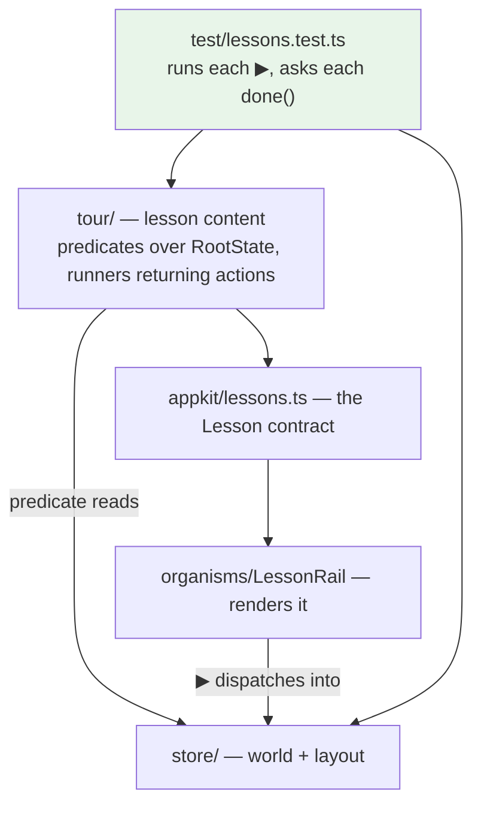

# Executable Documentation

**Maturity: Emergent, trending Established.** The contract exists and is tested; what is not yet explicit is which of the four mechanisms below is the general rule and which are instances of it.

## 1. What problem is being solved

Documentation of an interactive system decays in a specific way: the prose stays, the interface moves, and nothing fails. A screenshot walkthrough is wrong within a month and tells nobody. A written tutorial that says *press the button labelled Add Filter* survives a rename of that button indefinitely.

The requirement here was sharper than usual, because the product's onboarding surface is a marketing page containing six live copies of the application with lessons beside them. A lesson that describes a control that no longer exists is worse than no lesson, and it would be read by exactly the people least able to notice.

## 2. The concrete shape

Four mechanisms, in increasing order of how much they are worth stealing.

### Prose that dispatches the real action

The four in-application tutorials interleave explanation with buttons that dispatch **exactly what the interface dispatches** — the same action creators, not a parallel scripted path.

> Rename an action creator and the tutorial fails to compile, which is a property a screenshot walkthrough can never have.

That is the whole mechanism, and its cost is zero: the tutorial imports the same module the interface does.

### Completion as a predicate over state

The tour's lesson contract is the interesting piece:

```ts
export interface Lesson {
  id: string;
  title: string;
  body: ReactNode;
  /** Complete when this is true of the instance's state. */
  done?: (state: RootState) => boolean;
  /** "▶ do it for me". Dispatches exactly what the interface dispatches. */
  run?: (ctx: LessonContext) => void | Promise<void>;
}
```

A step is complete when a predicate over the Redux state says so — never when a button was pressed. Three consequences follow, and each is deliberate:

**Any route to the goal counts**, including routes the lesson author did not think of. A reader who achieves the outcome by a menu the lesson never mentions is finished, because the lesson asks about the world rather than about the reader's clicks.

**A predicate that throws counts as false**, rather than crashing. The reader is free to delete a document the predicate names; that is a legal move rather than an error.

**Pressing "do it for me" does not mark the step complete.** The predicate does. The rail remembers that the button was pressed and renders the tick as *watched* rather than green, because watching is not the same as knowing.

### A test that runs the documentation against itself

`ui/test/lessons.test.ts` executes each lesson's ▶ action and then asks that same lesson's own `done` predicate whether it is satisfied.

This is a documentation test with an unusual property: it needs no expected value. The lesson supplies both the action and the criterion, and the test asserts they agree. On its first execution it rejected two lessons — one whose predicate could never be satisfied by its own action, and one that silently required a *previous* lesson to have been completed first.

It also asserts structural facts a reviewer would not check: no lesson has both a runner and a manual "got it" button, ids are unique within a track, and a prediction's stated answer indexes its own options.

### Set equality between documentation and registry

`ui/test/tour.test.ts` asserts that the reference rack and the application registry contain **exactly the same set** of applications — every registered application has a card, every card names a registered application, and no application is documented twice.

The same idea appears on the Go side. `pkg/doc/doc_test.go` guards the embedded help pages, and it earned itself immediately: a page whose YAML frontmatter contained an unquoted colon was parsed as a mapping and **dropped by the loader without an error**, so the page existed, compiled, embedded, and did not resolve. Nothing but a test that walks the embedded filesystem and resolves every slug would have found it.

## 3. How it is woven into the rest of the application



The layer placement is what makes the test possible. Lesson content may import the store, the engine and the contract — it may **not** import components — so a lesson is executable with no DOM. That restriction is itself enforced by `tour.test.ts`, and it is the reason the `Lesson` type lives in `appkit` rather than beside the rail that renders it.

## 4. Why it works

**The documentation and the product share one vocabulary of actions.** There is no scripted layer that can drift, because there is no scripted layer.

**The completion criterion is about the world, not the reader.** This is the non-obvious half. A tutorial that tracks clicks is asserting that the reader followed instructions; a tutorial that tracks state is asserting that the reader achieved something. Only the second survives a reader who knows a better way.

**The tests need no fixtures.** A lesson supplies its own action and its own criterion, so the test is a consistency check rather than a specification that has to be maintained alongside the content.

## 5. What goes wrong

**Two lessons failed the anti-rot test on its first run**, and both failures are instructive. One was uncompletable because a helper defaulted an identifier to "follow the active document" rather than to a specific one, so the predicate examined the wrong object. The other required a filter count of two, which was only reachable if an earlier lesson had been completed — an invisible ordering dependency that the test surfaced as a flat failure.

**Auto-advance made one nudge unreachable.** Advancing on any completion meant a step that was satisfied by watching rather than doing was skipped before its message could be read. The repair advances only on self-completion.

**Content can be correct and unreachable.** During DATADROP-7, three tour sections contained cheat-sheet content with no tile to display it, and one rendered an empty lesson panel because it borrowed a neighbouring section's seed. All three were found by counting rendered elements in a browser, not by any test. This is the recurring failure class in this project: *content that exists, is correct, and is unreachable.*

**The four in-application tutorials are now the odd ones out.** The tour has better machinery, and the tutorials predate it. The recorded decision is to leave them — their shared parts are already extracted, and what remains in each is genuinely one-off prose — while noting that the open question is no longer whether to extract them but whether they should exist.

## 6. When should another project reuse it

**The prose-dispatches-the-real-action mechanism: always**, wherever an application has an in-product tutorial. It costs nothing and removes an entire decay mode.

**Completion as a predicate over state: whenever the product has observable state**, which for anything with a store is always. It is a small contract — one function per step — and it is what makes a tutorial testable at all.

**The anti-rot test: whenever documentation names something the code owns.** The set-equality form is the cheapest and most general instance: *every registered X has documentation, and every documented X is registered*. That is four lines over any registry.

Non-applicability: a linear installation guide with no state has nothing to write a predicate about, and forcing one produces ceremony. The pattern needs a product whose *state* is the thing being taught.

## 7. What should become ecosystem guidance

Two candidates, developed in [[Research/Software Architecture Garden/go-go-datadrop/09 - Candidate Ecosystem Guidelines|document 09]]:

1. **In-product documentation calls the same functions the product calls.** No scripted parallel path.
2. **Where documentation enumerates something the code owns, a test asserts set equality in both directions.**

The second is the one to adopt ecosystem-wide first. Almost every project here has a registry — commands, providers, widgets, applications — and almost every one has prose listing its members. Four lines make the two agree permanently, and the Go-side frontmatter incident shows the failure it prevents is silent.

## Related notes

- [[Research/Software Architecture Garden/go-go-datadrop/05 - Structural Guard Tests as a Genre]]
- [[Research/Software Architecture Garden/go-go-datadrop/07 - Single Binary Delivery and Operational Surface]]
- [[Research/Software Architecture Garden/go-go-datadrop/09 - Candidate Ecosystem Guidelines]]
- [[PROJECT REPORT - go-go-datadrop v0.6 - Six Workbenches on One Page, and a Tutorial That Cannot Rot]]
