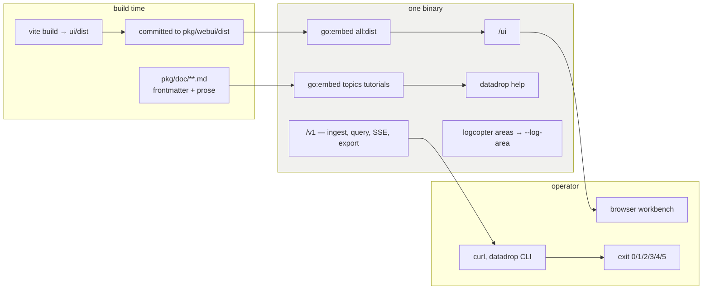

# Single-Binary Delivery and Operational Surface

**Maturity: Established, with one defect that is not local to this project.**

## 1. What problem is being solved

A self-hostable tool competes against "just use the cloud one". Every step between downloading it and having it running is a place the evaluation ends. The target is one artefact, no runtime dependencies, no companion process, and no build step on the operator's machine.

The second problem is operational rather than distributive: once it is running, a maintainer has to be able to ask it what it is doing without turning on a firehose.

## 2. The concrete shape

### The browser interface is embedded

```go
// pkg/webui/webui.go
//go:embed all:dist
var assets embed.FS
```

The built single-page application is committed and embedded. Node exists at build time and nowhere else; the deployment unit is one binary that serves the API at `/v1` and the interface at `/ui`. The committed bundle is rebuilt and committed alongside any interface change, because `pkg/webui` embeds it — a change that does not rebuild ships the previous interface, which is a real failure mode this project has had to remember explicitly.

### The documentation is embedded

```go
// pkg/doc/doc.go
//go:embed topics tutorials
var docFS embed.FS

func AddDocToHelpSystem(helpSystem *help.HelpSystem) error {
	return helpSystem.LoadSectionsFromFS(docFS, ".")
}
```

Six long-form help pages ship inside the binary and are reachable by slug — `datadrop help web-ui-object-model` — filterable by topic, rendered by the shared help machinery. The pages document the *browser* architecture, which is coherent rather than odd: the browser interface ships in this binary, so its architecture is as much a property of the program as the HTTP surface is.

### Log areas are addressable from the command line

A code generator emits one logger per package:

```go
// pkg/logcopter.go — generated
var log = logcopter.Package("go-go-golems.go-go-datadrop.pkg")
```

Ten areas at the analyzed commit. Until this cycle nothing could address one; the logging section now exposes them:

```console
$ datadrop serve --log-area go-go-golems.go-go-datadrop.pkg.store:debug
… INF applied migration    area=…pkg.store name=0001_init.sql version=1
… DBG opened store         area=…pkg.store path=/tmp/areatest.db
… INF datadrop listening   area=…pkg.server addr=[::]:18099
```

The store's debug output appears while every other area stays at info. `--strict-log-areas` rejects a misspelled area rather than ignoring it.

### Exit codes are an API

```go
const (
	ExitOK = 0; ExitError = 1; ExitUsage = 2
	ExitAuth = 3; ExitNotFound = 4; ExitValidation = 5
)
```

A script branches on *why* a command failed without parsing stderr; a container healthcheck distinguishes "unauthorized" from "unreachable". `cmd/datadrop/smoke_test.go` asserts them by shelling out to a compiled binary.

## 3. How it is woven together



The four surfaces share one property: none of them requires anything to be installed alongside the binary. That is the design.

## 4. Why it works

**Embedding removes an entire class of deployment question.** No asset path, no reverse-proxy rule for a static directory, no version skew between an interface and the API it calls — the two cannot disagree because they are one file.

**Embedded help scales better than a README.** A README is read once, at a moment when the reader has no context. A slug is read at the moment of the question, and it can be long without cost because nobody scrolls past it.

**Generated log areas mean no naming discipline is required.** A hand-maintained set of log categories drifts from the package structure immediately. Generation makes the two identical by construction, and the CLI flag then addresses whatever exists.

## 5. What goes wrong

### The exit-code contract is destroyed by the command framework

This is the significant finding in this document, and it is **not local to this project**.

Commands built through `glazed`'s Cobra builder assign `cmd.Run` — not `cmd.RunE` — and terminate with `cobra.CheckErr`, which prints `Error: …` and calls `os.Exit(1)` unconditionally. There is no path back to the application's `Execute()`, and the builder's configuration struct has no error or exit-code hook.

Reproduced during this analysis with a purpose-built two-command program against `glazed v1.3.8`:

```console
$ repro plain      # plain cobra, RunE
repro: not found: greenhouse
$ echo $?
4

$ repro glazed     # identical error, through BuildCobraCommandFromCommand
Error: not found: greenhouse
$ echo $?
1
```

Three losses from one cause: the documented code collapses to 1, the message prefix changes from the application's to Cobra's, and application-level error handling is bypassed entirely.

Filed as [glazed#611](https://github.com/go-go-golems/glazed/issues/611) with the reproduction and three proposed fixes. **Every CLI in this ecosystem that adopts the builder has this defect**, and it is silent unless a test asserts the codes. This project's test does, which is the only reason it was found before the conversion shipped.

### The help system triples the binary

Measured at the analyzed commit:

| | Size |
|---|---|
| baseline | 18.8 MB |
| + the help system's core | 27.7 MB |
| + the Cobra integration | **55.7 MB** |

The Cobra integration alone costs 28 MB, dragging in a terminal user interface, a spreadsheet writer, a JSON query engine and a secrets-manager client — none of which a data-inbox server uses. The module graph goes from 52 to 194.

That is a real cost for a self-hostable tool distributed as a container image, and it is recorded as debt rather than resolved.

### The embedded bundle is a manual step

`pkg/webui/dist` is committed. An interface change that does not rebuild it ships the previous interface. Nothing enforces the rebuild; it is remembered.

## 6. When should another project reuse it

**Embedding an SPA: yes, for any self-hosted tool with a browser interface.** This corroborates a candidate from the first Garden project and is discussed in [[Research/Software Architecture Garden/go-go-datadrop/09 - Candidate Ecosystem Guidelines|document 09]].

**Embedding long-form help: yes, wherever there is more to say than fits in `--help`**, and especially where the answer is architectural rather than operational. The frontmatter must be tested; see [[Research/Software Architecture Garden/go-go-datadrop/06 - Executable Documentation|document 06]] for the silent-drop failure.

**Generated log areas: yes, for any Go service with more than a handful of packages.** The generator plus the flag is a small amount of machinery for a large gain in diagnosability.

**Exit codes as an API: yes, and document them** — but be aware that adopting a command framework may take them away without saying so.

**Not applicable**: a library, a tool with no interface, or a service deployed as a fleet where a 37 MB binary difference multiplies.

## 7. What should become ecosystem guidance

1. **Embedded SPAs keep Node at build time.** Corroboration of an existing candidate.
2. **A CLI's exit codes are an API, and a command framework that owns error handling can silently destroy them.** Assert them in a test that shells out to the built binary.
3. **Weigh a convenience dependency against the artefact it produces.** A help system that triples a self-hosted binary is a trade worth making consciously.
4. **Generated observability categories beat maintained ones.**

## Related notes

- [[Research/Software Architecture Garden/go-go-datadrop/01 - Project Architecture Overview]]
- [[Research/Software Architecture Garden/go-go-datadrop/06 - Executable Documentation]]
- [[Research/Software Architecture Garden/go-go-datadrop/08 - Architecture Debt and Patterns Not to Repeat]]
- [[Research/Software Architecture Garden/go-go-datadrop/09 - Candidate Ecosystem Guidelines]]
- [[ARTICLE - Glazed Chain - From Cobra Flags to Typed Values]]
