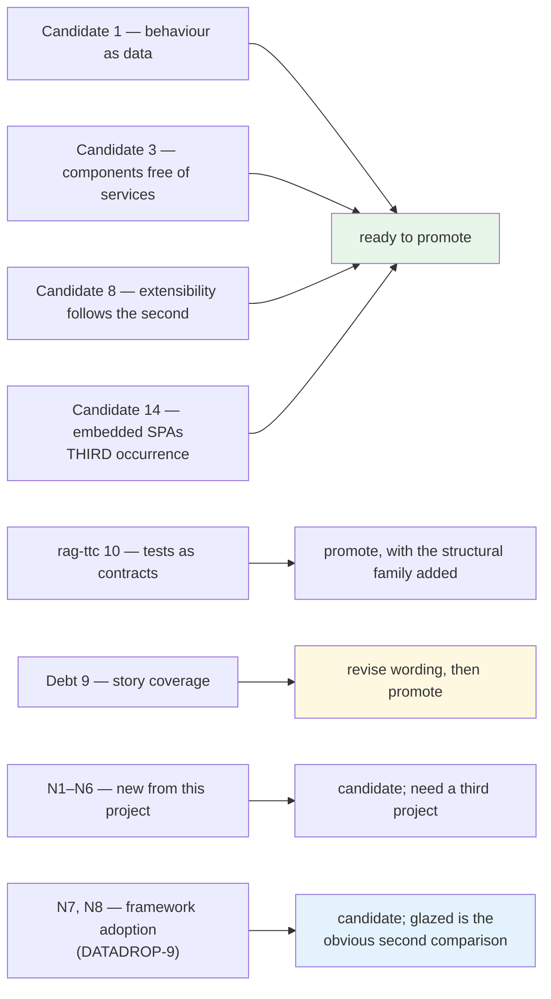

# Candidate Ecosystem Guidelines

`go-go-datadrop` is the fifth project in the Garden. Four entries precede it: `rag-evaluation-system` (fifteen candidates, no comparison), `publish-vault` (six candidates, compared against rag), `zitadel-go-test` (thirteen candidates, no comparison) and `rag-ttc` (ten candidates, no comparison).

This document compares against two of them. It confirms four of `rag-evaluation-system`'s candidates, confirms and **splits** one of `rag-ttc`'s, adds a third independent occurrence to a pattern `publish-vault` had already confirmed as a second, and proposes six new candidates of its own.

> [!summary]
> - **Four** of `rag-evaluation-system`'s fifteen candidates are independently confirmed, three of them arrived at for entirely different stated reasons. Under the Garden's promotion path these are ready to move from candidate to guidance.
> - **One** pattern — the embedded SPA — now has three independent occurrences across the Garden and should be promoted outright.
> - **One** of `rag-ttc`'s candidates is confirmed and split along an axis neither project had named: structural invariants over source and runtime invariants over behaviour are different mechanisms with different failure modes.
> - **One** recorded debt item is refined rather than confirmed: story coverage is a real risk in both projects, and this one bounds it explicitly.
> - **Six** new candidates are proposed, of which three are about how conventions get enforced.
> - **One** finding is not a candidate at all but a live defect in shared infrastructure, already filed upstream.

## How to use this document

A candidate is not guidance. It becomes guidance when a second project shows the same invariant solving the same class of problem, ideally for a different reason — because a pattern that two teams reached independently is more likely to be a property of the problem than a property of a taste.

Where a comparison below says **confirmed**, the recommendation is promotion. Where it says **refined**, the candidate's wording needs to change before promotion. Where it says **new**, the pattern is at candidate status and needs a third project.

---

## Part I — Comparisons against rag-evaluation-system

### Candidate 1: Represent cross-process behavior as data — **confirmed**

- **Constraint in this project:** an interface with fifteen kinds of object, each appearing in several places, each with an irregular set of actions. A per-call-site menu would define the verbs of a field in five places.
- **Concrete implementation:** menu entries pair a label with a serialisable verb — `{kind: "addFilter", docId, field, op, value}` — and exactly one module maps a verb to a reducer. Thirty-two verb kinds; eleven descriptors; zero closures.
- **Same invariant as rag-evaluation-system?** Yes.
- **Important differences:** rag's constraint is a *process* boundary — behaviour authored in Go, executed in a browser, where a callback physically cannot survive serialisation. This project has **no process boundary at all**; everything runs in one JavaScript context, and closures would have worked. The stated reasons here are testability (a menu entry's effect is assertable with no store, no provider and no DOM) and a phase seam (one implementation phase displayed verbs, the next dispatched them, and nothing in the protocol layer changed between them).
- **Failure evidence:** none in this project. The protocol has been extended twice without changes to the dispatch seam.
- **Recommendation: promote toward ecosystem guidance**, with the rule generalised. rag's wording is scoped to cross-process behaviour; this project shows the same invariant paying off with no process boundary, which means the rule is about *representability*, not about transport.

> **Proposed wording:** Represent an action as a serialisable value and map values to effects in exactly one place. This holds whether or not the action crosses a process boundary; the payoff without one is testability and a stable seam.

### Candidate 3: Keep reusable components free of application services — **confirmed**

- **Constraint in this project:** nine applications rendered their own JSX with hooks and fetches inline, so states that mattered — a unary operator that hides an input, a mapping to a column a later step removed — could not be rendered outside a running server.
- **Concrete implementation:** containers hold the hooks; panels take data and callbacks. Enforced by a nine-layer import graph checked by walking every import, plus a rule that `pages` is absent from what `apps` may import.
- **Same invariant as rag-evaluation-system?** Yes, and this project enforces it mechanically where rag states it.
- **Important differences:** the enforcement. rag records the inverse as debt (`FormDialog.widget.tsx` hiding stateful behaviour); this project has a test that would have failed on that file.
- **Failure evidence:** the extraction moved 1 135 lines of container to 554 and produced 54 story exports for states nobody had seen. Two of those stories then revealed defects in the components they were written for.
- **Recommendation: promote**, and add the enforcement clause — the rule works when a test checks it and decays when it does not.

### Candidate 8: Extensibility follows the second implementation — **confirmed, three times**

- **Constraint in this project:** three separate opportunities to build an abstraction before it was needed.
- **Concrete implementation, all three declined:**
  1. Four in-application tutorials share a shape; a generic `Tutorial` organism taking a step descriptor was rejected with *"revisit if a fifth is written"*.
  2. Three snapshot-family applications look alike; a shared list component was suspected to be the answer, and reading all three refuted it — what was actually shared was the *description of a specification*, extracted as one pure function and two small components, leaving three separate panels.
  3. The presentation protocol's type conversions are a fixed table of two entries, with *"if a third case appears, that is the moment to reconsider"* written beside it.
- **Same invariant?** Yes.
- **Important differences:** case 2 is the strongest evidence in either project, because the decision to design the three together **before extracting any** was recorded as a formal decision in advance, and the investigation then refuted the hypothesis that motivated it. That is the candidate working as a process rather than as a slogan.
- **Recommendation: promote.** Add the sharper form this project supplies: *when several implementations look alike, find what is actually shared before extracting anything — it is often smaller and lower down than the resemblance suggests.*

### Candidate 14: Embedded SPAs keep Node at build time — **confirmed**

- **Constraint in this project:** a self-hostable tool competing against a cloud alternative; every installation step is a place the evaluation ends.
- **Concrete implementation:** `//go:embed all:dist` in `pkg/webui`; the built bundle is committed; one binary serves `/v1` and `/ui`.
- **Same invariant?** Yes, identically — and this is the **third** independent occurrence in the Garden. [[Research/Software Architecture Garden/publish-vault/04 - Candidate Ecosystem Guidelines|`publish-vault`]] already recorded the second, with build-tag-controlled embedding.
- **Important differences:** rag builds an application artefact while keeping npm as a separate reusable product; `publish-vault` makes embedding conditional on a build tag; this project has no npm product and no tag — the interface exists only inside the binary. Three projects, three packaging constraints, one invariant. That is a wider spread than a candidate normally gets before promotion.
- **Failure evidence:** a real operational hazard this project has to remember: the committed bundle is a **manual** step, and an interface change that does not rebuild it ships the previous interface silently.
- **Recommendation: promote**, and add the failure clause — *if the built artefact is committed, something must fail when it is stale.* Neither project has this; both should.

### Recorded debt 9: Story coverage is mistaken for behavioural protection — **refined, not confirmed**

- **Constraint in this project:** identical risk. Story coverage is enforced by a test, so it is easy to read "every component has a story" as "every component is protected".
- **How this project bounds it:** the guidelines say so explicitly — *"Nothing tests that a component **looks** right. That is what Storybook and a reviewer are for."*
- **What this project adds:** evidence that coverage and protection are genuinely different, from both directions. Two stories written to *demonstrate* states instead *found defects* in the components they demonstrated, and separately a shared function lost information during a refactor while 229 tests, a type check and every story passed — it was caught by reading a rendered screenshot and noticing that two obviously different charts agreed.
- **Recommendation: revise the candidate's wording** before promotion. The failure is not that story coverage is worthless; it is that coverage and behavioural protection are orthogonal, and a project should state which of its contracts each mechanism covers.

> **Proposed wording:** Story coverage guarantees that a component has been *looked at*, not that it is correct. State explicitly which contracts are covered by tests, which by visual review, and which by neither.

This also engages rag's **Candidate 11** (match validation method to contract type), which this project supports with a fourth category rag does not name: a **cost** contract, asserted by a timing bound. See new candidate N6.

### rag-ttc Candidate 10: Let tests protect architectural invariants — **confirmed, and split**

`rag-ttc`'s wording is: *write tests for dependency-sensitive runtime invariants: order, authority, persistence, cancellation, identity, and terminal state.*

- **Constraint in this project:** identical in spirit and different in kind. This project's invariants are not about what the program does at run time; they are about what the source looks like. *No file imports from a layer above it. No hand-written form control outside the atoms. Nothing under `components/` evaluates the pipeline. Every component has a story. Every design token referenced in a stylesheet is declared.*
- **Concrete implementation:** thirteen tests, nine of which share one shape — walk the tree, assert an invariant, carry an allow-list whose entries each state a reason.
- **Same invariant as rag-ttc?** Yes at the level of *"tests are the right place for architectural contracts"*. No at the level of mechanism.
- **The split, which neither project had named.** These are two families with different failure modes:

  | | rag-ttc's family | this project's family |
  |---|---|---|
  | Asserts | what the program does | what the source contains |
  | Needs | a running system, fixtures, a clock | a file walk |
  | Fails when | behaviour regresses | a convention decays |
  | Characteristic weakness | slow, and can pass while the design rots | can pass while guarding nothing |
  | Antidote | the invariant is dependency-sensitive by construction | break it once, deliberately |

- **Failure evidence:** this project's characteristic weakness is real and has an answer. A structural test that scans for a pattern nobody writes any more passes forever and protects nothing. The counter-discipline — verify by breaking — is proposed below as N3, and it is precisely the discipline rag-ttc's family does *not* need, because a runtime test that guards nothing usually fails to compile or fails immediately.
- **Recommendation: promote rag-ttc's candidate, and add the second family to it.** The combined rule is stronger than either alone, because a project that writes only runtime invariant tests will let its conventions decay, and one that writes only structural tests will let its behaviour drift.

> **Proposed combined wording:** Tests are the right place for architectural contracts, and there are two families. Write **runtime** invariant tests for order, authority, persistence, cancellation, identity and terminal state; write **structural** tests for the conventions that govern the source itself. The second family must be verified by breaking it, because it can pass while guarding nothing.

---

---

## Part II — New candidates from this project

> **Note on N1–N3.** These three refine the *structural* half of the combined rule above rather than proposing something rag-ttc did not see. They are listed separately because each is an independently adoptable practice, and because N3 is the one that makes the family safe.

### N1: A convention stated twice in review becomes a structural test

**Rule:** When a convention has been stated in a code review for the second time, it becomes a test that walks the source tree, before the third statement.

**Evidence:** thirteen such tests, written across three tickets, converging on one shape without being planned as a genre. The originating observation is in the oldest of them: *"a convention that is only written down is a convention that has already been broken somewhere nobody has looked."* One was written after a sweep removed 42 hand-written buttons, 9 selects and 12 inputs, along with six copies of one style object that had drifted to two different font sizes.

**Compare against:** every project with a `CONTRIBUTING.md` that states a rule no tool checks. Likely first comparisons: glazed, geppetto, go-go-os frontend.

**Promotion test:** the project can name at least two conventions that decayed before enforcement and at least one that a test caught on the commit that introduced it.

### N2: Every exemption states its reason in a sentence

**Rule:** A structural rule carries an allow-list; each entry is a path plus a written reason; and a test asserts that every entry still matches something.

**Evidence:** eighteen reasoned exemptions across three tests in this project. The stated rationale: *"an escape hatch that costs a sentence is one people use honestly."* The stale-exemption check exists in one of the three and should exist in all.

**Compare against:** linter suppression comments, `//nolint` directives, test skips.

**Promotion test:** a reviewer can read the allow-list and challenge an entry without reading the code it exempts.

### N3: A structural guard is not real until it has been broken

**Rule:** A test that asserts a structural invariant must be verified by breaking the thing it guards, and the break belongs in the commit message.

**Evidence:** twelve verifications recorded in this project's history — eight at the first analysis, four more in DATADROP-9, where the break output is pasted into the commit message that introduces each guard. Two guards written in this cycle were confirmed to fail for the right reason and with a usable message; one — a help-page frontmatter guard — found a real defect on its first run, in which an unquoted colon caused a page to be **silently dropped by the loader with no error**.

**Compare against:** any repository with source-scanning tests, mutation-testing efforts, coverage gates.

**Promotion test:** for each structural test, the repository can state the one-line change that makes it fail.

**Why this is the one most likely to be skipped:** a guard nobody has broken is a guard nobody has tested, and a suite full of them provides confidence proportional to its line count rather than to its coverage.

### N4: Make the wrong thing unavailable, not discouraged

**Rule:** Prefer removing the capability to documenting the rule. Delete the export, narrow the type, split the interface.

**Evidence:** the store module exports a factory and no constructed instance, so `import { store }` fails to compile rather than being discouraged. Stated in the source: *"the only kind of discouragement that survives contact with a hurry."* Two further instances: a resolver stopped returning a table its callers did not read, and a presentation value type has no secret field so a credential structurally cannot reach the inspector, the watchlist or durable storage.

**Compare against:** singleton exports, `any` escape hatches, optional fields that must never be set.

**Promotion test:** the project can name a rule it deleted a capability to enforce, and the deletion is smaller than the documentation it replaced.

### N5: Injected capabilities travel on the framework's per-instance channel

**Rule:** When code that cannot take a parameter needs per-instance configuration, use the one channel the framework already provides for it, rather than a module import or a global.

**Evidence:** a query layer's transport is constructed once at module scope and runs inside middleware, so it can take no parameter; the fixture map reaches it on the store's thunk extra argument. The same channel later carried a clipboard port, which made an export path testable with no DOM — reuse being the evidence that the channel was right.

**Compare against:** context values in React, `context.Context` values in Go, constructor injection in generated hosts. This is close to rag's **Candidate 5** (generated hosts select capabilities explicitly) and should be compared against it directly in a third project.

**Promotion test:** the capability can be replaced by a test double without touching the code that consumes it.

### N6: A cost contract deserves an absolute bound, not a ratio

**Rule:** Where performance is a contract, assert an absolute bound in a test. Report the ratio; assert the bound.

**Evidence:** a correctness fix in this project cost 144 ms per frame at the largest row budget the interface offers. The guard asserts that thirteen schema resolutions at 50 000 rows complete in under 5 ms — roughly two hundred times the measured cost — because *a ratio is the more informative number and the more flaky assertion: it fails when the machine is loaded rather than when the code is wrong.*

**Compare against:** benchmark gates, bundle-size budgets, query-count assertions.

**Promotion test:** the bound passes on a loaded developer machine and fails when the guarded property regresses, demonstrated by breaking it.

**Relation to rag's Candidate 11:** this is a fifth validation category — visual, behavioural, golden, distribution, and now **cost** — and it needs the same treatment: name which contract changed, invoke the matching layer.

---

### N7: Framework adoption is a namespace merge — audit it before writing code

**Rule:** Before adopting a framework that contributes flags, sections or environment variables, enumerate its field names and intersect them with yours. Include the environment prefix in the intersection: a mechanically derived prefix maps variables onto fields by name alone, with no regard to meaning.

**Evidence:** DATADROP-9 hit all three collision kinds. `--stream` and `--flatten` were hard collisions that fail the construction of the *entire* command tree, not of one verb, and were discovered in phases three and five by running the binary. `DATADROP_ADDR` — the client's server address — would have been mapped onto `serve --addr`, the socket to bind, a collision that had existed harmlessly for the project's whole life because Cobra's flag shadowing kept the two names apart. `dataset import --format` and `--output` were a semantic overlap that nothing detects and only a stated rule caught. The ticket's own design document listed `--stream` among the flags the framework *adds*, without noticing the application already had one.

**Compare against:** any adoption of a CLI framework, a web framework contributing middleware configuration, a build tool contributing environment variables, or a plugin host contributing a settings namespace.

**Promotion test:** the project can produce the intersection of its own field names with the framework's, and state the disposition of every entry.

**Why the ordering matters:** the audit is mechanical and takes minutes. Performed in phase one it produces a rename list; performed in phase five it produces two renames of flags that six verbs already share, plus a migration in which the old spelling still parses with a different type and fails with a message about an unrelated rule.

### N8: A framework's introspection output is an exfiltration surface

**Rule:** When a framework can print its own resolved configuration, enumerate which of your fields carry credentials and verify what that output does with each one. Do it on the first command, not the fifteenth.

**Evidence:** `glazed` attaches a command-settings section to every command, contributing `--print-parsed-fields`, which dumps every resolved value with its provenance. A bearer token declared `fields.TypeString` is printed in full three times — value, parse log, and the name of the environment variable it came from. Declared `fields.TypeSecret` it renders `sm***ef`. There is no opt-out: the section is attached by the parser, not by the command. The distinction is also invisible at the Cobra layer, because both types register through the same `flagSet.String(...)` call, so a guard written over the assembled flags fails on every verb for the wrong reason.

**Compare against:** any framework with a `--print-config`, `--dump-settings`, `/debug/vars` or equivalent; structured-logging libraries that serialise a settings struct; error reporters that attach configuration to a crash report.

**Promotion test:** the project can name every credential-bearing field and show the framework's debug output for each.

**Why it is separable from N7:** N7 is about names colliding; this is about a capability arriving that the application never asked for. Both are consequences of adoption being a merge rather than an addition, but they are found by different audits.

## Part III — Not a candidate: an upstream defect

Commands built through `glazed`'s Cobra builder can only exit `0` or `1`, because the builder assigns `cmd.Run` rather than `cmd.RunE` and terminates with `cobra.CheckErr`. The application's `Execute()` never sees the error; the exit code, the message prefix and any application-level error handling are all lost.

Reproduced during this analysis against `v1.3.8` with a two-command program: the identical error exits `4` through plain Cobra and `1` through the builder. Filed as [glazed#611](https://github.com/go-go-golems/glazed/issues/611) with three proposed fixes.

This affects **every CLI in the ecosystem that adopts the builder**, and it is silent unless a test asserts the codes. It is recorded here rather than as a candidate because it is a bug to fix, not a pattern to weigh — but it produces one candidate-adjacent rule worth stating:

> A CLI's exit codes are a machine-facing API. Assert them in a test that shells out to the built binary, because a framework that owns error handling can remove them without failing anything.

**Update, 2026-07-26.** DATADROP-9 shipped the conversion with a local workaround rather than waiting for the fix, which turned the defect from a blocker into a measured cost. Two additions to the record: the blast radius includes flag-parse errors, which the framework reports itself before any application code runs and which no adapter can reach; and *where* the adapter is applied is a design decision with a wrong answer. See [[Research/Software Architecture Garden/go-go-datadrop/10 - Adopting a Command Framework|document 10]] §3. The workaround should be deleted when the upstream hook lands.

---

## Comparison worksheet for the next project

```markdown
### Candidate: <name>

- Constraint in this project:
- Concrete implementation:
- Same invariant as go-go-datadrop / rag-evaluation-system? yes/no/partial
- Important differences:
- Failure evidence:
- Recommendation:
  - keep project-local
  - revise candidate
  - promote toward Tribal guidance
  - retire candidate
```

## Likely next comparison projects

None of the five below has a Garden entry yet.

| Project | Why compare it |
|---|---|
| **glazed** | Owns the exit-code defect; the natural test of N1–N3, since it is the ecosystem's convention-heaviest library; and now the necessary second comparison for **N7 and N8**, since it is the framework whose namespace and introspection surface produced them. Comparing from the framework's side would also answer whether the collisions are avoidable by design. |
| **go-go-os frontend** | Component layering, design tokens, Storybook packaging — direct comparison for Candidate 3 and N1. |
| **Upwork Tracker** | Embedded SPA plus SQLite plus a committed artefact — the test of Candidate 14's new failure clause, on a fourth occurrence. |
| **geppetto / pinocchio** | Command registries and provider packaging — tests N5 against rag's Candidate 5. |
| **docmgr** | The ticket-documentation structure this project relies on; tests whether the decision-record-cited-from-code pattern generalises. |

The four projects already in the Garden are also comparison targets rather than finished work: `zitadel-go-test` and `rag-ttc` proposed candidates without comparing them, and their lists should be run against this one. `rag-ttc`'s "package by semantic dependency" and this project's layer graph are plainly the same argument at different granularities, and neither has been compared to the other.

## Promotion status after this comparison



## Related notes

- [[Research/Software Architecture Garden/go-go-datadrop/10 - Adopting a Command Framework]]

- [[Research/Software Architecture Garden/go-go-datadrop/README|Architecture Garden — go-go-datadrop]]
- [[Research/Software Architecture Garden/README|Software Architecture Garden]]
- [[Research/Software Architecture Garden/rag-evaluation-system/README|Architecture Garden — rag-evaluation-system]]
- [[Research/Software Architecture Garden/go-go-datadrop/05 - Structural Guard Tests as a Genre]]
- [[Research/Software Architecture Garden/go-go-datadrop/07 - Single Binary Delivery and Operational Surface]]
