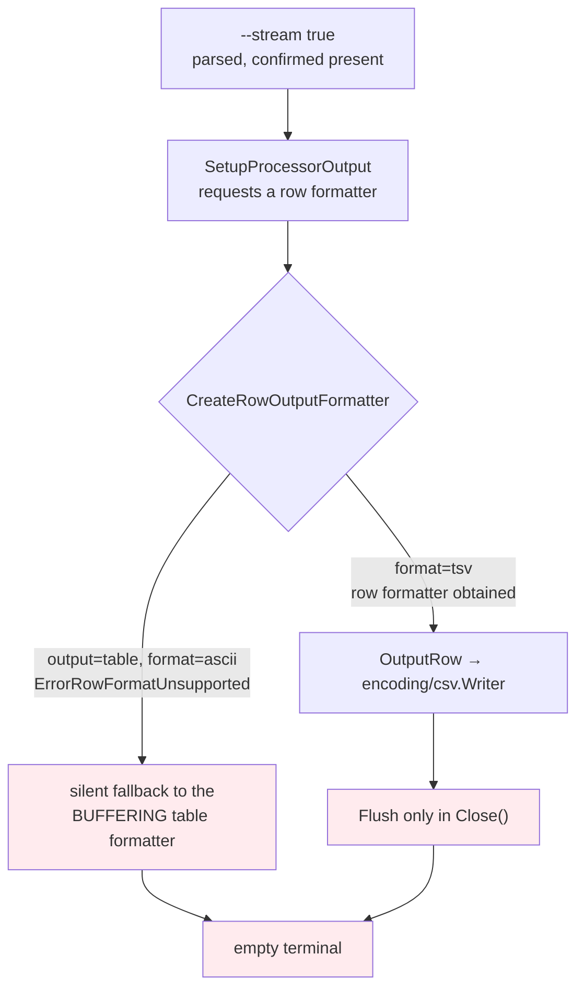

# Adopting a Command Framework

**Maturity: Established. Derived from one complete adoption, measured throughout; the failure taxonomy generalises to any framework that contributes flags, owns output, or owns error handling.**

Nineteen CLI verbs were converted from hand-written Cobra commands to `glazed` commands in DATADROP-9. The conversion succeeded and the resulting surface is better in ways that are easy to enumerate. This document is about the part that is not easy to enumerate: **every significant problem in the adoption was silent.** The framework behaved as documented, the application behaved as written, and the composition produced something neither would have chosen, with no error and no failing test.

This is a different subject from "how to write a Glazed command," which the ecosystem already documents. It is about what happens at the boundary when an application that already exists hands over three things it used to own — its flags, its output, and its error handling.

## 1. What problem is being solved

An application that adopts a command framework is not adding a dependency. It is merging two namespaces and two sets of assumptions:

- **A flag namespace.** The framework contributes flags. So does the application. They can collide.
- **An environment namespace.** A framework that derives environment variables from field names mechanically will connect variables to fields on the basis of a name match, without regard to meaning.
- **A capability surface.** The framework offers a set of output modes through one flag. They are not equivalent to each other, and the differences are not in the flag's help.
- **An error path.** A framework that owns the run loop may own error reporting and process termination with it.

Each of these is a place where the adoption can go wrong without anything failing. The application still compiles. The tests still pass, because the tests were written against the pre-adoption behaviour and the post-adoption behaviour differs in ways those tests do not observe.

## 2. The failure taxonomy

Four failure modes, in increasing order of how hard they are to find.

### 2.1 The hard collision — loud, but with a whole-program blast radius

Two sections defining the same field name is an error, and the error is clear:

```console
$ datadrop query greenhouse
datadrop: building the query command: Flag 'stream' (usage: stream within the
drop - <string>) already exists
```

What is worth noticing is *what* failed. Not the query — the construction of the command tree. `NewRootCmd` returns the error, so every verb in the binary, including `serve`, stops working. **A collision in one verb's field list is a whole-program failure**, which means it cannot be found by testing that verb; it is found by running anything at all, after which nothing runs.

The application's flag is always the one that moves, because a framework section's fields are fixed at construction and its settings struct reads them by tag. `schema.SectionOption` offers `WithPrefix`, `WithName`, `WithDescription`, `WithDefaults`, `WithFields` and `WithArguments` — none of which removes or renames an existing field.

Two occurred here: `--stream` against the output section's row-streaming boolean, and `--flatten` against the fields-filters section's column flattener.

**A rename away from a name the framework then occupies produces a worse migration than an unknown flag.** The old spelling still parses, with a different type:

```console
$ datadrop push lab --stdin --stream temps
datadrop: --stdin cannot be combined with key=value arguments
```

`--stream` is a boolean now, so `temps` became a positional argument and the error describes an unrelated rule. A user updating a script gets a plausible-looking failure about something else rather than "unknown flag."

### 2.2 The soft collision — invisible before adoption, because shadowing hid it

`DATADROP_ADDR` is the client's address for a running server. `serve --addr` is the socket to bind. They mean opposite things and share a name, and this had been true for the project's entire life without ever mattering, because Cobra's flag shadowing kept them apart: the root's persistent `--addr` carried the environment fallback, and `serve`'s local `--addr` simply won.

A framework that derives an environment prefix from an application name maps `DATADROP_ADDR` onto **any** field named `addr` in any section of any command built with that prefix. A developer with the ordinary client environment exported — the normal state of a shell in which one is using the tool — would find `datadrop serve` attempting to listen on `http://localhost:8080`.

The repair is to build the verbs that run or probe a server through a separate path with no application-name prefix at all, keeping their own fallbacks in the field defaults where they read the variable each verb actually means:

```go
// pkg/cli/build.go
func buildOperatorCommand(command cmds.Command) (*cobra.Command, error) {
    return cli.BuildCobraCommandFromCommand(
        WithExitCodes(command),
        cli.WithParserConfig(cli.CobraParserConfig{
            ShortHelpSections: []string{schema.DefaultSlug},
            // AppName deliberately unset.
        }),
    )
}
```

The generalisation is the useful part: **existing shadowing may be concealing a name collision that adoption will expose**, and the two names in question never had to be reconciled before because nothing had put them in one namespace.

### 2.3 The semantic overlap — nothing detects it

Two flags can be distinct, both work, and still be a defect, because a user cannot tell them apart. `dataset import --format` selected how the server reads a dataset file's rows; it sat beside `--output`, which selects how the summary is rendered locally. Both were correct. Together they are two flags that read as "what shape is the data."

The only mechanism that finds this is a stated rule, mechanised:

> `--format` names a server-side format; `--output` names a client-side rendering. A verb with both has been classified wrong.

Written as a test over the assembled tree, that rule caught a violation by its own author in the same working session. See [[Research/Software Architecture Garden/go-go-datadrop/05 - Structural Guard Tests as a Genre|document 05]]; this is a structural guard whose invariant is about *meaning* rather than about imports.

### 2.4 The silent capability fallback — the hardest to find

This is the one worth the most attention, because there is no rule to state and no collision to detect. The framework accepts a setting, parses it correctly, and the component that would honour it silently does something else.

`tail --follow` must emit rows as they arrive. The documented mechanism is an output default:

```go
settings.NewGlazedSchema(
    settings.WithOutputSectionOptions(
        schema.WithDefaults(map[string]interface{}{"stream": true}),
    ),
)
```

The value arrives — `--print-parsed-fields` confirms `stream: true` from `defaults`. The terminal stays empty anyway, and there are two independent reasons stacked:



An ASCII table cannot be drawn a row at a time, so the formatter selection refuses and the caller falls back rather than erroring. Switching to a row-capable table format removes that layer and reveals the next one: the CSV and TSV row formatters buffer until close.

The symptom at the end of both chains is a blank terminal, which is identical to the ordinary situation of a stream with no new events.

**Reading more source is the wrong response; the question is empirical.** Run the streaming command under each candidate, write one known event, and count bytes in the pipe after one second:

| Output configuration | Bytes in the pipe while live | Streams | Flushes |
|---|---|---|---|
| `--output json --output-as-objects` | 58 | yes | yes |
| `--output json` | 38 | yes | yes |
| `--output yaml` | 38 | yes | yes |
| `--table-format markdown` | 48 | yes | yes |
| `--table-format tsv` | 0 | yes | **no** |
| `--table-format csv` | 0 | yes | **no** |
| `--table-format ascii` (default) | 0 | **no** | — |
| `--output excel` | — | requires `--output-file` | — |

That table is the framework's real capability surface. It is not in the framework's help, which offers nine values of `--output` from one string.

## 3. The pattern: adapt at the seam

Where a framework takes something over, the compensating code belongs in the one place every command passes through, expressed against the framework's own interfaces — not at every call site.

The concrete instance is the exit-code contract. `glazed`'s builder assigns `cmd.Run` and ends with `cobra.CheckErr`, so the error never reaches the application's `Execute()` and every failure exits 1 ([glazed#611](https://github.com/go-go-golems/glazed/issues/611); see [[Research/Software Architecture Garden/go-go-datadrop/07 - Single Binary Delivery and Operational Surface|document 07]]). The compensating action — map the error and exit before returning — is forced. *Where it is applied* is not.

The ticket's design document specified applying it at every error site, and four sections later listed the failure mode that creates:

> Any verb whose error path returns `err` instead of `exitOn(err)` loses the mapping for that verb alone, which is worse than losing it everywhere because it looks like it works.

A rule applied at roughly a hundred sites, whose violation is invisible and whose enforcement is a two-verb test, is a discipline problem. Moved to registration and expressed as a wrapper, it becomes structural:

```go
func WithExitCodes(command cmds.Command) cmds.Command {
    switch typed := command.(type) {
    case cmds.GlazeCommand:  return &exitCodeGlazeCommand{GlazeCommand: typed}
    case cmds.WriterCommand: return &exitCodeWriterCommand{WriterCommand: typed}
    case cmds.BareCommand:   return &exitCodeBareCommand{BareCommand: typed}
    default:                 return command
    }
}

type exitCodeGlazeCommand struct{ cmds.GlazeCommand }   // embed the INTERFACE

func (c *exitCodeGlazeCommand) RunIntoGlazeProcessor(
    ctx context.Context, vals *values.Values, gp middlewares.Processor,
) error {
    return ExitOn(c.GlazeCommand.RunIntoGlazeProcessor(ctx, vals, gp))
}
```

Embedding the interface rather than a concrete type is what makes it cheap: each of the three command interfaces embeds `cmds.Command`, so `Description()` and `ToYAML()` forward for free. Verb bodies stay ordinary Go and never mention `os.Exit`.

The same principle applied twice more in this adoption. The `--output ndjson` deprecation shim is installed once in the builder rather than handled per verb. The parser configuration — which decides environment loading and short-help composition for all nineteen verbs — lives in one function, because four copies of `AppName: "datadrop"` are four chances to omit it and omitting it silently disables the environment source.

**Costs, which belong on the record.** The wrapper does not make the workaround free:

1. `os.Exit` skips deferred cleanup in a verb body — a constraint on every future verb, invisible from reading one.
2. In-process tests cannot reach the error path without indirecting `os.Exit` and `os.Stderr` behind package variables, which is test-only machinery in production code.
3. Errors raised by the framework *before* application code runs — flag parse failures — keep the framework's presentation. The exit code is unchanged; the prefix is not.

## 4. The security consequence nobody looks for

A framework that offers introspection over its own configuration has created a data-exfiltration surface, and whether a given field crosses it is decided by a type annotation.

`glazed` attaches a command-settings section to every command, contributing `--print-parsed-fields`, which dumps every resolved value with its provenance. Declared `fields.TypeString`, a bearer token is printed in full three times — value, parse log, and the environment variable it came from. Declared `fields.TypeSecret`, it renders `sm***ef`. The switch is `fields.RedactValue`, which returns the value unchanged unless `Type.IsSensitive()`, true for `TypeSecret` alone.

Two properties make this worth a section of its own:

**There is no opt-out.** The section is attached by the parser when `SkipCommandSettingsSection` is false, so the flag exists on every converted verb whether or not its constructor asks for it. A project can only declare its fields correctly.

**The property is invisible at the layer where one would test it.** `TypeString` and `TypeSecret` register through the same `flagSet.String(...)` call, so the assembled Cobra flag reports `string` in both cases. A guard written over the command tree fails for the wrong reason on every verb. The test has to reach the section definition:

```go
token, _ := section.GetDefinitions().Get("token")
if !token.Type.IsSensitive() {
    t.Errorf("--token is %s, which glazed does not redact; want %s", token.Type, fields.TypeSecret)
}
```

## 5. Recommended adoption sequence

Derived from doing it in six phases, with the ordering corrections the experience suggests.

1. **Audit the namespace before writing any verb.** List the framework's field names, list yours, intersect. This is mechanical and takes minutes. Doing it in phase five instead cost two forced renames that would have been visible in phase one, and one of them changed the meaning of a flag six verbs shared.
2. **Audit the environment prefix at the same time.** Every field name that the framework will map a variable onto, against every variable the application already defines. Look specifically for names that mean different things in different verbs.
3. **Classify the verbs by what they produce**, not by what they are, and write the classification rule down in a form a test can check.
4. **Build the shared scaffolding first** — the sections, the projections, the adapter — and pin the projections with a key-set test before any verb depends on them.
5. **Convert one verb end to end** before converting any others. It answers every wiring question on something small enough to discard.
6. **Determine the capability matrix by measurement** for any streaming or long-running verb, and write it into the application's own documentation.
7. **Check the credential fields** against the framework's introspection output, on the first verb rather than the fifteenth.
8. **Write the guards that only the assembled tree can satisfy**, and break each one before trusting it.

## 6. When should another project reuse this

**The failure taxonomy: yes, for any framework adoption where the framework contributes flags or owns output.** Sections 2.1 through 2.4 are not specific to `glazed`; they are specific to the shape of the relationship.

**The adapter-at-the-seam pattern: yes, wherever a framework takes over something the application had a contract about.** The general question to ask is: if the compensating code is a rule rather than a structure, how many places must apply it, and what happens when one does not?

**The measurement discipline: yes, for any capability offered as a set of enum values.** A single flag with nine values is a parser convenience, not a statement that the nine are equivalent.

**Not applicable:** an application with no pre-existing CLI contract to preserve. Most of this document's difficulty comes from the fact that nineteen verbs, five documented exit codes and a set of environment variables already existed and had users. A greenfield adoption meets none of 2.1, 2.2 or 2.3.

## 7. What should become ecosystem guidance

1. **Framework adoption is a namespace merge; audit it before writing code.** Candidate N7 in [[Research/Software Architecture Garden/go-go-datadrop/09 - Candidate Ecosystem Guidelines|document 09]].
2. **A framework's introspection output is an exfiltration surface.** Enumerate credential-bearing fields and check what debug output does with them.
3. **Where a framework takes something over, adapt at the seam.** One wrapper at registration beats a rule applied at a hundred call sites.
4. **A capability offered as enum values is not a set of equivalents.** Measure, then document it yourself.

## Related notes

- [[Research/Software Architecture Garden/go-go-datadrop/05 - Structural Guard Tests as a Genre]]
- [[Research/Software Architecture Garden/go-go-datadrop/07 - Single Binary Delivery and Operational Surface]]
- [[Research/Software Architecture Garden/go-go-datadrop/08 - Architecture Debt and Patterns Not to Repeat]]
- [[Research/Software Architecture Garden/go-go-datadrop/09 - Candidate Ecosystem Guidelines]]
- [[PROJECT REPORT - go-go-datadrop v0.8 - Nineteen Verbs, and the Four Silences of Framework Adoption]]
