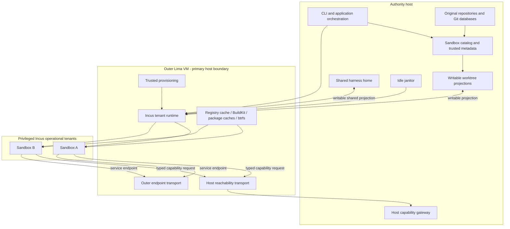

# Architecture Garden — Locki

Locki gives an AI coding session a host-side Git worktree and a root-capable Incus container inside one managed Lima VM. The implementation is compact, but its architecture is not reducible to “a Python CLI around a VM.” Its behavior depends on a split between trusted host custody and untrusted guest execution, writable filesystem projections, a policy-mediated path back to host Git and GitHub authority, deliberately shared credentials and caches, privileged provisioning, and observed-state cleanup.

This study decomposes those mechanisms by the laws they protect. It is also a portability study: a future Proxmox or Go implementation must preserve authority, identity, path, readiness, and lifecycle contracts rather than merely replace calls to `limactl`.

> [!summary]
> - Locki is a **split-plane sandbox coordinator**: the authority host owns Git metadata and host effects; the outer VM contains untrusted execution; selected writable projections and capabilities connect the planes.
> - One Lima VM plus many privileged Incus containers is a density and capability choice. The VM is the primary host-isolation boundary; containers are operational tenants inside one common compromise domain.
> - A sandbox is a distributed aggregate joined by `wt_id`, not a container record. Workspace, environment, projection, container, bridge, provisioning, endpoint, and operation states can fail independently.
> - `VMService` is a useful concentration of Lima calls, but not a complete portability interface. Mount semantics, host reachability, endpoint publication, path identity, and provisioning remain coupled outside it.
> - The host command bridge is a composition of guest adaptation, transport, principal binding, path resolution, policy evaluation, host effect execution, and audit. The current shared key is not bound to the requested sandbox identity.
> - Provisioning scripts are trusted root programs, not ordinary configuration. Existing containers have no desired/observed generation handshake, and the validated Phase-1 run produced a real partially configured container after a fatal connectivity probe.
> - Shared home, package caches, BuildKit, registry interception, and the VM kernel are explicit contamination domains. Their reuse improves speed while weakening cross-sandbox confidentiality, integrity, and availability.
> - The cleanup loop is an **idle janitor**, not a desired-state reconciler. Missing projected storage must not become deletion evidence without positive storage-health and ownership proof.

## Snapshot identity and evidence

| Field | Value |
|---|---|
| Repository | `/home/manuel/code/others/llms/locki` |
| Remote | `ssh://git@github.com/janpokorny/locki.git` |
| Branch | `main` |
| Commit | `0546b381005048418d9ff2622a47a3a67c982dc0` |
| Commit subject | `chore: update Mise` |
| Commit date | `2026-07-28T15:57:06+02:00` |
| Worktree | Clean |
| Package version | `0.0.27` |
| Runtime evidence | Nested Proxmox Phase-1 run recorded in the source ticket |

The source audit covered every Python command and service, both privileged provisioning scripts, the guest command shims, Git hook relay, packaged `AGENTS.md` command grammar, README, and the broad shell E2E suite. The crib-node experiment validated nested KVM, Lima startup, worktree projection, Incus execution, and host Git effects. It also supplied two concrete failures: host `/dev/kvm` permission denial and an ICMP-only connectivity probe that aborted container setup despite working HTTPS.

The runtime experiment did not establish a hostile cross-sandbox exploit, a direct PVE implementation, or formal clean-room equivalence. Those remain separate claims.

## The architecture in one diagram



The diagram intentionally shows several guest-to-host paths. Worktree edits and shared-home writes are direct host-file authority through projections. The capability gateway is the selected host-process path for `git`, `gh`, and `locki` effects. Network egress and service publication are separate capabilities. Calling all of them “the bridge” would erase the security model.

## The four governing laws

### 1. Host authority stays outside untrusted execution

The host owns original repository Git databases, trusted worktree metadata, host GitHub credentials, lifecycle credentials, and host effect execution. The outer VM receives writable worktree and sandbox-home projections, not the real home or original repository roots (`services/vm.py:147-161`; `services/worktree.py:168-190`).

The law is not “the guest cannot change the host.” It can change projected worktree and home bytes by design. The narrower law is:

> Untrusted execution receives only explicitly projected host bytes and explicitly mediated host effects; every additional capability must be named and tested.

### 2. Workspace mutation and host process authority are distinct

Editing a file in a worktree does not invoke a host process. Committing it does: the guest `git` shim serializes a request to the host daemon, which validates path shape and command grammar before starting host `git` (`container-setup.sh:148-180`; `cmd/internal.py:136-258`).

This distinction matters because filesystem confinement and command authorization fail differently. A safe rewrite must retain both boundaries.

### 3. Sandbox identity joins every owned resource

One `wt_id` appears in the worktree directory, branch suffix, trusted metadata directory, Incus container name, scoped-cache path, included worktrees, policy placeholders, and cleanup mapping (`worktree.py:43-103`; `container.py:14-19`). In the current implementation the relation is reconstructed from names. In a stronger implementation, names encode a validated domain identity; they do not define it.

For a sandbox ID $s$, let the owned-resource projection be:

$$
R(s)=\{W_s, M_s, B_s, C_s, K_s, I_s, E_s\}
$$

where $W$ is workspace, $M$ metadata, $B$ branch namespace, $C$ container, $K$ scoped cache, $I$ includes, and $E$ endpoint records. A destructive action is valid only when ownership evidence maps the target back to $s$.

### 4. Durable user work survives disposable infrastructure

A worktree may exist without a container or VM (`services/worktree.py:1-5`). `locki vm delete` is intended to preserve worktrees and shared home. Therefore environment/container state is reconstructable infrastructure while worktree changes and host Git refs are durable user work.

The safety law is:

$$
\operatorname{deleteInfrastructure}(s)\not\Rightarrow
\operatorname{deleteWorkspace}(s)\lor\operatorname{deleteBranches}(s).
$$

Branch deletion remains an explicit option. Infrastructure cleanup must never infer user-work deletion.

## Candidate common vocabulary

| Proposed term | Current Locki shape | Invariant |
|---|---|---|
| **Authority host** | CLI, original Git repositories, `WORKTREES_META`, daemon, host credentials | Trusted custody and effect execution remain outside untrusted agent execution. |
| **Outer environment** | one Lima Fedora VM | Primary host-isolation boundary and shared-fate domain. |
| **Operational tenant** | one privileged Incus container per sandbox | Separate rootfs/process namespace and `/tmp`; not hostile multi-tenant isolation. |
| **Workspace projection** | host worktree mounted through Lima then Incus at the same absolute path | Guest edits are host-visible while original Git metadata remains unprojected. |
| **Harness home** | one host-backed directory mounted as `/root` in every container | Cross-sandbox persistence and credential sharing are explicit. |
| **Sandbox join identity** | `wt_id` | Joins Git, runtime, policy, cache, include, endpoint, and cleanup ownership. |
| **Host capability gateway** | asyncssh daemon + resolver + grammar + subprocess execution | Selected host effects require authenticated identity, path binding, and policy authorization. |
| **Provider bundle** | Lima lifecycle + shell/copy + mounts + host alias + auto port publication | Portability requires compatible lifecycle, transport, projection, reachability, and publication capabilities. |
| **Provisioning generation** | absent in current VM/container setup | Running resources are ready only when target-specific desired generation and postconditions hold. |
| **Contamination domain** | shared home, caches, BuildKit, registry CA/cache, VM kernel | Reuse is explicit and must not be described as isolation. |
| **Endpoint exposure** | Incus proxy plus Lima host publication | Inner proxy, outer transport, bind scope, allocation, ownership, and teardown form one end-to-end object. |
| **Idle janitor** | daemon cleanup loop | Observed idleness and missing worktrees trigger best-effort stop/delete; no durable desired-state proof exists. |

> [!important] Vocabulary discipline
> A sandbox is not a container. A provider is not a lifecycle API. A writable projection is not a capability gateway. A shared directory is not a per-sandbox secret store. A running container is not a provisioned container. A missing path is not proof of deleted authoritative storage. A VMID is not ownership evidence.

## The sandbox is a product state, not one enum

The current implementation has no canonical sandbox record. It reconstructs a sandbox from worktree metadata, filesystem existence, Lima state, Incus instances/devices, shared home, daemon files, and cleanup timestamps. These axes can disagree.

A faithful observation is a product:

$$
S_s = W_s \times H_s \times V_s \times P_s^* \times C_s \times G_s
      \times Q_s \times E_s^* \times L_s,
$$

where:

- $W_s$ — workspace state;
- $H_s$ — workspace-storage health/mount identity;
- $V_s$ — outer-environment state;
- $P_s^*$ — a set of projections (workspace, home, optional cache);
- $C_s$ — container state;
- $G_s$ — gateway/link state;
- $Q_s$ — target-specific provisioning generations and receipts;
- $E_s^*$ — endpoint exposure records;
- $L_s$ — active operation lease.

This is not mathematical decoration. It names the exact class of failure observed in Phase 1: $C_s=\text{running}$ while the container provisioning component of $Q_s$ was incomplete.

### Current lifecycle

```text
resolve WorktreeInfo
 -> prepare shared home
 -> ensure Lima VM
 -> create worktree or repair branch suffix
 -> create/start Incus container; provision only when absent
 -> ensure host daemon and SSH config
 -> execute command
```

The short-lived CLI is the composition root (`cmd/exec.py:16-50`). The daemon is not the general orchestrator; it hosts the capability gateway and cleanup loop.

### Partial-state recovery

Current recovery is uneven:

- missing worktree metadata is pruned;
- orphan containers whose worktree device source disappeared are deleted;
- stopped containers restart;
- daemon version mismatch restarts the daemon;
- a container whose setup failed after creation is not reprovisioned;
- VM and container artifacts have no generation migration handshake.

The system already behaves like a partial-state coordinator. Making those states explicit would clarify rather than complicate it.

## Trust zones and explicit capabilities

| Zone/capability | Current evidence | Guarantee or non-guarantee |
|---|---|---|
| Host-private custody | Original repositories and `WORKTREES_META` stay outside declared VM mounts. | Positive host boundary, conditional on Lima/hypervisor/mount TCB. |
| Writable worktree projection | Lima mounts all Locki worktrees; Incus mounts one worktree into its container. | Assigned worktree content is directly mutable from guest. |
| Shared home | One host-backed source becomes every container's `/root`. | No cross-sandbox credential/config confidentiality or integrity. |
| Privileged container runtime | `security.privileged=true`, nesting, writable proc/sys, no dropped capabilities. | Operational separation only; one VM kernel/common compromise domain. |
| Shared acceleration | Cache root and BuildKit socket are writable from all containers. | No cross-sandbox cache integrity/availability boundary. |
| Host command effects | Shared SSH key, host resolver, package policy, host subprocess. | Command shape is deny-by-default; principal is not currently sandbox-bound. |
| Network egress | Incus bridge/NAT and unrestricted internet/LAN reach. | No exfiltration prevention. |
| Endpoint exposure | Incus `proxy` listener on VM plus Lima host forwarding. | Bind scope and port ownership depend on an implicit provider data plane. |

## Mathematical and computer-science foundations

### 1. Product state and non-flattening

Independent resource states form a product, not a linear lifecycle. A flattened state function

$$
f:S_s\to\{Absent,Stopped,Running\}
$$

loses information: multiple distinct states map to `Running`, including configured, stale, partially provisioned, bridge-degraded, or projection-failed containers. A safe orchestrator reasons over the components needed by each action and gates readiness on their postconditions.

### 2. Ownership as a partial function

Let resources be $r\in\mathcal R$ and sandbox identities be $s\in\mathcal S$. Ownership is a partial function:

$$
owner:\mathcal R\rightharpoonup\mathcal S.
$$

A destructive operation on $r$ requires $owner(r)=s$ plus a fenced operation lease. A pathname suffix or configured Proxmox VMID is evidence to validate, not the ownership function itself.

### 3. Filesystem projection as a path mapping

Lima currently realizes an identity mapping for worktrees:

$$
\phi_s:P_H\to P_G,\qquad \phi_s(p)=p.
$$

The host daemon accepts guest cwd as a host pathname because $\phi_s$ is identity in the reference deployment. A remote provider may implement a non-identity mapping. Then cwd, path-bearing argv, and Git-hook file arguments must cross as workspace-relative semantic paths and be translated explicitly:

$$
resolve_H(workspace,relativePath),\qquad resolve_G(workspace,relativePath).
$$

SSH transport does not define $\phi_s$.

### 4. Capability authorization relation

A valid host effect is not simply an allowed argv. It is a relation among principal, workspace, relative path, command intent, and policy:

$$
Authorize(p,w,d,c,\Pi)\in\{AuthorizedCommand,Deny\}.
$$

The current client key proves membership in the Locki guest population, while $w$ and sandbox ID are inferred from caller-supplied cwd. A stronger principal binds the credential to sandbox identity; the host resolves workspace-relative paths and emits an opaque `AuthorizedCommand` that alone can reach an effect executor.

### 5. Refinement by provider bundle

A concrete provider is a tuple:

$$
B=(L,T,P,R,O)
$$

with environment lifecycle $L$, guest transport $T$, projection provider $P$, host-reachability transport $R$, and outer endpoint transport $O$. It refines the abstract environment contract only if the tuple is compatible and passes shared conformance. Swapping $T$ from Lima shell to SSH does not establish $P$, $R$, or $O$.

### 6. Generation-stamped readiness

For provisioning target $t$, desired bundle generation $g_d(t)$ and verified observed generation $g_o(t)$ define readiness:

$$
Ready(t)\Rightarrow g_o(t)=g_d(t)\land postconditions(t,g_d(t)).
$$

Resource existence and process liveness are necessary observations but not readiness proofs.

### 7. Safety and liveness

Relevant safety laws include:

```text
unowned PVE resources are never mutated
original Git metadata is never guest-projected
host effects require authenticated and authorized command values
infrastructure deletion never implies branch/workspace deletion
missing unmounted storage never becomes deletion proof
endpoint bind scope never widens implicitly
```

Conditional liveness laws include:

```text
if provider calls terminate, an interrupted ensure eventually reaches ready or degraded
if callbacks/hooks terminate, a session eventually returns an exit status
if a resource remains idle and observations remain healthy, janitor policy eventually stops it
```

The current implementation does not prove all these laws. The point of naming them is to separate established behavior from target obligations.

## Implications for composable APIs

The decomposition suggests a small domain/application kernel rather than one provider-shaped service. Composition should preserve the laws above:

```text
CLI / presentation
 -> application use cases (enter, remove, include, expose, reconcile)
 -> domain ports
 -> in-tree adapters / validated provider bundle
```

Stable domain values include `SandboxID`, `WorkspaceID`, `OwnedEnvironmentRef`, `WorkspaceRelativePath`, `Principal`, `AuthorizedCommand`, `ProvisioningGeneration`, `ExposureID`, and `OperationLease`. Provider-specific status strings, `CompletedProcess`, spinner text, Lima paths, and Proxmox VMIDs do not enter the domain as authority.

The compositional rules are:

1. Application orchestration owns ordering and leases; transports never hide implicit start/readiness policy.
2. Runtime depends on `GuestTransport`, not a Lima implementation.
3. Provider bundle compatibility is validated before use; narrow ports are not arbitrary mix-and-match.
4. Policy evaluation cannot execute; host execution accepts only `AuthorizedCommand`.
5. Workspace/path translation is centralized and typed; hook administrative files use a separate ephemeral capability.
6. Provisioning readiness is target-specific and verified before dependent effects.
7. Repository configuration cannot select host-executable plugins, broader projections, or weaker mandatory policy.
8. External plugin protocols wait until Lima and a second bundle prove the common contract.

This is an API consequence of authority and state ownership, not a requirement to rewrite Locki in Go immediately.

## Correlation with the Pattern Zoos

The Pattern Zoos supply vocabulary for semantic identity, typed intent, scoped runtime, and authorization dominance. Locki supplies concrete OS/filesystem/virtualization evidence. These are correspondences, not equivalences.

| Locki finding | Zoo relation | Strength and boundary |
|---|---|---|
| One opaque `SandboxID` is encoded across workspace, runtime, policy, cache, and cleanup names. | [[Transcripts/Research/09 - RAG-MATHS Pattern Zoo#Pattern 1 — Semantic Identity as Explicit Projection|RAG 1 — Semantic Identity as Explicit Projection]] | **Non-equivalent.** RAG derives identity from a versioned projection of behavior-relevant fields; current Locki allocates a random join ID. The useful comparison is the need to define identity deliberately, not a shared identity law. |
| `SandboxID` plus subordinate `WorkspaceID` provide stable references used by several adapters. | [[Transcripts/Research/10 - PBUI-MATHS Pattern Zoo Handbook#Pattern 1 — Semantic Reference|PBUI 1 — Semantic Reference]] | **Adjacent.** Both separate semantic identity from individual representations, but Locki has no PBUI reference graph/coherence model and naming is not authorization. |
| Current guest shims serialize a shell-like cwd/exe/argv request; the target design replaces it with typed command intent interpreted by a host-owned effect boundary. | [[Transcripts/Research/10 - PBUI-MATHS Pattern Zoo Handbook#Pattern 5 — Command as Data|PBUI 5 — Command as Data]]; [[Transcripts/Research/10 - PBUI-MATHS Pattern Zoo Handbook#Pattern 8 — Serializable Semantic Contract|PBUI 8 — Serializable Semantic Contract]] | **Partial.** Host-owned interpretation exists, but current `shlex` strings are not yet the typed semantic contract described by the target design. |
| Host effects should be dominated by principal, ownership, path, trusted context, and policy authorization. | [[Transcripts/Research/09 - RAG-MATHS Pattern Zoo#Pattern 12 — Authorization Dominates Disclosure|RAG 12 — Authorization Dominates Disclosure]] | **Partial.** Current shared-key identity and pre-repair policy context leave domination incomplete. |
| One sandbox is a scoped product of worktree/runtime/gateway/generation/endpoint state. | [[Transcripts/Research/10 - PBUI-MATHS Pattern Zoo Handbook#Pattern 10 — Scoped Runtime and Context|PBUI 10 — Scoped Runtime and Context]] | **Adjacent.** Scope-indexed state corresponds structurally; Locki's privileged tenants and shared home/cache do not imply PBUI runtime isolation or hostile tenant isolation. |

## Cross-project comparison

| Project | Correspondence | Important non-equivalence |
|---|---|---|
| [[Research/Software Architecture Garden/devctl/README|devctl]] | Resource ownership, PID/start-token evidence, reconciliation, typed controller, plugin validation. | Locki currently reconstructs fewer desired-state records and uses a VM/container/filesystem aggregate rather than process attempts. Its cleanup is a janitor, not devctl-style reconciliation. |
| [[Research/Software Architecture Garden/go-go-goja/README|Go-Go-Goja]] | Runtime capabilities must be selected/validated before effects; registry membership is not authority. | Locki's provider tuple includes privileged infrastructure and filesystem projections, not JavaScript module registration. |
| [[Research/Software Architecture Garden/researchctl/README|Researchctl]] | Descriptors/requests cross a boundary before a host owns effects and evidence. | Locki's packaged command grammar authorizes selected host-user processes; it is not a typed experiment plan or evidence sink. |
| [[Research/Software Architecture Garden/go-go-datadrop/README|go-go-datadrop]] | Serializable intent is interpreted by a trusted host, and structural tests can protect architecture. | Locki's command bridge has OS/Git/GitHub authority and an authenticated transport boundary; DataDrop verbs are presentation operations. |
| [[Research/Software Architecture Garden/zitadel-go-test/README|zitadel-go-test]] | Authority must dominate every adapter and tenant boundary; negative cross-tenant tests matter. | Locki explicitly does not provide hostile isolation among privileged containers or shared credentials. |
| [[Research/Software Architecture Garden/flowkit/README|Flowkit]] | Version/generation markers prevent old infrastructure from being mistaken for current infrastructure. | Flowkit protects storage schema initialization; Locki needs target-specific root provisioning receipts and postcondition probes. |
| [[Research/Software Architecture Garden/sessionstream/designs/03 - Effect-Acknowledged State Machines and Runtime Refinement|Sessionstream runtime refinement]] | Existence/liveness must not be confused with acknowledged effect completion; concrete runtime state should refine an abstract machine. | Locki is a multi-resource orchestration product, not a single event/state reducer. |

These are correspondences, not equivalences. Locki should borrow vocabulary only where the invariant and authority model match.

## Trust tiers

Configuration authority follows its source. Current evidence already distinguishes user-only host execution (`ide_command`) from repository-selectable guest behavior (`ai_command`, `incus_image`) in `config.py:31-38,79-105`; the E2E suite tests that repo config cannot choose the host IDE command.

| Tier | Source | May select |
|---|---|---|
| Host administrator | protected system/user controller config | provider bundles, lifecycle credentials, projection roots, trusted provisioning, mandatory security policy |
| User | user Locki config | harness profile/command, editor, defaults, narrow endpoint policy |
| Repository | version-controlled `locki.toml` | guest image/spec and guest-side commands; never host plugins/effects, broader mounts, or security-policy weakening |
| Sandbox | authenticated runtime request | only sandbox-scoped operations already granted by core policy |

The boundary is emergent rather than fully encoded as a general framework. It is nevertheless substantive: lower-trust repository data must never load host-executable plugins, widen projections, broaden endpoint scope, or move credentials into a wider sharing domain.

## Maturity assessment

| Pattern or obligation | Maturity | Evidence / limitation |
|---|---|---|
| Split authority host and guest execution with writable projections | Established | README, VM mounts, worktree metadata split, E2E file synchronization, and Phase-1 deployment exercise important paths. |
| One outer VM with many privileged Incus operational tenants | Established | VM provisioning, default Incus profile, broad E2E suite, and Phase-1 deployment. It is a topology/cost choice, not hostile tenant isolation. |
| Sandbox identity joining workspace/runtime/policy/cleanup | Emergent | Naming joins concrete resources, but collision-safe validated identity and ownership records are implicit. |
| Grammar-mediated host Git/GitHub effect path | Emergent | Extensive grammar and E2E allow/deny tests exist; authenticated sandbox binding and trusted pre-policy context remain open. |
| Authenticated sandbox binding | Open correctness obligation | One shared key authenticates guest membership while requested cwd supplies sandbox scope. |
| Provider as a validated capability bundle | Emergent | Lima supplies the behavior implicitly; the five explicit ports and bundle validation do not yet exist. |
| Generation/postcondition-stamped provisioning readiness | Open correctness obligation | Container setup runs only on creation; Phase 1 produced a partially configured running container. |
| Shared harness home credential domain | Established | One writable source is intentionally mounted as every container's `/root`. |
| Shared acceleration contamination domain | Established | Shared cache/profile/build wiring and cross-sandbox reuse tests exist; isolation is intentionally absent. |
| Acceleration-independent semantic correctness | Open correctness obligation | Current tests prove reuse, not correctness under disabled/corrupt acceleration. |
| Git hook re-entry through the sandbox | Emergent | Concrete wrapper and E2E behavior exist; typed workspace/ephemeral path and cancellation contracts are implicit. |
| Endpoint exposure lifecycle | Emergent | Multi-hop publication exists, while atomic allocation, ownership, scope, and restore contracts are implicit. |
| Idle/orphan janitor | Architecture debt | Runtime loop stops/deletes resources without desired state, leases, storage-health fencing, or complete owned cleanup. |
| PVE-native provider | Open correctness obligation | PVE 8.4 and Phase-1 infrastructure exist, but controller/data placement and direct provider remain unresolved. |

## Design entries

### Split-plane sandbox aggregate and writable authority projections

[[Research/Software Architecture Garden/locki/designs/01 - Split-Plane Sandbox Aggregate and Writable Authority Projections|Split-Plane Sandbox Aggregate and Writable Authority Projections]] explains the primary trust topology: host custody, outer VM boundary, operational containers, direct writable projections, shared home, and explicit non-guarantees. It develops the product-state model and shows why “sandbox = container” is false.

### Sandbox identity joins workspace, runtime, policy, and cleanup

[[Research/Software Architecture Garden/locki/designs/02 - Sandbox Identity as a Join Across Workspace Runtime Policy and Cleanup|Sandbox Identity as a Join Across Workspace Runtime Policy and Cleanup]] studies `wt_id` as the aggregate join coordinate across worktrees, branch suffixes, metadata, includes, Incus instances, caches, policy placeholders, and cleanup. It records the need for validated identity and ownership evidence rather than filename slicing.

### Capability re-entry for host Git and collaboration effects

[[Research/Software Architecture Garden/locki/designs/03 - Capability Re-entry for Host Git and Collaboration Effects|Capability Re-entry for Host Git and Collaboration Effects]] decomposes the command bridge into its real security components. It distinguishes transport membership from sandbox identity, command shape from authorization, and direct worktree writes from host process effects.

### Deployment provider as a validated capability bundle

[[Research/Software Architecture Garden/locki/designs/04 - Deployment Provider as a Validated Capability Bundle|Deployment Provider as a Validated Capability Bundle]] identifies the hidden portability contract: lifecycle, guest transport, filesystem projection, host reachability, and endpoint transport must be compatible. It explains why an SSH backend cannot by itself replace Lima and why the Proxmox data-placement decision comes first.

### Readiness requires generation and verified postconditions

[[Research/Software Architecture Garden/locki/designs/05 - Readiness Requires Generation and Verified Postconditions|Readiness Requires Generation and Verified Postconditions]] uses the observed ICMP setup failure to show that existence and readiness differ. It treats privileged scripts as trusted versioned artifacts with receipts, phases, postconditions, migrations, and target-specific generation state.

### Shared harness home is an explicit credential domain

[[Research/Software Architecture Garden/locki/designs/06 - Shared Harness Home Is an Explicit Credential Domain|Shared Harness Home Is an Explicit Credential Domain]] separates durable cross-sandbox credentials and harness configuration from worktree custody and optional caches. Every credential or mutable harness artifact in a sharing scope is treated as readable, writable, and exfiltratable by every sandbox in that scope.

### Shared acceleration is an explicit contamination domain

[[Research/Software Architecture Garden/locki/designs/07 - Shared Acceleration Is an Explicit Contamination Domain|Shared Acceleration Is an Explicit Contamination Domain]] documents caches, registry interception, BuildKit, btrfs/bees, lazy installs, and their cross-sandbox integrity/availability implications. It preserves the performance value without rewriting sharing as isolation.

### Git hook re-entry across the sandbox boundary

[[Research/Software Architecture Garden/locki/designs/08 - Git Hook Re-entry Across the Sandbox Boundary|Git Hook Re-entry Across the Sandbox Boundary]] follows the recursive flow from guest Git to host Git to the trusted wrapper and back into the container. It records path transfer, ownership, recursion, cancellation, and conformance obligations.

### Endpoint exposure owns the whole publication path

[[Research/Software Architecture Garden/locki/designs/09 - Endpoint Exposure Owns the Whole Publication Path|Endpoint Exposure Owns the Whole Publication Path]] separates the provider's outer tunnel primitive from end-to-end exposure ownership: allocation, inner proxy, bind scope, advertised URL, observation, recovery, and teardown.

### Observed-state idle janitor is not desired-state reconciliation

[[Research/Software Architecture Garden/locki/designs/10 - Observed-State Idle Janitor Is Not Desired-State Reconciliation|Observed-State Idle Janitor Is Not Desired-State Reconciliation]] documents the current cleanup loop precisely and keeps its maturity honest. It distinguishes activity heuristics and orphan cleanup from ownership-fenced desired-state convergence.

## Candidate ecosystem patterns

> [!important] Comparison queue, not maturity promotion
> The following are hypotheses to compare across repositories. This heading does **not** promote the local Locki entries to the `Candidate ecosystem pattern` maturity label; the maturity table remains authoritative. Each item needs a precise comparison target and evidence that the same invariant—not merely similar code—travels.

1. **Separate authority custody, writable projection, and host effect invocation.** They are different capabilities with different enforcement and failure modes; compare with Researchctl/devctl host-owned effects without equating their objects.
2. **Model multi-resource sandboxes as product state.** Do not flatten workspace, infrastructure, projection, provisioning, and gateway states into one lifecycle enum; compare with Sessionstream runtime refinement without claiming one reducer.
3. **Make semantic identity the join; treat names as encodings.** Every destructive adapter verifies ownership independently; compare with devctl process incarnation and PBUI identity discipline.
4. **Bundle deployment capabilities that must be compatible.** Lifecycle, transport, projections, reachability, and publication can be narrow ports without becoming independently arbitrary choices; validation requires a second provider implementation.
5. **Treat privileged provisioning as versioned executable infrastructure.** Readiness requires target generation plus verified postconditions; compare with Flowkit initialization markers and Sessionstream generation fencing.
6. **Bind capability credentials to the principal whose authority is evaluated.** Shared membership credentials cannot establish per-tenant authorization; compare with zitadel-go-test's cross-layer authority tests.
7. **State contamination domains explicitly.** Shared credentials, kernels, caches, builders, and certificate authorities are not isolated merely because containers are named separately; compare with go-go-datadrop instance contamination without equating UI and security isolation.
8. **Require positive storage health before interpreting absence.** An unmounted projection is not evidence of deleted authoritative data; compare with devctl's contradiction-preserving reconciliation.
9. **Call a janitor a janitor until desired state, leases, ownership, and retryable plans exist.** Naming should not overstate correctness; devctl is the likely comparison target.
10. **Delay plugin protocols until two implementations prove commonality.** Extract ports and conformance first; compare with devctl/Go-Go-Goja admission rules while keeping host authority core.

## Architecture debt and open laws

1. Bind gateway authentication to sandbox identity and inject credentials outside shared home/worktrees/caches.
2. Restore/verify trusted `.git` and derive repository/remotes/stashes from host-owned workspace custody **before** contextual policy evaluation.
3. Represent cwd and worktree command/hook paths as typed workspace-relative values; represent declared Git administrative hook files (such as `COMMIT_EDITMSG`) as separate ephemeral capabilities, not workspace paths.
4. Add environment, container, and harness-home provisioning generations, receipts, and postcondition probes, with home verification preceding its projection/use.
5. Add operation leases so entry/removal/provisioning/hooks/endpoints cannot race janitor actions.
6. Distinguish healthy missing data from unavailable/unmounted projection state before cleanup.
7. Make PVE resource ownership stronger than a configured VMID and keep API credentials least-privileged/controller-only.
8. Separate machine policy artifacts from human `AGENTS.md` instructions and reject unknown placeholders.
9. Give endpoint exposure one owner across allocation, inner proxy, outer transport, bind scope, and teardown.
10. Add structured redacted audit for accepted host effects and retention/permission policy for denials.
11. Give daemon supervision an incarnation/start token rather than PID liveness plus version files alone.
12. Prove semantic behavior with acceleration disabled/corrupt and make scoped cache cleanup single-owned.
13. Extract backend-neutral conformance from the large Lima-specific E2E suite.

## Recommended next investigations

1. Freeze the reference behavior inventory and write domain/property tests for sandbox identity and durable-work preservation.
2. Prototype the Proxmox controller/data-plane Options B and C before implementing lifecycle APIs.
3. Add a typed `PathMap` to the Lima reference even when it maps paths identically.
4. Model and test per-sandbox gateway credentials, gateway identity pinning, revocation, and cross-sandbox denial.
5. Wrap existing provisioning scripts in manifests and record target generations without rewriting the scripts first.
6. Separate the endpoint-exposure service from inner Incus proxy and outer provider transport.
7. Compare the resulting Lima and Proxmox bundles before choosing any external plugin mechanism.

## Related studies

- [[Research/Software Architecture Garden/locki/Index of Design Patterns|Index of Design Patterns]] — back-of-the-book index, with companion [[Research/Software Architecture Garden/locki/Index of Design Patterns - Rationale|rationale]]
- [[Research/Software Architecture Garden/README|Software Architecture Garden]]
- [[Research/Software Architecture Garden/devctl/README|devctl architecture study]]
- [[Research/Software Architecture Garden/flowkit/README|Flowkit architecture study]]
- [[Research/Software Architecture Garden/go-go-goja/README|Go-Go-Goja architecture study]]
- [[Research/Software Architecture Garden/researchctl/README|Researchctl architecture study]]
- [[Research/Software Architecture Garden/zitadel-go-test/README|zitadel-go-test architecture study]]
- [[Research/Software Architecture Garden/sessionstream/designs/03 - Effect-Acknowledged State Machines and Runtime Refinement|Effect-Acknowledged State Machines and Runtime Refinement]]
- [[Research/Software Architecture Garden/locki/designs/01 - Split-Plane Sandbox Aggregate and Writable Authority Projections]]
- [[Research/Software Architecture Garden/locki/designs/02 - Sandbox Identity as a Join Across Workspace Runtime Policy and Cleanup]]
- [[Research/Software Architecture Garden/locki/designs/03 - Capability Re-entry for Host Git and Collaboration Effects]]
- [[Research/Software Architecture Garden/locki/designs/04 - Deployment Provider as a Validated Capability Bundle]]
- [[Research/Software Architecture Garden/locki/designs/05 - Readiness Requires Generation and Verified Postconditions]]
- [[Research/Software Architecture Garden/locki/designs/06 - Shared Harness Home Is an Explicit Credential Domain]]
- [[Research/Software Architecture Garden/locki/designs/07 - Shared Acceleration Is an Explicit Contamination Domain]]
- [[Research/Software Architecture Garden/locki/designs/08 - Git Hook Re-entry Across the Sandbox Boundary]]
- [[Research/Software Architecture Garden/locki/designs/09 - Endpoint Exposure Owns the Whole Publication Path]]
- [[Research/Software Architecture Garden/locki/designs/10 - Observed-State Idle Janitor Is Not Desired-State Reconciliation]]
