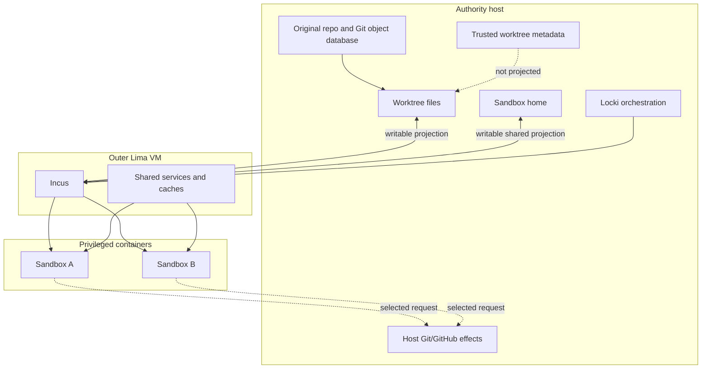

# Split-Plane Sandbox Aggregate and Writable Authority Projections

Locki separates trusted host custody from untrusted agent execution without pretending that the boundary is impermeable. The authority host owns original Git databases, trusted worktree metadata, host credentials, and host effects. One outer VM contains root-capable workloads. Writable worktree and sandbox-home projections deliberately carry selected host bytes into that VM and back.

> [!summary]
> - The outer VM is the primary host-isolation boundary; privileged Incus containers are operational tenants inside one common VM trust domain.
> - Worktree and shared-home projections are direct writable host-file capabilities, not observations and not part of the host command bridge.
> - A sandbox is a distributed aggregate whose workspace, VM, projections, container, gateway, provisioning, and endpoints can fail independently.
> - Durable user work survives VM/container deletion; infrastructure cleanup must not imply workspace or branch deletion.
> - The pattern protects the host from broad guest authority. It does not provide exfiltration prevention or mutually hostile tenant isolation.

## Why this note exists

The simple description of Locki is “one worktree and one container per AI session.” That description hides the architecture. A worktree lives on the authority host, the container lives two layers away, and the two are joined by writable mounts. Git metadata is deliberately split: the guest sees the worktree `.git` pointer, while the trusted copy and original Git database stay on the host. Every container also receives one shared sandbox home as `/root`.

A port that treats the container as the sandbox record or treats mounts as implementation details can lose user work, expose additional host paths, or misclassify shared credentials as tenant-private. This design names the actual aggregate and its trust topology.

## Pattern statement

> **Keep trusted custody and effect authority on an authority plane; run untrusted work behind an outer isolation boundary; project only explicitly named writable data planes; model the sandbox as the product of independently observed resources; and preserve durable user work when disposable infrastructure is removed.**

The pattern has two coupled parts:

1. **split authority:** host custody/effects versus guest execution;
2. **explicit writable projections:** selected host bytes cross the boundary with declared mutability and sharing scope.

The outer VM is not an implementation convenience. It is the boundary that keeps privileged containers, nested workloads, shared cache services, and root provisioning away from the host OS.

## Concrete architecture



`VMService.ensure_running` constructs two Lima mounts: the full `WORKTREES` root at the same path and `SANDBOX_HOME` at `/root/.locki/home` (`services/vm.py:147-161`). `vm-setup.sh` then makes that home source the default Incus profile's `/root` device and makes `/var/cache/locki` common to every container (`data/vm-setup.sh:69-76`). `ContainerService.ensure_running` adds only the selected worktree path as a disk device in one container (`services/container.py:183-198`).

The outer VM can see all Locki worktrees and the shared home. An ordinary container receives its own worktree plus shared home/cache, but the container profile is privileged and nesting-enabled (`vm-setup.sh:34-68`). This is a useful operational partition, not a hostile-tenant security boundary.

## The sandbox aggregate

A correct model separates resource axes:

```text
SandboxObservation = (
    workspace,
    workspaceStorageHealth,
    environment,
    projections[],
    harnessHome,
    container,
    gateway,
    provisioningGenerations,
    endpoints[],
    activeOperationLease
)
```

The current source reconstructs these values from filesystem state, `WORKTREES_META`, Lima status, Incus lists/devices, daemon PID/port/version files, and cleanup timestamps. There is no transaction joining them.

The product model explains states that a single enum cannot:

```text
workspace ready + VM absent
workspace dirty + container stopped
VM running + worktree projection stale
container running + container provisioning incomplete
gateway stale + container otherwise ready
shared storage unmounted + metadata still authoritative
```

The Phase-1 ICMP failure produced the fourth state directly: the Incus container existed and ran, but `container-setup.sh` terminated before completion.

## Ownership and durability classes

| Resource | Authority | Durability | Guest visibility |
|---|---|---|---|
| Original Git repository and object database | host user/Git | authoritative | not projected |
| Worktree files | workspace subsystem | authoritative user work | writable in assigned container |
| Trusted `.git` pointer copy, hooks, excludes | host workspace subsystem | authoritative security metadata | not projected |
| Shared sandbox home | harness-home subsystem | durable shared mutable state | writable in every container |
| Lima VM/disk | environment provider | reconstructable infrastructure | contains all tenants/services |
| Incus container/rootfs | tenant runtime | reconstructable infrastructure | one operational tenant |
| Shared/scoped caches | acceleration subsystem | disposable optimization | writable from tenants |
| Host bridge key/policy/audit | capability gateway | security state/evidence | only selected client material projected |

The classification determines deletion semantics. Infrastructure may be recreated. Worktree bytes and branches require explicit user-facing removal policy.

## Behavioral contract

### Established reference behavior

```text
A1. Original repositories and the real host home are not declared VM mounts.
A2. Worktree edits are visible on the authority host without a copy/sync step.
A3. Trusted worktree metadata remains outside the guest projection.
A4. One worktree can survive container and outer-VM deletion.
A5. Shared sandbox home survives container deletion and is visible to every sandbox.
A6. Each container has a separate rootfs/process namespace and /tmp.
A7. Every container shares the outer VM kernel and selected shared services.
```

### Required target behavior

```text
T1. Every projection declares host root, guest root, mutability, sharing scope, and filesystem semantics.
T2. Projection health is distinct from file absence.
T3. Infrastructure deletion cannot imply workspace/branch deletion.
T4. Destructive actions require ownership evidence and an operation lease.
T5. Readiness is evaluated from the necessary state axes, not a flattened status.
T6. Shared-home and shared-cache scope is explicit in UI/config/documentation.
```

### Non-guarantees

The pattern does not guarantee:

- confidentiality of sandbox credentials from other sandboxes;
- cache integrity or availability between sandboxes;
- protection from a privileged-container escape into the shared VM;
- protection of projected worktree/home bytes from a compromised VM;
- network egress control or secret exfiltration prevention;
- atomic consistency among Git, files, Lima, Incus, and daemon state.

## Mathematical foundations

Let the authority-host state be $H$, the outer-environment state be $V$, and tenant states be $C_i$. Let writable projections be partial maps:

$$
\pi_W:H\rightharpoonup V,
\qquad
\pi_i:V\rightharpoonup C_i.
$$

The host boundary does not require $\pi_W$ to be read-only. It requires the domain of $\pi_W$ to be explicit and smaller than all host state:

$$
\operatorname{dom}(\pi_W)=\{WORKTREES,SANDBOX\_HOME\}
\subsetneq H.
$$

A security review asks both what is excluded and what is deliberately writable. “Inside a VM” is insufficient without the projection domain.

The global runtime is a product:

$$
G=H\times V\times\prod_i C_i.
$$

Tenant noninterference does not follow from the product because tenants share components of $V$ and projected home/cache state. The honest law is host confinement under the outer boundary, not tenant independence.

## Design-pattern vocabulary

- **Bulkhead / isolation boundary:** the outer VM limits guest compromise relative to the host.
- **Projection / shared filesystem:** selected host state is made directly writable at another execution layer.
- **Aggregate with distributed state:** one logical sandbox is reconstructed across several resources.
- **Ports and adapters:** future provider implementations must preserve projection and execution contracts.
- **Capability security:** mounts, network, devices, and host effects are explicit authorities.
- **Disposable infrastructure / durable data separation:** environments and containers may be rebuilt while worktrees persist.

No single label is sufficient. “VM sandbox” misses the distributed aggregate; “container sandbox” overstates tenant isolation; “mounted worktree” misses host effect authority.

## Why obvious alternatives are wrong

### One VM per sandbox

It strengthens tenant separation but abandons Locki's density, shared caches, BuildKit, and cheap startup. It is a different product topology, not a direct port.

### Container-only isolation on the authority host

Privileged nested containers and Docker/Kubernetes workloads would share the authority-host kernel. The outer VM is what protects host OS/files beyond the explicitly projected roots.

### Copy/sync workspaces instead of projecting them

Replication introduces a second authority, merge/conflict semantics, latency, and crash recovery. It can be a valid design, but it is not behaviorally equivalent to immediate writable projection.

### Treat shared home as tenant state

Every container receives the same source as `/root`. Describing it as per-sandbox state creates false confidentiality and migration assumptions.

### Flatten state to `running`

It hides projection failure, stale provisioning, gateway failure, and storage unavailability. The observed Phase-1 partial setup is the counterexample.

## Failure modes and tricky details

1. **Partial provisioning:** container existence caused later ensure calls to skip setup after a fatal script failure.
2. **Transient mount loss:** future NFS/virtiofs unavailability can look like deleted worktree data; current pruning/deletion logic uses path absence.
3. **Shared credential mutation:** one sandbox can modify shared harness settings or credentials used by every sandbox.
4. **Shared VM compromise:** privileged containers and devices widen the common kernel attack surface.
5. **Path identity assumptions:** Lima maps paths identically; a remote provider may not.
6. **User-work deletion:** cleanup/removal ordering must never infer branch deletion from runtime state.

## Testing and verification

- Assert only intended host roots appear in provider projection plans.
- Run file coherence tests across host, outer VM, and selected container.
- Verify original Git database and trusted metadata are unreachable from ordinary guest paths.
- Verify worktrees/home survive VM deletion and recreation.
- Inject projection unavailability and prove metadata/container deletion does not occur.
- Test every aggregate-state combination relevant to entry/removal/readiness.
- Run cross-sandbox tests for home/cache visibility and document expected sharing.
- Treat privileged-container escape resistance as hypervisor/kernel hardening, not an application unit test.

## Applicability

Use this pattern when untrusted or failure-prone tooling needs a rich Linux environment, direct workspace edits, and selected host integrations, while the host OS and original repository metadata must remain outside broad guest authority.

Do not use the exact topology for mutually hostile customers, credentials requiring per-tenant confidentiality, workloads requiring egress prevention, or systems where shared privileged containers are unacceptable.

## Candidate ecosystem guidance

1. Define the authority plane before selecting virtualization technology.
2. Inventory writable projections as capabilities.
3. Keep trusted metadata outside the projected workspace.
4. Model resource axes independently and derive readiness.
5. Separate durable user work from reconstructable infrastructure.
6. State shared-fate and contamination domains explicitly.
7. Never infer deletion from missing projected paths without storage-health evidence.

## Open questions

- Should future Locki default to per-sandbox home overlays with explicit shared credentials?
- Is protection from malfunctioning agents sufficient, or is malicious cross-sandbox isolation required?
- Which filesystem semantics are normative for a PVE provider?
- Should the outer VM see the entire worktree root or only active projections?
- What recovery record should join desired and observed resources?

## Evidence and references

- `src/locki/cmd/exec.py:16-50` — actual composition root and entry order.
- `src/locki/services/vm.py:124-185` — Lima VM and writable projections.
- `src/locki/services/container.py:162-261` — Incus tenant creation/provisioning/exec.
- `src/locki/services/worktree.py:1-5,129-256,379-439` — durable workspace and metadata.
- `src/locki/services/home.py:18-115` — shared home and transcripts.
- `src/locki/data/vm-setup.sh:13-76` — privileged Incus profile and shared devices.
- `README.md:72-161` — intended path/security/topology claims.
- `test/e2e.sh` — file projection, container `/tmp`, cache, and lifecycle evidence.
- [[Research/Software Architecture Garden/locki/README|Architecture Garden — Locki]]
