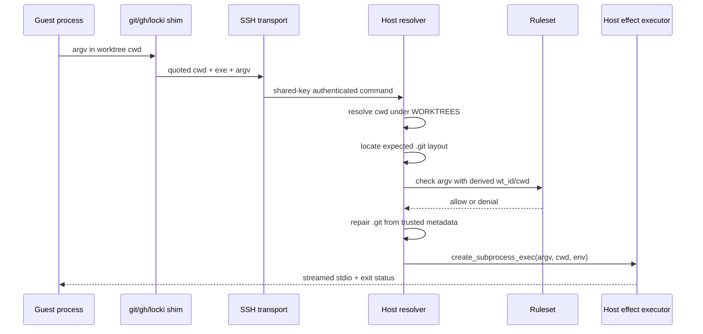

# Capability Re-entry for Host Git and Collaboration Effects

A Locki sandbox can edit projected worktree bytes directly, but it cannot reach the original Git database or host GitHub credential. Selected `git`, `gh`, and `locki` operations re-enter the host through an SSH forced-command service. The reusable idea is not “use SSH.” It is to translate a guest request into a narrowly authorized host effect while keeping transport, identity, path binding, policy, execution, and audit distinct.

> [!summary]
> - The guest shim is an adapter, not an enforcement point; root can invoke the transport directly.
> - The host resolver checks the worktree layout, derives policy context, evaluates a deny-by-default grammar, repairs the projected `.git` pointer, and executes argv without a shell.
> - Current authentication proves possession of one shared Locki client key, not which sandbox is calling. Sandbox scope is derived from caller-supplied cwd.
> - A safe gateway binds a per-sandbox principal to `SandboxID`, `WorkspaceID`, relative cwd, typed path arguments, and an opaque `AuthorizedCommand`.
> - Git, GitHub, and Locki-control effects use different authorities and need effect-specific policy and audit.
> - Trusted `.git` context must be restored or resolved from host custody before policy placeholders consult repository, remote, or stash state.

## Why this note exists

The README says agents can perform safe Git operations while the original `.git` directory remains out of reach. That behavior is one of Locki's defining features. It is also easy to overstate. The command grammar is only one part of the boundary, and loopback binding does not establish per-sandbox identity.

A port must preserve the entire authorization path. Replacing the SSH hop without modeling principal, workspace, path, and effect authority would retain connectivity while losing the security claim.

## Pattern statement

> **A host effect executes only from an authenticated principal bound to the same sandbox/workspace, a workspace-relative typed command intent confined through a validated path map, and a deny-by-default policy decision that yields an opaque authorization value. Raw command strings cannot reach the executor.**

The current implementation is an emergent form of this pattern. It has strong path/grammar enforcement and broad E2E allow/deny coverage. It does not bind the shared client key to the sandbox identity inferred from the request.

## Concrete request path



The generated guest shim lives in `container-setup.sh:148-180`. It bridges `git`, `gh`, and `locki` only under `LOCKI_WORKTREES_HOME`; selected local `git clone` behavior is deliberately kept inside the container. The SSH config uses the client key from shared `/root/.ssh`, disables host-key checking, and targets `host.lima.internal` (`data/locki-ssh-config`).

The host daemon binds asyncssh to `127.0.0.1`, disables SCP/agent/X11 forwarding, and accepts the generated public key (`cmd/internal.py:216-279`). Lima's host alias makes that loopback service reachable from the VM/container network.

## The bridge is six responsibilities

### Guest invocation adapter

Chooses whether to bridge and serializes the request. It is bypassable and carries no security proof.

### Reachability transport

Carries bytes from guest/container network to host loopback. Provider-specific connectivity is not principal identity.

### Principal and credential lifecycle

Authenticates the sandbox capability, pins/authenticates the gateway, injects private material outside shared state, rotates/revokes credentials, and yields `Principal{SandboxID, CredentialID}`.

### Workspace/path binding

Maps `WorkspaceID + relative cwd + WorkspacePath arguments` to host paths under host-owned workspace roots. Absolute guest paths do not become host authority.

### Policy decision

Parses trusted rules, resolves context placeholders, and returns an opaque `AuthorizedCommand` or structured denial.

### Effect execution and audit

Runs only opaque authorized effects through Git, GitHub, or Locki-control adapters; emits redacted evidence of decision and outcome.

The current source combines several of these responsibilities in `_resolve_bridged` and `internal_daemon`. Decomposition is a target contract, not a claim that six packages already exist.

## Policy shape

`Ruleset.from_markdown` scans `locki-bridged-command-filter` fences in packaged `AGENTS.md`. A Lark grammar builds sequences, alternatives, optional groups, flags, repeated terminal arguments, and placeholders (`bridge.py:193-265,394-424`). `Ruleset.check` selects one- or two-word command prefixes, splits flags and positionals, and accepts only if one rule consumes every effective flag and positional (`bridge.py:426-458`).

Dynamic placeholders bind policy to context:

- `<wt-id>` — sandbox suffix;
- `<owner>` / `<repo>` — current GitHub repository;
- `<owned-stash-ref>` — stash messages carrying the sandbox suffix;
- `<remote>` — configured remotes;
- `<number>` — numeric values.

Unknown placeholders currently degrade to `.+?` (`bridge.py:160-183`). A target policy compiler should reject unknown placeholders so a spelling error cannot broaden authority.

## Trusted policy context must precede evaluation

The current resolver calls `_ruleset().check(...)` before repairing the projected `.git` pointer (`internal.py:178-193`). During policy evaluation, `<owner>`, `<repo>`, `<owned-stash-ref>`, and `<remote>` execute host `gh`/`git` commands in the requested cwd (`bridge.py:132-158`). At that moment the `.git` file is guest-writable.

A sandbox can therefore point `.git` at a fabricated guest-writable Git directory, influence repository/remote/stash context used by policy, obtain authorization under that fabricated context, and then have the accepted argv execute after Locki restores the real pointer. Per-sandbox authentication alone does not repair this ordering defect.

The target order is:

```text
bind Principal + WorkspaceID
 -> resolve host-owned repository/worktree custody
 -> repair/verify projected .git pointer
 -> derive repo/remotes/stashes from host-owned custody
 -> evaluate typed command policy
 -> produce AuthorizedCommand
 -> execute without re-deriving ambient policy context
```

Policy context must be an explicit host-owned value, not subprocess output reached through untrusted projected metadata.

## Authenticated sandbox binding

Current key custody is:

```text
SANDBOX_HOME/.ssh/id_locki
    -> mounted as /root/.ssh/id_locki in every container
    -> public key copied to host authorized_keys
```

Every container can use the same private key. The request's first word is an absolute cwd. `_resolve_bridged` resolves that path under `WORKTREES`, extracts the directory suffix, and uses it as policy `wt_id` (`internal.py:136-178`).

Therefore the implementation proves:

```text
caller possesses the Locki guest key
requested cwd is a real Locki worktree path
argv matches policy for the ID derived from that path
```

It does not prove:

```text
caller is the container that owns the requested cwd/ID
```

A sandbox that learns another valid worktree path can construct a raw SSH request naming it. This is a source-established identity-binding gap; no exploit was run.

The target request is semantic:

```go
type CommandRequest struct {
    Principal   Principal
    WorkspaceID WorkspaceID
    RelativeCWD WorkspaceRelativePath
    Command     CommandIntent
    RequestID   string
}
```

Private credentials are injected through a per-container secret/device outside shared home, worktrees, and caches. The guest pins the gateway server or uses mutual authentication. Rotation/revocation follows sandbox lifecycle.

## Path-bearing command intent

An opaque `[]string` is insufficient under non-identity host/guest roots because arguments may themselves be paths. The policy schema must mark literals, flags, arbitrary values, refs, and workspace paths separately.

```text
CommandIntent
  command: git
  subcommand: add
  args:
    - WorkspacePath("src/main.go")
    - WorkspacePath("README.md")
```

The policy validates that each `WorkspacePath` is relative and confined. The host executor resolves it under the host workspace. This also supplies the path contract needed by Git-hook re-entry.

## Behavioral contract

```text
G1. Transport reachability does not grant effect authority.
G2. Every accepted request has a gateway-authenticated sandbox principal.
G3. Principal SandboxID matches the owner of WorkspaceID.
G4. Cwd and path-bearing arguments are workspace-relative and confined.
G5. Trusted .git/repository context is established before any contextual policy lookup.
G6. Policy is deny-by-default and consumes the complete typed intent.
G7. Unknown policy placeholders fail compilation.
G8. Only an opaque AuthorizedCommand can invoke an effect executor.
G9. Host execution uses argv, not an injected shell command.
G10. Git, GitHub, and Locki-control authority are audited separately.
G11. Credential revocation prevents later requests from a removed sandbox.
```

The reference strongly establishes deny-by-default complete-form matching and shell-free execution. Authenticated sandbox binding, trusted pre-policy context, typed path values, opaque authorization, audit, and revocation remain open or target obligations.

## Mathematical foundations

Authorization is a relation:

$$
A(p,w,d,c,\Pi)\in\{allow,deny\},
$$

where $p$ is authenticated principal, $w$ workspace, $d$ relative cwd, $c$ typed intent, and $\Pi$ trusted policy. An effect is executable only when:

$$
A(p,w,d,c,\Pi)=allow
\land owner(w)=p.sandbox
\land validPathMap(w,d,c.paths).
$$

The opaque authorization value turns the proof obligation into a type boundary:

$$
Authorize(...)\to AuthorizedCommand,
\qquad
Execute:AuthorizedCommand\to Result.
$$

This does not prove the semantic safety of every allowed Git/GitHub operation. It establishes that execution is dominated by the declared checks.

## Pattern vocabulary

- **Reference Monitor:** every selected host effect passes one mediation path.
- **Policy Decision / Enforcement Point:** grammar/context decides; executor performs.
- **Capability:** sandbox-bound credential plus authorized effect value.
- **Anti-Corruption Layer:** guest intent is translated into host-owned effect types.
- **Command as Data:** argv/path/ref intent is serialized, not callbacks or ambient authority.
- **Least Authority:** Git, GitHub, and control effects expose different grants.
- **Audit Boundary:** accepted/denied outcomes become structured evidence.

## Why tempting alternatives are wrong

### Trust cwd because it is under WORKTREES

Cwd validates target shape, not caller identity. A principal can claim another valid path.

### Put one private key per sandbox in shared home

Every sandbox can read every key in the shared directory. Secret placement must itself be per-container.

### Treat loopback as authorization

Loopback limits network exposure. Any process with a route and accepted key still needs principal/tenant authorization.

### Let plugins implement policy or host execution

Unreviewed plugin code at the host authority boundary defeats auditability. Transport may vary; mandatory policy and executors remain core/in-tree.

### Keep policy only in human AGENTS.md

Co-location is convenient, but an instructional edit changes host authority. Version policy separately and generate/verify documentation.

## Failure modes and tricky details

1. Shared key plus caller-selected cwd creates cross-sandbox authority confusion.
2. Disabled host-key checking permits gateway impersonation if the transport path is compromised.
3. Unknown placeholders become broad regex values.
4. Full denied argv is durably logged and can contain secrets.
5. Accepted remote GitHub effects lack structured audit.
6. Contextual policy lookups currently run before trusted `.git` repair and can consult attacker-controlled Git metadata.
7. Path validation followed by later pathname execution has a TOCTOU surface; stable root handles/openat-style confinement deserves review.
8. Policy safety depends on Git/GitHub client semantics, not grammar matching alone.

## Testing and verification

- Cross-sandbox negative: principal A cannot name workspace B.
- Forged/mismatched/revoked principal rejection.
- Gateway server-authentication failure.
- Property tests for every policy form, duplicate flags, unknown placeholders, and path escape.
- Tampered `.git` negative tests for `<owner>/<repo>`, `<remote>`, and `<owned-stash-ref>`; authorization context must remain host-owned.
- Prove raw command values cannot call executors.
- Test non-identity `PathMap` for cwd and argv paths.
- Redaction tests for accepted/denied audit.
- Mutation-test bypasses: shared principal, unchecked absolute path, raw executor call, unknown placeholder.
- Run existing E2E allow/deny scenarios as reference compatibility.

## Applicability

Use this pattern when sandboxed tools need selected effects under a more privileged user/process authority: VCS, issue/PR workflows, signing, deployment requests, or controlled local orchestration.

Do not use it to grant arbitrary shell execution, to hide a broad ambient credential behind a shallow allowlist, or as a substitute for filesystem/network confinement.

## Candidate ecosystem guidance

1. Authenticate the same scope you authorize.
2. Carry semantic IDs and relative paths, not ambient absolute paths.
3. Separate connectivity from principal identity.
4. Compile policy into opaque executable authority.
5. Keep host effect adapters in the trusted core.
6. Audit effect class/outcome with redaction.
7. Test cross-tenant negatives directly.

## Open questions

- SSH certificates, per-sandbox keys, or a purpose-built local protocol?
- How should Git pathspecs be represented without reimplementing Git parsing?
- Which accepted GitHub effects require human confirmation?
- What audit fields provide accountability without leaking content?
- Can stable directory handles remove the remaining path race portably?

## Evidence and references

- `src/locki/data/container-setup.sh:148-180,528-535`
- `src/locki/data/locki-ssh-config`
- `src/locki/services/daemon.py:20-71`
- `src/locki/cmd/internal.py:129-200,203-309`
- `src/locki/services/bridge.py:17-458`
- `src/locki/data/AGENTS.md:17-118`
- `test/e2e.sh:166-259` — command allow/deny evidence.
- [[Research/Software Architecture Garden/locki/README|Architecture Garden — Locki]]
- [[Research/Software Architecture Garden/researchctl/README|Researchctl architecture study]]
