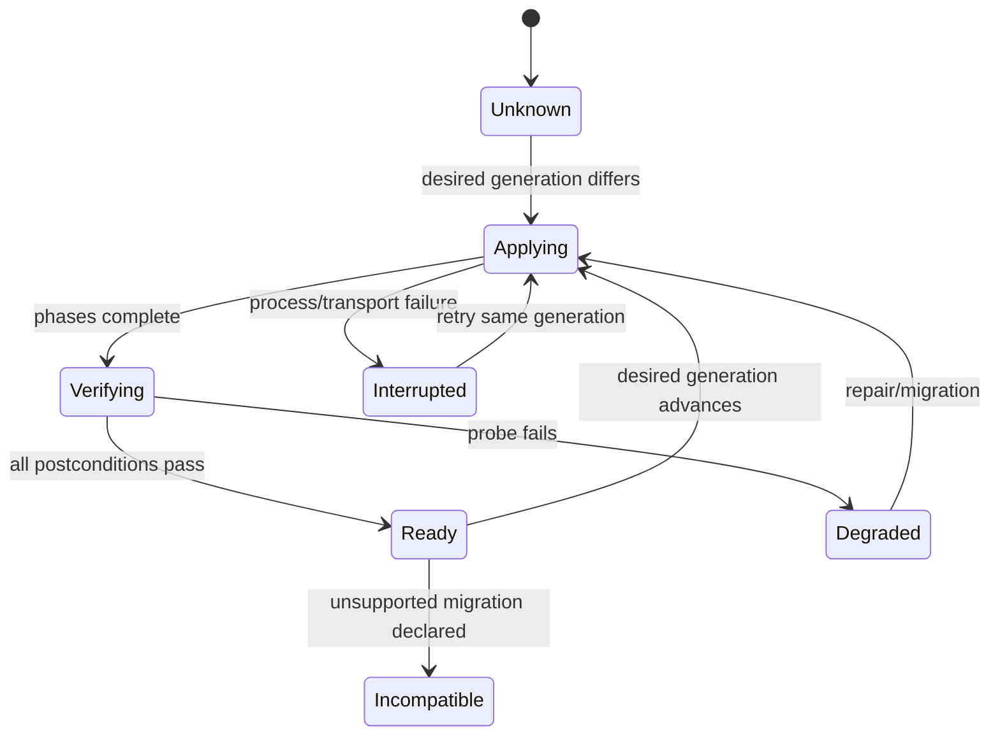

# Readiness Requires Generation and Verified Postconditions

Locki provisions the outer VM and each container with large privileged shell programs. Today those programs run mainly at resource creation. A container that exists is treated as provisioned, even if setup failed halfway or the installed package later changed. The Phase-1 crib run produced exactly that state: an Incus container was running while `container-setup.sh` had exited 124 at a fatal ICMP probe.

> [!summary]
> - Resource existence, power state, and process liveness do not prove provisioning readiness.
> - Environment, container, and harness-home targets need independent desired/observed generations and receipts.
> - Provisioning scripts are trusted root executables with OS/capability assumptions; they are not harmless templates or ordinary config.
> - Readiness requires generation equality plus verified postconditions.
> - Preserve existing scripts initially; add manifests, phase markers, probes, and migrations before considering a rewrite.

## Why this note exists

`VMService.ensure_running` returns early when Lima reports `Running`. `ContainerService.ensure_running` starts an existing container and only pipes `container-setup.sh` when the name was absent (`vm.py:124-185`; `container.py:162-226`). The daemon alone has a package-version handshake that restarts it when code changes (`services/daemon.py:37-64`).

This asymmetry means host policy can update while old guest shims, trust roots, networking, and tools persist indefinitely. It also means a failed first setup can become a durable degraded state without a readiness marker.

## Pattern statement

> **For each provisioning target, readiness holds only when the observed bundle digest/generation equals the desired digest/generation and every declared postcondition passes. Record phase receipts so interrupted effects can resume or fail explicitly; do not infer readiness from existence or liveness.**

For target $t$:

$$
Ready(t)\Rightarrow
g_o(t)=g_d(t)\land Verify(t,g_d(t))=pass.
$$

Targets are independent:

```text
environment generation
container generation per SandboxID
harness-home generation per sharing scope
```

A current environment and interrupted container setup must be representable simultaneously.

## Current provisioning artifacts

### Outer environment bundle

`vm-setup.sh`:

- installs Incus/btrfs packages and configures subordinate IDs;
- initializes a btrfs Incus pool and fixed `10.99.0.0/24` bridge;
- creates a privileged, nesting-enabled default profile;
- projects shared cache/home and selected devices;
- generates a private CA and TLS interception/cache configuration;
- installs nginx, BuildKit, and bees/systemd services.

It assumes Fedora/dnf, systemd, root, btrfs, Incus, SELinux helpers, fixed networking, and projected home availability.

### Container bundle

`container-setup.sh`:

- writes AI instructions and harness configuration;
- installs high/low priority shims and lazy installers;
- configures tool/package caches and Docker/BuildKit routing;
- installs/updates CA trust and `/etc/hosts` interception;
- hard-codes `host.lima.internal` addressing;
- performs the fatal ICMP connectivity wait;
- preinstalls selected tools.

These are root effects defining the guest TCB. Classifying them as “config” would hide their authority and migration obligations.

## Observed failure

On the crib topology, ICMP to `connectivitycheck.gstatic.com` was filtered while HTTPS worked. Under `set -e`, this command exited 124:

```sh
timeout 30s sh -c 'while ! ping -c1 -W1 connectivitycheck.gstatic.com >/dev/null 2>&1; do sleep 1; done'
```

The container had already been created and started. A later ensure saw the name and skipped setup. Lazy shims made parts of the environment usable, but that recovery was accidental and did not prove the full bundle.

This is direct evidence for:

```text
container exists != provisioning completed
container runs   != desired bundle is installed
```

## Target bundle and receipts

```go
type ProvisioningBundle struct {
    ID                   string
    Generation           uint64
    Digest               Digest
    Target               ProvisioningTarget
    RequiredCapabilities []Capability
    Phases               []ProvisioningPhase
    Postconditions       []Probe
    IrreversibleEffects  []string
}

type Receipt struct {
    Target       ProvisioningTargetRef
    BundleID     string
    Generation   uint64
    Digest       Digest
    Phase        string
    Status       PhaseStatus
    StartedAt    time.Time
    CompletedAt  *time.Time
    Evidence     []ProbeResult
}
```

Receipts are keyed by target and bundle identity. They do not assert scientific proof or transactional rollback; they record which privileged effects were attempted and which postconditions were observed.

## Orchestration order

```text
ensure/verify requested harness-home scope and generation
ensure environment existence/power/ownership
ensure projection prerequisites for that verified home/workspace
apply/verify environment bundle
ensure container instance existence/power
apply/verify container bundle
recheck harness-home/projection postconditions
issue gateway capability and verify reachability
mark sandbox ready
```

Application orchestration calls `ProvisioningEngine`. Harness-home verification is a prerequisite because outer provisioning installs the projected home as each container's `/root`, and container setup writes credentials/configuration there. A later postcondition recheck detects drift but cannot replace the prerequisite. Lifecycle/runtime adapters do not hide provisioning or declare readiness themselves.

## Phases and postconditions

Useful phases for the outer bundle:

```text
platform prerequisites
Incus installation
storage/network/profile
projected devices
registry CA/cache
BuildKit
btrfs dedup
final capability probes
```

Useful container probes:

```text
AGENTS/instructions digest
shim bundle digest
cache path ownership
CA installed and HTTPS works
workspace projection writable
host reachability transport resolves
AI/tool command probes
optional KVM/vhost capability observations
```

Connectivity tests should test required protocols. An ICMP-only probe is not a valid proxy for HTTPS/package availability.

## Behavioral contract

```text
P1. Each target has independent desired/observed generation and digest.
P2. Resource existence is never sufficient for Ready.
P3. Every substitution resolves before privileged execution.
P4. Every phase has a stable ID and receipt.
P5. Retried phases are idempotent or explicitly irreversible.
P6. Ready is published only after all required postconditions pass.
P7. Package upgrades compare desired and observed generations on every ensure.
P8. Unsupported migrations report incompatible/degraded state instead of silent drift.
P9. Old/stale attempt completion cannot publish readiness for a replacement generation.
P10. Provisioning credentials and root authority remain in the trusted engine/bundle boundary.
```

## State machine



Generation guards prevent a late completion from an old attempt changing the current target:

$$
complete(a,g)\text{ may publish only if }activeGeneration(a)=g.
$$

A generation is an incarnation/concurrency fence, not a sandbox identity, config revision, idempotency key, or authorization grant.

## Design-pattern vocabulary

- **Desired/Observed State:** desired bundle versus installed/verified generation.
- **Migration:** ordered transition between supported generations.
- **Receipt / effect acknowledgment:** durable evidence that a phase completed and probes passed.
- **Idempotent Provisioner:** retries converge without duplicating unsafe effects.
- **Generation Token:** stale async completions cannot affect a replacement.
- **Postcondition Contract:** readiness is proved by observations, not command exit alone.
- **Trusted Artifact:** digest/provenance identifies the privileged executable bundle.

## Why tempting alternatives fail

### Run setup only when the resource is absent

It cannot repair interrupted setup or update existing resources.

### Re-run the whole script on every entry without generations

It adds latency, makes irreversible effects risky, and still does not establish which bundle produced the state.

### Version by package version only

Environment, container, home, policy, and provisioning artifacts can change independently. Pin the actual bundle digest/generation.

### Treat shell scripts as data plugins

They execute as root and define trusted services, mounts, CA, and container privilege. Artifact serialization does not reduce authority.

### Declare success from exit code

A script can return after partial external effects or skip stale state. Verify postconditions.

## Failure modes and tricky details

1. Interrupted creation leaves an existing but unconfigured container.
2. Package update restarts daemon but leaves old guest shims/policy.
3. An irreversible phase can make naive retry unsafe.
4. A probe can test the wrong protocol, as the ICMP failure did.
5. Environment provisioning depends on projection prerequisites.
6. Stale generation cleanup can delete resources created by a replacement.
7. Current `if ! command -v` guards prove binary presence, not complete configuration.

## Testing and verification

- Interrupt before/after every phase and rerun ensure.
- Assert same-generation retries are idempotent.
- Advance desired generation and verify ordered migration or explicit incompatibility.
- Kill an old attempt after a replacement begins; reject stale completion/cleanup.
- Test permanent ICMP failure with working HTTPS.
- Test `/dev/kvm` permission denial and capability reporting.
- Corrupt/remove one postcondition after success; detect degraded state.
- Differentially run with Lima and PVE provider bundles.
- Verify receipts never become authority for the wrong target identity.

## Applicability

Use generation-stamped provisioning for privileged mutable environments that survive application upgrades: VMs, system containers, developer environments, local clusters, cache services, and trust stores.

A fully immutable image replaced atomically may use image digest/deployment rollout instead, but it still needs observed identity and health evidence.

## Candidate ecosystem guidance

1. Separate existence, liveness, provisioning, and readiness.
2. Version actual privileged artifacts, not only application packages.
3. Keep independent generations per target.
4. Record phase receipts and verify postconditions.
5. Fence stale completion by active generation.
6. Make unsupported migration explicit.
7. Test interruption at every phase boundary.

## Open questions

- Which current script phases are safely idempotent?
- Which changes require delete/recreate rather than migration?
- Where should receipts live so VM deletion does not erase controller evidence?
- How should bundle provenance/signing work for external providers?
- Should home migration use overlays and copy-on-write snapshots?

## Evidence and references

- `src/locki/services/vm.py:124-185`
- `src/locki/services/container.py:162-226`
- `src/locki/services/daemon.py:37-64`
- `src/locki/data/vm-setup.sh:1-325`
- `src/locki/data/container-setup.sh:1-557`
- Source ticket `reference/01-investigation-diary.md`, Steps 6–7.
- Source ticket `scripts/locki-run3-success.log`.
- [[Research/Software Architecture Garden/locki/README|Architecture Garden — Locki]]
- [[Research/Software Architecture Garden/sessionstream/designs/03 - Effect-Acknowledged State Machines and Runtime Refinement|Effect-Acknowledged State Machines and Runtime Refinement]]
